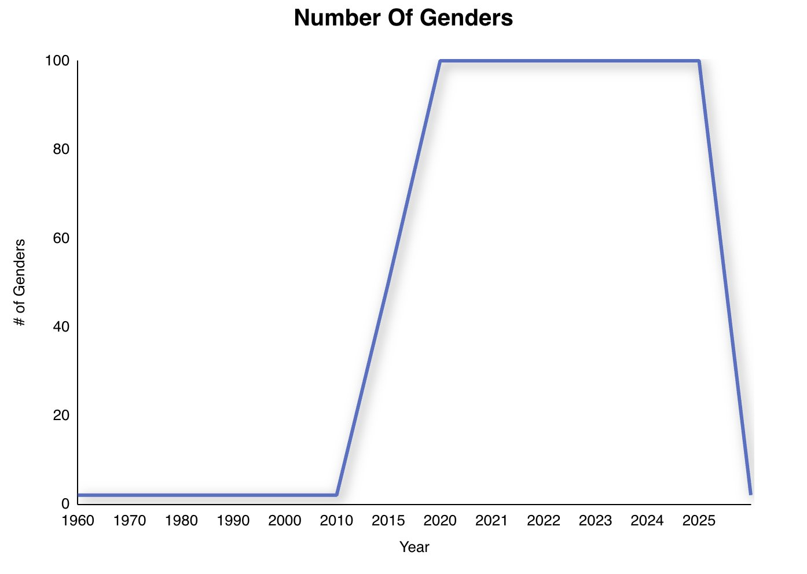
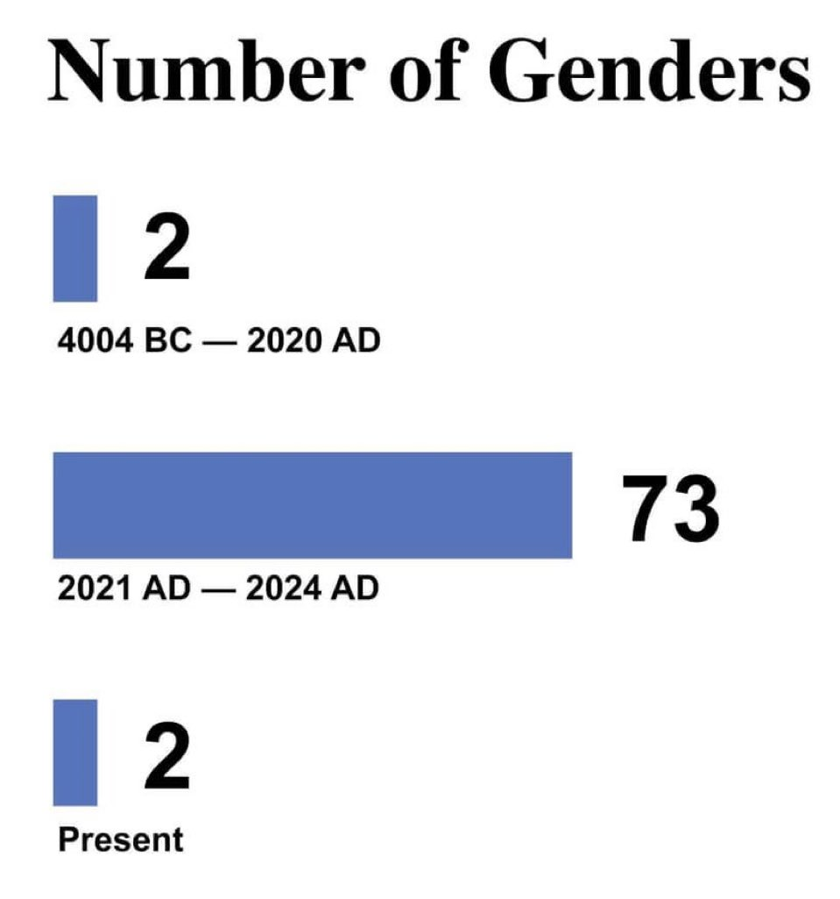
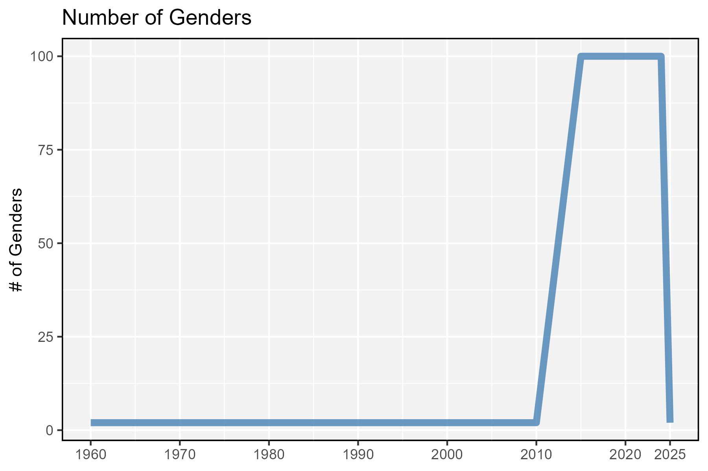
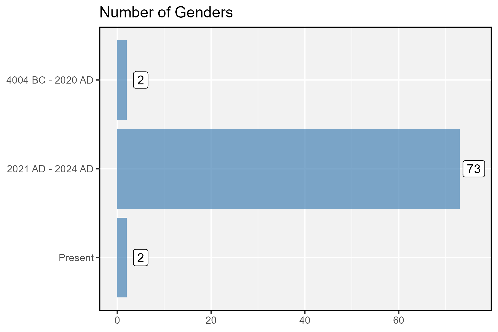

```{r setup, include=FALSE}
knitr::opts_chunk$set(echo = TRUE, message = F, warning = F)
```

---

# Data

> - `r shiny::icon("save")` [data_gender.xlsx](data_gender.xlsx)





---

# Prepare Data

```{r class.source = 'fold-show'}
# devtools::install_github("derekmichaelwright/agData")
library(agData)
library(readxl)
```

```{r}
# Prep data
#myCaption <- "derekmichaelwright.github.io/dblogr/"
d1 <- read_xlsx("data_gender.xlsx", "danny")
d2 <- read_xlsx("data_gender.xlsx", "elon") %>%
  mutate(Year = factor(Year, levels = rev(Year)))
```

---

# Plots {.tabset .tabset-pills}

## Danny's Tweet 



```{r}
# Plot
mp <- ggplot(d1, aes(x = Year, y = Value)) + 
  geom_line(color = "steelblue", lwd = 2, alpha = 0.8) +
  scale_x_continuous(breaks = c(seq(1960, 2020, by = 10), 2025),
                     minor_breaks = seq(1960, 2025, by = 5)) +
  theme_agData() +
  labs(title = "Number of Genders", y = "# of Genders", x = NULL)
ggsave("gender_01.png", mp, width = 6, height = 4)
```

```{r echo = F}
ggsave("featured.png", mp, width = 6, height = 4)
```

---

## Elon's Tweet



```{r}
# Plot
mp <- ggplot(d2, aes(x = Year, y = Value)) + 
  geom_col(fill = "steelblue", alpha = 0.7) +
  geom_label(aes(label = Value), nudge_y = 3) +
  coord_flip() +
  theme_agData() +
  labs(title = "Number of Genders", y = NULL, x = NULL)
ggsave("gender_02.png", mp, width = 6, height = 4)
```

---
