```{r setup, include=FALSE}
knitr::opts_chunk$set(echo = TRUE, message = F, warning = F)
```


# Introduction

This is a vignette for my Masters thesis titled "Influence of heterozygosity on nitrogen use efficiency in hybrid and purebred lines of *Brassica napus* (L.)".

Department of Agronomy and Plant Breeding I, Justus-Liebig-Universität, Gießen 35392, Germany

[Download My Masters Thesis](https://github.com/derekmichaelwright/dblogr/raw/master/content/academic/canola_nue/MastersThesis.pdf)

# Materials and Methods

## Experiment

Thirty *Brassica napus* cultivars, 20 hybrid and 10 purebred lines, both old and new, were grown in a greenhouse under two fertilizer treatments: no N fertilization (N1) and 200 kg N/ha (N2). For each experimental replicate of genotype and fertilizer treatment, nine plants were grown in containers of 0.16 m2 surface area, filled with 147.5 kg of soil with a dry matter content of 88.2% (130.1 kg dry mass), in the layout described below.

## Data Collection & Analysis

Plant root mass, shoot mass, straw mass and seed mass was recorded, along with (NIRS) of seed for oil and protein content. Note: For plant shoots, 2 of the 9 plants were used for another study and not inluded in total mass measurements


```{r echo=F, out.width = '50%'}
myimages <- c("container1.png", "container2.png")
knitr::include_graphics(myimages)
```

```{r echo=F, out.width = '100%'}
myimages <- c("layout1.png", "layout2.png")
knitr::include_graphics(myimages)
```

# Formulas

$NUE=N_{in Seed}/N_{Available}$

Calculation of N fertilizatio when 1.6g N is added to container:

$(1.6gN)*(\frac{1kg}{1000g})*(\frac{1}{0.16m^2})*(\frac{10000m^2}{1ha})=100\frac{kgN}{ha}$

Calculation of available N in soil (N1)

$N1=\frac{44.65\frac{mgNO_3}{kgsoil}+2.15\frac{mgNH_4}{kgsoil}*(130.1kgsoil)}{9plants}=677\frac{mgN}{perplant}$

Calculation of available N with fertilization of 200 kg N/ha (N2)

$N2=677\frac{mgN}{perplant}+\frac{2*(1600mgN)}{9plants}=1033\frac{mgN}{perplant}$

# Prepare Data

```{r echo = F, eval = F}
file.copy(from = "canola_nue_data.xlsx", to = "../../../htmls/academic/")
```

[Download Data](https://github.com/derekmichaelwright/dblogr/blob/master/content/academic/canola_nue_data.xlsx?raw=true)

```{r}
# devtools::install_github("derekmichaelwright/agData")
library(agData) # Loads: tidyverse, ggpubr, ggbeeswarm, ggrepel
library(readxl) # read_xlsx
```

```{r}
# Cultivar data
r1 <- read_xlsx("canola_nue_data.xlsx", "CultData") %>%
  mutate(Hybrid = plyr::mapvalues(Hybrid, c("H", "P"), c("Hybrid", "Purebred")),
         Age = plyr::mapvalues(Age, c("N", "O"), c("New", "Old")),
         Type = factor(paste(Age, Hybrid), 
           levels = c("Old Purebred", "New Purebred", "Old Hybrid", "New Hybrid")))
# Container data
r2 <- read_xlsx("canola_nue_data.xlsx", "ContData") %>%
  mutate(Nlevel = paste0("N", Nlevel))
# Plant data
r3 <- read_xlsx("canola_nue_data.xlsx", "PlantData")
# NIRS data main
r4 <- read_xlsx("canola_nue_data.xlsx", "NIRSmainRaw") %>%
  mutate(ErucicAcidPercent = ifelse(ErucicAcidPercent < 0, 0, ErucicAcidPercent),
         DryContent = 100 - WaterPercent) %>%
  group_by(Container) %>% 
  summarise_all(funs(mean), na.rm = T)
colnames(r4) <- paste0(colnames(r4),"_Main")
colnames(r4)[1] <- "Container"
# NIRS data side
r5 <- read_xlsx("canola_nue_data.xlsx", "NIRSsideRaw")
r5 <- r5 %>% mutate(DryContent = 100 - WaterPercent) %>%
  mutate(ErucicAcidPercent = ifelse(ErucicAcidPercent < 0, 0, ErucicAcidPercent),
         DryContent = 100 - WaterPercent) %>%
  group_by(Container) %>% 
  summarise_all(funs(mean), na.rm = T)
colnames(r5) <- paste0(colnames(r5),"_Side")
colnames(r5)[1] <- "Container"
```

- Note: for straw mass 2 of the 9 plants were removed and used for another project
- StemMass1:
- StemMass2:

```{r}
rr <- left_join(r2, r1, by = c("Genotype"="Cultivar")) %>% 
  left_join(r3, by = "Container") %>%
  left_join(r4, by = "Container") %>%
  left_join(r5, by = "Container") %>%
  mutate(RootMass = RootMass / 9,
         StemMass = (StemMass1 + StemMass2) / 7,
         StrawMass = (StrawMassMain + StrawMassSide) / 7,
         ShootMass = StemMass + StrawMass,
         SeedMassMainDry = SeedMassMain * DryContent_Main / 100 / 7,
         SeedMassSideDry = SeedMassSide * DryContent_Side / 100 / 7,
         SeedMass = SeedMassMainDry + SeedMassSideDry,
         HarvestIndex = SeedMass / ShootMass,
         OilMassMain = OilPercent_Main * SeedMassMainDry / 100,
         OilMassSide = OilPercent_Side * SeedMassSideDry / 100,
         OilMass = OilMassMain + OilMassSide,
         ProteinMassMain = ProteinPercent_Main * SeedMassMainDry / 100,
         ProteinMassSide = ProteinPercent_Side * SeedMassSideDry / 100,
         ProteinMass = ProteinMassMain + ProteinMassSide,
         N_Available = ifelse(Nlevel == 1, 677, 1033),
         NUE_P = ProteinMass * 0.16 / N_Available * 1000, 
         NUE_Y = SeedMass           / N_Available * 1000) %>% 
  select(Container, Nlevel, AvailableN, Rep, Edge,
         Genotype, CultLabel, CultNumber, Hybrid, Age, Type, Breeder,
         RootMass, StemMass, StrawMass, ShootMass, SeedMass, 
         NUE_P, NUE_Y, everything()) %>%
  filter(Edge == "F")
trts <- colnames(rr)[13:ncol(rr)]
xx <- rr %>% group_by(Nlevel, Genotype, CultLabel, Hybrid, Age, Type, Breeder) %>%
  summarise_at(vars(trts), funs(mean), na.rm = T) %>% 
  ungroup()
xx_sd <- rr %>% group_by(Nlevel, Genotype, CultLabel, Hybrid, Age, Type, Breeder) %>%
  summarise_at(vars(trts), funs(sd), na.rm = T) %>% 
  ungroup()
```

# Biomass

```{r}
nlev = "N2"
gg_PlantMass <- function(nlev) {
  x1 <- xx %>% 
    mutate(SeedMass = ifelse(Genotype == "Pacific" & Nlevel == "N2", 0, SeedMass),
           StrawMass = ifelse(Genotype == "Pacific" & Nlevel == "N2", 0, StrawMass),
           StemMass = ifelse(Genotype == "Pacific" & Nlevel == "N2", 0, StemMass),
           RootMass = ifelse(Genotype == "Pacific" & Nlevel == "N2", 0, RootMass),
           RootScore = ifelse(Genotype == "Pacific" & Nlevel == "N2", 0, RootScore))
  genoOrder <- x1 %>% filter(Nlevel == "N2") %>%
    arrange(SeedMass, Type) %>% pull(Genotype)
  
  xi <- x1 %>% filter(Nlevel == nlev, !is.na(StemMass), !is.na(StrawMass), 
                      !is.na(SeedMass), !is.na(RootMass))
  xs <- xi %>% 
    select(Genotype, Hybrid, Type, StemMass, StrawMass, SeedMass) %>% 
    gather(Trait, Value, StemMass, StrawMass, SeedMass) %>%
    mutate(Genotype = factor(Genotype, levels = genoOrder),
           Trait = factor(Trait, levels = c("SeedMass","StrawMass","StemMass","RootMass")))
  xr <- xi %>% rename(Value=RootMass) %>% 
    mutate(Genotype = factor(Genotype, levels = genoOrder),
           Trait = "RootMass",
           Trait = factor(Trait, levels = c("RootMass","StemMass","StrawMass","SeedMass")))
  mp1 <- ggplot(xs, aes(x = Genotype, y = Value, fill = Trait, group = Trait)) + 
    geom_bar(stat= "identity") +
    geom_line(data = xs %>% filter(Trait == "SeedMass")) +
    facet_grid(.~Type, scales= "free_x", space = "free_x") +
    scale_y_continuous(limits = c(0,85), expand = c(0,0)) +
    scale_fill_manual(name = NULL,
                      values = c("darkgreen","darkorange","forestgreen"),
                      labels = c("Seed","Straw","Stem")) +
    theme_agData(axis.text.x = element_blank()) +
    labs(title = nlev, x = NULL, y = "g")
  mp2 <- ggplot(xr, aes(x = Genotype, y = Value)) + 
    geom_bar(stat = "identity", aes(fill = Trait)) +
    geom_text(aes(label = RootScore, y = 1), size = 3)  +
    facet_grid(.~Type, scales= "free_x", space = "free_x") +
    scale_y_reverse(limits = c(11,0), expand = c(0,0)) +
    scale_fill_manual(name = NULL, values = c("brown"),
                      labels = c("Root")) +
    theme_agData(rotx = T, strip.text.x = element_blank()) +
    labs(y = "g", x = NULL)
  ggarrange(mp1, mp2, ncol = 1, align = "v", heights = c(1.3,1))
}
#
mp1 <- gg_PlantMass("N2")
mp2 <- gg_PlantMass("N1")
mp <- ggarrange(mp1, mp2, ncol = 1)
ggsave("Fig_01.png", mp, width = 10, height = 10)
```

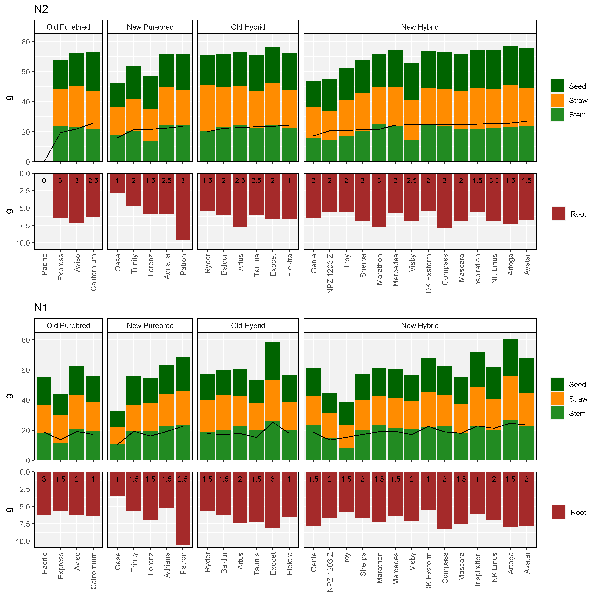

---

# N1 vs N2

```{r}
gg_Corr <- function(trait = "NUE_P", title = NULL) {
  xi <- xx %>% select(Genotype, Type, Nlevel, Hybrid, Value=trait) %>%
    spread(Nlevel, Value)
  mymin <- min(xi$N1, xi$N2, na.rm = T)
  mymax <- max(xi$N1, xi$N2, na.rm = T)
  x2 <- bind_rows(xi %>% filter(Type != "Old Purebred") %>% mutate(Type = "Old Purebred"),
                  xi %>% filter(Type != "New Purebred")  %>% mutate(Type = "New Purebred"),
                  xi %>% filter(Type != "Old Hybrid")  %>% mutate(Type = "Old Hybrid"),
                  xi %>% filter(Type != "New Hybrid")  %>% mutate(Type = "New Hybrid") )
  ggplot(xi, aes(x = N1, y = N2)) + 
    geom_point(aes(shape = Type, fill = Type), size = 3, alpha = 0.7) + 
    geom_point(data = x2, alpha = 0.2) + geom_abline() + 
    facet_wrap(Type~., ncol = 2) +
    scale_fill_manual(values = c("darkblue","darkred","darkblue","darkred")) +
    scale_shape_manual(values = c(22,23,25,24)) +
    coord_cartesian(xlim = c(mymin, mymax), ylim = c(mymin, mymax)) +
    theme_agData(legend.position = "none") +
    labs(title = trait)
}
mp1 <- gg_Corr("NUE_P", "NUE Protein")
mp2 <- gg_Corr("NUE_Y", "NUE Yield")
mp3 <- gg_Corr("ProteinMass", "Protein Mass")
mp4 <- gg_Corr("OilMass", "Oil Mass")
mp5 <- gg_Corr("RootMass", "Root Mass")
mp6 <- gg_Corr("ShootMass", "Shoot Mass")
mp7 <- gg_Corr("SeedMass", "Seed Mass")
mp8 <- gg_Corr("RootScore", "Root Branching Score")
mp <- ggarrange(mp1, mp2, mp3, mp4, mp5, mp6, mp7, mp8, ncol = 4, nrow = 2)
ggsave("Fig_02.png", mp, width = 12, height = 8)
```

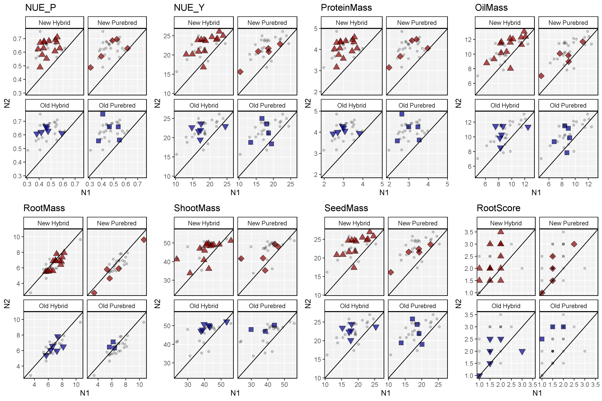

---

```{r}
# Plotting function
gg_Diff <- function(trait = "SeedMass") {
  xi <- xx %>% 
    rename(Value = trait) %>%
    select(Nlevel, Genotype, CultLabel, Hybrid, Age, Type, Value) %>%
    spread(Nlevel, Value) %>%
    mutate(Diff = N2 - N1,
           Diff2 = ifelse(Diff > 0, "Pos", "Neg")) %>%
    gather(Nlevel, Value, N1, N2)
  #
  mp <- ggplot(xi, aes(x = Nlevel, y = Value, color = Diff2)) + 
    geom_line(aes(group = Genotype)) +
    geom_label(aes(label = CultLabel), size = 2.5,
               label.padding = unit(0.15, "lines")) +
    facet_grid(. ~ Type) +
    scale_color_manual(values = c("darkred","darkblue")) +
    theme_agData(legend.position = "none")
  ggsave(paste0("Diff_", trait, ".png"), mp, width = 8, height = 4)
}
# Plot
gg_Diff(trait = "StemMass")
gg_Diff(trait = "StrawMass")
gg_Diff(trait = "ShootMass")
gg_Diff(trait = "SeedMass")
gg_Diff(trait = "RootMass")
gg_Diff(trait = "RootScore")
gg_Diff(trait = "NUE_P")
gg_Diff(trait = "NUE_Y")
```

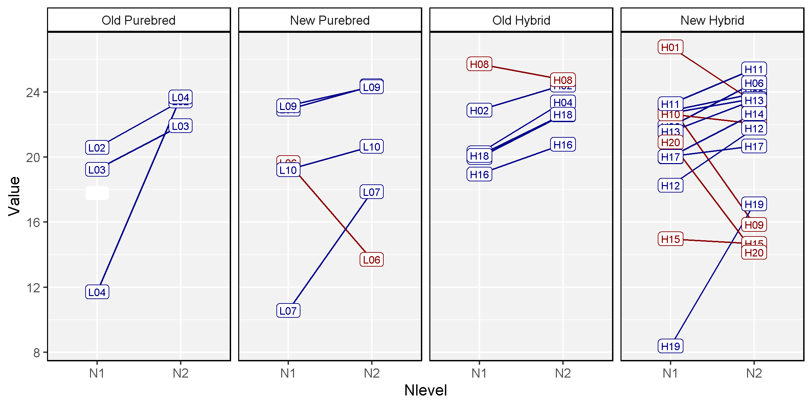

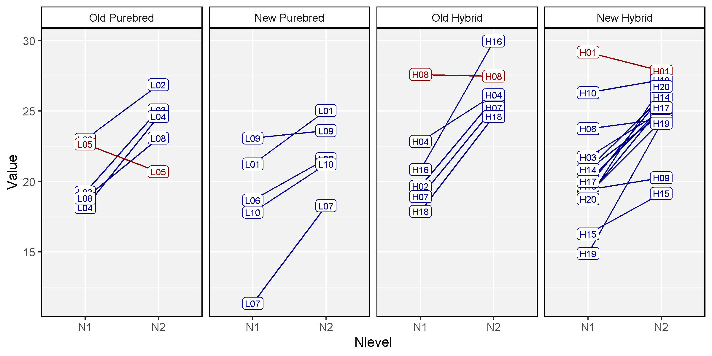

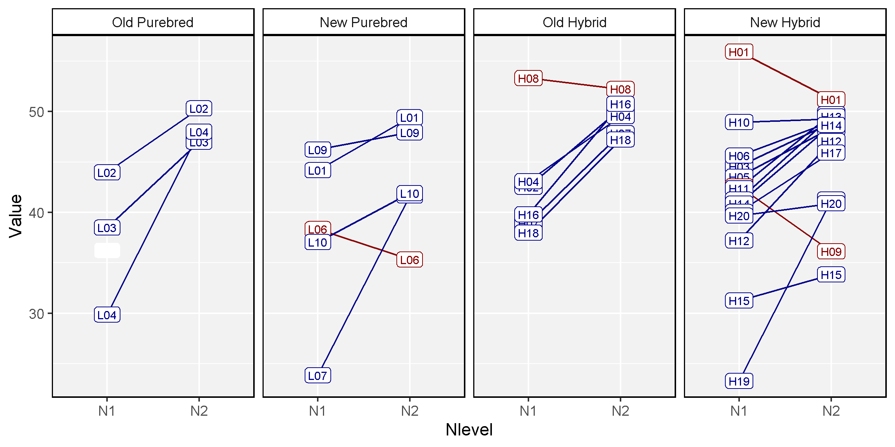


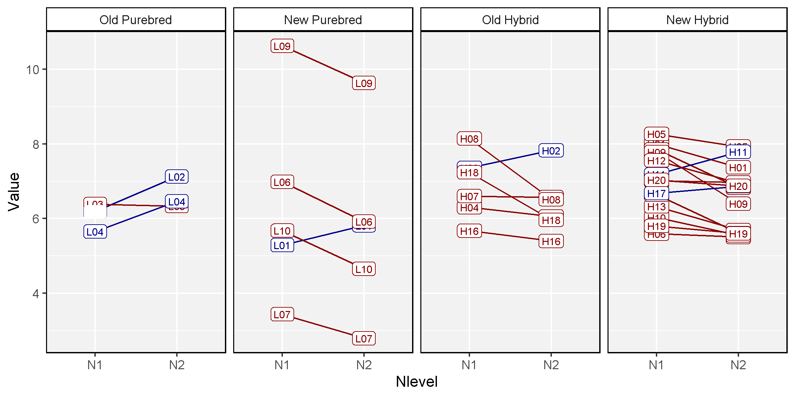

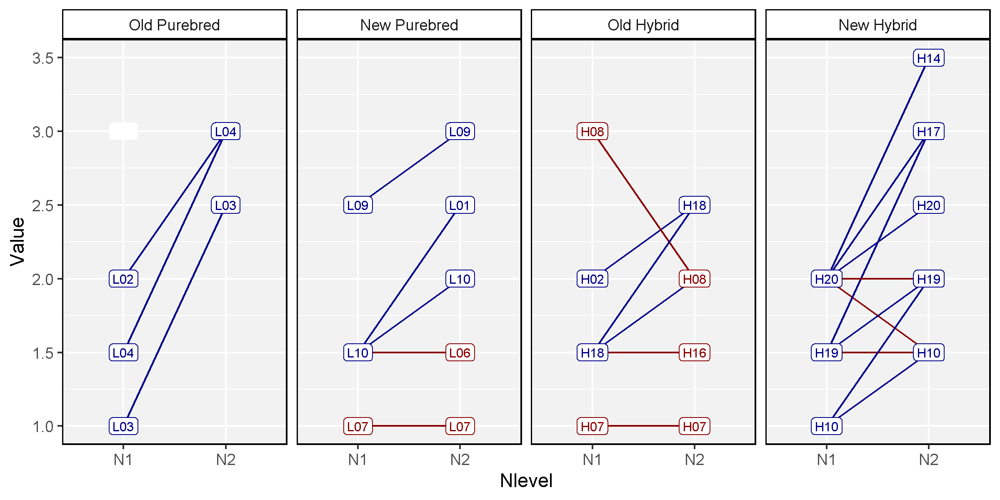

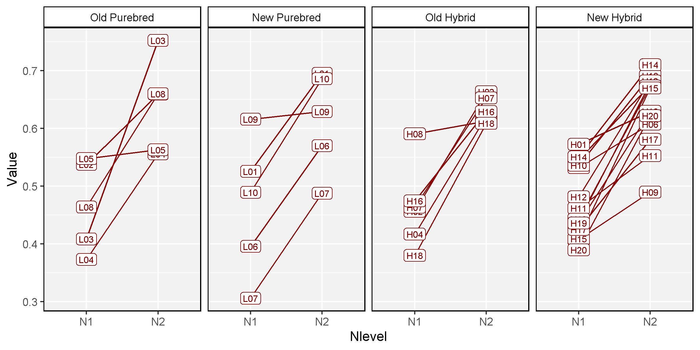

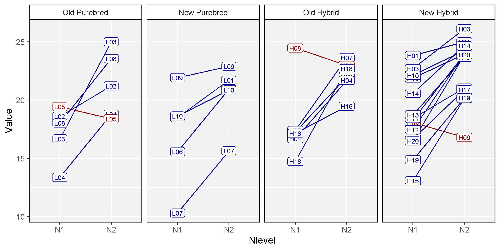

---

```{r}
library(corrplot)
traits <- c("RootMass", "RootScore", "StemMass", "ShootMass", 
            "StrawMass", #"StrawMassMain", "StrawMassSide",
            "SeedMass", "SeedMassMain", "SeedMassSide",
            "NUE_P", "NUE_Y", "RootLength", 
            "ProteinMass", "OilMass", "HarvestIndex", 
            "OilPercent_Main", "OilPercent_Side",
            "ProteinPercent_Main", "ProteinPercent_Side")
m1 <- xx %>% filter(Nlevel == "N1", !is.na(RootMass)) %>% select(traits)
m2 <- xx %>% filter(Nlevel == "N2", !is.na(RootMass)) %>% select(traits)
#
png("N1_corrplot.png", width = 600, height = 600)
mp1 <- corrplot(cor(m1), order = "hclust", addrect=2)
dev.off()
#
png("N2_corrplot.png", width = 600, height = 600)
mp2 <- corrplot(cor(m2), order = "hclust", addrect=2)
dev.off()
```

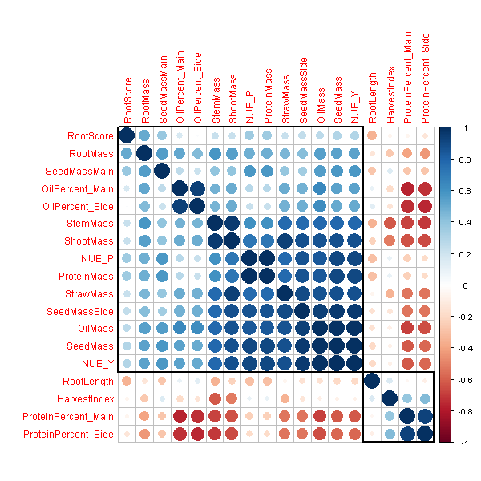

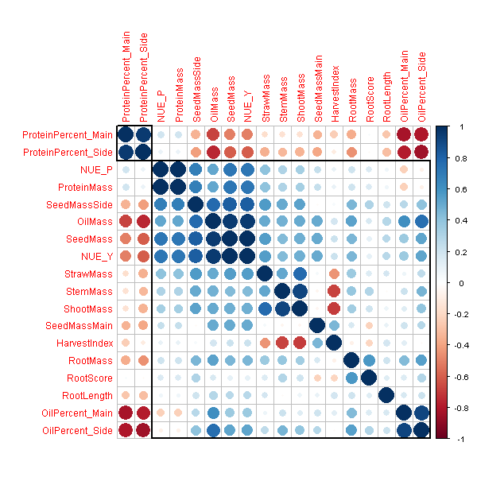

```{r eval = F, echo = F}

ggplot(xx, aes(x = Hybrid, y = SeedMass)) + 
  geom_boxplot(width = 0.2) +
  geom_beeswarm(aes(color = Type)) +
  facet_grid(. ~ Nlevel) +
  theme_agData(legend.position = "bottom")
library(GGally)
# 

x1 <- xx %>% filter(Nlevel == "N1")
ggpairs(xx, columns = traits)
```

---

&copy; Derek Michael Wright 2020 [www.dblogr.com/](https://dblogr.com/)
