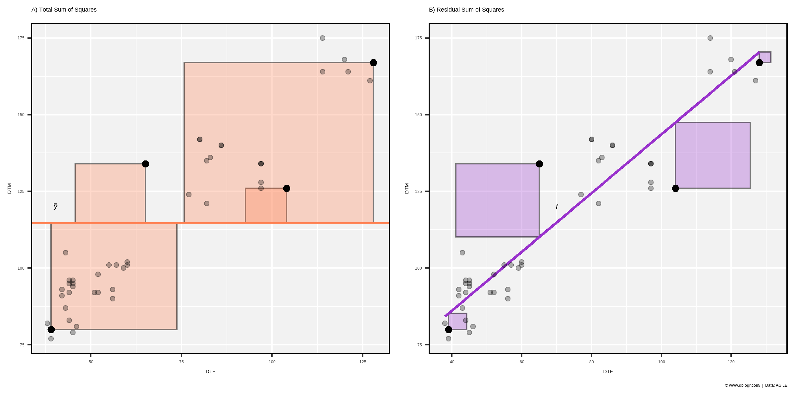

+++
widget = "blank"  # See https://sourcethemes.com/academic/docs/page-builder/
headless = false  # This file represents a page section.
active = true  # Activate this widget? true/false
weight = 2  # Order that this section will appear.

title = "Explaining Correlation Coefficients"
summary = "A quick explanation of how to properly use correlation coefficients when evaluating models"
tags = [ "Academic", "AGILE", "Tutorials", "Featured" ]

[image]
  preview_only = true

[design]
  columns = "1"
+++

{}
https://derekmichaelwright.github.io/htmls/academic/correlation_coefficients.html
{}

