<script src="index_files/font-awesome/js/script.js"></script>

<script src="index_files/htmlwidgets/htmlwidgets.js"></script>

<script src="index_files/jquery/jquery.min.js"></script>

<link href="index_files/datatables-css/datatables-crosstalk.css" rel="stylesheet" />

<script src="index_files/datatables-binding/datatables.js"></script>

<link href="index_files/dt-core/css/jquery.dataTables.min.css" rel="stylesheet" />
<link href="index_files/dt-core/css/jquery.dataTables.extra.css" rel="stylesheet" />

<script src="index_files/dt-core/js/jquery.dataTables.min.js"></script>

<link href="index_files/crosstalk/css/crosstalk.css" rel="stylesheet" />

<script src="index_files/crosstalk/js/crosstalk.min.js"></script>

<script src="index_files/font-awesome/js/script.js"></script>

<script src="index_files/htmlwidgets/htmlwidgets.js"></script>

<script src="index_files/jquery/jquery.min.js"></script>

<link href="index_files/datatables-css/datatables-crosstalk.css" rel="stylesheet" />

<script src="index_files/datatables-binding/datatables.js"></script>

<link href="index_files/dt-core/css/jquery.dataTables.min.css" rel="stylesheet" />
<link href="index_files/dt-core/css/jquery.dataTables.extra.css" rel="stylesheet" />

<script src="index_files/dt-core/js/jquery.dataTables.min.js"></script>

<link href="index_files/crosstalk/css/crosstalk.css" rel="stylesheet" />

<script src="index_files/crosstalk/js/crosstalk.min.js"></script>

-----

# Introduction

The correlation coefficient (*R<sup>2</sup>*), which indicates the proportion of variation explained by an independent variable or model, can be calculated in more than one way. The goal of this vignette is to help clear up this confusion, with a few different examples.

``` r
# devtools::install_github("derekmichaelwright/agData")
library(agData)  # Loads: tidyverse, ggpubr, ggbeeswarm, ggrepel
library(ggpmisc) # stat_poly_eq()
```

-----

# Load Dataset 1

<a href="https://github.com/derekmichaelwright/dblogr/blob/master/content/academic/correlation_coefficients/correlation_coefficients_data_2.csv">
<button class="btn btn-success"><i class="fa fa-save"></i> correlation_coefficients_data_2.csv</button>
</a>

  - `Entry`: 1 Lentil Genotype
  - `Expt`: 18 Site-years
  - `MacroEnv`: 3 Macroenvironments
  - `Rep`: 1-3 Reps per site-year
  - `T_mean`: Mean temperature
  - `P_mean`: Mean photoperiod
  - `DTF`: Days from sowing to flower
  - `DTM`: Days from sowing to swollen pod
  - `DTM`: Days from sowing to maturity
  - `RDTF`: Rate of progress towards fowering

<!-- end list -->

``` r
# Prep data
d1 <- read.csv("correlation_coefficients_data_1.csv") %>% 
  mutate(RDTF = 1 / DTF) # Rate of progress towards flowering
# Preview data
DT::datatable(d1)
```

<div id="htmlwidget-1" style="width:100%;height:auto;" class="datatables html-widget"></div>
<script type="application/json" data-for="htmlwidget-1">{"x":{"filter":"none","data":[["1","2","3","4","5","6","7","8","9","10","11","12","13","14","15","16","17","18","19","20","21","22","23","24","25","26","27","28","29","30","31","32","33","34","35","36","37","38","39","40","41","42","43","44","45","46","47","48","49","50","51","52","53","54"],[33,33,33,33,33,33,33,33,33,33,33,33,33,33,33,33,33,33,33,33,33,33,33,33,33,33,33,33,33,33,33,33,33,33,33,33,33,33,33,33,33,33,33,33,33,33,33,33,33,33,33,33,33,33],["Ro16","Ro16","Ro16","Ro17","Ro17","Ro17","Ca16","Ca16","Ca16","Ca17","Ca17","Ca17","Ca18","Ca18","Ca18","Us18","Us18","Us18","In16","In16","In16","In17","In17","In17","Ba16","Ba16","Ba16","Ba17","Ba17","Ba17","Ne16","Ne16","Ne16","Ne17","Ne17","Ne17","Sp16","Sp16","Sp16","Sp17","Sp17","Sp17","Mo16","Mo16","Mo16","Mo17","Mo17","Mo17","It16","It16","It16","It17","It17","It17"],["Macroenvironment 1","Macroenvironment 1","Macroenvironment 1","Macroenvironment 1","Macroenvironment 1","Macroenvironment 1","Macroenvironment 1","Macroenvironment 1","Macroenvironment 1","Macroenvironment 1","Macroenvironment 1","Macroenvironment 1","Macroenvironment 1","Macroenvironment 1","Macroenvironment 1","Macroenvironment 1","Macroenvironment 1","Macroenvironment 1","Macroenvironment 2","Macroenvironment 2","Macroenvironment 2","Macroenvironment 2","Macroenvironment 2","Macroenvironment 2","Macroenvironment 2","Macroenvironment 2","Macroenvironment 2","Macroenvironment 2","Macroenvironment 2","Macroenvironment 2","Macroenvironment 2","Macroenvironment 2","Macroenvironment 2","Macroenvironment 2","Macroenvironment 2","Macroenvironment 2","Macroenvironment 3","Macroenvironment 3","Macroenvironment 3","Macroenvironment 3","Macroenvironment 3","Macroenvironment 3","Macroenvironment 3","Macroenvironment 3","Macroenvironment 3","Macroenvironment 3","Macroenvironment 3","Macroenvironment 3","Macroenvironment 3","Macroenvironment 3","Macroenvironment 3","Macroenvironment 3","Macroenvironment 3","Macroenvironment 3"],[1,2,3,1,2,3,1,2,3,1,2,3,1,2,3,1,2,3,3,1,2,1,2,3,1,2,3,1,2,3,1,2,3,1,2,3,1,2,3,1,2,3,1,2,3,1,2,3,1,2,3,1,2,3],[17.2,17.2,17.2,17.5,17.5,17.5,16.7,16.7,16.7,15.7,15.7,15.7,17.6,17.6,17.6,15.8,15.8,15.8,17.6,17.6,17.6,20.6,20.6,20.6,18.6,18.6,18.6,21.7,21.7,21.7,19.2,19.2,19.2,19.4,19.4,19.4,12.5,12.5,12.5,11.7,11.7,11.7,12,12,12,11.8,11.8,11.8,10.6,10.6,10.6,11.2,11.2,11.2],[16.2,16.2,16.2,16.4,16.4,16.4,15.9,15.9,15.9,16.1,16.1,16.1,16.1,16.1,16.1,14.3,14.3,14.3,10.9,10.9,10.9,10.7,10.7,10.7,10.8,10.8,10.8,11,11,11,11,11,11,10.8,10.8,10.8,10.9,10.9,10.9,11.1,11.1,11.1,10.8,10.8,10.8,11.5,11.5,11.5,10.8,10.8,10.8,10.8,10.8,10.8],[45,44,44,38,39,39,44,45,45,44,45,46,42,43,42,51,null,52,43,43,55,55,52,52,59,60,60,57,56,56,81,77,82,82,65,83,97,97,97,97,104,97,80,80,null,86,86,86,114,114,120,121,128,127],[62,64,61,60,57,57,65,62,63,64,65,67,64,62,64,69,null,70,95,null,null,97,null,91,81,82,82,73,71,70,null,111,106,114,115,114,118,114,109,113,113,104,121,121,121,104,108,106,130,133,145,146,146,145],[96,96,92,82,80,77,95,94,95,83,79,81,91,87,93,92,96,92,105,null,null,101,null,98,100,101,102,101,93,90,null,124,121,135,134,136,134,134,134,128,126,126,142,142,142,null,140,140,164,175,168,164,167,161],[0.0222222222222222,0.0227272727272727,0.0227272727272727,0.0263157894736842,0.0256410256410256,0.0256410256410256,0.0227272727272727,0.0222222222222222,0.0222222222222222,0.0227272727272727,0.0222222222222222,0.0217391304347826,0.0238095238095238,0.0232558139534884,0.0238095238095238,0.0196078431372549,null,0.0192307692307692,0.0232558139534884,0.0232558139534884,0.0181818181818182,0.0181818181818182,0.0192307692307692,0.0192307692307692,0.0169491525423729,0.0166666666666667,0.0166666666666667,0.0175438596491228,0.0178571428571429,0.0178571428571429,0.0123456790123457,0.012987012987013,0.0121951219512195,0.0121951219512195,0.0153846153846154,0.0120481927710843,0.0103092783505155,0.0103092783505155,0.0103092783505155,0.0103092783505155,0.00961538461538462,0.0103092783505155,0.0125,0.0125,null,0.0116279069767442,0.0116279069767442,0.0116279069767442,0.0087719298245614,0.0087719298245614,0.00833333333333333,0.00826446280991736,0.0078125,0.0078740157480315]],"container":"<table class=\"display\">\n  <thead>\n    <tr>\n      <th> <\/th>\n      <th>Entry<\/th>\n      <th>Expt<\/th>\n      <th>MacroEnv<\/th>\n      <th>Rep<\/th>\n      <th>T_mean<\/th>\n      <th>P_mean<\/th>\n      <th>DTF<\/th>\n      <th>DTS<\/th>\n      <th>DTM<\/th>\n      <th>RDTF<\/th>\n    <\/tr>\n  <\/thead>\n<\/table>","options":{"columnDefs":[{"className":"dt-right","targets":[1,4,5,6,7,8,9,10]},{"orderable":false,"targets":0}],"order":[],"autoWidth":false,"orderClasses":false}},"evals":[],"jsHooks":[]}</script>

-----

# Correlation Between Two Traits

The most obvious correlation is that of two traits. For example, since `DTF`, `DTS`, and `DTM` are all phenology traits, we can assume they will be highly correlated. Lets plot this out and see how it looks.

``` r
# Remove any rows with missing data
d1 <- d1 %>% filter(!is.na(DTF), !is.na(DTS), !is.na(DTM))
# DTF - DTS
mp1 <- ggplot(d1, aes(x = DTF, y = DTS)) + 
  geom_smooth(method = "lm", se = F, color = "red") + 
  geom_point(aes(fill = MacroEnv), size = 3, pch = 21, alpha = 0.7) + 
  scale_fill_manual(name = NULL, values = c("darkgreen","darkorange","darkblue")) +
  stat_poly_eq(aes(label = paste(..eq.label.., ..rr.label.., sep = "*\",\"~~")),
               formula = y ~ x, parse = T, rr.digits = 3) +
  theme_agData() +
  labs(title = "A)", x = "Days to Flower", y = "Days to Swollen Pods")
# DTS - DTM
mp2 <- ggplot(d1, aes(x = DTS, y = DTM)) + 
  geom_smooth(method = "lm", se = F, color = "red") + 
  geom_point(aes(fill = MacroEnv), size = 3, pch = 21, alpha = 0.7) + 
  scale_fill_manual(name = NULL, values = c("darkgreen","darkorange","darkblue")) +
  stat_poly_eq(aes(label = paste(..eq.label.., ..rr.label.., sep = "*\",\"~~")),
               formula = y ~ x, parse = T, rr.digits = 3) +
  theme_agData() +
  labs(title = "B)", x = "Days to Swollen Pods", y = "Days to Maturity")
# DTF - DTM
mp3 <- ggplot(d1, aes(x = DTF, y = DTM)) + 
  geom_smooth(method = "lm", se = F, color = "red") + 
  geom_point(aes(fill = MacroEnv), size = 3, pch = 21, alpha = 0.7) + 
  scale_fill_manual(name = NULL, values = c("darkgreen","darkorange","darkblue")) +
  stat_poly_eq(aes(label = paste(..eq.label.., ..rr.label.., sep = "*\",\"~~")),
               formula = y ~ x, parse = T, rr.digits = 3) +
  theme_agData() +
  labs(title = "C)", x = "Days to Flower", y = "Days to Maturity",
       caption = "\xa9 www.dblogr.com/  |  Data: AGILE")
# Append and Save
mp <- ggarrange(mp1, mp2, mp3, nrow = 1, align = "h",
                common.legend = T, legend = "bottom")
ggsave("correlation_coefficients_01.png", mp, width = 10, height = 4)
```

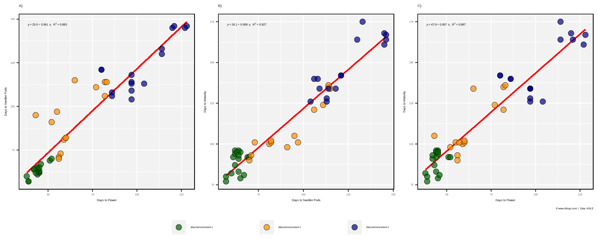

**Interpretations**:

  - 88.3% of variation in `DTS` is explained by `DTF`.
  - 92.7% of variation in `DTM` is explained by `DTS`.
  - 88.7% of variation in `DTM` is explained by `DTF`.

# Calculating *R<sup>2</sup>*

## *Pearson’s R<sup>2</sup>*

*R<sup>2</sup>* can be calculated using the `cor` function which has `method = "pearson"` as the default.

``` r
cor(x = d1$DTF, y = d1$DTS, method = "pearson")^2
```

    ## [1] 0.8833893

``` r
cor(x = d1$DTS, y = d1$DTM, method = "pearson")^2
```

    ## [1] 0.9272951

``` r
cor(x = d1$DTF, y = d1$DTM, method = "pearson")^2
```

    ## [1] 0.8868398

*R<sup>2</sup>* can also be manually calculated using the following formula to calculate *Pearson’s r*:

`\(r=\frac{n\sum xy - (\sum x)(\sum y)}{\sqrt{(n\sum x^2 - (\sum x)^2)(n\sum y^2 - (\sum y)^2)}}\)`

where:

  - `\(x\)` = Independant variable
  - `\(y\)` = Dependant Variable
  - `\(n\)` = Number of observations

and

`\(R^2=r^2\)`

Now lets manually create a function to calculate *R<sup>2</sup>* using *Pearson’s r*.

``` r
pearsonsR2 <- function(x, y) {
  n <- length(x)
  r_numerator <- n * sum(x*y) - sum(x) * sum(y)
  r_denominator <- sqrt( (n * sum(x^2) - sum(x)^2) * (n * sum(y^2) - sum(y)^2) )
  r <- r_numerator / r_denominator
  r^2
}
pearsonsR2(x = d1$DTF, y = d1$DTS)
```

    ## [1] 0.8833893

``` r
pearsonsR2(x = d1$DTS, y = d1$DTM)
```

    ## [1] 0.9272951

``` r
pearsonsR2(x = d1$DTF, y = d1$DTM)
```

    ## [1] 0.8868398

Switching the `x` and `y` variables gives the same result.

``` r
pearsonsR2(x = d1$DTM, y = d1$DTF)
```

    ## [1] 0.8868398

``` r
cor(x = d1$DTM, y = d1$DTF, method = "pearson")^2
```

    ## [1] 0.8868398

Note that the `stat_poly_eq` function included the option `formula = y ~ x`, which creates a linear regression of the `x` and `y` variables. Our *R<sup>2</sup>* is a measure how how well the `DTM` data matches the *predictions of DTM* based on our `DTF` data and linear regression model.

``` r
# Perform linear regression
myModel <- lm(DTM ~ DTF, data = d1)
summary(myModel)
```

    ## 
    ## Call:
    ## lm(formula = DTM ~ DTF, data = d1)
    ## 
    ## Residuals:
    ##     Min      1Q  Median      3Q     Max 
    ## -21.443  -6.744  -1.465   5.132  23.879 
    ## 
    ## Coefficients:
    ##             Estimate Std. Error t value Pr(>|t|)    
    ## (Intercept) 47.91678    3.82211   12.54 2.78e-16 ***
    ## DTF          0.95699    0.05096   18.78  < 2e-16 ***
    ## ---
    ## Signif. codes:  0 '***' 0.001 '**' 0.01 '*' 0.05 '.' 0.1 ' ' 1
    ## 
    ## Residual standard error: 9.601 on 45 degrees of freedom
    ## Multiple R-squared:  0.8868, Adjusted R-squared:  0.8843 
    ## F-statistic: 352.7 on 1 and 45 DF,  p-value: < 2.2e-16

``` r
summary(myModel)$r.squared
```

    ## [1] 0.8868398

``` r
# Get predicted values and residual values from model
d1 <- d1 %>% mutate(Predicted_DTM = predict(myModel), 
                    Residuals_DTM = residuals(myModel) )
```

We can also calculate *R<sup>2</sup>* by replacing `DTF` with with the `Predicted_DTM` values from our linear regression model.

``` r
pearsonsR2(x = d1$Predicted_DTM, y = d1$DTM)
```

    ## [1] 0.8868398

Again, switching the x and y variables gives the same result.

``` r
pearsonsR2(x = d1$DTM, y = d1$Predicted_DTM)
```

    ## [1] 0.8868398

## *Sum of Squares R<sup>2</sup>*

If you have *Observed* and *Predicted* values, *R<sup>2</sup>* can also be calculated using the *Sum of Squares* formula:

`\(R^2=1-\frac{SS_{residuals}}{SS_{total}}=1-\frac{\sum (o-p)^2}{\sum (o-\bar{o})^2}\)`

where:

  - `\(o\)` = Observed value
  - `\(p\)` = Predicted value
  - `\(\bar{o}=\frac{\sum o}{n}\)` = Mean of observed values

Now lets manually create a function to calculate *R<sup>2</sup>* using the *Sum of Squares*.

``` r
SumOfSquaresR2 <- function(o, p) { 1 - ( sum((o - p)^2) / sum((o - mean(o))^2) ) }
```

Create a plot to visualize the *Total Sum of Squares* and *Residual Sum of Squares*

``` r
# Prep data
xx <- d1 %>% filter(Expt %in% c("Ro17","Ne17","Sp17","It17"), Rep == 2)
# Total Sum of Squares Plot
mp1 <- ggplot(xx, aes(x = DTF, y = DTM)) +
  geom_text(x = 40, y = 120, size = 5, label = expression(italic(bar("y"))), parse = T) +
  geom_rect(alpha = 0.3, fill = "coral", color = alpha("black",0.5),
            aes(xmin = DTF, xmax = DTF + (mean(d1$DTM, na.rm = T) - DTM), 
                ymin = DTM, ymax = mean(d1$DTM, na.rm = T))) +
  geom_hline(yintercept = mean(d1$DTM, na.rm = T), color = "coral") +
  geom_point(size = 2, ) + 
  geom_point(data = d1,alpha = 0.3) +
  theme_agData() +
  labs(title = "A) Total Sum of Squares")
# Residual Sum of Squares Plot
mp2 <- ggplot(xx, aes(x = DTF, y = DTM)) + 
  geom_text(x = 70, y = 120, size = 5, label = expression(italic("f")), parse = T) +
  geom_rect(alpha = 0.3, fill = "darkorchid", color = alpha("black",0.5),
            aes(xmin = DTF, xmax = DTF - Residuals_DTM, 
                ymin = DTM, ymax = Predicted_DTM)) +
  geom_smooth(data = d1, method = "lm", se = F, color = "darkorchid") +
  geom_point(size = 2) + 
  geom_point(data = d1, alpha = 0.3) +
  theme_agData() +
  labs(title = "B) Residual Sum of Squares",
       caption = "\xa9 www.dblogr.com/  |  Data: AGILE")
# Appened
mp <- ggarrange(mp1, mp2, ncol = 2, align = "h")
ggsave("correlation_coefficients_02.png", mp, width = 8, height = 4)
```


In this case:

  - `\(o\)` = Observed value = `DTM`
  - `\(p\)` = Predicted value = `Predicted_DTM`
  - `\(\bar{o}\)` = Mean of observed values = `mean(DTM, na.rm = T)`

Now lets calculate *R<sup>2</sup>* using the *Sum of Squares* formula.

``` r
SumOfSquaresR2(o = d1$DTM, p = d1$Predicted_DTM)
```

    ## [1] 0.8868398

Now, Swaping the `x` and `y` variables results in different values. **Why?**

``` r
SumOfSquaresR2(p = d1$DTM, o = d1$Predicted_DTM)
```

    ## [1] 0.8724006

It is important to set `DTM` as the *observed* variable and `Predicted_DTM` as the *predicted* variable. This is becuase with the sum of squares model, our trendline has a `slope = 1` and `intercept = 0` (`geom_abline`), which is matched by `lm(DTM~Predicted_DTM)` but not `lm(Predicted_DTM~DTM)`.

``` r
# Intercept = 0, Slope = 1
round(lm(DTM ~ Predicted_DTM, data = d1)$coefficients, 3)
```

    ##   (Intercept) Predicted_DTM 
    ##             0             1

``` r
# Intercept != 0, Slope != 1
round(lm(Predicted_DTM ~ DTM, data = d1)$coefficients, 3)
```

    ## (Intercept)         DTM 
    ##      12.980       0.887

This can be visualized by showing how the trendline (`geom_smooth(method = "lm")`) devaites from the 1:1 line (`geom_abline()`).

``` r
mymin <- min(c(d1$DTM, d1$Predicted_DTM))
mymax <- max(c(d1$DTM, d1$Predicted_DTM))
mp1 <- ggplot(d1, aes(y = DTM, x = Predicted_DTM)) + 
  geom_smooth(method = "lm", se = F, size = 2, color = "red") + 
  geom_abline(color = "blue") +
  geom_point(aes(fill = MacroEnv), size = 3, pch = 21, alpha = 0.7) +
  scale_fill_manual(values = c("darkgreen","darkorange","darkblue")) +
  xlim(c(mymin, mymax)) + 
  ylim(c(mymin, mymax)) +
  theme_agData() +
  labs(title = "A)")
mp2 <- ggplot(d1, aes(x = DTM, y = Predicted_DTM)) + 
  geom_smooth(method = "lm", formula = y ~ x, se = F, size = 2, color = "red") + 
  geom_abline(color = "blue") + 
  geom_point(aes(fill = MacroEnv), size = 3, pch = 21, alpha = 0.7) +
  scale_fill_manual(values = c("darkgreen","darkorange","darkblue")) +
  xlim(c(mymin, mymax)) + 
  ylim(c(mymin, mymax)) +
  theme_agData() +
  labs(title = "B)", caption = "\xa9 www.dblogr.com/  |  Data: AGILE")
mp <- ggarrange(mp1, mp2, ncol = 2, legend = "none", align = "h")
ggsave("correlation_coefficients_03.png", mp, width = 8, height = 4)
```

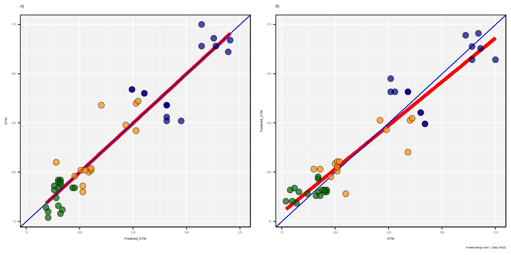

**Why is this important?** Improper usage can lead to inncorrect interpretations. The example above involved inncorrectly calculating *R<sup>2</sup>* by swapping our observed and predicted variables within the *Sum of Squares* (*SS*) formula. Another example would be using the *Sum of Squares* formula without predictions vs. observations. *E.g.,* if we calculate *R<sup>2</sup>* using our `SumOfSquaresR2` function with `DTF` vs `DTM`.

``` r
SumOfSquaresR2(o = d1$DTF, p = d1$DTM)
```

    ## [1] -1.789874

``` r
mymin <- min(d1$DTF)
mymax <- max(d1$DTM)
mp1 <- ggplot(d1, aes(x = DTF, y = DTM)) +
  geom_abline(color = "blue") +
  geom_smooth(method = "lm", se = F, color = "red") + 
  geom_segment(aes(xend = DTF, yend = Predicted_DTM)) +
  geom_point(aes(fill = MacroEnv), size = 3, pch = 21, alpha = 0.7) +
  scale_fill_manual(values = c("darkgreen","darkorange","darkblue")) +
  xlim(c(mymin, mymax)) + ylim(c(mymin, mymax)) +
  theme_agData() +
  labs(title = substitute(paste("A) ", italic("Pearson's R")^2, " = ", r2), 
         list(r2 = round(pearsonsR2(x = d1$DTF, y = d1$DTM), 3))))
mp2 <- ggplot(d1, aes(x = DTF, y = DTM)) +
  geom_abline(color = "blue") +
  geom_smooth(method = "lm", se = F, color = "red") + 
  geom_segment(aes(xend = DTF, yend = DTF)) +
  geom_point(aes(fill = MacroEnv), size = 3, pch = 21, alpha = 0.7) +
  scale_fill_manual(values = c("darkgreen","darkorange","darkblue")) +
  xlim(c(mymin, mymax)) + ylim(c(mymin, mymax)) +
  theme_agData() +
  labs(title = substitute(paste("B) ", italic("Sum of Squares R")^2, " = ", r2), 
         list(r2 = round(SumOfSquaresR2(o = d1$DTF, p = d1$DTM), 3))),
       caption = "\xa9 www.dblogr.com/  |  Data: AGILE")
mp <- ggarrange(mp1, mp2, nrow= 1, ncol = 2, legend = "none", align = "h")
ggsave("correlation_coefficients_04.png", mp, width = 8, height = 4)
```

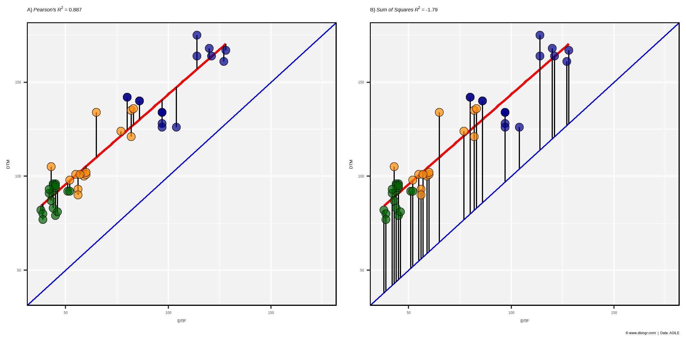

However, the more common mistake happens when the *Pearson’s* formula is used for evaluating the accuracy of a model used to predict values.

-----

# Load Dataset 2

<a href="https://github.com/derekmichaelwright/dblogr/blob/master/content/academic/correlation_coefficients/correlation_coefficients_data_2.csv">
<button class="btn btn-success"><i class="fa fa-save"></i> correlation_coefficients_data_2.csv</button>
</a>

  - `Entry`: 324 Genotypes
  - `Expt`: 3 Site-years
  - `MacroEnv`: 3 Macroenvironments
  - `DTF`: Days from sowing to flower
  - `Predicted_DTF`: Predicted values of DTF

<!-- end list -->

``` r
# Prep data
d2 <- read.csv("correlation_coefficients_data_2.csv") %>%
  mutate(Expt = factor(Expt, levels = c("Ca16", "Ne16", "It16")))
# Preview data
DT::datatable(d2)
```

<div id="htmlwidget-2" style="width:100%;height:auto;" class="datatables html-widget"></div>
<script type="application/json" data-for="htmlwidget-2">{"x":{"filter":"none","data":[["1","2","3","4","5","6","7","8","9","10","11","12","13","14","15","16","17","18","19","20","21","22","23","24","25","26","27","28","29","30","31","32","33","34","35","36","37","38","39","40","41","42","43","44","45","46","47","48","49","50","51","52","53","54","55","56","57","58","59","60","61","62","63","64","65","66","67","68","69","70","71","72","73","74","75","76","77","78","79","80","81","82","83","84","85","86","87","88","89","90","91","92","93","94","95","96","97","98","99","100","101","102","103","104","105","106","107","108","109","110","111","112","113","114","115","116","117","118","119","120","121","122","123","124","125","126","127","128","129","130","131","132","133","134","135","136","137","138","139","140","141","142","143","144","145","146","147","148","149","150","151","152","153","154","155","156","157","158","159","160","161","162","163","164","165","166","167","168","169","170","171","172","173","174","175","176","177","178","179","180","181","182","183","184","185","186","187","188","189","190","191","192","193","194","195","196","197","198","199","200","201","202","203","204","205","206","207","208","209","210","211","212","213","214","215","216","217","218","219","220","221","222","223","224","225","226","227","228","229","230","231","232","233","234","235","236","237","238","239","240","241","242","243","244","245","246","247","248","249","250","251","252","253","254","255","256","257","258","259","260","261","262","263","264","265","266","267","268","269","270","271","272","273","274","275","276","277","278","279","280","281","282","283","284","285","286","287","288","289","290","291","292","293","294","295","296","297","298","299","300","301","302","303","304","305","306","307","308","309","310","311","312","313","314","315","316","317","318","319","320","321","322","323","324","325","326","327","328","329","330","331","332","333","334","335","336","337","338","339","340","341","342","343","344","345","346","347","348","349","350","351","352","353","354","355","356","357","358","359","360","361","362","363","364","365","366","367","368","369","370","371","372","373","374","375","376","377","378","379","380","381","382","383","384","385","386","387","388","389","390","391","392","393","394","395","396","397","398","399","400","401","402","403","404","405","406","407","408","409","410","411","412","413","414","415","416","417","418","419","420","421","422","423","424","425","426","427","428","429","430","431","432","433","434","435","436","437","438","439","440","441","442","443","444","445","446","447","448","449","450","451","452","453","454","455","456","457","458","459","460","461","462","463","464","465","466","467","468","469","470","471","472","473","474","475","476","477","478","479","480","481","482","483","484","485","486","487","488","489","490","491","492","493","494","495","496","497","498","499","500","501","502","503","504","505","506","507","508","509","510","511","512","513","514","515","516","517","518","519","520","521","522","523","524","525","526","527","528","529","530","531","532","533","534","535","536","537","538","539","540","541","542","543","544","545","546","547","548","549","550","551","552","553","554","555","556","557","558","559","560","561","562","563","564","565","566","567","568","569","570","571","572","573","574","575","576","577","578","579","580","581","582","583","584","585","586","587","588","589","590","591","592","593","594","595","596","597","598","599","600","601","602","603","604","605","606","607","608","609","610","611","612","613","614","615","616","617","618","619","620","621","622","623","624","625","626","627","628","629","630","631","632","633","634","635","636","637","638","639","640","641","642","643","644","645","646","647","648","649","650","651","652","653","654","655","656","657","658","659","660","661","662","663","664","665","666","667","668","669","670","671","672","673","674","675","676","677","678","679","680","681","682","683","684","685","686","687","688","689","690","691","692","693","694","695","696","697","698","699","700","701","702","703","704","705","706","707","708","709","710","711","712","713","714","715","716","717","718","719","720","721","722","723","724","725","726","727","728","729","730","731","732","733","734","735","736","737","738","739","740","741","742","743","744","745","746","747","748","749","750","751","752","753","754","755","756","757","758","759","760","761","762","763","764","765","766","767","768","769","770","771","772","773","774","775","776","777","778","779","780","781","782","783","784","785","786","787","788","789","790","791","792","793","794","795","796","797","798","799","800","801","802","803","804","805","806","807","808","809","810","811","812","813","814","815","816","817","818","819","820","821","822","823","824","825","826","827","828","829","830","831","832","833","834","835","836","837","838","839","840","841","842","843","844","845","846","847","848","849","850","851","852","853","854","855","856","857","858","859","860","861","862","863","864","865","866","867","868","869","870","871","872","873","874","875","876","877","878","879","880","881","882","883","884","885","886","887","888","889","890","891","892","893","894","895","896","897","898","899","900","901","902","903","904","905","906","907","908","909","910","911","912","913","914","915","916","917","918","919","920","921","922","923","924","925","926","927","928","929","930","931","932","933","934","935","936","937","938","939","940","941","942","943","944","945","946","947","948","949","950","951","952","953","954","955","956","957","958","959","960","961","962","963","964","965","966","967","968","969","970","971","972"],[1,1,1,2,2,2,3,3,3,4,4,4,5,5,5,6,6,6,7,7,7,8,8,8,9,9,9,10,10,10,11,11,11,12,12,12,13,13,13,14,14,14,15,15,15,16,16,16,17,17,17,18,18,18,19,19,19,20,20,20,21,21,21,22,22,22,23,23,23,24,24,24,25,25,25,26,26,26,27,27,27,28,28,28,29,29,29,30,30,30,31,31,31,32,32,32,33,33,33,34,34,34,35,35,35,36,36,36,37,37,37,38,38,38,39,39,39,40,40,40,41,41,41,42,42,42,43,43,43,44,44,44,45,45,45,46,46,46,47,47,47,48,48,48,49,49,49,50,50,50,51,51,51,52,52,52,53,53,53,54,54,54,55,55,55,56,56,56,57,57,57,58,58,58,59,59,59,60,60,60,61,61,61,62,62,62,63,63,63,64,64,64,65,65,65,66,66,66,67,67,67,68,68,68,69,69,69,70,70,70,71,71,71,72,72,72,73,73,73,74,74,74,75,75,75,76,76,76,77,77,77,78,78,78,79,79,79,80,80,80,81,81,81,82,82,82,83,83,83,84,84,84,85,85,85,86,86,86,87,87,87,88,88,88,89,89,89,90,90,90,91,91,91,92,92,92,93,93,93,94,94,94,95,95,95,96,96,96,97,97,97,98,98,98,99,99,99,100,100,100,101,101,101,102,102,102,103,103,103,104,104,104,105,105,105,106,106,106,107,107,107,108,108,108,109,109,109,110,110,110,111,111,111,112,112,112,113,113,113,114,114,114,115,115,115,116,116,116,117,117,117,118,118,118,119,119,119,120,120,120,121,121,121,122,122,122,123,123,123,124,124,124,125,125,125,126,126,126,127,127,127,128,128,128,129,129,129,130,130,130,131,131,131,132,132,132,133,133,133,134,134,134,135,135,135,136,136,136,137,137,137,138,138,138,139,139,139,140,140,140,141,141,141,142,142,142,143,143,143,144,144,144,145,145,145,146,146,146,147,147,147,148,148,148,149,149,149,150,150,150,151,151,151,152,152,152,153,153,153,154,154,154,155,155,155,156,156,156,157,157,157,158,158,158,159,159,159,160,160,160,161,161,161,162,162,162,163,163,163,164,164,164,165,165,165,166,166,166,167,167,167,168,168,168,169,169,169,170,170,170,171,171,171,172,172,172,173,173,173,174,174,174,175,175,175,176,176,176,177,177,177,178,178,178,179,179,179,180,180,180,181,181,181,182,182,182,183,183,183,184,184,184,185,185,185,186,186,186,187,187,187,188,188,188,189,189,189,190,190,190,191,191,191,192,192,192,193,193,193,194,194,194,195,195,195,196,196,196,197,197,197,198,198,198,199,199,199,200,200,200,201,201,201,202,202,202,203,203,203,204,204,204,205,205,205,206,206,206,207,207,207,208,208,208,209,209,209,210,210,210,211,211,211,212,212,212,213,213,213,214,214,214,215,215,215,216,216,216,217,217,217,218,218,218,219,219,219,220,220,220,221,221,221,222,222,222,223,223,223,224,224,224,225,225,225,226,226,226,227,227,227,228,228,228,229,229,229,230,230,230,231,231,231,232,232,232,233,233,233,234,234,234,235,235,235,236,236,236,237,237,237,238,238,238,239,239,239,240,240,240,241,241,241,242,242,242,243,243,243,244,244,244,245,245,245,246,246,246,247,247,247,248,248,248,249,249,249,250,250,250,251,251,251,252,252,252,253,253,253,254,254,254,255,255,255,256,256,256,257,257,257,258,258,258,259,259,259,260,260,260,261,261,261,262,262,262,263,263,263,264,264,264,265,265,265,266,266,266,267,267,267,268,268,268,269,269,269,270,270,270,271,271,271,272,272,272,273,273,273,274,274,274,275,275,275,276,276,276,277,277,277,278,278,278,279,279,279,280,280,280,281,281,281,282,282,282,283,283,283,284,284,284,285,285,285,286,286,286,287,287,287,288,288,288,289,289,289,290,290,290,291,291,291,292,292,292,293,293,293,294,294,294,295,295,295,296,296,296,297,297,297,298,298,298,299,299,299,300,300,300,301,301,301,302,302,302,303,303,303,304,304,304,305,305,305,306,306,306,307,307,307,308,308,308,309,309,309,310,310,310,311,311,311,312,312,312,313,313,313,314,314,314,315,315,315,316,316,316,317,317,317,318,318,318,319,319,319,320,320,320,321,321,321,322,322,322,323,323,323,324,324,324],["Ca16","Ne16","It16","Ca16","Ne16","It16","Ca16","Ne16","It16","Ca16","Ne16","It16","Ca16","Ne16","It16","Ca16","Ne16","It16","Ca16","Ne16","It16","Ca16","Ne16","It16","Ca16","Ne16","It16","Ca16","Ne16","It16","Ca16","Ne16","It16","Ca16","Ne16","It16","Ca16","Ne16","It16","Ca16","Ne16","It16","Ca16","Ne16","It16","Ca16","Ne16","It16","Ca16","Ne16","It16","Ca16","Ne16","It16","Ca16","Ne16","It16","Ca16","Ne16","It16","Ca16","Ne16","It16","Ca16","Ne16","It16","Ca16","Ne16","It16","Ca16","Ne16","It16","Ca16","Ne16","It16","Ca16","Ne16","It16","Ca16","Ne16","It16","Ca16","Ne16","It16","Ca16","Ne16","It16","Ca16","Ne16","It16","Ca16","Ne16","It16","Ca16","Ne16","It16","Ca16","Ne16","It16","Ca16","Ne16","It16","Ca16","Ne16","It16","Ca16","Ne16","It16","Ca16","Ne16","It16","Ca16","Ne16","It16","Ca16","Ne16","It16","Ca16","Ne16","It16","Ca16","Ne16","It16","Ca16","Ne16","It16","Ca16","Ne16","It16","Ca16","Ne16","It16","Ca16","Ne16","It16","Ca16","Ne16","It16","Ca16","Ne16","It16","Ca16","Ne16","It16","Ca16","Ne16","It16","Ca16","Ne16","It16","Ca16","Ne16","It16","Ca16","Ne16","It16","Ca16","Ne16","It16","Ca16","Ne16","It16","Ca16","Ne16","It16","Ca16","Ne16","It16","Ca16","Ne16","It16","Ca16","Ne16","It16","Ca16","Ne16","It16","Ca16","Ne16","It16","Ca16","Ne16","It16","Ca16","Ne16","It16","Ca16","Ne16","It16","Ca16","Ne16","It16","Ca16","Ne16","It16","Ca16","Ne16","It16","Ca16","Ne16","It16","Ca16","Ne16","It16","Ca16","Ne16","It16","Ca16","Ne16","It16","Ca16","Ne16","It16","Ca16","Ne16","It16","Ca16","Ne16","It16","Ca16","Ne16","It16","Ca16","Ne16","It16","Ca16","Ne16","It16","Ca16","Ne16","It16","Ca16","Ne16","It16","Ca16","Ne16","It16","Ca16","Ne16","It16","Ca16","Ne16","It16","Ca16","Ne16","It16","Ca16","Ne16","It16","Ca16","Ne16","It16","Ca16","Ne16","It16","Ca16","Ne16","It16","Ca16","Ne16","It16","Ca16","Ne16","It16","Ca16","Ne16","It16","Ca16","Ne16","It16","Ca16","Ne16","It16","Ca16","Ne16","It16","Ca16","Ne16","It16","Ca16","Ne16","It16","Ca16","Ne16","It16","Ca16","Ne16","It16","Ca16","Ne16","It16","Ca16","Ne16","It16","Ca16","Ne16","It16","Ca16","Ne16","It16","Ca16","Ne16","It16","Ca16","Ne16","It16","Ca16","Ne16","It16","Ca16","Ne16","It16","Ca16","Ne16","It16","Ca16","Ne16","It16","Ca16","Ne16","It16","Ca16","Ne16","It16","Ca16","Ne16","It16","Ca16","Ne16","It16","Ca16","Ne16","It16","Ca16","Ne16","It16","Ca16","Ne16","It16","Ca16","Ne16","It16","Ca16","Ne16","It16","Ca16","Ne16","It16","Ca16","Ne16","It16","Ca16","Ne16","It16","Ca16","Ne16","It16","Ca16","Ne16","It16","Ca16","Ne16","It16","Ca16","Ne16","It16","Ca16","Ne16","It16","Ca16","Ne16","It16","Ca16","Ne16","It16","Ca16","Ne16","It16","Ca16","Ne16","It16","Ca16","Ne16","It16","Ca16","Ne16","It16","Ca16","Ne16","It16","Ca16","Ne16","It16","Ca16","Ne16","It16","Ca16","Ne16","It16","Ca16","Ne16","It16","Ca16","Ne16","It16","Ca16","Ne16","It16","Ca16","Ne16","It16","Ca16","Ne16","It16","Ca16","Ne16","It16","Ca16","Ne16","It16","Ca16","Ne16","It16","Ca16","Ne16","It16","Ca16","Ne16","It16","Ca16","Ne16","It16","Ca16","Ne16","It16","Ca16","Ne16","It16","Ca16","Ne16","It16","Ca16","Ne16","It16","Ca16","Ne16","It16","Ca16","Ne16","It16","Ca16","Ne16","It16","Ca16","Ne16","It16","Ca16","Ne16","It16","Ca16","Ne16","It16","Ca16","Ne16","It16","Ca16","Ne16","It16","Ca16","Ne16","It16","Ca16","Ne16","It16","Ca16","Ne16","It16","Ca16","Ne16","It16","Ca16","Ne16","It16","Ca16","Ne16","It16","Ca16","Ne16","It16","Ca16","Ne16","It16","Ca16","Ne16","It16","Ca16","Ne16","It16","Ca16","Ne16","It16","Ca16","Ne16","It16","Ca16","Ne16","It16","Ca16","Ne16","It16","Ca16","Ne16","It16","Ca16","Ne16","It16","Ca16","Ne16","It16","Ca16","Ne16","It16","Ca16","Ne16","It16","Ca16","Ne16","It16","Ca16","Ne16","It16","Ca16","Ne16","It16","Ca16","Ne16","It16","Ca16","Ne16","It16","Ca16","Ne16","It16","Ca16","Ne16","It16","Ca16","Ne16","It16","Ca16","Ne16","It16","Ca16","Ne16","It16","Ca16","Ne16","It16","Ca16","Ne16","It16","Ca16","Ne16","It16","Ca16","Ne16","It16","Ca16","Ne16","It16","Ca16","Ne16","It16","Ca16","Ne16","It16","Ca16","Ne16","It16","Ca16","Ne16","It16","Ca16","Ne16","It16","Ca16","Ne16","It16","Ca16","Ne16","It16","Ca16","Ne16","It16","Ca16","Ne16","It16","Ca16","Ne16","It16","Ca16","Ne16","It16","Ca16","Ne16","It16","Ca16","Ne16","It16","Ca16","Ne16","It16","Ca16","Ne16","It16","Ca16","Ne16","It16","Ca16","Ne16","It16","Ca16","Ne16","It16","Ca16","Ne16","It16","Ca16","Ne16","It16","Ca16","Ne16","It16","Ca16","Ne16","It16","Ca16","Ne16","It16","Ca16","Ne16","It16","Ca16","Ne16","It16","Ca16","Ne16","It16","Ca16","Ne16","It16","Ca16","Ne16","It16","Ca16","Ne16","It16","Ca16","Ne16","It16","Ca16","Ne16","It16","Ca16","Ne16","It16","Ca16","Ne16","It16","Ca16","Ne16","It16","Ca16","Ne16","It16","Ca16","Ne16","It16","Ca16","Ne16","It16","Ca16","Ne16","It16","Ca16","Ne16","It16","Ca16","Ne16","It16","Ca16","Ne16","It16","Ca16","Ne16","It16","Ca16","Ne16","It16","Ca16","Ne16","It16","Ca16","Ne16","It16","Ca16","Ne16","It16","Ca16","Ne16","It16","Ca16","Ne16","It16","Ca16","Ne16","It16","Ca16","Ne16","It16","Ca16","Ne16","It16","Ca16","Ne16","It16","Ca16","Ne16","It16","Ca16","Ne16","It16","Ca16","Ne16","It16","Ca16","Ne16","It16","Ca16","Ne16","It16","Ca16","Ne16","It16","Ca16","Ne16","It16","Ca16","Ne16","It16","Ca16","Ne16","It16","Ca16","Ne16","It16","Ca16","Ne16","It16","Ca16","Ne16","It16","Ca16","Ne16","It16","Ca16","Ne16","It16","Ca16","Ne16","It16","Ca16","Ne16","It16","Ca16","Ne16","It16","Ca16","Ne16","It16","Ca16","Ne16","It16","Ca16","Ne16","It16","Ca16","Ne16","It16","Ca16","Ne16","It16","Ca16","Ne16","It16","Ca16","Ne16","It16","Ca16","Ne16","It16","Ca16","Ne16","It16","Ca16","Ne16","It16","Ca16","Ne16","It16","Ca16","Ne16","It16","Ca16","Ne16","It16","Ca16","Ne16","It16","Ca16","Ne16","It16","Ca16","Ne16","It16","Ca16","Ne16","It16","Ca16","Ne16","It16","Ca16","Ne16","It16","Ca16","Ne16","It16","Ca16","Ne16","It16","Ca16","Ne16","It16","Ca16","Ne16","It16","Ca16","Ne16","It16","Ca16","Ne16","It16","Ca16","Ne16","It16","Ca16","Ne16","It16","Ca16","Ne16","It16","Ca16","Ne16","It16","Ca16","Ne16","It16","Ca16","Ne16","It16","Ca16","Ne16","It16","Ca16","Ne16","It16","Ca16","Ne16","It16","Ca16","Ne16","It16","Ca16","Ne16","It16","Ca16","Ne16","It16","Ca16","Ne16","It16","Ca16","Ne16","It16","Ca16","Ne16","It16","Ca16","Ne16","It16","Ca16","Ne16","It16","Ca16","Ne16","It16","Ca16","Ne16","It16","Ca16","Ne16","It16","Ca16","Ne16","It16","Ca16","Ne16","It16","Ca16","Ne16","It16","Ca16","Ne16","It16","Ca16","Ne16","It16","Ca16","Ne16","It16","Ca16","Ne16","It16","Ca16","Ne16","It16","Ca16","Ne16","It16","Ca16","Ne16","It16","Ca16","Ne16","It16","Ca16","Ne16","It16","Ca16","Ne16","It16","Ca16","Ne16","It16","Ca16","Ne16","It16","Ca16","Ne16","It16","Ca16","Ne16","It16","Ca16","Ne16","It16","Ca16","Ne16","It16","Ca16","Ne16","It16"],["Macroenvironment 1","Macroenvironment 2","Macroenvironment 3","Macroenvironment 1","Macroenvironment 2","Macroenvironment 3","Macroenvironment 1","Macroenvironment 2","Macroenvironment 3","Macroenvironment 1","Macroenvironment 2","Macroenvironment 3","Macroenvironment 1","Macroenvironment 2","Macroenvironment 3","Macroenvironment 1","Macroenvironment 2","Macroenvironment 3","Macroenvironment 1","Macroenvironment 2","Macroenvironment 3","Macroenvironment 1","Macroenvironment 2","Macroenvironment 3","Macroenvironment 1","Macroenvironment 2","Macroenvironment 3","Macroenvironment 1","Macroenvironment 2","Macroenvironment 3","Macroenvironment 1","Macroenvironment 2","Macroenvironment 3","Macroenvironment 1","Macroenvironment 2","Macroenvironment 3","Macroenvironment 1","Macroenvironment 2","Macroenvironment 3","Macroenvironment 1","Macroenvironment 2","Macroenvironment 3","Macroenvironment 1","Macroenvironment 2","Macroenvironment 3","Macroenvironment 1","Macroenvironment 2","Macroenvironment 3","Macroenvironment 1","Macroenvironment 2","Macroenvironment 3","Macroenvironment 1","Macroenvironment 2","Macroenvironment 3","Macroenvironment 1","Macroenvironment 2","Macroenvironment 3","Macroenvironment 1","Macroenvironment 2","Macroenvironment 3","Macroenvironment 1","Macroenvironment 2","Macroenvironment 3","Macroenvironment 1","Macroenvironment 2","Macroenvironment 3","Macroenvironment 1","Macroenvironment 2","Macroenvironment 3","Macroenvironment 1","Macroenvironment 2","Macroenvironment 3","Macroenvironment 1","Macroenvironment 2","Macroenvironment 3","Macroenvironment 1","Macroenvironment 2","Macroenvironment 3","Macroenvironment 1","Macroenvironment 2","Macroenvironment 3","Macroenvironment 1","Macroenvironment 2","Macroenvironment 3","Macroenvironment 1","Macroenvironment 2","Macroenvironment 3","Macroenvironment 1","Macroenvironment 2","Macroenvironment 3","Macroenvironment 1","Macroenvironment 2","Macroenvironment 3","Macroenvironment 1","Macroenvironment 2","Macroenvironment 3","Macroenvironment 1","Macroenvironment 2","Macroenvironment 3","Macroenvironment 1","Macroenvironment 2","Macroenvironment 3","Macroenvironment 1","Macroenvironment 2","Macroenvironment 3","Macroenvironment 1","Macroenvironment 2","Macroenvironment 3","Macroenvironment 1","Macroenvironment 2","Macroenvironment 3","Macroenvironment 1","Macroenvironment 2","Macroenvironment 3","Macroenvironment 1","Macroenvironment 2","Macroenvironment 3","Macroenvironment 1","Macroenvironment 2","Macroenvironment 3","Macroenvironment 1","Macroenvironment 2","Macroenvironment 3","Macroenvironment 1","Macroenvironment 2","Macroenvironment 3","Macroenvironment 1","Macroenvironment 2","Macroenvironment 3","Macroenvironment 1","Macroenvironment 2","Macroenvironment 3","Macroenvironment 1","Macroenvironment 2","Macroenvironment 3","Macroenvironment 1","Macroenvironment 2","Macroenvironment 3","Macroenvironment 1","Macroenvironment 2","Macroenvironment 3","Macroenvironment 1","Macroenvironment 2","Macroenvironment 3","Macroenvironment 1","Macroenvironment 2","Macroenvironment 3","Macroenvironment 1","Macroenvironment 2","Macroenvironment 3","Macroenvironment 1","Macroenvironment 2","Macroenvironment 3","Macroenvironment 1","Macroenvironment 2","Macroenvironment 3","Macroenvironment 1","Macroenvironment 2","Macroenvironment 3","Macroenvironment 1","Macroenvironment 2","Macroenvironment 3","Macroenvironment 1","Macroenvironment 2","Macroenvironment 3","Macroenvironment 1","Macroenvironment 2","Macroenvironment 3","Macroenvironment 1","Macroenvironment 2","Macroenvironment 3","Macroenvironment 1","Macroenvironment 2","Macroenvironment 3","Macroenvironment 1","Macroenvironment 2","Macroenvironment 3","Macroenvironment 1","Macroenvironment 2","Macroenvironment 3","Macroenvironment 1","Macroenvironment 2","Macroenvironment 3","Macroenvironment 1","Macroenvironment 2","Macroenvironment 3","Macroenvironment 1","Macroenvironment 2","Macroenvironment 3","Macroenvironment 1","Macroenvironment 2","Macroenvironment 3","Macroenvironment 1","Macroenvironment 2","Macroenvironment 3","Macroenvironment 1","Macroenvironment 2","Macroenvironment 3","Macroenvironment 1","Macroenvironment 2","Macroenvironment 3","Macroenvironment 1","Macroenvironment 2","Macroenvironment 3","Macroenvironment 1","Macroenvironment 2","Macroenvironment 3","Macroenvironment 1","Macroenvironment 2","Macroenvironment 3","Macroenvironment 1","Macroenvironment 2","Macroenvironment 3","Macroenvironment 1","Macroenvironment 2","Macroenvironment 3","Macroenvironment 1","Macroenvironment 2","Macroenvironment 3","Macroenvironment 1","Macroenvironment 2","Macroenvironment 3","Macroenvironment 1","Macroenvironment 2","Macroenvironment 3","Macroenvironment 1","Macroenvironment 2","Macroenvironment 3","Macroenvironment 1","Macroenvironment 2","Macroenvironment 3","Macroenvironment 1","Macroenvironment 2","Macroenvironment 3","Macroenvironment 1","Macroenvironment 2","Macroenvironment 3","Macroenvironment 1","Macroenvironment 2","Macroenvironment 3","Macroenvironment 1","Macroenvironment 2","Macroenvironment 3","Macroenvironment 1","Macroenvironment 2","Macroenvironment 3","Macroenvironment 1","Macroenvironment 2","Macroenvironment 3","Macroenvironment 1","Macroenvironment 2","Macroenvironment 3","Macroenvironment 1","Macroenvironment 2","Macroenvironment 3","Macroenvironment 1","Macroenvironment 2","Macroenvironment 3","Macroenvironment 1","Macroenvironment 2","Macroenvironment 3","Macroenvironment 1","Macroenvironment 2","Macroenvironment 3","Macroenvironment 1","Macroenvironment 2","Macroenvironment 3","Macroenvironment 1","Macroenvironment 2","Macroenvironment 3","Macroenvironment 1","Macroenvironment 2","Macroenvironment 3","Macroenvironment 1","Macroenvironment 2","Macroenvironment 3","Macroenvironment 1","Macroenvironment 2","Macroenvironment 3","Macroenvironment 1","Macroenvironment 2","Macroenvironment 3","Macroenvironment 1","Macroenvironment 2","Macroenvironment 3","Macroenvironment 1","Macroenvironment 2","Macroenvironment 3","Macroenvironment 1","Macroenvironment 2","Macroenvironment 3","Macroenvironment 1","Macroenvironment 2","Macroenvironment 3","Macroenvironment 1","Macroenvironment 2","Macroenvironment 3","Macroenvironment 1","Macroenvironment 2","Macroenvironment 3","Macroenvironment 1","Macroenvironment 2","Macroenvironment 3","Macroenvironment 1","Macroenvironment 2","Macroenvironment 3","Macroenvironment 1","Macroenvironment 2","Macroenvironment 3","Macroenvironment 1","Macroenvironment 2","Macroenvironment 3","Macroenvironment 1","Macroenvironment 2","Macroenvironment 3","Macroenvironment 1","Macroenvironment 2","Macroenvironment 3","Macroenvironment 1","Macroenvironment 2","Macroenvironment 3","Macroenvironment 1","Macroenvironment 2","Macroenvironment 3","Macroenvironment 1","Macroenvironment 2","Macroenvironment 3","Macroenvironment 1","Macroenvironment 2","Macroenvironment 3","Macroenvironment 1","Macroenvironment 2","Macroenvironment 3","Macroenvironment 1","Macroenvironment 2","Macroenvironment 3","Macroenvironment 1","Macroenvironment 2","Macroenvironment 3","Macroenvironment 1","Macroenvironment 2","Macroenvironment 3","Macroenvironment 1","Macroenvironment 2","Macroenvironment 3","Macroenvironment 1","Macroenvironment 2","Macroenvironment 3","Macroenvironment 1","Macroenvironment 2","Macroenvironment 3","Macroenvironment 1","Macroenvironment 2","Macroenvironment 3","Macroenvironment 1","Macroenvironment 2","Macroenvironment 3","Macroenvironment 1","Macroenvironment 2","Macroenvironment 3","Macroenvironment 1","Macroenvironment 2","Macroenvironment 3","Macroenvironment 1","Macroenvironment 2","Macroenvironment 3","Macroenvironment 1","Macroenvironment 2","Macroenvironment 3","Macroenvironment 1","Macroenvironment 2","Macroenvironment 3","Macroenvironment 1","Macroenvironment 2","Macroenvironment 3","Macroenvironment 1","Macroenvironment 2","Macroenvironment 3","Macroenvironment 1","Macroenvironment 2","Macroenvironment 3","Macroenvironment 1","Macroenvironment 2","Macroenvironment 3","Macroenvironment 1","Macroenvironment 2","Macroenvironment 3","Macroenvironment 1","Macroenvironment 2","Macroenvironment 3","Macroenvironment 1","Macroenvironment 2","Macroenvironment 3","Macroenvironment 1","Macroenvironment 2","Macroenvironment 3","Macroenvironment 1","Macroenvironment 2","Macroenvironment 3","Macroenvironment 1","Macroenvironment 2","Macroenvironment 3","Macroenvironment 1","Macroenvironment 2","Macroenvironment 3","Macroenvironment 1","Macroenvironment 2","Macroenvironment 3","Macroenvironment 1","Macroenvironment 2","Macroenvironment 3","Macroenvironment 1","Macroenvironment 2","Macroenvironment 3","Macroenvironment 1","Macroenvironment 2","Macroenvironment 3","Macroenvironment 1","Macroenvironment 2","Macroenvironment 3","Macroenvironment 1","Macroenvironment 2","Macroenvironment 3","Macroenvironment 1","Macroenvironment 2","Macroenvironment 3","Macroenvironment 1","Macroenvironment 2","Macroenvironment 3","Macroenvironment 1","Macroenvironment 2","Macroenvironment 3","Macroenvironment 1","Macroenvironment 2","Macroenvironment 3","Macroenvironment 1","Macroenvironment 2","Macroenvironment 3","Macroenvironment 1","Macroenvironment 2","Macroenvironment 3","Macroenvironment 1","Macroenvironment 2","Macroenvironment 3","Macroenvironment 1","Macroenvironment 2","Macroenvironment 3","Macroenvironment 1","Macroenvironment 2","Macroenvironment 3","Macroenvironment 1","Macroenvironment 2","Macroenvironment 3","Macroenvironment 1","Macroenvironment 2","Macroenvironment 3","Macroenvironment 1","Macroenvironment 2","Macroenvironment 3","Macroenvironment 1","Macroenvironment 2","Macroenvironment 3","Macroenvironment 1","Macroenvironment 2","Macroenvironment 3","Macroenvironment 1","Macroenvironment 2","Macroenvironment 3","Macroenvironment 1","Macroenvironment 2","Macroenvironment 3","Macroenvironment 1","Macroenvironment 2","Macroenvironment 3","Macroenvironment 1","Macroenvironment 2","Macroenvironment 3","Macroenvironment 1","Macroenvironment 2","Macroenvironment 3","Macroenvironment 1","Macroenvironment 2","Macroenvironment 3","Macroenvironment 1","Macroenvironment 2","Macroenvironment 3","Macroenvironment 1","Macroenvironment 2","Macroenvironment 3","Macroenvironment 1","Macroenvironment 2","Macroenvironment 3","Macroenvironment 1","Macroenvironment 2","Macroenvironment 3","Macroenvironment 1","Macroenvironment 2","Macroenvironment 3","Macroenvironment 1","Macroenvironment 2","Macroenvironment 3","Macroenvironment 1","Macroenvironment 2","Macroenvironment 3","Macroenvironment 1","Macroenvironment 2","Macroenvironment 3","Macroenvironment 1","Macroenvironment 2","Macroenvironment 3","Macroenvironment 1","Macroenvironment 2","Macroenvironment 3","Macroenvironment 1","Macroenvironment 2","Macroenvironment 3","Macroenvironment 1","Macroenvironment 2","Macroenvironment 3","Macroenvironment 1","Macroenvironment 2","Macroenvironment 3","Macroenvironment 1","Macroenvironment 2","Macroenvironment 3","Macroenvironment 1","Macroenvironment 2","Macroenvironment 3","Macroenvironment 1","Macroenvironment 2","Macroenvironment 3","Macroenvironment 1","Macroenvironment 2","Macroenvironment 3","Macroenvironment 1","Macroenvironment 2","Macroenvironment 3","Macroenvironment 1","Macroenvironment 2","Macroenvironment 3","Macroenvironment 1","Macroenvironment 2","Macroenvironment 3","Macroenvironment 1","Macroenvironment 2","Macroenvironment 3","Macroenvironment 1","Macroenvironment 2","Macroenvironment 3","Macroenvironment 1","Macroenvironment 2","Macroenvironment 3","Macroenvironment 1","Macroenvironment 2","Macroenvironment 3","Macroenvironment 1","Macroenvironment 2","Macroenvironment 3","Macroenvironment 1","Macroenvironment 2","Macroenvironment 3","Macroenvironment 1","Macroenvironment 2","Macroenvironment 3","Macroenvironment 1","Macroenvironment 2","Macroenvironment 3","Macroenvironment 1","Macroenvironment 2","Macroenvironment 3","Macroenvironment 1","Macroenvironment 2","Macroenvironment 3","Macroenvironment 1","Macroenvironment 2","Macroenvironment 3","Macroenvironment 1","Macroenvironment 2","Macroenvironment 3","Macroenvironment 1","Macroenvironment 2","Macroenvironment 3","Macroenvironment 1","Macroenvironment 2","Macroenvironment 3","Macroenvironment 1","Macroenvironment 2","Macroenvironment 3","Macroenvironment 1","Macroenvironment 2","Macroenvironment 3","Macroenvironment 1","Macroenvironment 2","Macroenvironment 3","Macroenvironment 1","Macroenvironment 2","Macroenvironment 3","Macroenvironment 1","Macroenvironment 2","Macroenvironment 3","Macroenvironment 1","Macroenvironment 2","Macroenvironment 3","Macroenvironment 1","Macroenvironment 2","Macroenvironment 3","Macroenvironment 1","Macroenvironment 2","Macroenvironment 3","Macroenvironment 1","Macroenvironment 2","Macroenvironment 3","Macroenvironment 1","Macroenvironment 2","Macroenvironment 3","Macroenvironment 1","Macroenvironment 2","Macroenvironment 3","Macroenvironment 1","Macroenvironment 2","Macroenvironment 3","Macroenvironment 1","Macroenvironment 2","Macroenvironment 3","Macroenvironment 1","Macroenvironment 2","Macroenvironment 3","Macroenvironment 1","Macroenvironment 2","Macroenvironment 3","Macroenvironment 1","Macroenvironment 2","Macroenvironment 3","Macroenvironment 1","Macroenvironment 2","Macroenvironment 3","Macroenvironment 1","Macroenvironment 2","Macroenvironment 3","Macroenvironment 1","Macroenvironment 2","Macroenvironment 3","Macroenvironment 1","Macroenvironment 2","Macroenvironment 3","Macroenvironment 1","Macroenvironment 2","Macroenvironment 3","Macroenvironment 1","Macroenvironment 2","Macroenvironment 3","Macroenvironment 1","Macroenvironment 2","Macroenvironment 3","Macroenvironment 1","Macroenvironment 2","Macroenvironment 3","Macroenvironment 1","Macroenvironment 2","Macroenvironment 3","Macroenvironment 1","Macroenvironment 2","Macroenvironment 3","Macroenvironment 1","Macroenvironment 2","Macroenvironment 3","Macroenvironment 1","Macroenvironment 2","Macroenvironment 3","Macroenvironment 1","Macroenvironment 2","Macroenvironment 3","Macroenvironment 1","Macroenvironment 2","Macroenvironment 3","Macroenvironment 1","Macroenvironment 2","Macroenvironment 3","Macroenvironment 1","Macroenvironment 2","Macroenvironment 3","Macroenvironment 1","Macroenvironment 2","Macroenvironment 3","Macroenvironment 1","Macroenvironment 2","Macroenvironment 3","Macroenvironment 1","Macroenvironment 2","Macroenvironment 3","Macroenvironment 1","Macroenvironment 2","Macroenvironment 3","Macroenvironment 1","Macroenvironment 2","Macroenvironment 3","Macroenvironment 1","Macroenvironment 2","Macroenvironment 3","Macroenvironment 1","Macroenvironment 2","Macroenvironment 3","Macroenvironment 1","Macroenvironment 2","Macroenvironment 3","Macroenvironment 1","Macroenvironment 2","Macroenvironment 3","Macroenvironment 1","Macroenvironment 2","Macroenvironment 3","Macroenvironment 1","Macroenvironment 2","Macroenvironment 3","Macroenvironment 1","Macroenvironment 2","Macroenvironment 3","Macroenvironment 1","Macroenvironment 2","Macroenvironment 3","Macroenvironment 1","Macroenvironment 2","Macroenvironment 3","Macroenvironment 1","Macroenvironment 2","Macroenvironment 3","Macroenvironment 1","Macroenvironment 2","Macroenvironment 3","Macroenvironment 1","Macroenvironment 2","Macroenvironment 3","Macroenvironment 1","Macroenvironment 2","Macroenvironment 3","Macroenvironment 1","Macroenvironment 2","Macroenvironment 3","Macroenvironment 1","Macroenvironment 2","Macroenvironment 3","Macroenvironment 1","Macroenvironment 2","Macroenvironment 3","Macroenvironment 1","Macroenvironment 2","Macroenvironment 3","Macroenvironment 1","Macroenvironment 2","Macroenvironment 3","Macroenvironment 1","Macroenvironment 2","Macroenvironment 3","Macroenvironment 1","Macroenvironment 2","Macroenvironment 3","Macroenvironment 1","Macroenvironment 2","Macroenvironment 3","Macroenvironment 1","Macroenvironment 2","Macroenvironment 3","Macroenvironment 1","Macroenvironment 2","Macroenvironment 3","Macroenvironment 1","Macroenvironment 2","Macroenvironment 3","Macroenvironment 1","Macroenvironment 2","Macroenvironment 3","Macroenvironment 1","Macroenvironment 2","Macroenvironment 3","Macroenvironment 1","Macroenvironment 2","Macroenvironment 3","Macroenvironment 1","Macroenvironment 2","Macroenvironment 3","Macroenvironment 1","Macroenvironment 2","Macroenvironment 3","Macroenvironment 1","Macroenvironment 2","Macroenvironment 3","Macroenvironment 1","Macroenvironment 2","Macroenvironment 3","Macroenvironment 1","Macroenvironment 2","Macroenvironment 3","Macroenvironment 1","Macroenvironment 2","Macroenvironment 3","Macroenvironment 1","Macroenvironment 2","Macroenvironment 3","Macroenvironment 1","Macroenvironment 2","Macroenvironment 3","Macroenvironment 1","Macroenvironment 2","Macroenvironment 3","Macroenvironment 1","Macroenvironment 2","Macroenvironment 3","Macroenvironment 1","Macroenvironment 2","Macroenvironment 3","Macroenvironment 1","Macroenvironment 2","Macroenvironment 3","Macroenvironment 1","Macroenvironment 2","Macroenvironment 3","Macroenvironment 1","Macroenvironment 2","Macroenvironment 3","Macroenvironment 1","Macroenvironment 2","Macroenvironment 3","Macroenvironment 1","Macroenvironment 2","Macroenvironment 3","Macroenvironment 1","Macroenvironment 2","Macroenvironment 3","Macroenvironment 1","Macroenvironment 2","Macroenvironment 3","Macroenvironment 1","Macroenvironment 2","Macroenvironment 3","Macroenvironment 1","Macroenvironment 2","Macroenvironment 3","Macroenvironment 1","Macroenvironment 2","Macroenvironment 3","Macroenvironment 1","Macroenvironment 2","Macroenvironment 3","Macroenvironment 1","Macroenvironment 2","Macroenvironment 3","Macroenvironment 1","Macroenvironment 2","Macroenvironment 3","Macroenvironment 1","Macroenvironment 2","Macroenvironment 3","Macroenvironment 1","Macroenvironment 2","Macroenvironment 3","Macroenvironment 1","Macroenvironment 2","Macroenvironment 3","Macroenvironment 1","Macroenvironment 2","Macroenvironment 3","Macroenvironment 1","Macroenvironment 2","Macroenvironment 3","Macroenvironment 1","Macroenvironment 2","Macroenvironment 3","Macroenvironment 1","Macroenvironment 2","Macroenvironment 3","Macroenvironment 1","Macroenvironment 2","Macroenvironment 3","Macroenvironment 1","Macroenvironment 2","Macroenvironment 3","Macroenvironment 1","Macroenvironment 2","Macroenvironment 3","Macroenvironment 1","Macroenvironment 2","Macroenvironment 3","Macroenvironment 1","Macroenvironment 2","Macroenvironment 3","Macroenvironment 1","Macroenvironment 2","Macroenvironment 3","Macroenvironment 1","Macroenvironment 2","Macroenvironment 3","Macroenvironment 1","Macroenvironment 2","Macroenvironment 3","Macroenvironment 1","Macroenvironment 2","Macroenvironment 3","Macroenvironment 1","Macroenvironment 2","Macroenvironment 3","Macroenvironment 1","Macroenvironment 2","Macroenvironment 3","Macroenvironment 1","Macroenvironment 2","Macroenvironment 3","Macroenvironment 1","Macroenvironment 2","Macroenvironment 3","Macroenvironment 1","Macroenvironment 2","Macroenvironment 3","Macroenvironment 1","Macroenvironment 2","Macroenvironment 3","Macroenvironment 1","Macroenvironment 2","Macroenvironment 3","Macroenvironment 1","Macroenvironment 2","Macroenvironment 3","Macroenvironment 1","Macroenvironment 2","Macroenvironment 3","Macroenvironment 1","Macroenvironment 2","Macroenvironment 3","Macroenvironment 1","Macroenvironment 2","Macroenvironment 3","Macroenvironment 1","Macroenvironment 2","Macroenvironment 3","Macroenvironment 1","Macroenvironment 2","Macroenvironment 3","Macroenvironment 1","Macroenvironment 2","Macroenvironment 3","Macroenvironment 1","Macroenvironment 2","Macroenvironment 3","Macroenvironment 1","Macroenvironment 2","Macroenvironment 3","Macroenvironment 1","Macroenvironment 2","Macroenvironment 3","Macroenvironment 1","Macroenvironment 2","Macroenvironment 3","Macroenvironment 1","Macroenvironment 2","Macroenvironment 3","Macroenvironment 1","Macroenvironment 2","Macroenvironment 3","Macroenvironment 1","Macroenvironment 2","Macroenvironment 3","Macroenvironment 1","Macroenvironment 2","Macroenvironment 3","Macroenvironment 1","Macroenvironment 2","Macroenvironment 3","Macroenvironment 1","Macroenvironment 2","Macroenvironment 3","Macroenvironment 1","Macroenvironment 2","Macroenvironment 3"],[53.66666667,123,136.6666667,57.33333333,124.5,128,59,122.3333333,134,56,118,129.3333333,51,122.5,126.3333333,56,127,131,54,125,139.6666667,53,123.3333333,129.3333333,54.33333333,118,134.6666667,55.66666667,120.6666667,130.6666667,53.66666667,117,129.6666667,50.66666667,120,129.6666667,56,117,147.3333333,56,131,127.6666667,56,124.5,128,53.66666667,125.3333333,129.6666667,53,120,129.3333333,54,106.3333333,125.3333333,57.66666667,118.6666667,129.3333333,55,128.3333333,133.6666667,54,110.6666667,125.3333333,51,103.3333333,123,47,115.6666667,129.3333333,54.33333333,118.6666667,128,51.66666667,106.6666667,124.6666667,47.66666667,99.66666667,120.6666667,45.33333333,106.3333333,131,43.66666667,115.5,131,51,107.6666667,134,45.66666667,102.3333333,125.3333333,44.33333333,82.33333333,116.3333333,43.66666667,101.6666667,113.6666667,44.66666667,80,116,53,129.6666667,145,51,137,135,54.66666667,126,133.3333333,51,126,144.6666667,47,99.66666667,116.3333333,55.33333333,121,136.6666667,53.66666667,112.3333333,131,56,123.6666667,140,51.66666667,102.6666667,123,45,94,116.3333333,49.66666667,111.3333333,129.6666667,46.33333333,107,121,48,124.6666667,144.6666667,45,120.3333333,147.3333333,47.33333333,122.3333333,143,45,98.33333333,120.6666667,55,144,147.6666667,48.33333333,121.3333333,141.3333333,43.33333333,100,114,48.33333333,88,108,44.33333333,98,116,46.33333333,87.5,114,45.33333333,99.33333333,114,44.33333333,92.33333333,116.3333333,45.33333333,89.66666667,113.6666667,44,86.66666667,112,48,123.6666667,144.6666667,45.66666667,103.5,134.3333333,49,132,141.3333333,47.66666667,99.66666667,120.6666667,46.33333333,125.5,133.6666667,49.33333333,125,129.3333333,50,119.6666667,131,46.66666667,95.33333333,113.6666667,45.33333333,106.6666667,120.6666667,49.66666667,124,127.6666667,46,96.66666667,119.3333333,48.33333333,124.5,134,45,95.33333333,121,47,116.3333333,128,46.33333333,102,120.6666667,47.33333333,121.6666667,123.6666667,48.66666667,118.3333333,134.6666667,47.33333333,85,111.6666667,49,126.3333333,133.6666667,49.33333333,119.6666667,134.3333333,52,123.5,133.3333333,44.33333333,102.3333333,116.3333333,45,102,116.3333333,54,123.3333333,137.3333333,47.66666667,118,127.6666667,55.66666667,125,152,52.33333333,112.5,141.3333333,55.33333333,134.6666667,146.3333333,49,120,125.6666667,47.66666667,127.3333333,120.6666667,54.33333333,122.6666667,138.3333333,47.33333333,122.3333333,129.6666667,43.66666667,97,123.6666667,48,126,125.3333333,44.33333333,58.66666667,99,45,96.33333333,113.6666667,47,85.33333333,109,47.33333333,107.3333333,135,49,114,123.3333333,49.33333333,91.33333333,113.6666667,51.33333333,127.5,134,47.66666667,129.3333333,123.3333333,51,128.6666667,127.6666667,47.33333333,122,131.3333333,49.33333333,91,113.6666667,44,65,105,47,97.33333333,121,49.33333333,85,110.6666667,49.33333333,128.6666667,128,46.33333333,119,120.6666667,45,99,113.6666667,46,98.33333333,116.3333333,43.33333333,83.33333333,110,45,90.66666667,121,45.33333333,89.66666667,118.3333333,47,124.6666667,132,50,113.6666667,131.6666667,47,107,127.6666667,46.33333333,112.3333333,120.6666667,46.33333333,124,121,45.66666667,114.6666667,120.6666667,46.33333333,108.3333333,120.6666667,45,100.6666667,115.3333333,44.66666667,98.33333333,120.6666667,45.66666667,93.33333333,116.3333333,49.33333333,103.3333333,121,61.33333333,126.3333333,145,44,89.66666667,113.6666667,56,104.5,132.6666667,46.66666667,79,108,53,139,132.6666667,51.66666667,120.3333333,141,48.66666667,123,134.3333333,51.66666667,126,148,53,121.3333333,148,47,112.3333333,133.3333333,51,115.3333333,136,49.66666667,136,137.3333333,49.33333333,123,138.6666667,50.66666667,108.6666667,134.3333333,50,128.6666667,131.6666667,48.33333333,117,132,50,130.6666667,134,52.33333333,121.3333333,133.6666667,44,100,113.6666667,44.66666667,91.33333333,113.6666667,49.66666667,120,137,49.66666667,123,138,58.33333333,138,145,49.66666667,118.5,144.6666667,50.33333333,123.6666667,143,51,124.5,136.3333333,45,112.3333333,123,49,112.6666667,133.6666667,43.33333333,78,106.3333333,49,122,132.6666667,45.66666667,96.33333333,114,43,73.66666667,106.6666667,49,130,146.3333333,45.66666667,87,116.3333333,53.33333333,125,134,56.66666667,146,146.3333333,52,113.6666667,133.6666667,55,120,138.6666667,51,123.6666667,143.6666667,52,110.3333333,127,49.66666667,117.6666667,134.3333333,49,116,145,53.66666667,130,144,53.66666667,133,133.3333333,44,96.33333333,114,48.33333333,113.3333333,143.6666667,47,107.3333333,137.6666667,50.33333333,113.6666667,128,53,113.6666667,132,47,106.5,137.6666667,54.66666667,127,148.6666667,57.66666667,130.3333333,146,53,119.6666667,132,50.66666667,122,127.6666667,53,130.5,150,48.33333333,123.6666667,145,48,106,127.6666667,48,106.5,125.3333333,47.33333333,105,121,46.66666667,109,125.3333333,50,131.3333333,145,49.66666667,119,129.6666667,50,129.6666667,134.6666667,48.66666667,124,134.6666667,49,111,133.3333333,52,112.6666667,132.6666667,54,125,141.3333333,54.33333333,129.6666667,129.3333333,49,119.3333333,143.6666667,52.66666667,113.6666667,124,50,127,137,50,122.5,133.3333333,45.66666667,111,121,52.33333333,129,133.3333333,52.33333333,139.3333333,135,55.66666667,125.3333333,137.6666667,45.33333333,118.6666667,134.3333333,52,99.33333333,118.3333333,59,113.3333333,132,55.66666667,137,145,49,133.5,148,51.66666667,132.6666667,144.6666667,48,117,127.6666667,60.33333333,122.6666667,137.3333333,58.33333333,127.3333333,144.6666667,54,115,129.6666667,47,111,131.3333333,46.66666667,115.3333333,133.3333333,46,106,134.6666667,50.33333333,135.6666667,134.5,51,149,131.6666667,46.33333333,125,146.3333333,48.33333333,113,135.3333333,47.33333333,113.5,144.6666667,48.33333333,112,135,56.33333333,113.6666667,137.6666667,52.33333333,116.6666667,137.3333333,51,125.3333333,138,52.66666667,122.3333333,141.3333333,54,132.5,134.3333333,52.33333333,113.6666667,138.6666667,47,116.5,133.3333333,46.66666667,116.5,125.6666667,54,108.6666667,125.6666667,49.66666667,111.3333333,136.6666667,48.66666667,117.6666667,136,48.66666667,132.6666667,141.3333333,50.66666667,132.6666667,129.3333333,48.33333333,131.3333333,127.6666667,50.33333333,123,125.3333333,50,127,127.6666667,49.66666667,125.6666667,146.6666667,49,113,143.6666667,46,94.33333333,116.3333333,46,97.66666667,118.6666667,48,127.5,127.3333333,47.66666667,110.3333333,135,49.33333333,125.3333333,145,48.66666667,134.6666667,154,47.33333333,102.5,134,46.33333333,112,141.3333333,46.66666667,110.6666667,133.6666667,49,112,143,48.66666667,118.3333333,146.3333333,51.33333333,105,153.6666667,48,122.5,148.6666667,49.66666667,119.3333333,145,49,115,146,49,111.3333333,144.6666667,49,119,147.6666667,48.66666667,110.3333333,146.3333333,48.66666667,121.5,138.6666667,48.33333333,112.3333333,131.6666667,47.33333333,119.3333333,145.6666667,49.33333333,117,148.6666667,47,123.6666667,143.6666667,46.66666667,116.6666667,135.6666667,50,122,147,50,135.6666667,147,46.66666667,125,141,47.33333333,126.3333333,145.6666667,49.66666667,125,144,47,108,140.6666667,48.33333333,125.3333333,146,48.33333333,111.6666667,138.6666667,49.33333333,134.3333333,148.3333333,47.33333333,126.5,142.3333333,49.66666667,122.6666667,146.6666667,48.33333333,110,144,44.66666667,118,134.6666667,49,116.3333333,144,46.33333333,122.3333333,144.6666667,50,120.6666667,154,48.66666667,103.5,149.6666667,46.66666667,126.6666667,136.6666667,47,112.6666667,134.6666667,52,110.6666667,132.6666667,50.66666667,120.6666667,134.5,49.33333333,111.3333333,145,51.33333333,123.5,147.3333333,46.66666667,104,130,54.33333333,122.6666667,148.6666667,54.33333333,125,137,47.33333333,102,129.3333333,49,109,129.6666667,52.66666667,123.6666667,137.6666667,57.33333333,123.6666667,134.3333333,49,123.3333333,134.3333333,44.66666667,87.33333333,116,44.66666667,83.33333333,113.6666667,48.66666667,119.6666667,144.6666667,45.33333333,96,121,46,94,121,48.66666667,100,120.6666667,45,100.6666667,113.6666667,47.66666667,102,116.6666667,46.66666667,97.33333333,114,47,94.66666667,114.6666667,50.33333333,122,137,47,122.6666667,141.3333333,45.33333333,103.3333333,120.6666667,46.66666667,108,133.3333333,46.66666667,108,131.3333333,52,110.3333333,134.3333333,48.33333333,115.3333333,143.6666667,48,106.6666667,128,57.33333333,118,134,58.33333333,120.3333333,133.6666667,51.33333333,133,141.3333333,52.33333333,120.5,142,45.33333333,117.5,120.6666667,48,101.6666667,118.3333333,46.66666667,99.33333333,121,52.33333333,113,129.3333333,58,124.5,133.6666667,51,103.6666667,123,47.33333333,126.3333333,125.6666667,47.66666667,95.66666667,110.3333333,50.66666667,130.6666667,125.3333333],[51.58705767,97.99714281,145.0287744,55.26612935,93.53895849,136.5871214,57.77961616,95.96950032,142.0703954,53.70121107,87.57958067,135.3547132,51.22007861,89.62825543,135.5016002,54.47381125,92.48636615,139.3561358,52.26261074,92.57850053,145.9271462,49.86555076,99.70429572,139.1588504,52.36532185,93.08072246,141.4151691,54.06867263,79.05946052,137.1354212,52.57095479,94.14477297,139.0424073,50.75212614,91.07576783,135.4115382,54.497121,94.44453843,148.6134585,53.71407621,92.82710671,141.0737234,53.65945072,98.49924411,135.90512,52.22851573,98.64340013,137.0674754,50.53342068,92.38524046,142.9180043,51.96558519,78.79587701,138.1638675,55.76594518,96.18120528,139.3513461,52.93649299,96.38257817,140.5426773,52.69615068,88.77947965,138.2613084,50.83382831,75.53783446,131.817863,46.25365998,85.08086131,142.0204111,52.23965089,87.0943899,134.9701229,50.78205553,81.75763617,135.8540947,46.04418489,80.07219546,119.2382931,44.3665265,80.17391833,140.2206219,43.3406567,84.19688239,137.6372135,50.02048239,81.85575011,142.1480511,43.87497671,76.46472491,131.9878201,43.15824841,68.73810563,114.2995427,43.05206223,75.40102756,110.3440903,43.97145209,60.47498743,109.706053,51.31470804,99.6485704,144.3071282,49.76777774,101.4179404,137.8786388,51.15954815,100.6223262,132.245193,50.73423535,101.1809976,141.1684014,45.29532937,73.45166276,112.0210854,51.98905308,94.15933176,141.0507411,52.12309719,88.30077949,135.8986949,54.89238957,90.32192963,150.0919462,50.95891739,79.2160157,126.2231527,43.93317327,70.78790525,111.6516668,47.65315026,92.23600247,143.0126789,45.78199386,91.53422494,122.5587535,46.43717055,88.89024845,148.0152425,45.68833412,93.76532424,148.9115637,46.33646212,89.12597918,139.1328536,44.32933121,79.47553932,115.9130114,52.73778094,97.78553886,148.0396974,46.93491902,90.28973742,143.9262167,43.82846277,73.50537314,112.2374233,47.41274226,64.83215822,107.9045695,44.36559339,68.18118466,110.0652855,44.04348909,66.58729921,114.8855367,44.900793,74.82713628,111.9152934,44.3561253,67.23838163,110.6097833,44.50667402,65.87952584,111.9717015,43.90006204,67.14368963,112.2890181,46.74634872,89.31698983,145.6280692,45.58497345,83.79907992,139.8404049,49.05795554,101.5525679,144.1697473,46.00300961,84.67299592,121.5675738,45.09891683,93.86461988,135.9644399,46.18004093,99.94138581,132.3027056,48.96286143,77.521435,142.6910742,44.80791899,75.8513998,112.9276669,44.45540288,86.59484254,124.5661048,46.92114149,97.09526394,130.2846746,44.33375187,81.05708677,116.524849,46.69798252,96.99900064,137.0229588,44.98160676,78.02668735,115.9827711,45.86774112,91.91783882,129.4375291,44.08912318,86.18699006,121.4469514,45.79570083,95.57021418,124.2477101,48.57519342,95.48891402,135.61615,46.67462644,64.21283434,108.0692765,47.30033404,100.5635795,135.7738042,49.59943307,92.16758789,136.4818816,49.8128408,96.90227187,133.9461082,42.74313494,77.83400991,113.8788055,42.40904858,76.55600207,114.8043823,51.93852843,97.22431227,147.0850308,45.92140649,93.764042,130.513144,53.64630617,97.73120985,153.3428634,50.74936392,92.70897825,148.0763833,53.39220339,102.8754438,144.79523,47.0288196,96.00308392,126.1396505,46.34647595,94.84882251,123.9781212,52.37302203,93.27210258,147.3900089,46.81068317,88.14215509,131.5315282,43.82586864,71.0952633,131.5124023,45.71140087,93.87371126,126.8790587,42.3977384,43.97268178,97.63754159,43.39714161,74.97099272,111.1232634,45.98834741,63.02397212,106.0758064,46.42732245,87.02300886,142.7646859,46.29220857,90.95941257,122.4087649,47.6747052,66.63422228,109.0317891,49.96235491,93.58991249,143.3954293,46.01083027,99.8945039,125.5544826,48.57413316,97.06935006,124.7192506,45.29888106,85.28571681,142.9859809,47.38144093,67.84141448,110.0643293,43.74783929,48.83351446,100.7306763,45.74375246,77.66493014,119.610743,47.1565083,63.35887565,109.1480295,47.71590305,98.77576611,127.4250794,45.31877019,91.52474904,125.7135515,44.15298555,74.68907583,109.5752029,45.58838586,77.50970769,112.1471346,42.32051489,65.36584482,110.2422595,43.19955671,69.56904755,113.3931374,44.27187177,70.07358886,115.3746406,46.6011873,98.04751106,132.7417493,47.6454159,80.63334974,138.5310661,46.25403972,74.063972,139.0450712,43.65034594,77.17095826,122.9141703,45.56645968,97.07858651,120.3818851,44.30081049,84.8237111,126.9870977,44.26972318,79.55280209,119.514035,43.31018135,84.48749957,116.1111976,43.52850353,75.53433048,115.0190333,44.59976415,70.39835724,111.004338,48.11631319,80.29184531,125.7156399,59.59989187,98.43500351,147.3494697,43.09459086,68.66743785,110.921799,55.15523057,84.54853439,138.8196411,45.36301007,57.1399036,104.3621547,50.97633539,99.34308996,134.8965762,49.94195259,87.38249491,148.386069,46.92842171,93.72126563,142.9113933,49.66794927,99.23723854,138.9650754,50.39038895,93.51598511,147.297804,46.72770553,86.71372938,142.037868,49.99284964,92.96538577,142.4231197,48.37704568,101.0257009,141.3182568,48.1925509,96.93134062,143.6515968,50.17699664,93.38339557,141.1052736,48.19167959,99.08784031,128.9544269,47.07498255,89.98229651,141.5668506,47.50387505,100.7018755,131.9596505,51.72114949,97.40701598,137.2415688,42.91544856,74.37909923,111.2325679,42.58340011,69.28575464,109.9812806,49.50296775,93.19340348,142.2015561,49.09022285,89.78688437,143.4992328,57.17274682,103.5339468,140.5848324,48.43213855,98.49434749,148.357542,49.52136678,97.02617633,144.2045886,50.55633142,94.66069274,141.9816488,44.25591159,88.26819485,124.2628575,49.44945648,79.31496412,143.2385507,41.58573151,61.48161801,106.6456145,46.30922673,94.95827806,132.9197785,43.97071114,72.68869478,109.3200844,40.04076753,59.58494439,106.505791,48.78078468,101.7171884,147.7213254,44.48426865,72.44016031,114.824149,50.77358577,100.792142,136.2851663,56.88050358,102.9144269,140.0257937,51.1760572,95.25190664,142.2842453,52.60289435,99.52161143,144.7288878,49.64966121,94.75941669,142.0095284,51.2512916,92.5904363,137.196325,49.20353304,97.8471481,138.1008423,48.97493458,93.63843156,149.0993323,51.32465774,101.1667309,140.5586181,49.37542743,101.0220503,131.0067746,42.63644904,72.41656609,111.9428222,47.20875243,92.78919843,144.8293532,45.88333772,86.51802296,143.4060936,47.46331787,79.35134977,134.2657781,51.27605618,93.72935211,142.9203247,46.17909161,82.96010625,142.2944094,53.68307899,96.85852543,147.2472234,54.90978528,96.27265128,142.7164691,50.72858616,94.33715782,138.7490032,49.07773595,98.50515911,128.08029,50.34535119,99.77562981,147.1763108,46.59548488,91.69763723,145.9645913,46.76003803,89.02784708,134.9156122,46.87716974,79.24103428,127.6069326,45.6379628,81.60555397,121.5778982,44.58022362,91.54760289,124.0709322,49.88037693,99.48692181,139.0638526,48.00659094,94.70073271,135.9856545,49.19760491,101.1862506,136.2075731,47.97327661,100.109089,140.5155313,48.21071713,87.2231559,135.7509785,50.98948426,90.22712714,141.7341493,51.95862932,95.15733898,139.1093345,51.06048064,99.87706143,133.8250533,48.38632849,92.04190053,141.2271854,49.41398611,99.06322445,124.378675,48.14402886,98.04232398,137.3353905,47.89535854,97.0924932,132.3739934,45.16662818,83.77894429,123.6804665,49.92681505,100.2230305,132.9536976,50.72067859,102.3719355,136.449935,52.38761646,99.1889375,142.9177782,44.56489838,92.34341776,143.2488776,50.41238621,77.77233409,118.1510306,55.65944698,85.07451386,141.6287045,51.47897091,100.4963824,142.5987297,48.4053752,100.9388285,149.951688,49.80114589,104.5028872,140.4532624,46.01166688,97.74631762,129.5266926,58.42788167,95.65281317,145.4081549,55.71732146,101.703597,152.8549227,52.96324702,93.26691875,140.5195927,45.8896747,87.95058483,139.0236504,46.82767689,88.20905274,136.8735047,44.64394797,84.17985801,144.201365,48.228987,100.857452,132.6031113,47.7546255,99.984181,136.366472,44.8188012,89.45163381,146.0327756,45.97458668,88.46493004,146.7024728,45.21042871,83.12362182,148.9486624,47.09396021,86.94373248,142.1320194,55.32553985,95.98809978,143.350532,51.13187845,94.47749847,147.7550258,50.63876955,98.03379529,145.7070519,51.66690972,97.26928888,149.1688321,51.39269397,100.9210051,136.4745936,51.53293572,93.18193745,143.7085314,46.25233638,94.52243815,136.5892863,45.99011199,94.04078707,126.6914938,52.47325217,98.03679181,131.9197584,48.15019018,90.87192234,134.6378149,48.29761362,94.08088881,136.0132556,47.81527012,96.60540565,145.9707734,49.9990484,101.2785722,133.3810806,46.91730189,97.01602522,125.9485809,48.82054841,99.62782128,122.2523892,48.45144828,97.03724443,124.6457828,48.68401896,98.9670455,144.6961827,49.03494089,94.79900062,145.9824871,45.00889776,75.11380969,114.2623562,44.15792564,77.94215418,114.8848354,45.47050807,93.84765929,129.9601402,47.14593227,84.70303457,136.0380046,48.90774016,97.14563109,142.6342657,47.83209195,103.3699177,154.2669993,46.52999293,84.8503415,137.1445182,45.93497819,90.88266778,141.3483063,45.83583485,88.95549108,142.9311403,48.5615933,93.09581628,143.7238836,48.01082687,95.0872786,147.3987724,50.30365932,93.71960644,157.3516187,47.72225498,97.14431478,150.7720789,47.51539942,91.40734655,142.7559786,48.00160843,91.70382556,145.7650037,48.4661056,94.41687922,143.4496639,47.69191289,94.60214773,147.269038,48.51011926,90.50717579,147.3727338,48.53599553,93.18796769,141.3904426,47.86070038,87.55142771,139.3839137,47.0400366,90.56121025,144.798436,48.17754044,96.8740304,149.8558208,46.26947067,91.07089884,143.2682025,45.22916387,91.26613134,142.7356141,49.69381957,93.74658188,142.8801409,47.50771663,100.1551586,150.309462,45.26155067,90.7664161,145.310832,47.73511074,99.02874607,149.3683759,49.60853901,100.7021045,145.78605,46.41014592,88.99574468,145.9434317,46.72357968,99.21954749,151.9490911,47.13577139,94.02882575,142.0778049,48.82154254,102.1579622,149.8225845,46.85291629,92.28817271,133.0046035,49.27426523,95.86117202,147.1672213,48.88234032,91.11520966,147.5683164,44.83815209,92.95099721,133.2990031,47.4530757,91.76659367,142.4827008,45.90723804,92.32356073,146.2704597,49.29307697,97.25679855,153.074899,48.22812707,91.4288268,150.9048563,45.38626608,90.40688677,146.0217365,45.97967382,85.44063296,138.3541635,50.55386207,89.65357587,141.0252582,49.28931716,89.4001122,146.6567266,47.83978583,94.09662211,149.1099149,48.21750038,94.1847206,147.2798386,45.25961153,85.24345113,134.5739542,53.25612631,91.62951169,152.2368472,51.30593276,99.23586193,137.8799364,45.82223871,74.2109938,135.27169,47.42679548,94.16207523,137.6097357,49.93464835,99.15448052,141.9249867,55.91227178,101.0239344,145.1622507,47.65630053,91.61645217,140.5717335,44.18949384,69.37177718,113.641412,44.47395032,63.56523493,108.9722667,46.25269836,90.41249831,147.2363206,43.90576003,75.38593102,116.254681,44.25353739,72.29567035,115.9001149,45.74962578,83.66570142,118.8833982,44.25725422,76.1597341,112.065547,44.70007971,83.24652286,117.1799248,44.71652287,79.00452822,113.787595,45.01740329,75.99622577,112.1213338,49.01658001,90.34509195,138.4026962,46.09781208,95.98919294,138.37808,44.53987578,83.34105382,120.8211487,45.22396228,83.34813652,141.255514,46.28453441,71.68336933,142.6081723,51.29131069,89.9824168,143.6494298,47.18829287,94.91396643,140.5127641,46.2981387,81.5673735,141.4467554,56.44237511,94.89368233,142.4727247,56.84597903,95.77956036,140.6924923,50.59626544,100.9024949,139.3481058,51.87077609,93.30795923,143.7383721,44.04292743,94.17069165,122.4610155,45.62955413,82.01162883,114.3828353,44.94061328,84.84467238,116.013738,50.10937397,76.61396155,138.9039701,54.47696612,95.9457559,141.3318596,49.50107026,82.40109982,127.5179451,45.48209021,97.6605102,127.0188346,46.28982053,73.53317511,106.7407533,48.100544,98.0061065,129.475592]],"container":"<table class=\"display\">\n  <thead>\n    <tr>\n      <th> <\/th>\n      <th>Entry<\/th>\n      <th>Expt<\/th>\n      <th>MacroEnv<\/th>\n      <th>DTF<\/th>\n      <th>Predicted_DTF<\/th>\n    <\/tr>\n  <\/thead>\n<\/table>","options":{"columnDefs":[{"className":"dt-right","targets":[1,4,5]},{"orderable":false,"targets":0}],"order":[],"autoWidth":false,"orderClasses":false}},"evals":[],"jsHooks":[]}</script>

``` r
mymin <- min(c(d2$DTF, d2$Predicted_DTF))
mymax <- max(c(d2$DTF, d2$Predicted_DTF))
mp <- ggplot(d2, aes(x = Predicted_DTF, y = DTF)) + 
  geom_point(aes(color = MacroEnv), alpha = 0.3) + 
  geom_abline(color = "blue") + 
  geom_smooth(method = "lm", se = F, color = "red") +
  facet_wrap(Expt~., scales = "free", ncol = 3) +
  stat_poly_eq(formula = y ~ x, parse = T, rr.digits = 7) +
  scale_color_manual(values = c("darkgreen","darkorange","darkblue")) +
  xlim(c(mymin, mymax)) + ylim(c(mymin, mymax)) +
  theme_agData(legend.position = "none") +
  labs(title = expression(paste("Incorrect usage of ", italic("Pearson's R")^2)),
       caption = "\xa9 www.dblogr.com/  |  Data: AGILE")
ggsave("correlation_coefficients_05.png", mp, width = 8, height = 4)
```

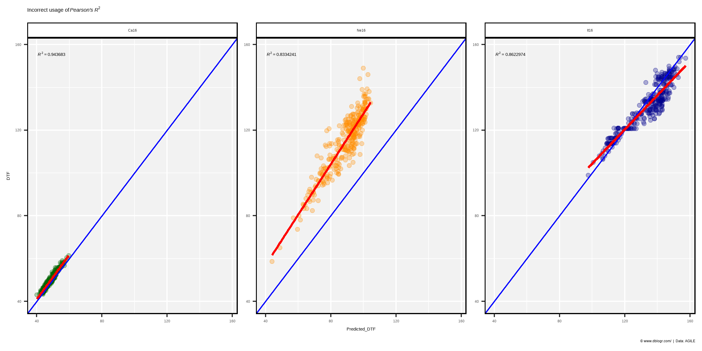

``` r
my_ggplot <- function(expt, color) {
  # Prep data
  xx <- d2 %>% filter(Expt == expt) 
  xx <- xx %>%
    mutate(Trendline = predict(lm(DTF ~ Predicted_DTF, data = xx)))
  mymin <- min(c(xx$DTF, xx$Predicted_DTF))
  mymax <- max(c(xx$DTF, xx$Predicted_DTF))
  # Plot
  mp1 <- ggplot(xx, aes(x = Predicted_DTF, y = DTF)) + 
    geom_segment(aes(xend = Predicted_DTF, yend = Trendline), alpha = 0.2) +
    geom_smooth(method = "lm", se = F, color = "red") +
    geom_point(color = color, alpha = 0.5) + 
    geom_abline(color = "blue") +
    xlim(c(mymin, mymax)) + ylim(c(mymin, mymax)) +
    theme_agData() +
    labs(title = expt,
         subtitle = substitute(paste(italic("Pearson's R")^2, " = ", r2), 
           list(r2 = round(pearsonsR2(x = xx$DTF, y = xx$Predicted_DTF), 3))))
  mp2 <- ggplot(xx, aes(x = Predicted_DTF, y = DTF)) + 
    geom_segment(aes(xend = Predicted_DTF, yend = Predicted_DTF), alpha = 0.2) +
    geom_point(color = color, alpha = 0.5) + 
    geom_abline(color = "blue") +
    stat_poly_eq(formula = y ~ x, parse = T, rr.digits = 7) +
    xlim(c(mymin, mymax)) + ylim(c(mymin, mymax)) +
    theme_agData() +
    labs(subtitle = substitute(paste(italic("Sum of Squares R")^2, " = ", r2), 
           list(r2 = round(SumOfSquaresR2(o = xx$DTF, p = xx$Predicted_DTF), 3))),
         caption = "\xa9 www.dblogr.com/  |  Data: AGILE")
  ggarrange(mp1, mp2, ncol = 2, align = "h")
}
```

``` r
mp1 <- my_ggplot("Ca16", color = "darkgreen")
mp2 <- my_ggplot("Ne16", color = "darkorange")
mp3 <- my_ggplot("It16", color = "darkblue")
mp <- ggarrange(mp1, mp2, mp3, ncol = 1)
ggsave("correlation_coefficients_06.png", mp, width = 8, height = 10)
```

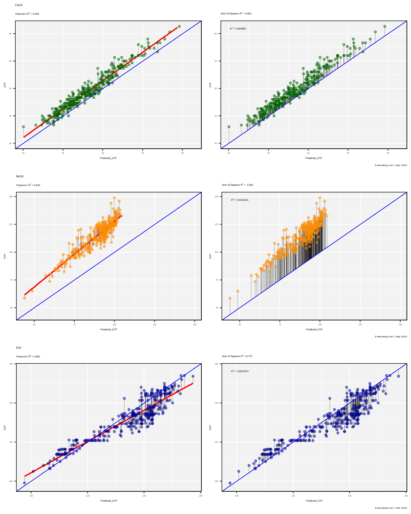

-----

# Negative *R<sup>2</sup>* values

Using *Pearson’s* formula *R<sup>2</sup>* values will always fall between 0 and 1. However, when using the *Sum of Squares* formula (which has an intercept of 0), negative values can be aquired.

``` r
# Calculate R^2 for Ne17
xx <- d2 %>% filter(Expt == "Ne16")
SumOfSquaresR2(o = xx$DTF, p = xx$Predicted_DTF)
```

    ## [1] -2.581473

*R<sup>2</sup>* for `Ne17` is \< 0, What does this mean? and how do we interpret it?

*R<sup>2</sup>* = 1 = regression is perfect, no errors

since,

`\(R^2=1-\frac{SS_{residuals}}{SS_{total}}=1-\frac{0}{\sum (x-\bar{x})}=1\)`

``` r
# Calculate R^2 of perfect regression
SumOfSquaresR2(o = xx$DTF, p = xx$DTF)
```

    ## [1] 1

*R<sup>2</sup>* = 0 = regression is no better than using the mean

since,

`\(y=\bar{x}\)`

and,

`\(R^2=1-\frac{SS_{residuals}}{SS_{total}}=1-\frac{\sum (x-\bar{x})}{\sum (x-\bar{x})}=1-1=0\)`

``` r
# Prep data
xx <- xx %>% mutate(Mean_DTF = mean(DTF))
# Calculate R^2 with mean
SumOfSquaresR2(o = xx$DTF, p = xx$Mean_DTF)
```

    ## [1] 0

*R<sup>2</sup>* \< 0 = regression is worse than using the mean.

`\(R^2=1-\frac{SS_{residuals}}{SS_{total}}=1-(>1)=(<0)\)`

``` r
# Calculate the Sum of Squares for the residuals
sum((xx$DTF - xx$Predicted_DTF)^2)
```

    ## [1] 226005

``` r
# Calculate the total Sum of Squares
sum((xx$DTF - mean(xx$DTF))^2)
```

    ## [1] 63103.93

`\(SS_{residuals} > SS_{total}\)`

``` r
t1 <- paste("Total Sum of Squares =", round(sum((xx$DTF - mean(xx$DTF))^2)))
t2 <- paste("Residual Sum of Squares =", round(sum((xx$DTF - xx$Predicted_DTF)^2)))
mp1 <- ggplot(xx, aes(x = Predicted_DTF, y = DTF)) + 
  geom_hline(yintercept = mean(xx$DTF), color = "coral", size = 2) +
  geom_segment(aes(xend = Predicted_DTF, yend = Mean_DTF), alpha = 0.2) +
  geom_point(alpha = 0.5) +
  theme_agData() +
  labs(title = "Ne16", subtitle = t1)
mp2 <- ggplot(xx, aes(x = Predicted_DTF, y = DTF)) + 
  geom_abline(color = "darkorchid", size = 2) +
  geom_segment(aes(xend = Predicted_DTF, yend = Predicted_DTF), alpha = 0.2) +
  geom_point(alpha = 0.5) +
  theme_agData() +
  labs(title = "", subtitle = t2,
       caption = "\xa9 www.dblogr.com/  |  Data: AGILE")
mp <- ggarrange(mp1, mp2, ncol = 2, align = "h")
ggsave("correlation_coefficients_07.png", mp, width = 8, height = 4)
```

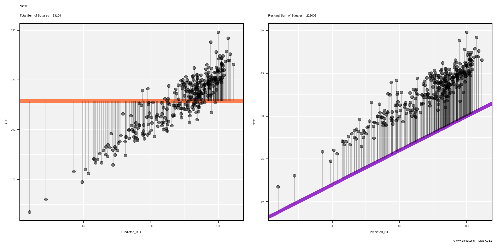

-----

# Effect of Range

Another factor to keep in mind, when considering *R<sup>2</sup>*, is the effect of the range of the data.

``` r
x1 <- d1 %>% filter(MacroEnv == "Macroenvironment 1") %>% mutate(Range = "Low")
x2 <- x1 %>% mutate(DTF = DTF + 20, DTM = DTM + 20, Range = "High",
                    MacroEnv = "Macroenvironment 2")
x3 <- bind_rows(x1, x2) %>% mutate(Range = "Both")
xx <- bind_rows(x1, x2, x3) %>% 
  mutate(Range = factor(Range, levels = c("Low","High","Both")))
mp <- ggplot(xx, aes(x = DTF, y = DTM)) + 
  geom_point(aes(color = MacroEnv)) + 
  geom_smooth(method = "lm", se = F) +
  stat_poly_eq(formula = y ~ x, parse = T, rr.digits = 3) +
  facet_grid(.~Range) +
  theme_agData(legend.position = "none") +
  labs(caption = "\xa9 www.dblogr.com/  |  Data: AGILE")
ggsave("correlation_coefficients_08.png", mp, width = 6, height = 4)
```

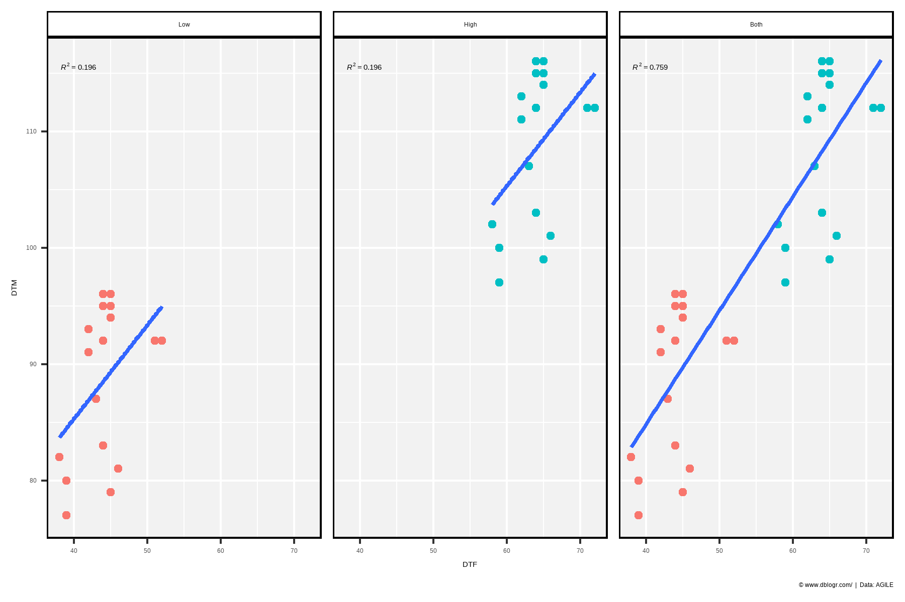

-----

# RMSE

The *The Root-Mean-Square Error* (*RMSE*) is a measure of the differences between observed and predicted, or an average deviation of the predicted vs observed values.

`\(RMSE=\frac{\sum (o-p^2}{n}\)`

  - `\(o\)` = Observed value
  - `\(p\)` = Predicted value
  - `\(n\)` = Number of observations

<!-- end list -->

``` r
# Create RMSE function
modelRMSE <- function(o, p) {
  sqrt(sum((o-p)^2) / (length(o)))
}
# Calculate RMSE for Ro17
xx <- d2 %>% filter(Expt == "Ca16")
modelRMSE(xx$DTF, xx$Predicted_DTF)
```

    ## [1] 1.610582

``` r
# Calculate RMSE for Ne17
xx <- d2 %>% filter(Expt == "Ne16")
modelRMSE(xx$DTF, xx$Predicted_DTF)
```

    ## [1] 26.4111

**interpretation**: the standard deviation of the unexplained variance in `Ro17` is `0.95` and in `Ne17` is `24.4`.

-----

# Final Plots

Note: for easier interpretation, the `x` and `y` axis have been swapped, since *overpredictions* will be above the `geom_abline` and *underpredictions* below.

``` r
my_ggplot <- function(expts, colors) {
  # Prep data
  xx <- d2 %>% filter(Expt %in% expts)
  r2 <- round(SumOfSquaresR2(o = xx$DTF, p = xx$Predicted_DTF), 3)
  rmse <- round(modelRMSE(o = xx$DTF, p = xx$Predicted_DTF), 1)
  mymin <- min(c(xx$DTF, xx$Predicted_DTF))
  mymax <- max(c(xx$DTF, xx$Predicted_DTF))
  # Plot
  ggplot(xx, aes(x = DTF, y = Predicted_DTF)) +
    geom_point(aes(fill = Expt), pch = 21, size = 2, alpha = 0.7) + 
    geom_abline(color = "blue") + 
    ylim(c(mymin, mymax)) +
    xlim(c(mymin, mymax)) +
    scale_fill_manual(values = colors) +
    theme_agData(legend.position = "none") +
    labs(y = "Predicted DTF", x = "Observed DTF",
         title = substitute(
           paste(italic("R")^2, " = ", r2, " | ", italic("RMSE"), " = ", rmse), 
           list(r2 = r2, rmse = rmse)))
}
mp1 <- my_ggplot("Ca16", "darkgreen")  + facet_grid(.~Expt)
mp2 <- my_ggplot("Ne16", "darkorange") + facet_grid(.~Expt)
mp3 <- my_ggplot("It16", "darkblue")   + facet_grid(.~Expt) +
  labs(caption = "\xa9 www.dblogr.com/  |  Data: AGILE")
mp <- ggarrange(mp1, mp2, mp3, ncol = 3)
ggsave("correlation_coefficients_09.png", mp, width = 10, height = 4)
```

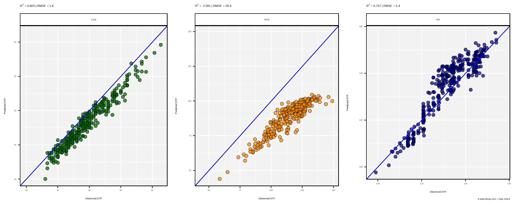

``` r
mp <- my_ggplot(c("Ca16","Ne16","It16"), c("darkgreen","darkorange","darkblue")) + 
  theme(legend.position = "bottom")
ggsave("correlation_coefficients_10.png", mp, width = 6, height = 4)
```

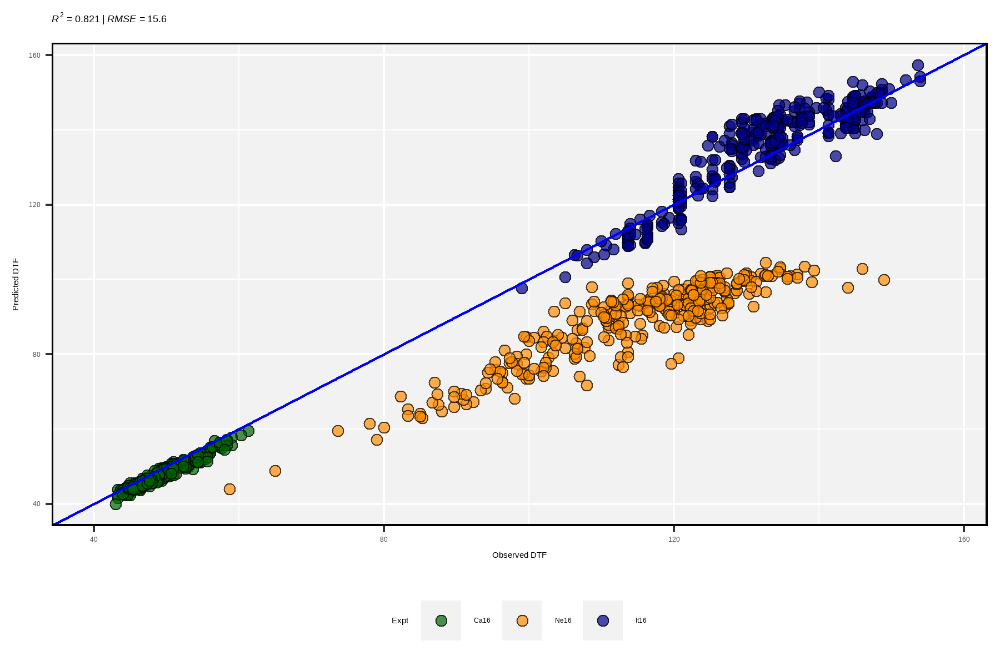

-----

# Model Evaluation

Next we will evaluate a **Photothermal Model** which describes the reciprical of DTF (`RDTF`) as a linear function of temperature and photoperiod:

`\(\frac{1}{f}=a+b\overline{T}+c\overline{P}\)`

where:

  - `\(f\)` = Days from sowing to flower (`DTF`)
  - `\(\overline{T}\)` = Mean temperature (`T_mean`)
  - `\(\overline{P}\)` = Mean photoperiod (`P_mean`)
  - `\(a,b,c\)` = Genotype specific constants

<!-- end list -->

``` r
# Perform linear regression
myModel <- lm(RDTF ~ T_mean + P_mean, data = d1)
summary(myModel)
```

    ## 
    ## Call:
    ## lm(formula = RDTF ~ T_mean + P_mean, data = d1)
    ## 
    ## Residuals:
    ##        Min         1Q     Median         3Q        Max 
    ## -0.0038951 -0.0005957 -0.0001821  0.0004946  0.0086038 
    ## 
    ## Coefficients:
    ##               Estimate Std. Error t value Pr(>|t|)    
    ## (Intercept) -1.843e-02  1.894e-03  -9.730 1.54e-12 ***
    ## T_mean       7.888e-04  8.688e-05   9.079 1.20e-11 ***
    ## P_mean       1.761e-03  1.223e-04  14.395  < 2e-16 ***
    ## ---
    ## Signif. codes:  0 '***' 0.001 '**' 0.01 '*' 0.05 '.' 0.1 ' ' 1
    ## 
    ## Residual standard error: 0.002006 on 44 degrees of freedom
    ## Multiple R-squared:  0.8893, Adjusted R-squared:  0.8843 
    ## F-statistic: 176.8 on 2 and 44 DF,  p-value: < 2.2e-16

In this case we now have multiple independant varables and cannot correlate `RDTF` with `T_mean` + `P_mean` using *Pearson’s* formula. Instead we will correlate `RDTF` with the `Predicted_RDTF` values that come from the model.

``` r
# Get predicted values and residual values from model
d1 <- d1 %>% mutate(Predicted_RDTF =     predict(myModel), 
                    Predicted_DTF  = 1 / predict(myModel),
                    Residuals_RDTF =     residuals(myModel),
                    Residuals_DTF  = abs( (1/DTF) - (1/Predicted_DTF) ))
```

Calculate *R<sup>2</sup>*

``` r
# Calculate R^2 using cor function
cor(d1$RDTF, d1$Predicted_RDTF)^2
```

    ## [1] 0.8893289

``` r
# Calculate R^2 using Pearson's formula
pearsonsR2(x = d1$RDTF, y = d1$Predicted_RDTF)
```

    ## [1] 0.8893289

``` r
# Calculate R^2 using SS formula
SumOfSquaresR2(o = d1$RDTF, p = d1$Predicted_RDTF)
```

    ## [1] 0.8893289

Each formula gives the same *R<sup>2</sup>* result.

``` r
mymin <- min(c(d1$RDTF, d1$Predicted_RDTF))
mymax <- max(c(d1$RDTF, d1$Predicted_RDTF))
mp <- ggplot(d1, aes(x = Predicted_RDTF, y = RDTF)) +
  geom_smooth(method = "lm", se = F, size = 2, color = "red") +
  geom_abline(color = "blue") +
  geom_segment(aes(yend = Predicted_RDTF, xend = Predicted_RDTF)) +
  geom_point(aes(fill = MacroEnv, size = abs(Residuals_RDTF)), pch = 21, alpha = 0.7) +
  scale_fill_manual(values = c("darkgreen","darkorange","darkblue")) +
  ylim(c(mymin, mymax)) +
  xlim(c(mymin, mymax)) +
  theme_agData(legend.position = "none") +
  labs(title = substitute(paste(italic("R")^2, " = ", r2), 
         list(r2 = round(SumOfSquaresR2(o = d1$DTF, p = d1$Predicted_DTF), 3))),
       caption = "\xa9 www.dblogr.com/  |  Data: AGILE")
ggsave("correlation_coefficients_11.png", mp, width = 6, height = 4)
```

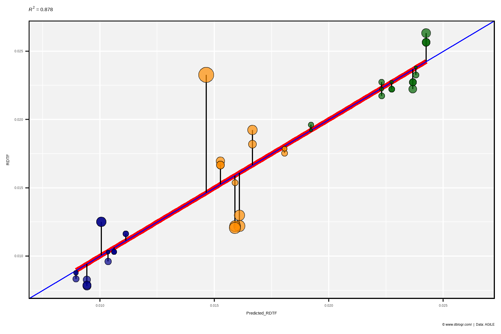

However, we are interested in `DTF` and not `RDTF`. Let see how *R<sup>2</sup>* changes when we calculate it for `DTF` instead of `RDTF`.

``` r
# Calculate R^2 using cor function
cor(x = d1$DTF, y = d1$Predicted_DTF)^2
```

    ## [1] 0.8823158

``` r
# Calculate R^2 using Pearson's formula
pearsonsR2(x = d1$DTF, y = d1$Predicted_DTF)
```

    ## [1] 0.8823158

``` r
# Calculate R^2 using SS formula
SumOfSquaresR2(o = d1$DTF, p = d1$Predicted_DTF)
```

    ## [1] 0.8775759

Notice the how the values of *R<sup>2</sup>* from `cor` or `pearssonR2` and `SumOfSquaresR2` do not match. Why is this occuring?

``` r
mymin <- min(c(d1$DTF, d1$Predicted_DTF))
mymax <- max(c(d1$DTF, d1$Predicted_DTF))
mp <- ggplot(d1, aes(y = DTF, x = Predicted_DTF)) +
  geom_smooth(method = "lm", se = F, size = 2, color = "red") +
  geom_abline(color = "blue") + 
  geom_segment(aes(yend = Predicted_DTF, xend = Predicted_DTF)) +
  geom_point(aes(fill = Expt, size = abs(Residuals_DTF)), pch = 21, alpha = 0.7) + 
  ylim(c(mymin, mymax)) +
  xlim(c(mymin, mymax)) +
  theme_agData(legend.position = "none") + 
  labs(title = substitute(paste(italic("R")^2, " = ", r2), 
         list(r2 = round(SumOfSquaresR2(o = d1$DTF, p = d1$Predicted_DTF), 3))),
       caption = "\xa9 www.dblogr.com/  |  Data: AGILE")
ggsave("correlation_coefficients_12.png", mp, width = 6, height = 4)
```

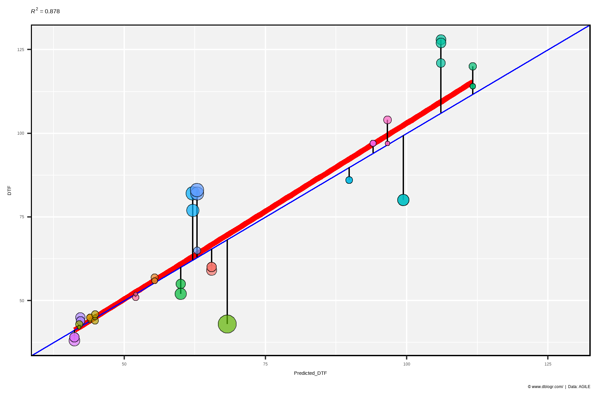

Now that we’ve transformed the data, the `geom_abline` and `geom_smooth` lines no longer perfectly overlap, which causes the slight difference in *R<sup>2</sup>*.

However, this still leaves open the questions of why `geom_abline()` and `geom_smooth` no longer overlap after transforming the data? Lets try and visualize this with test data.

``` r
# Prep data
xx <- data.frame(x = 1:10, y = 1:10 + 0.5) %>% 
  mutate(Residuals = abs(y-x))
SSt <- sum((xx$x - mean(xx$x))^2)
SSr <- sum((xx$x - xx$y)^2)
r2 <- round(1 - SSr / SSt, 4)
# Plot
mp1 <- ggplot(xx, aes(x = x, y = y)) + 
  geom_abline() + 
  geom_segment(aes(xend = x, yend = x)) +
  geom_point(aes(size = Residuals), alpha = 0.7) +
  theme_agData() +
  labs(title = substitute(paste(italic("R")^2, " = 1 - (", SSr, "/",SSt, ") = ", r2 ), 
         list(SSr = SSr, SSt = SSt, r2 = r2)))
# Prep data
xx <- xx %>% mutate(Residuals = abs((1/y)-(1/x)))
SSt <- sum((1 / xx$x - mean(1 / xx$x))^2)
SSr <- sum((1 / xx$x - 1 / xx$y)^2)
r2 <- round(1 - SSr / SSt, 4)
# Plot
mp2 <- ggplot(xx, aes(x = 1 / x, y = 1 / y)) + 
  geom_abline() +
  geom_segment(aes(xend = 1 / x, yend = 1 / x)) +
  geom_point(aes(size = Residuals), alpha = 0.7) +
  theme_agData() +
  labs(title = substitute(paste(italic("R")^2, " = 1 - (", SSr, "/",SSt, ") = ", r2 ), 
         list(SSr = round(SSr, 3), SSt = round(SSt, 3), r2 = r2)),
       caption = "\xa9 www.dblogr.com/  |  Data: AGILE")
# Append Plots
mp <- ggarrange(mp1, mp2, ncol = 2, legend = "none", align = "h")
ggsave("correlation_coefficients_13.png", mp, width = 8, height = 4)
```

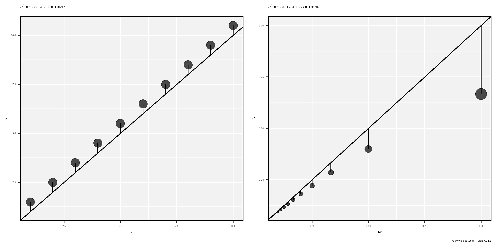

Visualizing the Photothermal model

``` r
x <- d1$T_mean
y <- d1$P_mean
z <- d1$RDTF
cv <- as.numeric(as.factor(d1$MacroEnv))
fit <- lm(z ~ x + y)
# Create PhotoThermal plane
fitpoints <- predict(fit)
grid.lines = 12
x.pred <- seq(min(x), max(x), length.out = grid.lines)
y.pred <- seq(min(y), max(y), length.out = grid.lines)
xy <- expand.grid(x = x.pred, y = y.pred)
z.pred <- matrix(predict(fit, newdata = xy), 
                 nrow = grid.lines, ncol = grid.lines)
# Plot with regression plane
png("correlation_coefficients_14.png", width = 1000, height = 1000, res = 200)
par(mar=c(1.5, 2.5, 1.5, 0.5))
plot3D::scatter3D(x, y, z, pch = 18, cex = 2, zlim = c(0.005,0.03),
  col = alpha(c("darkgreen","darkorange","darkblue"),0.5), 
  colvar = cv, colkey = F, col.grid = "grey", bty = "u",
  theta = 40, phi = 25, ticktype = "detailed", cex.lab = 1, cex.axis = 0.5,
  xlab = "Temperature", ylab = "Photoperiod", zlab = "1 / DTF",
  surf = list(x = x.pred, y = y.pred, z = z.pred, col = "black", 
  facets = NA, fit = fitpoints), main = "PhotoThermal Model")
dev.off()
```

    ## png 
    ##   2

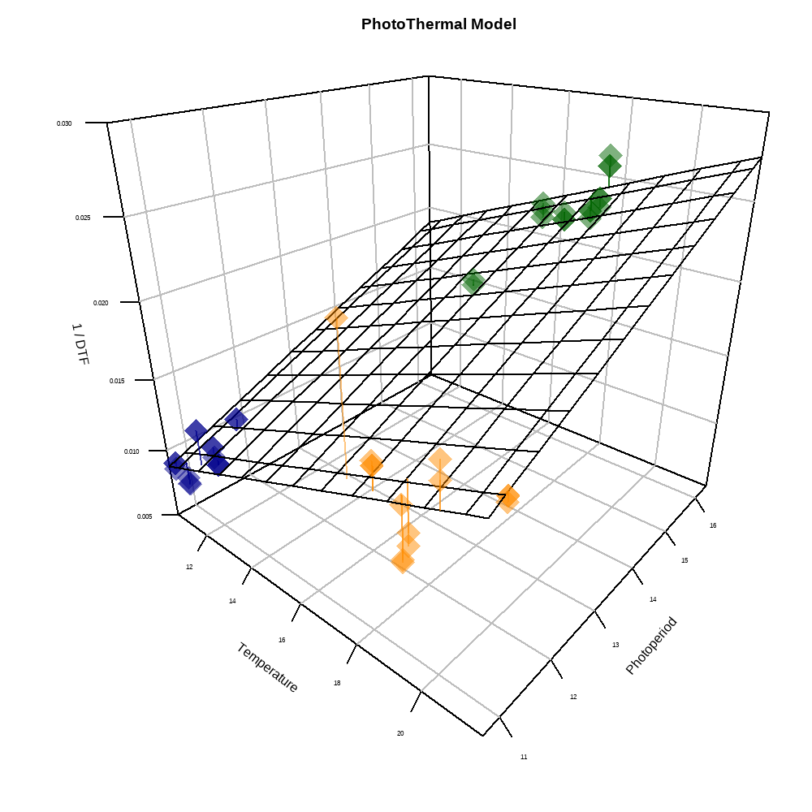

-----

© Derek Michael Wright 2020 [www.dblogr.com/](https://dblogr.netlify.com/)
