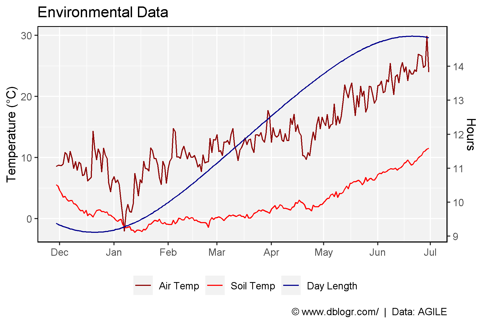

+++
widget = "blank"  # See https://sourcethemes.com/academic/docs/page-builder/
headless = false  # This file represents a page section.
active = true  # Activate this widget? true/false
weight = 2  # Order that this section will appear.

title = "Dual y-Axis"
summary = "How to create a plot with dual y-axes in R"
tags = [ "Academic", "Tutorials", "Featured" ]

[image]
  preview_only = true

[design]
  columns = "1"
+++

https://derekmichaelwright.github.io/htmls/academic/dual_y_axis.html

