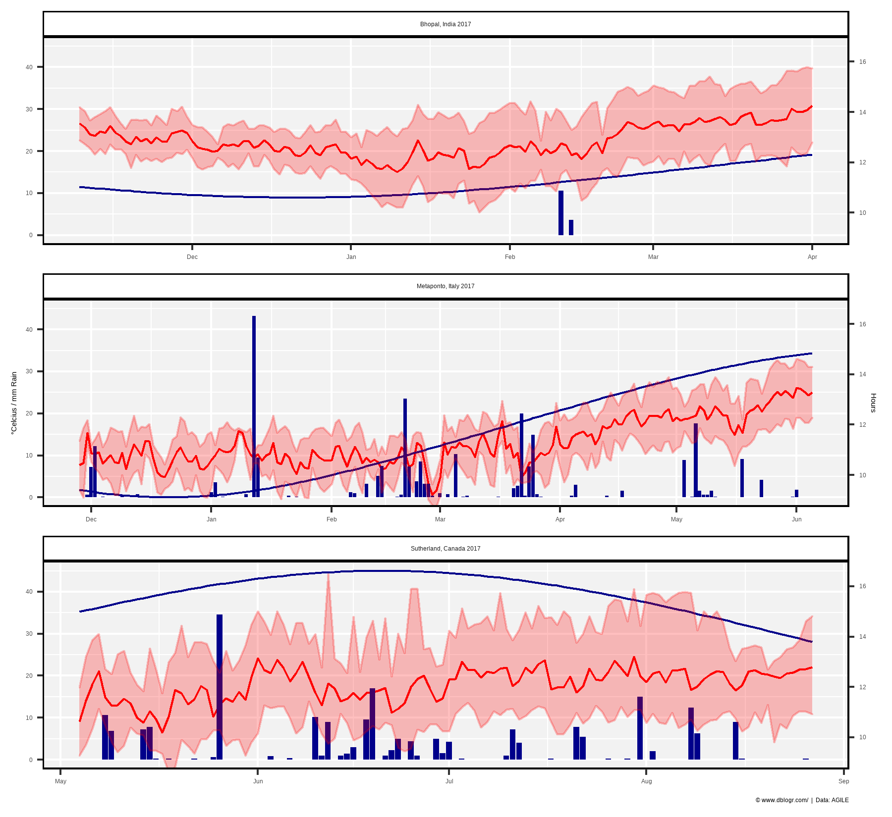

+++
widget = "blank"  # See https://sourcethemes.com/academic/docs/page-builder/
headless = false  # This file represents a page section.
active = true  # Activate this widget? true/false
weight = 3  # Order that this section will appear.

title = "Environmental Data Vignette"
summary = "Environmental data for the agile project"
tags = [ "Academic", "AGILE", "Tutorial" ]

[image]
  preview_only = true

[design]
  columns = "1"
+++

{}
https://derekmichaelwright.github.io/htmls/academic/envdata.html
{}

