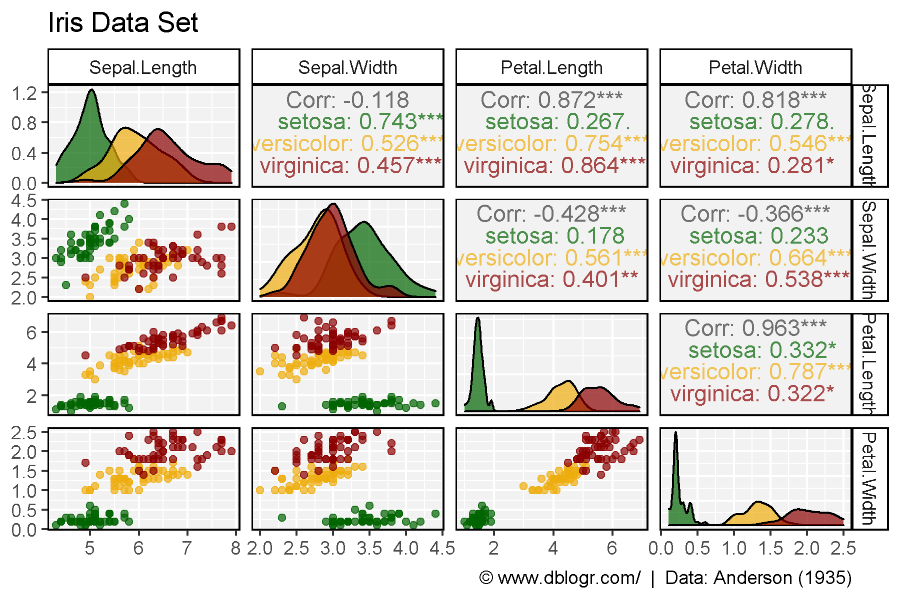
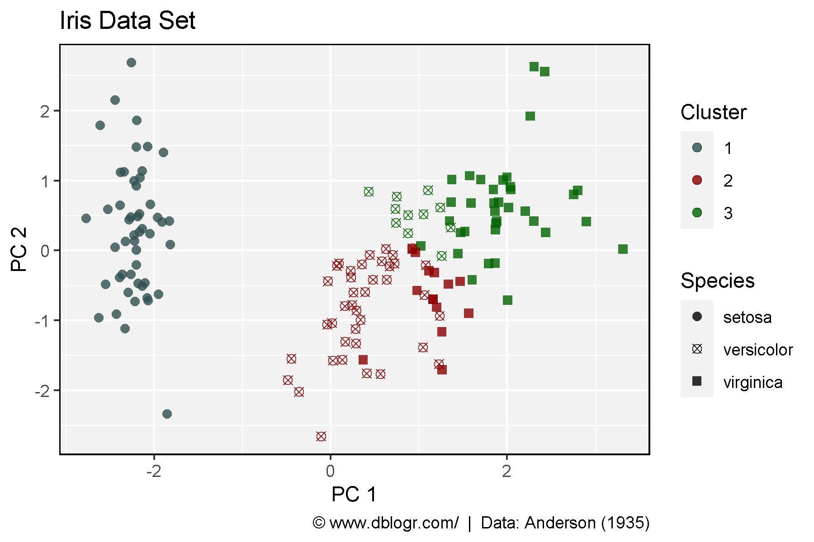

```{r setup, include=FALSE}
knitr::opts_chunk$set(echo = T, message = F, warning = F)
```

# Introduction

Principal component analysis (PCA) is the process of computing the principal components and using them to perform a change of basis on the data, sometimes using only the first few principal components and ignoring the rest.

It is commonly used for dimensionality reduction by projecting each data point onto only the first few principal components to obtain lower-dimensional data while preserving as much of the data's variation as possible. The first principal component can equivalently be defined as a direction that maximizes the variance of the projected data.

# Data

Fisher, R. A. (1936) **The use of multiple measurements in taxonomic problems**. *Annals of Eugenics*. 7(II): 179–188.

Anderson, Edgar (1935) **The irises of the Gaspe Peninsula**. *Bulletin of the American Iris Society*. 59: 2–5.

```{r}
# devtools::install_github("derekmichaelwright/agData")
library(agData) # Loads: tidyverse, ggpubr, ggbeeswarm, ggrepel
library(GGally) # ggpairs() 
library(FactoMineR) # PCA() & HCPC()
```

```{r}
# Prep data
DT::datatable(iris)
# Plot
mp <- ggpairs(iris, columns = 1:4, aes(color = Species)) +
  scale_color_manual(values = alpha(agData_Colors,0.7)) +
  scale_fill_manual(values = alpha(agData_Colors,0.7)) +
  theme_agData() +
  labs(title = "Iris Data Set",
       caption = "\xa9 www.dblogr.com/  |  Data: Anderson (1935)")
ggsave("pca_01.png", mp, width = 6, height = 4)
```

```{r echo = F}
ggsave("featured.png", mp, width = 6, height = 4)
```



---

```{r}
# PCA
mypca <- PCA(iris[,1:4], graph = F)
# HPCA
myhpca <- HCPC(mypca, nb.clust = 3, graph = F)
#
pcs <- mypca[[3]]$coord %>% as.data.frame()
xx <- iris %>% 
  mutate(Cluster = myhpca[[1]]$clust) %>%
  bind_cols(pcs)
#
colors <- c("darkslategrey", "darkred", "darkgreen")
shapes <- c(16, 13, 15)
# Plot 
mp <- ggplot(xx, aes(x = Dim.1, y = Dim.2, color = Cluster, pch = Species)) +
  geom_point(size = 2, alpha = 0.8) +
  scale_color_manual(values = colors) +
  scale_shape_manual(values = shapes) +
  theme_agData() +
  labs(title = "Iris Data Set", x = "PC 1", y = "PC 2",
       caption = "\xa9 www.dblogr.com/  |  Data: Anderson (1935)")
ggsave("pca_02.png", mp,  width = 6, height = 4)
```



---

&copy; Derek Michael Wright [www.dblogr.com/](https://dblogr.com/)