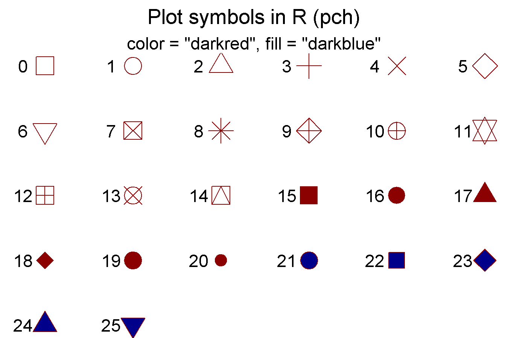

<script src="index_files/htmlwidgets/htmlwidgets.js"></script>

<script src="index_files/jquery/jquery.min.js"></script>

<link href="index_files/datatables-css/datatables-crosstalk.css" rel="stylesheet" />

<script src="index_files/datatables-binding/datatables.js"></script>

<link href="index_files/dt-core/css/jquery.dataTables.min.css" rel="stylesheet" />
<link href="index_files/dt-core/css/jquery.dataTables.extra.css" rel="stylesheet" />

<script src="index_files/dt-core/js/jquery.dataTables.min.js"></script>

<link href="index_files/crosstalk/css/crosstalk.css" rel="stylesheet" />

<script src="index_files/crosstalk/js/crosstalk.min.js"></script>

-----

# Introduction

This vignette will introduce the reader to `R`, a free, open-source statistical computing environment and `RStudio`, a integrated development environment for `R`.


-----

# Download R

[Download R](https://www.r-project.org/)

[Download RStudio](https://rstudio.com/products/rstudio/download/)


http://r-statistics.co/R-Tutorial.html

https://bookdown.org/rdpeng/exdata/getting-started-with-r.html\#installation

-----

# Calculator

R can be used as a super awesome calculator

``` r
# 5 + 3 = 8
5 + 3 
```

    ## [1] 8

``` r
# 24 / (1 + 2) = 8
24 / (1 + 2) 
```

    ## [1] 8

``` r
# 2 * 2 * 2 = 8
2^3 
```

    ## [1] 8

``` r
# 8 * 8 = 64
sqrt(64) 
```

    ## [1] 8

``` r
# -log10(0.05 / 5000000) = 8
-log10(0.05 / 5000000) 
```

    ## [1] 8

-----

# Functions

R has many useful built in functions

``` r
1:10
```

    ##  [1]  1  2  3  4  5  6  7  8  9 10

``` r
as.character(1:10)
```

    ##  [1] "1"  "2"  "3"  "4"  "5"  "6"  "7"  "8"  "9"  "10"

``` r
rep(1:2, times = 5)
```

    ##  [1] 1 2 1 2 1 2 1 2 1 2

``` r
rep(1:5, times = 2)
```

    ##  [1] 1 2 3 4 5 1 2 3 4 5

``` r
rep(1:5, each = 2)
```

    ##  [1] 1 1 2 2 3 3 4 4 5 5

``` r
rep(1:5, length.out = 7)
```

    ## [1] 1 2 3 4 5 1 2

``` r
help(rep)
seq(5, 50, by = 5)
```

    ##  [1]  5 10 15 20 25 30 35 40 45 50

``` r
seq(5, 50, length.out = 5)
```

    ## [1]  5.00 16.25 27.50 38.75 50.00

``` r
paste(1:10, 20:30, sep = "-")
```

    ##  [1] "1-20"  "2-21"  "3-22"  "4-23"  "5-24"  "6-25"  "7-26"  "8-27"  "9-28" 
    ## [10] "10-29" "1-30"

``` r
paste(1:10, collapse = "-")
```

    ## [1] "1-2-3-4-5-6-7-8-9-10"

``` r
paste0("x", 1:10)
```

    ##  [1] "x1"  "x2"  "x3"  "x4"  "x5"  "x6"  "x7"  "x8"  "x9"  "x10"

``` r
min(1:10)
```

    ## [1] 1

``` r
max(1:10)
```

    ## [1] 10

``` r
range(1:10)
```

    ## [1]  1 10

``` r
mean(1:10)
```

    ## [1] 5.5

``` r
sd(1:10)
```

    ## [1] 3.02765

Users can also create their own functions

``` r
customFunction1 <- function(x, y) {
  z <- 100 * x / (x + y)
  paste(z, "%")
}
customFunction1(x = 10, y = 90)
```

    ## [1] "10 %"

``` r
customFunction2 <- function(x) {
  mymin <- mean(x - sd(x))
  mymax <- mean(x) + sd(x)
  print(paste("Min =", mymin))
  print(paste("Max =", mymax))
}
customFunction2(x = 1:10)
```

    ## [1] "Min = 2.47234964590251"
    ## [1] "Max = 8.52765035409749"

`for` loops and `if` `else` statements

``` r
xx <- NULL #creates and empty object
for(i in 1:10) {
  xx[i] <- i*3
}
xx
```

    ##  [1]  3  6  9 12 15 18 21 24 27 30

``` r
xx %% 2 #gives the remainder when divided by 2
```

    ##  [1] 1 0 1 0 1 0 1 0 1 0

``` r
for(i in 1:length(xx)) {
  if((xx[i] %% 2) == 0) {
    print(paste(xx[i],"is Even"))
  } else { 
      print(paste(xx[i],"is Odd")) 
    }
}
```

    ## [1] "3 is Odd"
    ## [1] "6 is Even"
    ## [1] "9 is Odd"
    ## [1] "12 is Even"
    ## [1] "15 is Odd"
    ## [1] "18 is Even"
    ## [1] "21 is Odd"
    ## [1] "24 is Even"
    ## [1] "27 is Odd"
    ## [1] "30 is Even"

``` r
# or
ifelse(xx %% 2 == 0, "Even", "Odd")
```

    ##  [1] "Odd"  "Even" "Odd"  "Even" "Odd"  "Even" "Odd"  "Even" "Odd"  "Even"

``` r
paste(xx, ifelse(xx %% 2 == 0, "is Even", "is Odd"))
```

    ##  [1] "3 is Odd"   "6 is Even"  "9 is Odd"   "12 is Even" "15 is Odd" 
    ##  [6] "18 is Even" "21 is Odd"  "24 is Even" "27 is Odd"  "30 is Even"

-----

# Objects

Information can be stored in user defined objects, in multiple forms:

  - `c()`: a string of values
  - `matrix()`: a two dimensional matrix in one format
  - `data.frame()`: a two dimensional matrix where each column can be a different format
  - `list()`:

A string…

``` r
xc <- 1:10
xc
```

    ##  [1]  1  2  3  4  5  6  7  8  9 10

``` r
xc <- c(1,2,3,4,5,6,7,8,9,10)
xc
```

    ##  [1]  1  2  3  4  5  6  7  8  9 10

A matrix…

``` r
xm <- matrix(1:100, nrow = 10, ncol = 10, byrow = T)
xm
```

    ##       [,1] [,2] [,3] [,4] [,5] [,6] [,7] [,8] [,9] [,10]
    ##  [1,]    1    2    3    4    5    6    7    8    9    10
    ##  [2,]   11   12   13   14   15   16   17   18   19    20
    ##  [3,]   21   22   23   24   25   26   27   28   29    30
    ##  [4,]   31   32   33   34   35   36   37   38   39    40
    ##  [5,]   41   42   43   44   45   46   47   48   49    50
    ##  [6,]   51   52   53   54   55   56   57   58   59    60
    ##  [7,]   61   62   63   64   65   66   67   68   69    70
    ##  [8,]   71   72   73   74   75   76   77   78   79    80
    ##  [9,]   81   82   83   84   85   86   87   88   89    90
    ## [10,]   91   92   93   94   95   96   97   98   99   100

``` r
xm <- matrix(1:100, nrow = 10, ncol = 10, byrow = F)
xm
```

    ##       [,1] [,2] [,3] [,4] [,5] [,6] [,7] [,8] [,9] [,10]
    ##  [1,]    1   11   21   31   41   51   61   71   81    91
    ##  [2,]    2   12   22   32   42   52   62   72   82    92
    ##  [3,]    3   13   23   33   43   53   63   73   83    93
    ##  [4,]    4   14   24   34   44   54   64   74   84    94
    ##  [5,]    5   15   25   35   45   55   65   75   85    95
    ##  [6,]    6   16   26   36   46   56   66   76   86    96
    ##  [7,]    7   17   27   37   47   57   67   77   87    97
    ##  [8,]    8   18   28   38   48   58   68   78   88    98
    ##  [9,]    9   19   29   39   49   59   69   79   89    99
    ## [10,]   10   20   30   40   50   60   70   80   90   100

A data frame…

``` r
xd <- data.frame(
  x1 = c("aa","bb","cc","dd","ee",
         "ff","gg","hh","ii","jj"),
  x2 = 1:10,
  x3 = c(1,1,1,1,1,2,2,2,3,3),
  x4 = rep(c(1,2), times = 5),
  x5 = rep(1:5, times = 2),
  x6 = rep(1:5, each = 2),
  x7 = seq(5, 50, by = 5),
  x8 = log10(1:10),
  x9 = (1:10)^3,
  x10 = c(T,T,T,F,F,T,T,F,F,F)
)
xd
```

    ##    x1 x2 x3 x4 x5 x6 x7        x8   x9   x10
    ## 1  aa  1  1  1  1  1  5 0.0000000    1  TRUE
    ## 2  bb  2  1  2  2  1 10 0.3010300    8  TRUE
    ## 3  cc  3  1  1  3  2 15 0.4771213   27  TRUE
    ## 4  dd  4  1  2  4  2 20 0.6020600   64 FALSE
    ## 5  ee  5  1  1  5  3 25 0.6989700  125 FALSE
    ## 6  ff  6  2  2  1  3 30 0.7781513  216  TRUE
    ## 7  gg  7  2  1  2  4 35 0.8450980  343  TRUE
    ## 8  hh  8  2  2  3  4 40 0.9030900  512 FALSE
    ## 9  ii  9  3  1  4  5 45 0.9542425  729 FALSE
    ## 10 jj 10  3  2  5  5 50 1.0000000 1000 FALSE

A list…

``` r
xl <- list(xc, xm, xd)
xl[[1]]
```

    ##  [1]  1  2  3  4  5  6  7  8  9 10

``` r
xl[[2]]
```

    ##       [,1] [,2] [,3] [,4] [,5] [,6] [,7] [,8] [,9] [,10]
    ##  [1,]    1   11   21   31   41   51   61   71   81    91
    ##  [2,]    2   12   22   32   42   52   62   72   82    92
    ##  [3,]    3   13   23   33   43   53   63   73   83    93
    ##  [4,]    4   14   24   34   44   54   64   74   84    94
    ##  [5,]    5   15   25   35   45   55   65   75   85    95
    ##  [6,]    6   16   26   36   46   56   66   76   86    96
    ##  [7,]    7   17   27   37   47   57   67   77   87    97
    ##  [8,]    8   18   28   38   48   58   68   78   88    98
    ##  [9,]    9   19   29   39   49   59   69   79   89    99
    ## [10,]   10   20   30   40   50   60   70   80   90   100

``` r
xl[[3]]
```

    ##    x1 x2 x3 x4 x5 x6 x7        x8   x9   x10
    ## 1  aa  1  1  1  1  1  5 0.0000000    1  TRUE
    ## 2  bb  2  1  2  2  1 10 0.3010300    8  TRUE
    ## 3  cc  3  1  1  3  2 15 0.4771213   27  TRUE
    ## 4  dd  4  1  2  4  2 20 0.6020600   64 FALSE
    ## 5  ee  5  1  1  5  3 25 0.6989700  125 FALSE
    ## 6  ff  6  2  2  1  3 30 0.7781513  216  TRUE
    ## 7  gg  7  2  1  2  4 35 0.8450980  343  TRUE
    ## 8  hh  8  2  2  3  4 40 0.9030900  512 FALSE
    ## 9  ii  9  3  1  4  5 45 0.9542425  729 FALSE
    ## 10 jj 10  3  2  5  5 50 1.0000000 1000 FALSE

Selecting data…

``` r
xc[5] # 5th element in xc
```

    ## [1] 5

``` r
xd$x3[5] # 5th element in col "x3"
```

    ## [1] 1

``` r
xd[5,"x3"] # row 5, col "x3"
```

    ## [1] 1

``` r
xd$x3 # all of col "x3"
```

    ##  [1] 1 1 1 1 1 2 2 2 3 3

``` r
xd[,"x3"] # all rows, col "x3"
```

    ##  [1] 1 1 1 1 1 2 2 2 3 3

``` r
xd[3,] # row 3, all cols
```

    ##   x1 x2 x3 x4 x5 x6 x7        x8 x9  x10
    ## 3 cc  3  1  1  3  2 15 0.4771213 27 TRUE

``` r
xd[c(2,4),c("x4","x5")] # rows 2 & 4, cols "x4" & "x5"
```

    ##   x4 x5
    ## 2  2  2
    ## 4  2  4

``` r
xl[[3]]$x1 # 3rd object in the list, col "x1
```

    ##  [1] "aa" "bb" "cc" "dd" "ee" "ff" "gg" "hh" "ii" "jj"

-----

# Data Formats

Data can also be saved in many formats:

  - numeric
  - integer
  - character
  - factor
  - logical

<!-- end list -->

``` r
xd$x3 <- as.character(xd$x3)
xd$x3
```

    ##  [1] "1" "1" "1" "1" "1" "2" "2" "2" "3" "3"

``` r
xd$x3 <- as.numeric(xd$x3)
xd$x3
```

    ##  [1] 1 1 1 1 1 2 2 2 3 3

``` r
xd$x3 <- as.factor(xd$x3)
xd$x3
```

    ##  [1] 1 1 1 1 1 2 2 2 3 3
    ## Levels: 1 2 3

``` r
xd$x3 <- factor(xd$x3, levels = c("3","2","1"))
xd$x3
```

    ##  [1] 1 1 1 1 1 2 2 2 3 3
    ## Levels: 3 2 1

``` r
xd$x10
```

    ##  [1]  TRUE  TRUE  TRUE FALSE FALSE  TRUE  TRUE FALSE FALSE FALSE

``` r
as.numeric(xd$x10) # TRUE = 1, FALSE = 0
```

    ##  [1] 1 1 1 0 0 1 1 0 0 0

``` r
sum(xd$x10)
```

    ## [1] 5

Internal structure of an object can be checked with `str()`

``` r
str(xc) # c()
```

    ##  num [1:10] 1 2 3 4 5 6 7 8 9 10

``` r
str(xm) # matrix()
```

    ##  int [1:10, 1:10] 1 2 3 4 5 6 7 8 9 10 ...

``` r
str(xd) # data.frame()
```

    ## 'data.frame':    10 obs. of  10 variables:
    ##  $ x1 : chr  "aa" "bb" "cc" "dd" ...
    ##  $ x2 : int  1 2 3 4 5 6 7 8 9 10
    ##  $ x3 : Factor w/ 3 levels "3","2","1": 3 3 3 3 3 2 2 2 1 1
    ##  $ x4 : num  1 2 1 2 1 2 1 2 1 2
    ##  $ x5 : int  1 2 3 4 5 1 2 3 4 5
    ##  $ x6 : int  1 1 2 2 3 3 4 4 5 5
    ##  $ x7 : num  5 10 15 20 25 30 35 40 45 50
    ##  $ x8 : num  0 0.301 0.477 0.602 0.699 ...
    ##  $ x9 : num  1 8 27 64 125 216 343 512 729 1000
    ##  $ x10: logi  TRUE TRUE TRUE FALSE FALSE TRUE ...

``` r
str(xl) # list()
```

    ## List of 3
    ##  $ : num [1:10] 1 2 3 4 5 6 7 8 9 10
    ##  $ : int [1:10, 1:10] 1 2 3 4 5 6 7 8 9 10 ...
    ##  $ :'data.frame':    10 obs. of  10 variables:
    ##   ..$ x1 : chr [1:10] "aa" "bb" "cc" "dd" ...
    ##   ..$ x2 : int [1:10] 1 2 3 4 5 6 7 8 9 10
    ##   ..$ x3 : num [1:10] 1 1 1 1 1 2 2 2 3 3
    ##   ..$ x4 : num [1:10] 1 2 1 2 1 2 1 2 1 2
    ##   ..$ x5 : int [1:10] 1 2 3 4 5 1 2 3 4 5
    ##   ..$ x6 : int [1:10] 1 1 2 2 3 3 4 4 5 5
    ##   ..$ x7 : num [1:10] 5 10 15 20 25 30 35 40 45 50
    ##   ..$ x8 : num [1:10] 0 0.301 0.477 0.602 0.699 ...
    ##   ..$ x9 : num [1:10] 1 8 27 64 125 216 343 512 729 1000
    ##   ..$ x10: logi [1:10] TRUE TRUE TRUE FALSE FALSE TRUE ...

-----

# Packages

Additional libraries can be installed and loaded for use.

``` r
install.packages("scales")
```

``` r
library(scales)
xx <- data.frame(Values = 1:10)
xx$Rescaled <- rescale(x = xx$Values, to = c(1,30))
xx
```

    ##    Values  Rescaled
    ## 1       1  1.000000
    ## 2       2  4.222222
    ## 3       3  7.444444
    ## 4       4 10.666667
    ## 5       5 13.888889
    ## 6       6 17.111111
    ## 7       7 20.333333
    ## 8       8 23.555556
    ## 9       9 26.777778
    ## 10     10 30.000000

-----

# Data Wrangling

[R for Data Science](https://r4ds.had.co.nz/)

``` r
xx <- data.frame(Group = c("X","X","Y","Y","Y","X","X","X","Y","Y"),
                 Data1 = 1:10, 
                 Data2 = seq(10, 100, by = 10))
xx$NewData1 <- xx$Data1 + xx$Data2
xx$NewData2 <- xx$Data1 * 1000
xx
```

    ##    Group Data1 Data2 NewData1 NewData2
    ## 1      X     1    10       11     1000
    ## 2      X     2    20       22     2000
    ## 3      Y     3    30       33     3000
    ## 4      Y     4    40       44     4000
    ## 5      Y     5    50       55     5000
    ## 6      X     6    60       66     6000
    ## 7      X     7    70       77     7000
    ## 8      X     8    80       88     8000
    ## 9      Y     9    90       99     9000
    ## 10     Y    10   100      110    10000

``` r
xx$Data1 < 5 # which are less than 5
```

    ##  [1]  TRUE  TRUE  TRUE  TRUE FALSE FALSE FALSE FALSE FALSE FALSE

``` r
xx[xx$Data1 < 5,]
```

    ##   Group Data1 Data2 NewData1 NewData2
    ## 1     X     1    10       11     1000
    ## 2     X     2    20       22     2000
    ## 3     Y     3    30       33     3000
    ## 4     Y     4    40       44     4000

``` r
xx[xx$Group == "X", c("Group","Data2","NewData1")]
```

    ##   Group Data2 NewData1
    ## 1     X    10       11
    ## 2     X    20       22
    ## 6     X    60       66
    ## 7     X    70       77
    ## 8     X    80       88

Data wrangling with `tidyverse` and pipes (`%>%`)

``` r
library(tidyverse) # install.packages("tidyverse")
xx <- data.frame(Group = c("X","X","Y","Y","Y","Y","Y","X","X","X")) %>%
  mutate(Data1 = 1:10, 
         Data2 = seq(10, 100, by = 10),
         NewData1 = Data1 + Data2,
         NewData2 = Data1 * 1000)
xx
```

    ##    Group Data1 Data2 NewData1 NewData2
    ## 1      X     1    10       11     1000
    ## 2      X     2    20       22     2000
    ## 3      Y     3    30       33     3000
    ## 4      Y     4    40       44     4000
    ## 5      Y     5    50       55     5000
    ## 6      Y     6    60       66     6000
    ## 7      Y     7    70       77     7000
    ## 8      X     8    80       88     8000
    ## 9      X     9    90       99     9000
    ## 10     X    10   100      110    10000

``` r
filter(xx, Data1 < 5)
```

    ##   Group Data1 Data2 NewData1 NewData2
    ## 1     X     1    10       11     1000
    ## 2     X     2    20       22     2000
    ## 3     Y     3    30       33     3000
    ## 4     Y     4    40       44     4000

``` r
xx %>% filter(Data1 < 5)
```

    ##   Group Data1 Data2 NewData1 NewData2
    ## 1     X     1    10       11     1000
    ## 2     X     2    20       22     2000
    ## 3     Y     3    30       33     3000
    ## 4     Y     4    40       44     4000

``` r
xx %>% filter(Group == "X") %>% 
  select(Group, NewColName=Data2, NewData1)
```

    ##   Group NewColName NewData1
    ## 1     X         10       11
    ## 2     X         20       22
    ## 3     X         80       88
    ## 4     X         90       99
    ## 5     X        100      110

``` r
xs <- xx %>% 
  group_by(Group) %>% 
  summarise(Data2_mean = mean(Data2),
            Data2_sd = sd(Data2),
            NewData2_mean = mean(NewData2),
            NewData2_sd = sd(NewData2))
xs
```

    ## # A tibble: 2 x 5
    ##   Group Data2_mean Data2_sd NewData2_mean NewData2_sd
    ##   <chr>      <dbl>    <dbl>         <dbl>       <dbl>
    ## 1 X             60     41.8          6000       4183.
    ## 2 Y             50     15.8          5000       1581.

``` r
xx %>% left_join(xs, by = "Group")
```

    ##    Group Data1 Data2 NewData1 NewData2 Data2_mean Data2_sd NewData2_mean
    ## 1      X     1    10       11     1000         60 41.83300          6000
    ## 2      X     2    20       22     2000         60 41.83300          6000
    ## 3      Y     3    30       33     3000         50 15.81139          5000
    ## 4      Y     4    40       44     4000         50 15.81139          5000
    ## 5      Y     5    50       55     5000         50 15.81139          5000
    ## 6      Y     6    60       66     6000         50 15.81139          5000
    ## 7      Y     7    70       77     7000         50 15.81139          5000
    ## 8      X     8    80       88     8000         60 41.83300          6000
    ## 9      X     9    90       99     9000         60 41.83300          6000
    ## 10     X    10   100      110    10000         60 41.83300          6000
    ##    NewData2_sd
    ## 1     4183.300
    ## 2     4183.300
    ## 3     1581.139
    ## 4     1581.139
    ## 5     1581.139
    ## 6     1581.139
    ## 7     1581.139
    ## 8     4183.300
    ## 9     4183.300
    ## 10    4183.300

# Read/Write data

``` r
xx <- read.csv("Data.csv")
write.csv(xx, "Data.csv", row.names = F)
```

For excel sheets, the package `readxl` can be used to read in sheets of data.

``` r
library(readxl) # install.packages("readxl")
xx <- read_xlsx("Data.xlsx", sheet = "Data")
```

<div id="htmlwidget-1" style="width:100%;height:auto;" class="datatables html-widget"></div>
<script type="application/json" data-for="htmlwidget-1">{"x":{"filter":"none","data":[["1","2","3","4","5","6","7","8","9","10","11","12","13","14","15","16","17","18","19","20","21","22","23","24","25","26","27","28","29","30","31","32","33","34","35","36","37","38","39","40","41","42","43","44","45","46","47","48","49","50","51","52","53","54"],["CDC Maxim AGL","ILL 618 AGL","Laird AGL","CDC Maxim AGL","Laird AGL","ILL 618 AGL","CDC Maxim AGL","Laird AGL","ILL 618 AGL","Laird AGL","CDC Maxim AGL","Laird AGL","ILL 618 AGL","ILL 618 AGL","CDC Maxim AGL","ILL 618 AGL","Laird AGL","CDC Maxim AGL","ILL 618 AGL","CDC Maxim AGL","ILL 618 AGL","ILL 618 AGL","CDC Maxim AGL","ILL 618 AGL","ILL 618 AGL","ILL 618 AGL","CDC Maxim AGL","Laird AGL","ILL 618 AGL","Laird AGL","ILL 618 AGL","CDC Maxim AGL","Laird AGL","CDC Maxim AGL","ILL 618 AGL","CDC Maxim AGL","ILL 618 AGL","Laird AGL","ILL 618 AGL","Laird AGL","CDC Maxim AGL","Laird AGL","CDC Maxim AGL","ILL 618 AGL","Laird AGL","CDC Maxim AGL","Laird AGL","Laird AGL","CDC Maxim AGL","Laird AGL","CDC Maxim AGL","Laird AGL","CDC Maxim AGL","Laird AGL"],["Metaponto, Italy","Metaponto, Italy","Metaponto, Italy","Metaponto, Italy","Metaponto, Italy","Metaponto, Italy","Metaponto, Italy","Metaponto, Italy","Metaponto, Italy","Saskatoon, Canada","Saskatoon, Canada","Saskatoon, Canada","Saskatoon, Canada","Saskatoon, Canada","Saskatoon, Canada","Saskatoon, Canada","Saskatoon, Canada","Saskatoon, Canada","Saskatoon, Canada","Saskatoon, Canada","Saskatoon, Canada","Saskatoon, Canada","Saskatoon, Canada","Jessore, Bangladesh","Jessore, Bangladesh","Jessore, Bangladesh","Metaponto, Italy","Metaponto, Italy","Metaponto, Italy","Metaponto, Italy","Metaponto, Italy","Metaponto, Italy","Metaponto, Italy","Metaponto, Italy","Metaponto, Italy","Jessore, Bangladesh","Jessore, Bangladesh","Jessore, Bangladesh","Jessore, Bangladesh","Jessore, Bangladesh","Jessore, Bangladesh","Jessore, Bangladesh","Jessore, Bangladesh","Jessore, Bangladesh","Saskatoon, Canada","Saskatoon, Canada","Saskatoon, Canada","Saskatoon, Canada","Jessore, Bangladesh","Jessore, Bangladesh","Jessore, Bangladesh","Jessore, Bangladesh","Jessore, Bangladesh","Jessore, Bangladesh"],[2016,2016,2016,2016,2016,2016,2016,2016,2016,2016,2016,2016,2016,2016,2016,2016,2016,2016,2017,2017,2017,2017,2017,2017,2017,2017,2017,2017,2017,2017,2017,2017,2017,2017,2017,2016,2016,2016,2016,2016,2016,2016,2016,2016,2017,2017,2017,2017,2017,2017,2017,2017,2017,2017],[1,1,1,2,2,2,3,3,3,2,1,1,1,2,2,3,3,3,1,1,2,3,3,1,2,3,1,1,1,2,2,2,3,3,3,1,1,1,2,2,2,3,3,3,1,2,2,3,1,1,2,2,3,3],[128,135,133,133,135,135,128,130,135,56,50,56,47,48,51,47,56,51,48,55,46,46,53,84,82,80,139,139,139,146,142,139,138,138,141,84,76,73,77,74,83,74,85,77,60,55,57,56,88,78,90,78,90,84]],"container":"<table class=\"display\">\n  <thead>\n    <tr>\n      <th> <\/th>\n      <th>Name<\/th>\n      <th>Location<\/th>\n      <th>Year<\/th>\n      <th>Rep<\/th>\n      <th>DTF<\/th>\n    <\/tr>\n  <\/thead>\n<\/table>","options":{"columnDefs":[{"className":"dt-right","targets":[3,4,5]},{"orderable":false,"targets":0}],"order":[],"autoWidth":false,"orderClasses":false}},"evals":[],"jsHooks":[]}</script>

# Tidy Data

https://cran.r-project.org/web/packages/tidyr/vignettes/tidy-data.html

https://r4ds.had.co.nz/tidy-data.html

``` r
yy <- xx %>%
  group_by(Name, Location) %>%
  summarise(Mean_DTF = round(mean(DTF),1)) %>% 
  arrange(Location)
yy
```

    ## # A tibble: 9 x 3
    ## # Groups:   Name [3]
    ##   Name          Location            Mean_DTF
    ##   <chr>         <chr>                  <dbl>
    ## 1 CDC Maxim AGL Jessore, Bangladesh     86.7
    ## 2 ILL 618 AGL   Jessore, Bangladesh     79.3
    ## 3 Laird AGL     Jessore, Bangladesh     76.8
    ## 4 CDC Maxim AGL Metaponto, Italy       134. 
    ## 5 ILL 618 AGL   Metaponto, Italy       138. 
    ## 6 Laird AGL     Metaponto, Italy       137. 
    ## 7 CDC Maxim AGL Saskatoon, Canada       52.5
    ## 8 ILL 618 AGL   Saskatoon, Canada       47  
    ## 9 Laird AGL     Saskatoon, Canada       56.8

``` r
yy <- yy %>% spread(key = Location, value = Mean_DTF)
yy
```

    ## # A tibble: 3 x 4
    ## # Groups:   Name [3]
    ##   Name          `Jessore, Bangladesh` `Metaponto, Italy` `Saskatoon, Canada`
    ##   <chr>                         <dbl>              <dbl>               <dbl>
    ## 1 CDC Maxim AGL                  86.7               134.                52.5
    ## 2 ILL 618 AGL                    79.3               138.                47  
    ## 3 Laird AGL                      76.8               137.                56.8

``` r
yy <- yy %>% gather(key = TraitName, value = Value, 2:4)
yy
```

    ## # A tibble: 9 x 3
    ## # Groups:   Name [3]
    ##   Name          TraitName           Value
    ##   <chr>         <chr>               <dbl>
    ## 1 CDC Maxim AGL Jessore, Bangladesh  86.7
    ## 2 ILL 618 AGL   Jessore, Bangladesh  79.3
    ## 3 Laird AGL     Jessore, Bangladesh  76.8
    ## 4 CDC Maxim AGL Metaponto, Italy    134. 
    ## 5 ILL 618 AGL   Metaponto, Italy    138. 
    ## 6 Laird AGL     Metaponto, Italy    137. 
    ## 7 CDC Maxim AGL Saskatoon, Canada    52.5
    ## 8 ILL 618 AGL   Saskatoon, Canada    47  
    ## 9 Laird AGL     Saskatoon, Canada    56.8

``` r
yy <- yy %>% spread(key = Name, value = Value)
yy
```

    ## # A tibble: 3 x 4
    ##   TraitName           `CDC Maxim AGL` `ILL 618 AGL` `Laird AGL`
    ##   <chr>                         <dbl>         <dbl>       <dbl>
    ## 1 Jessore, Bangladesh            86.7          79.3        76.8
    ## 2 Metaponto, Italy              134.          138.        137. 
    ## 3 Saskatoon, Canada              52.5          47          56.8

-----

# Base Plotting

We will start with some basic plotting using the base function `plot()`

http://www.sthda.com/english/wiki/r-base-graphs

https://bookdown.org/rdpeng/exdata/the-base-plotting-system-1.html

``` r
# A basic scatter plot
plot(x = xd$x8, y = xd$x9)
```

}}index_files/figure-html/unnamed-chunk-20-1.png" width="672" />

``` r
# Adjust color and shape of the points
plot(x = xd$x8, y = xd$x9, col = "darkred", pch = 0)
```

}}index_files/figure-html/unnamed-chunk-20-2.png" width="672" />

``` r
plot(x = xd$x8, y = xd$x9, col = xd$x4, pch = xd$x4)
```

}}index_files/figure-html/unnamed-chunk-20-3.png" width="672" />

``` r
# Adjust plot type 
plot(x = xd$x8, y = xd$x9, type = "line")
```

}}index_files/figure-html/unnamed-chunk-20-4.png" width="672" />

``` r
# Adjust linetype
plot(x = xd$x8, y = xd$x9, type = "line", lty = 2)
```

}}index_files/figure-html/unnamed-chunk-20-5.png" width="672" />

``` r
# Plot lines and points
plot(x = xd$x8, y = xd$x9, type = "both")
```

}}index_files/figure-html/unnamed-chunk-20-6.png" width="672" />

Now lets create some random and normally distributed data to make some more complicated plots

``` r
# 100 random uniformly distributed numbers ranging from 0 - 100
ru <- runif(100, min = 0, max = 100)
ru
```

    ##   [1] 71.25940998  2.06377557 56.14025977 64.96492550  7.68938265 46.52724906
    ##   [7] 58.54766036 57.94447409 34.70233120 15.34682459 38.01426438 94.08731125
    ##  [13] 74.62048451 47.40663895 41.40492310 71.04764469 92.90247166 71.93544360
    ##  [19] 20.63517552 87.26260441 24.83198117 33.76727665 18.18954467 32.01809577
    ##  [25] 88.79487922 14.29473471 16.98726036 11.53463479 96.90330285 57.60225046
    ##  [31] 43.31066064 73.46334131 39.78753292 83.51597434 82.14917935 39.60583943
    ##  [37]  6.73912927 77.01894108 99.01245178 83.40608971 32.06273932 42.30700119
    ##  [43] 99.97626257 86.86021676 46.79021190  6.86419937 66.07610059 70.69278127
    ##  [49]  6.27400512 59.07025228  0.14574910 99.99563091 24.12675307 38.87712283
    ##  [55]  9.99807520 87.16852635 31.66627064 58.79184161 43.85814392 59.22204463
    ##  [61] 67.06703345 50.95938393  5.48780723  0.01309372 64.52167311 64.03244901
    ##  [67] 41.68989204 56.51010231 27.43023981 47.35172477 29.58400468 38.83199291
    ##  [73] 56.96875164 62.01093905 36.23008542 90.35316373 71.16430416 35.65715523
    ##  [79] 26.55879569 70.61113170 71.90632247 85.57735668 89.77064549 16.05337111
    ##  [85] 57.02039253 86.63331221 54.96002149  9.66174898 15.60548977 60.96070106
    ##  [91] 15.12075088 75.65825044 95.66008914 46.55915729 37.29983228 64.53315220
    ##  [97] 60.21844323 80.34547309 34.98126301 80.55179100

``` r
plot(x = ru)
```

}}index_files/figure-html/unnamed-chunk-21-1.png" width="672" />

``` r
order(ru)
```

    ##   [1]  64  51   2  63  49  37  46   5  88  55  28  26  91  10  89  84  27  23
    ##  [19]  19  53  21  79  69  71  57  24  41  22   9  99  78  75  95  11  72  54
    ##  [37]  36  33  15  67  42  31  59   6  94  45  70  14  62  87   3  68  73  85
    ##  [55]  30   8   7  58  50  60  97  90  74  66  65  96   4  47  61  80  48  16
    ##  [73]  77   1  81  18  32  13  92  38  98 100  35  40  34  82  86  44  56  20
    ##  [91]  25  83  76  17  12  93  29  39  43  52

``` r
ru<- ru[order(ru)]
ru
```

    ##   [1]  0.01309372  0.14574910  2.06377557  5.48780723  6.27400512  6.73912927
    ##   [7]  6.86419937  7.68938265  9.66174898  9.99807520 11.53463479 14.29473471
    ##  [13] 15.12075088 15.34682459 15.60548977 16.05337111 16.98726036 18.18954467
    ##  [19] 20.63517552 24.12675307 24.83198117 26.55879569 27.43023981 29.58400468
    ##  [25] 31.66627064 32.01809577 32.06273932 33.76727665 34.70233120 34.98126301
    ##  [31] 35.65715523 36.23008542 37.29983228 38.01426438 38.83199291 38.87712283
    ##  [37] 39.60583943 39.78753292 41.40492310 41.68989204 42.30700119 43.31066064
    ##  [43] 43.85814392 46.52724906 46.55915729 46.79021190 47.35172477 47.40663895
    ##  [49] 50.95938393 54.96002149 56.14025977 56.51010231 56.96875164 57.02039253
    ##  [55] 57.60225046 57.94447409 58.54766036 58.79184161 59.07025228 59.22204463
    ##  [61] 60.21844323 60.96070106 62.01093905 64.03244901 64.52167311 64.53315220
    ##  [67] 64.96492550 66.07610059 67.06703345 70.61113170 70.69278127 71.04764469
    ##  [73] 71.16430416 71.25940998 71.90632247 71.93544360 73.46334131 74.62048451
    ##  [79] 75.65825044 77.01894108 80.34547309 80.55179100 82.14917935 83.40608971
    ##  [85] 83.51597434 85.57735668 86.63331221 86.86021676 87.16852635 87.26260441
    ##  [91] 88.79487922 89.77064549 90.35316373 92.90247166 94.08731125 95.66008914
    ##  [97] 96.90330285 99.01245178 99.97626257 99.99563091

``` r
plot(x = ru)
```

}}index_files/figure-html/unnamed-chunk-21-2.png" width="672" />

``` r
# 100 normally distributed numbers with a mean of 50 and sd of 10
nd <- rnorm(100, mean = 50, sd = 10)
nd
```

    ##   [1] 44.69872 41.17932 49.37516 63.20662 61.06130 52.86767 67.74893 46.90803
    ##   [9] 31.40432 42.82779 47.37112 53.32855 50.74485 42.66275 52.02900 53.55618
    ##  [17] 48.50481 62.48698 59.75678 45.75638 58.88638 55.89105 46.22370 43.33382
    ##  [25] 42.53700 49.97211 57.33904 49.53500 51.30629 51.17681 50.25578 43.74323
    ##  [33] 31.77782 43.97508 57.18920 50.32112 38.06251 26.86303 37.89225 41.83792
    ##  [41] 48.85803 27.61561 47.51084 50.59906 50.95730 43.36075 43.99314 40.99152
    ##  [49] 43.02743 60.17652 54.48014 58.24812 53.95800 53.30142 31.14370 56.42637
    ##  [57] 64.86757 40.99176 50.82019 47.48028 68.27758 54.52292 25.60635 42.74642
    ##  [65] 43.40425 42.90359 37.42260 53.54844 41.18838 51.46315 48.80784 41.97584
    ##  [73] 42.76467 37.39981 45.19184 63.24895 46.87093 33.62165 39.18992 73.98309
    ##  [81] 54.88433 58.01981 11.41806 37.31206 45.43490 37.32580 40.92627 39.84636
    ##  [89] 43.11834 43.29488 44.18824 41.31476 41.61533 39.90415 42.12330 46.83831
    ##  [97] 52.90860 49.97765 43.05675 33.62331

``` r
nd <- nd[order(nd)]
nd
```

    ##   [1] 11.41806 25.60635 26.86303 27.61561 31.14370 31.40432 31.77782 33.62165
    ##   [9] 33.62331 37.31206 37.32580 37.39981 37.42260 37.89225 38.06251 39.18992
    ##  [17] 39.84636 39.90415 40.92627 40.99152 40.99176 41.17932 41.18838 41.31476
    ##  [25] 41.61533 41.83792 41.97584 42.12330 42.53700 42.66275 42.74642 42.76467
    ##  [33] 42.82779 42.90359 43.02743 43.05675 43.11834 43.29488 43.33382 43.36075
    ##  [41] 43.40425 43.74323 43.97508 43.99314 44.18824 44.69872 45.19184 45.43490
    ##  [49] 45.75638 46.22370 46.83831 46.87093 46.90803 47.37112 47.48028 47.51084
    ##  [57] 48.50481 48.80784 48.85803 49.37516 49.53500 49.97211 49.97765 50.25578
    ##  [65] 50.32112 50.59906 50.74485 50.82019 50.95730 51.17681 51.30629 51.46315
    ##  [73] 52.02900 52.86767 52.90860 53.30142 53.32855 53.54844 53.55618 53.95800
    ##  [81] 54.48014 54.52292 54.88433 55.89105 56.42637 57.18920 57.33904 58.01981
    ##  [89] 58.24812 58.88638 59.75678 60.17652 61.06130 62.48698 63.20662 63.24895
    ##  [97] 64.86757 67.74893 68.27758 73.98309

``` r
plot(x = nd)
```

}}index_files/figure-html/unnamed-chunk-21-3.png" width="672" />

``` r
hist(x = nd)
```

}}index_files/figure-html/unnamed-chunk-21-4.png" width="672" />

``` r
hist(nd, breaks = 20, col = "darkgreen")
```

}}index_files/figure-html/unnamed-chunk-21-5.png" width="672" />

``` r
plot(x = density(nd))
```

}}index_files/figure-html/unnamed-chunk-21-6.png" width="672" />

``` r
boxplot(x = nd)
```

}}index_files/figure-html/unnamed-chunk-21-7.png" width="672" />

``` r
boxplot(x = nd, horizontal = T)
```

}}index_files/figure-html/unnamed-chunk-21-8.png" width="672" />

# ggplot2

Lets be honest, the base plots are ugly\! The `ggplot2` package gives the user to create a better, more visually appealing plots. Additional packages such as `ggbeeswarm` and `ggrepel` also contain useful functions to add to the functionality of `ggplot2`.

https://ggplot2.tidyverse.org/

https://www.r-graph-gallery.com/ggplot2-package.html

http://r-statistics.co/ggplot2-Tutorial-With-R.html

https://www.statsandr.com/blog/graphics-in-r-with-ggplot2/

``` r
library(ggplot2)
mp <- ggplot(xd, aes(x = x8, y = x9))
mp + geom_point()
```

}}index_files/figure-html/unnamed-chunk-22-1.png" width="672" />

``` r
mp + geom_point(aes(color = x3, shape = x3), size = 4)
```

}}index_files/figure-html/unnamed-chunk-22-2.png" width="672" />

``` r
mp + geom_line(size = 2)
```

}}index_files/figure-html/unnamed-chunk-22-3.png" width="672" />

``` r
mp + geom_line(aes(color = x3), size = 2)
```

}}index_files/figure-html/unnamed-chunk-22-4.png" width="672" />

``` r
mp + geom_smooth(method = "loess")
```

}}index_files/figure-html/unnamed-chunk-22-5.png" width="672" />

``` r
mp + geom_smooth(method = "lm")
```

}}index_files/figure-html/unnamed-chunk-22-6.png" width="672" />

``` r
xx <- data.frame(data = c(rnorm(50, mean = 40, sd = 10),
                          rnorm(50, mean = 60, sd = 5)),
                 group = factor(rep(1:2, each = 50)),
                 label = c("Label1", rep(NA, 49), "Label2", rep(NA, 49)))
mp <- ggplot(xx, aes(x = data, fill = group))
mp + geom_histogram(color = "black")
```

}}index_files/figure-html/unnamed-chunk-22-7.png" width="672" />

``` r
mp + geom_histogram(color = "black", position = "dodge")
```

}}index_files/figure-html/unnamed-chunk-22-8.png" width="672" />

``` r
mp1 <- mp + geom_histogram(color = "black") + facet_grid(group~.)
mp1
```

}}index_files/figure-html/unnamed-chunk-22-9.png" width="672" />

``` r
mp + geom_density(alpha = 0.5)
```

}}index_files/figure-html/unnamed-chunk-22-10.png" width="672" />

``` r
mp <- ggplot(xx, aes(x = group, y = data, fill = group))
mp + geom_boxplot(color = "black")
```

}}index_files/figure-html/unnamed-chunk-22-11.png" width="672" />

``` r
mp + geom_boxplot() + geom_point()
```

}}index_files/figure-html/unnamed-chunk-22-12.png" width="672" />

``` r
mp + geom_violin() + geom_boxplot(width = 0.1, fill = "white")
```

}}index_files/figure-html/unnamed-chunk-22-13.png" width="672" />

``` r
library(ggbeeswarm)
mp + geom_quasirandom()
```

}}index_files/figure-html/unnamed-chunk-22-14.png" width="672" />

``` r
mp + geom_quasirandom(aes(shape = group))
```

}}index_files/figure-html/unnamed-chunk-22-15.png" width="672" />

``` r
mp2 <- mp + geom_violin() + 
  geom_boxplot(width = 0.1, fill = "white") +
  geom_beeswarm(alpha = 0.5)
library(ggrepel)
mp2 + geom_text_repel(aes(label = label), nudge_x = 0.4)
```

}}index_files/figure-html/unnamed-chunk-22-16.png" width="672" />

``` r
library(ggpubr)
ggarrange(mp1, mp2, ncol = 2, widths = c(2,1),
          common.legend = T, legend = "bottom")
```

}}index_files/figure-html/unnamed-chunk-22-17.png" width="672" />

-----

# Statistics

http://biostathandbook.com/

https://rcompanion.org/rcompanion/a\_02.html

``` r
# Prep data
lev_Loc  <- c("Saskatoon, Canada", "Jessore, Bangladesh", "Metaponto, Italy")
lev_Name <- c("ILL 618 AGL", "CDC Maxim AGL", "Laird AGL")
dd <- read_xlsx("Data.xlsx", sheet = "Data") %>%
  mutate(Location = factor(Location, levels = lev_Loc),
         Name = factor(Name, levels = lev_Name))
xx <- dd %>%
  group_by(Name, Location) %>%
  summarise(Mean_DTF = mean(DTF))
xx %>% spread(Location, Mean_DTF)
```

    ## # A tibble: 3 x 4
    ## # Groups:   Name [3]
    ##   Name          `Saskatoon, Canada` `Jessore, Bangladesh` `Metaponto, Italy`
    ##   <fct>                       <dbl>                 <dbl>              <dbl>
    ## 1 ILL 618 AGL                  47                    79.3               138.
    ## 2 CDC Maxim AGL                52.5                  86.7               134.
    ## 3 Laird AGL                    56.8                  76.8               137.

``` r
# Plot
mp1 <- ggplot(dd, aes(x = Location, y = DTF, color = Name, shape = Name)) +
  geom_point(size = 2, alpha = 0.7, position = position_dodge(width=0.5))
mp2 <- ggplot(xx, aes(x = Location, y = Mean_DTF, color = Name, group = Name, shape = Name)) +
  geom_point(size = 2.5, alpha = 0.7) + 
  geom_line(size = 1, alpha = 0.7) +
  theme(legend.position = "top")
ggarrange(mp1, mp2, ncol = 2, common.legend = T, legend = "top")
```

}}index_files/figure-html/unnamed-chunk-23-1.png" width="672" />

From first glace, it is clear there are differences between genotypes, locations, and genotype x environment (GxE) interactions. Now let’s do a few statistical tests.

``` r
summary(aov(DTF ~ Name * Location, data = dd))
```

    ##               Df Sum Sq Mean Sq  F value   Pr(>F)    
    ## Name           2     88      44    3.476   0.0395 *  
    ## Location       2  65863   32932 2598.336  < 2e-16 ***
    ## Name:Location  4    560     140   11.044 2.52e-06 ***
    ## Residuals     45    570      13                      
    ## ---
    ## Signif. codes:  0 '***' 0.001 '**' 0.01 '*' 0.05 '.' 0.1 ' ' 1

As expected, an ANOVA shows statistical significance for genotype (p-value = 0.0395), Location (p-value \< 2e-16) and GxE interactions (p-value \< 2.52e-06). However, all this tells us is that one genotype is different from the rest, one location is different from the others and that there is GxE interactions. If we want to be more specific, we can filter the data and perform say a *t-test* to compare two groups.

``` r
xx <- dd %>% 
  filter(Location %in% c("Saskatoon, Canada", "Jessore, Bangladesh")) %>%
  spread(Location, DTF)
t.test(x = xx$`Saskatoon, Canada`, y = xx$`Jessore, Bangladesh`)
```

    ## 
    ##  Welch Two Sample t-test
    ## 
    ## data:  xx$`Saskatoon, Canada` and xx$`Jessore, Bangladesh`
    ## t = -17.521, df = 32.701, p-value < 2.2e-16
    ## alternative hypothesis: true difference in means is not equal to 0
    ## 95 percent confidence interval:
    ##  -32.18265 -25.48402
    ## sample estimates:
    ## mean of x mean of y 
    ##  52.11111  80.94444

DTF in Saskatoon, Canada is significantly different (p-value \< 2.2e-16) from DTF in Jessore, Bangladesh.

``` r
xx <- dd %>% 
  filter(Name %in% c("ILL 618 AGL", "Laird AGL"),
         Location == "Metaponto, Italy") %>%
  spread(Name, DTF)
t.test(x = xx$`ILL 618 AGL`, y = xx$`Laird AGL`)
```

    ## 
    ##  Welch Two Sample t-test
    ## 
    ## data:  xx$`ILL 618 AGL` and xx$`Laird AGL`
    ## t = 0.38008, df = 8.0564, p-value = 0.7137
    ## alternative hypothesis: true difference in means is not equal to 0
    ## 95 percent confidence interval:
    ##  -5.059739  7.059739
    ## sample estimates:
    ## mean of x mean of y 
    ##  137.8333  136.8333

DTF between ILL 618 AGL and Laird AGL are not significantly different (p-value = 0.7137) in Metaponto, Italy.

-----

# pch Plot

``` r
xx <- data.frame(x = rep(1:6, times = 5, length.out = 26),
                 y = rep(5:1, each = 6, length.out = 26),
                 pch = 0:25)
mp <- ggplot(xx, aes(x = x, y = y, shape = as.factor(pch))) +
  geom_point(color = "darkred", fill = "darkblue", size = 5) +
  geom_text(aes(label = pch), nudge_x = -0.25) +
  scale_shape_manual(values = xx$pch) +
  scale_x_continuous(breaks = 6:1) +
  scale_y_continuous(breaks = 6:1) +
  theme_void() +
  theme(legend.position = "none",
        plot.title = element_text(hjust = 0.5),
        plot.subtitle = element_text(hjust = 0.5),
        axis.text = element_blank(),
        axis.ticks = element_blank()) +
  labs(title = "Plot symbols in R (pch)",
       subtitle = "color = \"darkred\", fill = \"darkblue\"",
       x = NULL, y = NULL)
ggsave("pch.png", mp, width = 4.5, height = 3)
```



-----

# R Markdown

Tutorials on how to create an R markdown document like this one can be found here:

  - https://rmarkdown.rstudio.com/articles\_intro.html
  - https://rmarkdown.rstudio.com/lesson-1.html
  - https://alexd106.github.io/intro2R/Rmarkdown\_intro.html

-----

© Derek Michael Wright 2020 [www.dblogr.com/](https://dblogr.netlify.com/)
