```{r setup, include = FALSE}
knitr::opts_chunk$set(echo = T, message = F, warning = F)
```

---

```{r}
# devtools::install_github("derekmichaelwright/agData")
library(agData) # Loads: tidyverse, ggpubr, ggbeeswarm, ggrepel
library(treemapify) # geom_treemap()
```

---

# Crops by Area

```{r}
gg_treemap <- function(area = "Canada", measurement = "Area harvested", year = 2018) {
  #Prep data
  xx <- agData_FAO_Crops %>% 
    filter(Area == area, Year == year, Measurement == measurement) %>%
    arrange(desc(Value)) %>% 
    slice(1:25) %>%
    mutate(Area = factor(Area, levels = unique(Area))) 
  # Plot
  ggplot(xx, aes(area = Value, fill = Crop, label = Crop)) +
    geom_treemap(color = "black") +
    geom_treemap_text(place = "centre", grow = T, color = "white") +
    scale_fill_manual(values = alpha(agData_Colors, 0.75)) +
    theme_agData(legend.position = "none") +
    labs(title = paste(area,"-",year,"-",measurement),
         caption = "\xa9 www.dblogr.com/  |  Data: STATCAN")
}
```

---

## World

```{r}
mp <- gg_treemap(area = "World")
ggsave("country_treemaps_01_world.png", mp, width = 6, height = 4)
```

```{r echo = F}
ggsave("featured.png", mp, width = 6, height = 4)
```

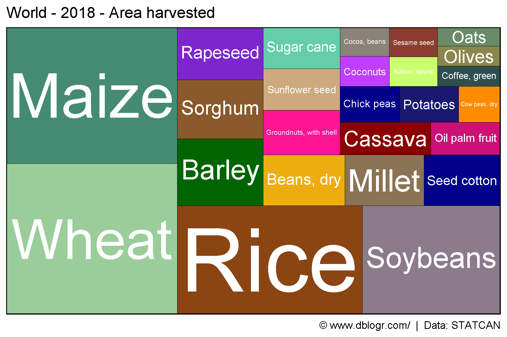

---

## Canada

```{r}
mp <- gg_treemap(area = "Canada")
ggsave("country_treemaps_02_canada.png", mp, width = 6, height = 4)
```

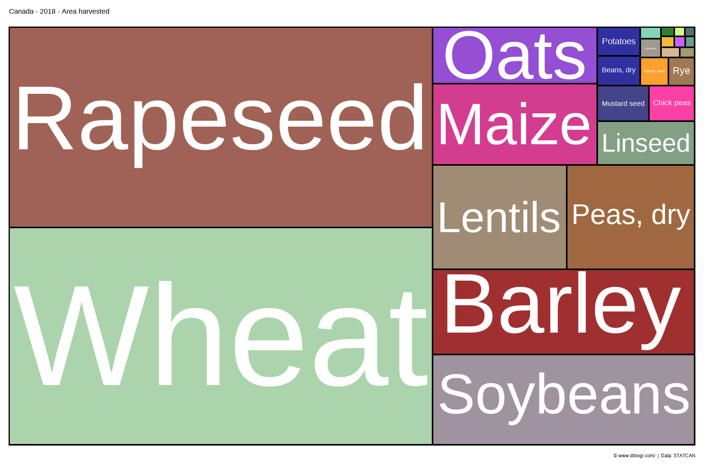

---

## USA

```{r}
mp <- gg_treemap(area = "USA")
ggsave("country_treemaps_03_usa.png", mp, width = 6, height = 4)
```

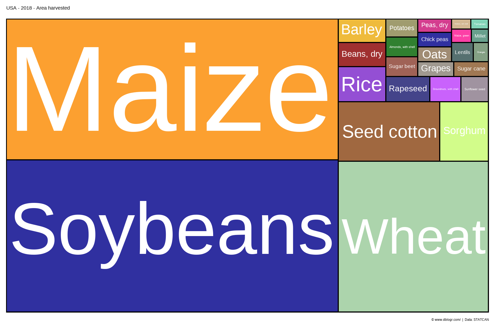

---

## Mexico

```{r}
mp <- gg_treemap(area = "Mexico")
ggsave("country_treemaps_04_mexico.png", mp, width = 6, height = 4)
```

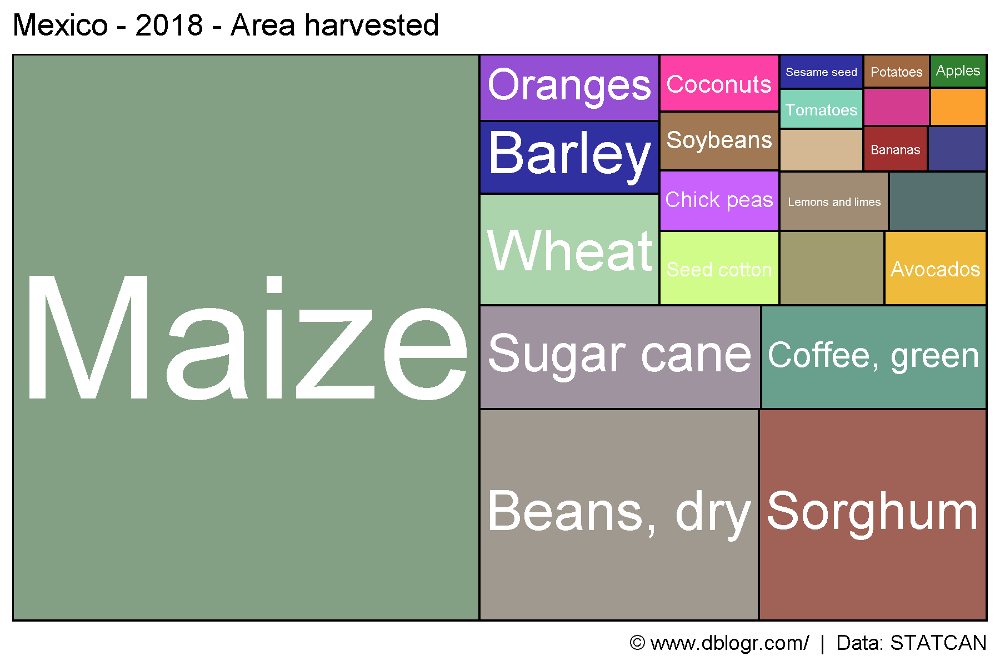

---

## Germany

```{r}
mp <- gg_treemap(area = "Germany")
ggsave("country_treemaps_05_germany.png", mp, width = 6, height = 4)
```

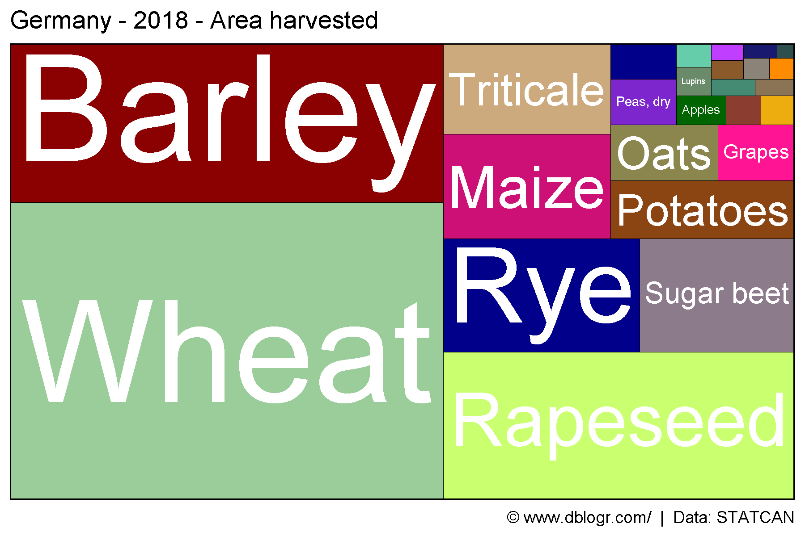

---

## Russia

```{r}
mp <- gg_treemap(area = "Russia")
ggsave("country_treemaps_06_russia.png", mp, width = 6, height = 4)
```

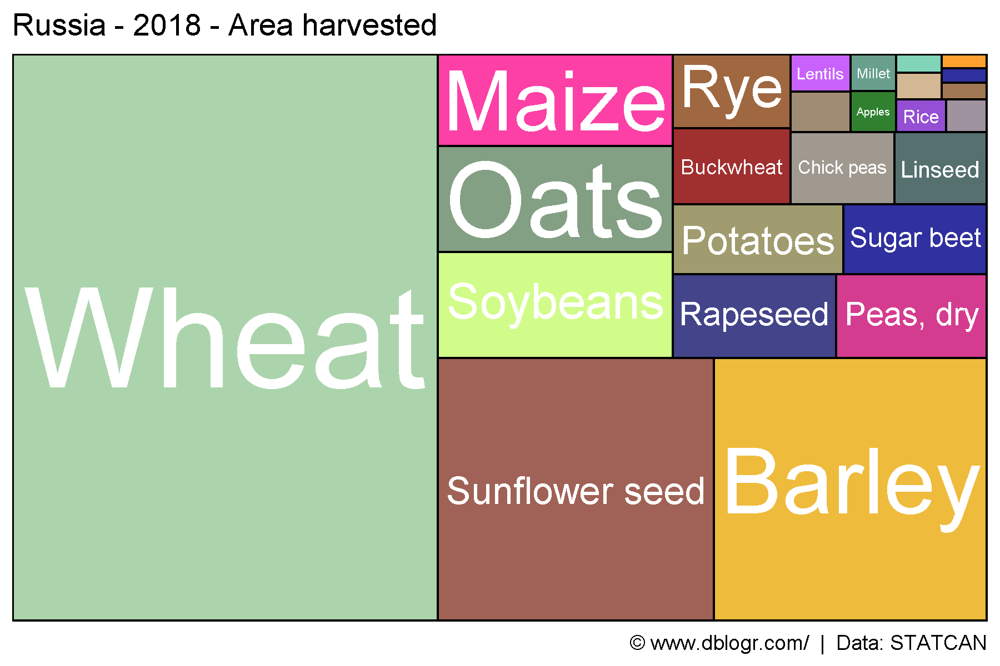

---

## France

```{r}
mp <- gg_treemap(area = "France")
ggsave("country_treemaps_07_france.png", mp, width = 6, height = 4)
```

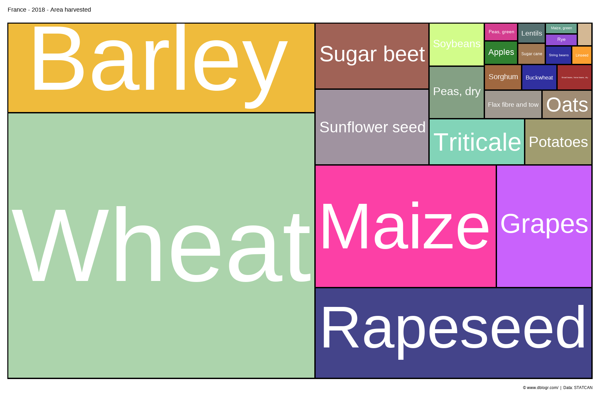

---

## Spain 

```{r}
mp <- gg_treemap(area = "Spain")
ggsave("country_treemaps_08_spain.png", mp, width = 6, height = 4)
```

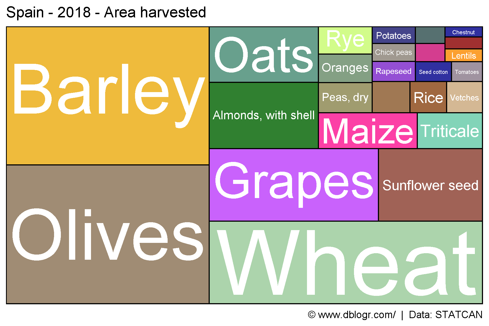

---

## United Kingdom

```{r}
mp <- gg_treemap(area = "UK")
ggsave("country_treemaps_09_uk.png", mp, width = 6, height = 4)
```

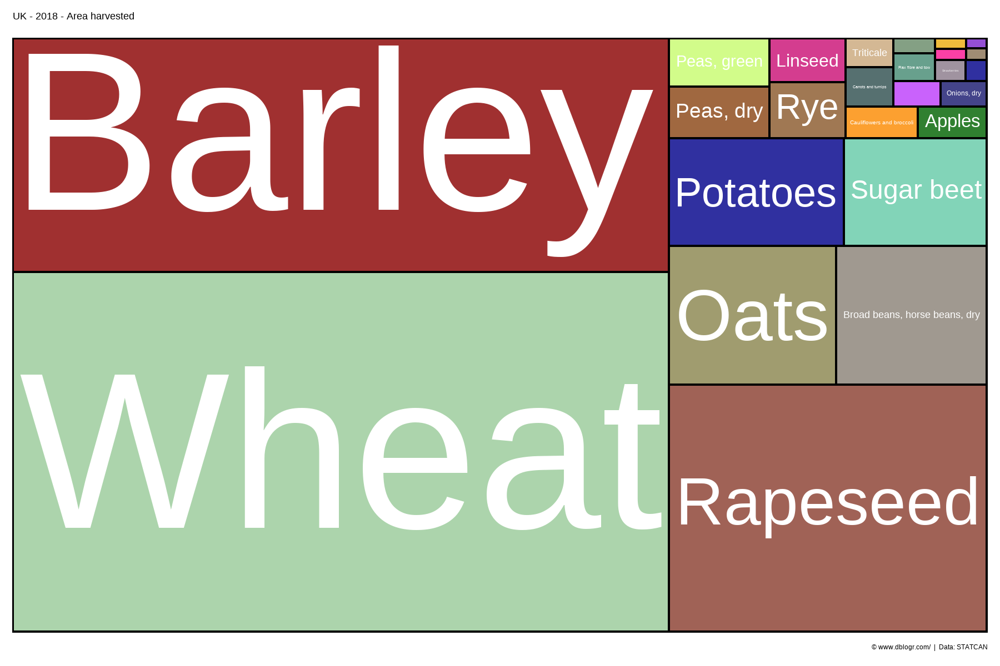

---

## India

```{r}
mp <- gg_treemap(area = "India")
ggsave("country_treemaps_10_india.png", mp, width = 6, height = 4)
```

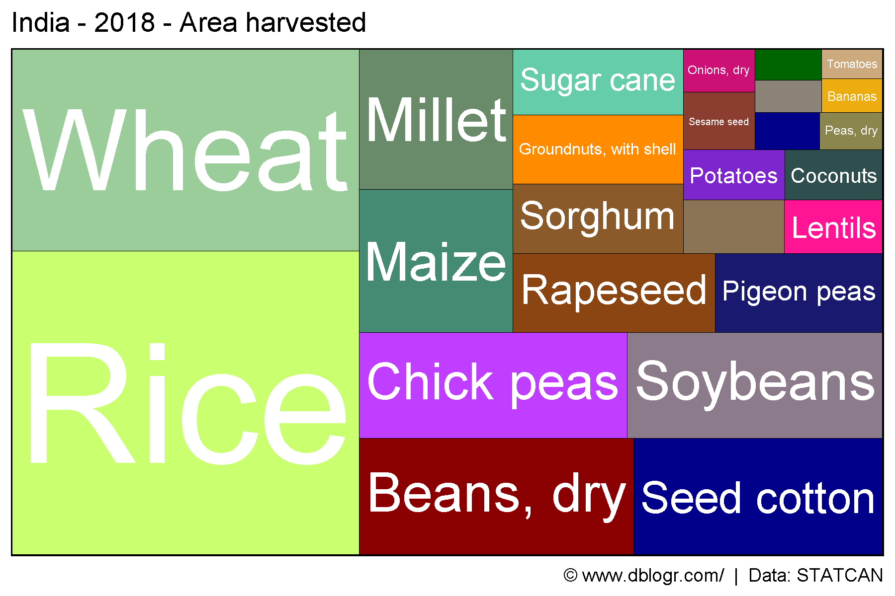

---

## Nepal 

```{r}
mp <- gg_treemap(area = "Nepal")
ggsave("country_treemaps_11_nepal.png", mp, width = 6, height = 4)
```

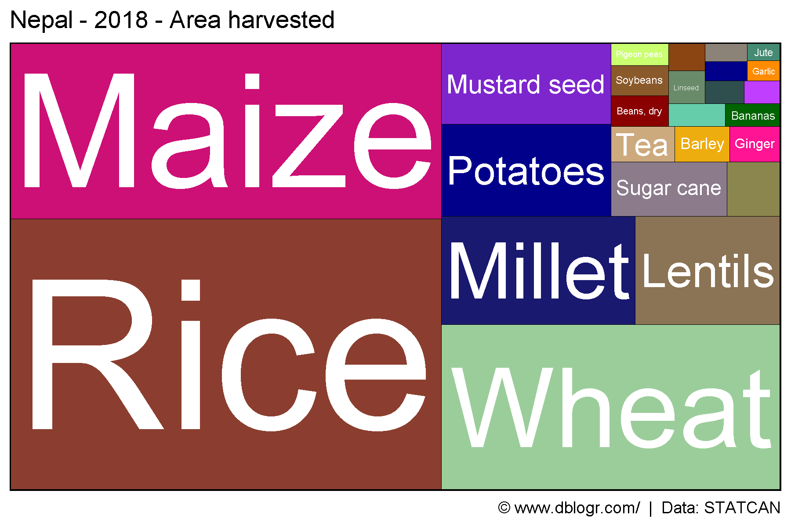

---

## China

```{r}
mp <- gg_treemap(area = "China")
ggsave("country_treemaps_12_china.png", mp, width = 6, height = 4)
```

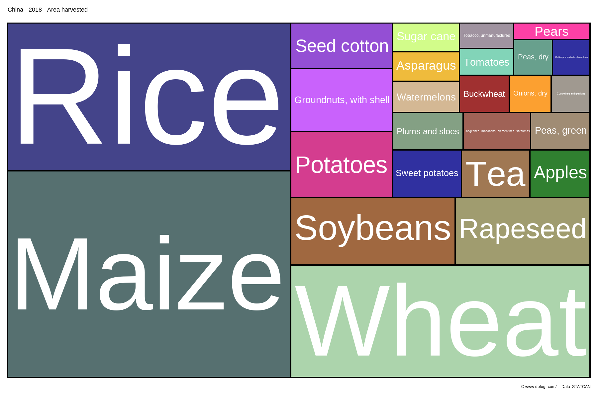

---

# All Countries

```{r}
# Prep data
areas <- c("World",
  levels(agData_FAO_Country_Table$Region),
  levels(agData_FAO_Country_Table$SubRegion),
  levels(agData_FAO_Country_Table$Country))
# Plot
pdf("country_treemaps_fao.pdf", width = 6, height = 4)
for(i in areas) {
  print(gg_treemap(area = i))
}
dev.off()
```

**PDF**: [country_treemaps_fao.pdf](https://github.com/derekmichaelwright/dblogr/blob/master/content/agdata/country_treemaps/country_treemaps_fao.pdf)

---

&copy; Derek Michael Wright [www.dblogr.com/](https://dblogr.com/)