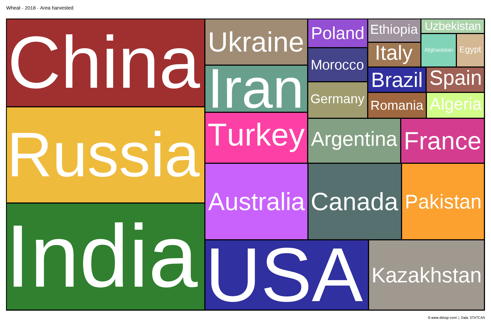
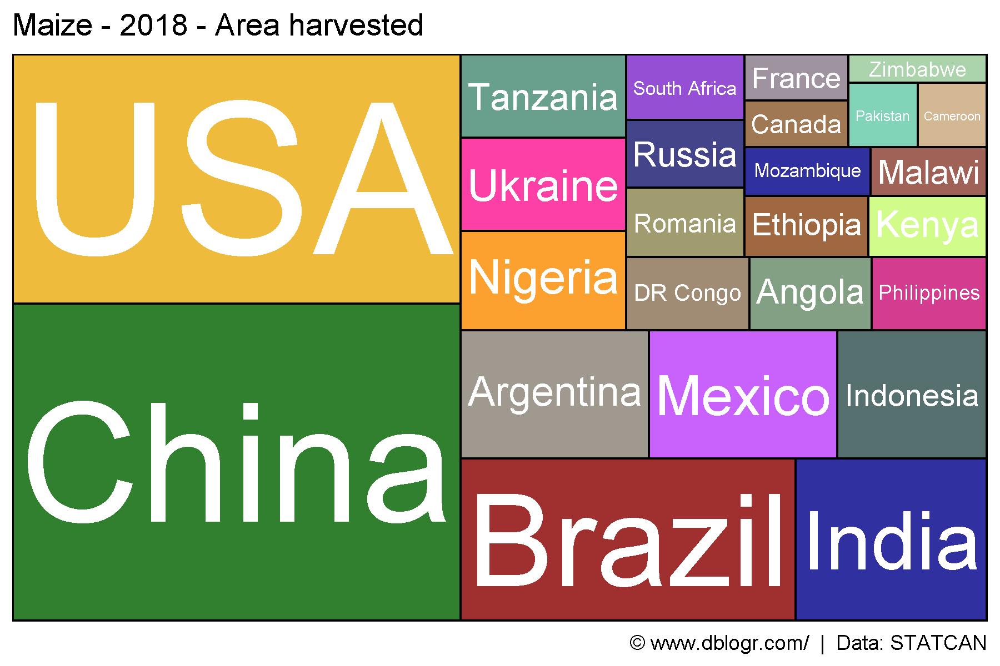
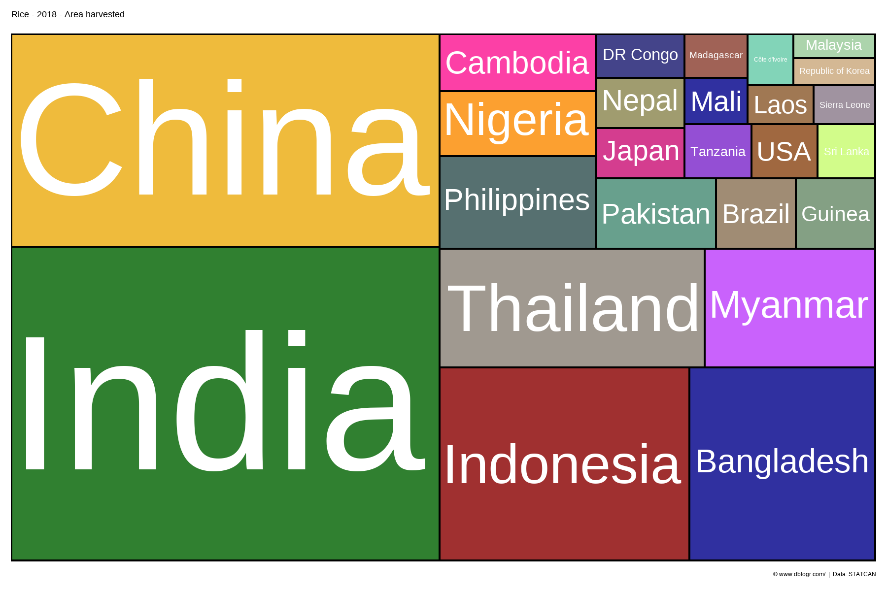
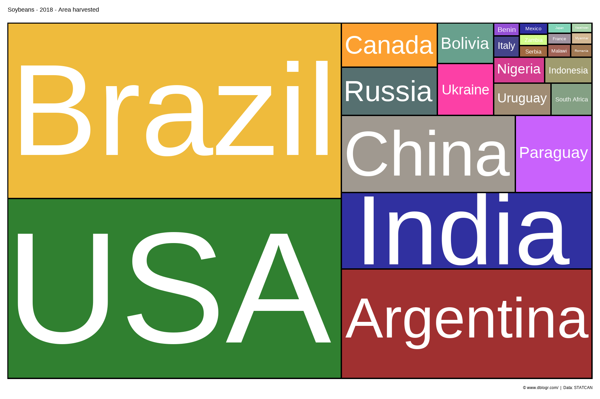
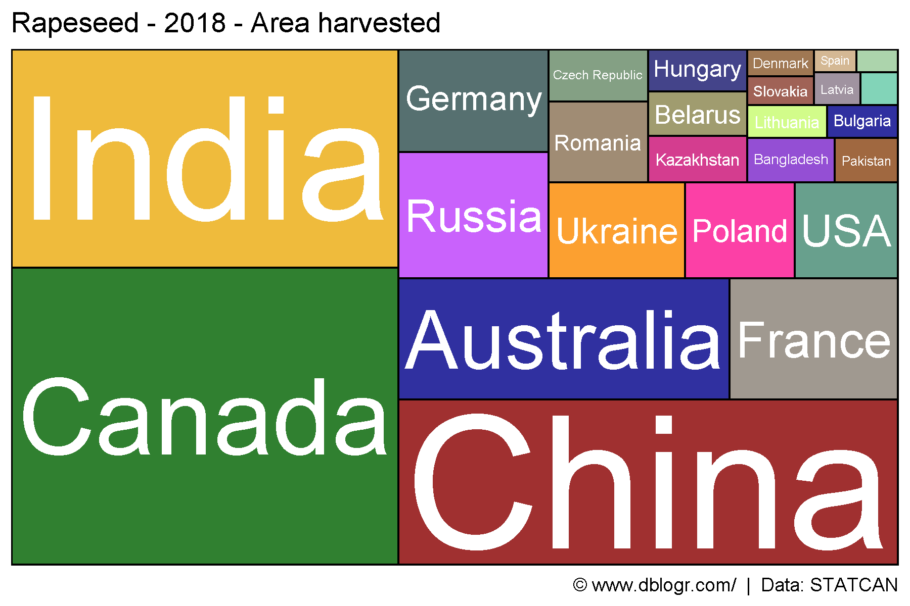
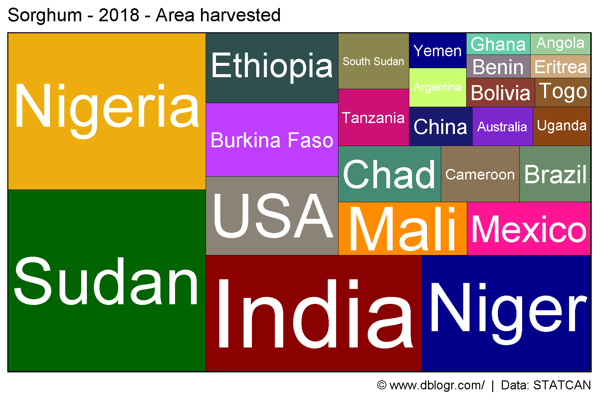
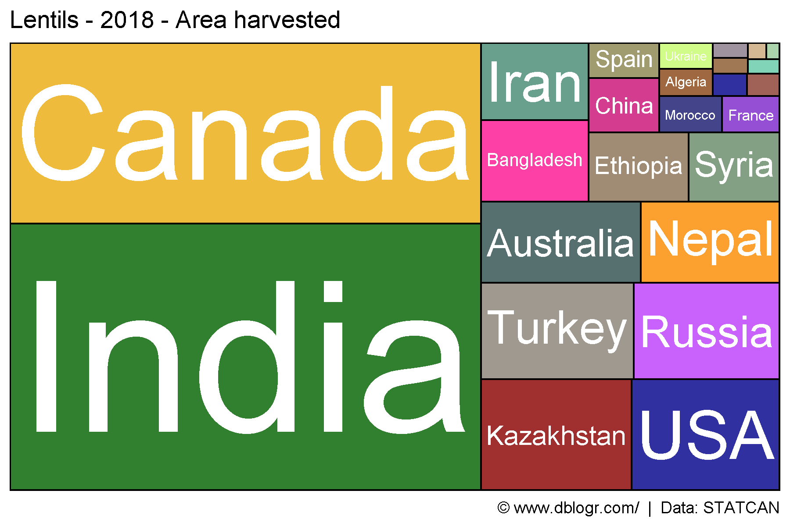
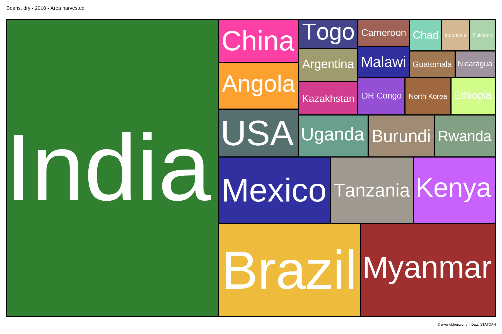
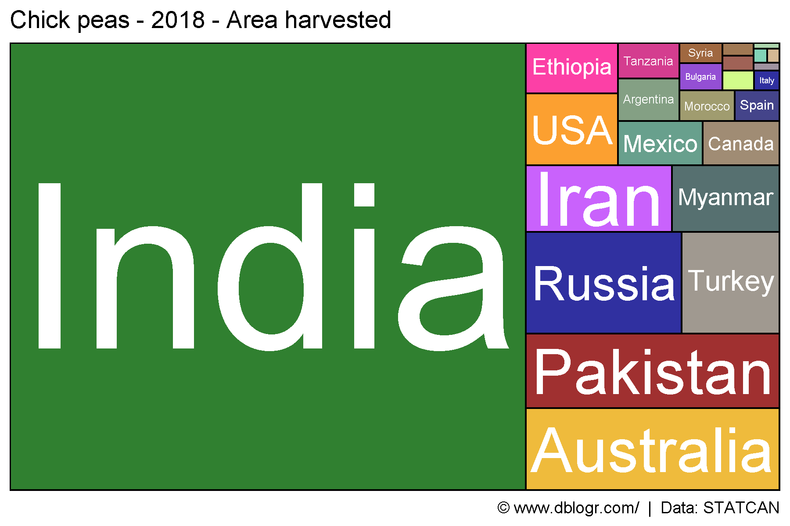

```{r setup, include = FALSE}
knitr::opts_chunk$set(echo = T, message = F, warning = F)
```

---

```{r}
# devtools::install_github("derekmichaelwright/agData")
library(agData) # Loads: tidyverse, ggpubr, ggbeeswarm, ggrepel
library(treemapify) # geom_treemap()
```

---

# Plotting Function

```{r}
gg_treemap <- function(crop = "Wheat", measurement = "Area harvested", year = 2018) {
  #Prep data
  xx <- agData_FAO_Crops %>% 
    filter(Crop == crop, Year == year, Measurement == measurement,
           Area %in% agData_FAO_Country_Table$Country) %>%
    arrange(desc(Value)) %>% 
    slice(1:25) %>%
    mutate(Area = factor(Area, levels = unique(Area))) 
  # Plot
  ggplot(xx, aes(area = Value, fill = Area, label = Area)) +
    geom_treemap(color = "black", size = 1.5, alpha = 0.8) +
    geom_treemap_text(place = "centre", grow = T, color = "white") +
    scale_fill_manual(values = alpha(agData_Colors, 0.75)) +
    theme_agData(legend.position = "none") +
    labs(title = paste(crop,"-",year,"-",measurement),
         caption = "\xa9 www.dblogr.com/  |  Data: STATCAN")
}
```

---

# All Countries

```{r}
# Prep data
crops <- unique(agData_FAO_Crops$Crop)
# Plot
pdf("crop_treemaps_fao.pdf", width = 6, height = 4)
for(i in crops) {
  print(gg_treemap(crop = i))
}
dev.off()
```

```{r echo = F}
downloadthis::download_link(
  link = "https://github.com/derekmichaelwright/dblogr/blob/master/content/agdata/crop_treemaps/crop_treemaps_fao.pdf",
  button_label = "crop_treemaps_fao.pdf",
  button_type = "success",
  has_icon = TRUE,
  icon = "fa fa-file-pdf",
  self_contained = FALSE
)
```

---

## Wheat

```{r}
mp <- gg_treemap(crop = "Wheat")
ggsave("crop_treemaps_wheat.png", mp, width = 6, height = 4)
```



---

## Maize

```{r}
mp <- gg_treemap(crop = "Maize")
ggsave("crop_treemaps_maize.png", mp, width = 6, height = 4)
```




---

## Rice

```{r}
mp <- gg_treemap(crop = "Rice")
ggsave("crop_treemaps_rice.png", mp, width = 6, height = 4)
```



---

## Soybeans

```{r}
mp <- gg_treemap(crop = "Soybeans")
ggsave("crop_treemaps_soybeans.png", mp, width = 6, height = 4)
```




---

## Rapeseed

```{r}
mp <- gg_treemap(crop = "Rapeseed")
ggsave("crop_treemaps_rapeseed.png", mp, width = 6, height = 4)
```



---

## Sorghum

```{r}
mp <- gg_treemap(crop = "Sorghum")
ggsave("crop_treemaps_sorghum.png", mp, width = 6, height = 4)
```



---

## Lentils

```{r}
mp <- gg_treemap(crop = "Lentils")
ggsave("crop_treemaps_lentils.png", mp, width = 6, height = 4)
```

```{r echo = F}
ggsave("featured.png", mp, width = 6, height = 4)
```



---

## Beans

```{r}
mp <- gg_treemap(crop = "Beans, dry")
ggsave("crop_treemaps_beans.png", mp, width = 6, height = 4)
```



---

## Chickpeas

```{r}
mp <- gg_treemap(crop = "Chick peas")
ggsave("crop_treemaps_chickpeas.png", mp, width = 6, height = 4)
```



---

&copy; Derek Michael Wright [www.dblogr.com/](https://dblogr.com/)