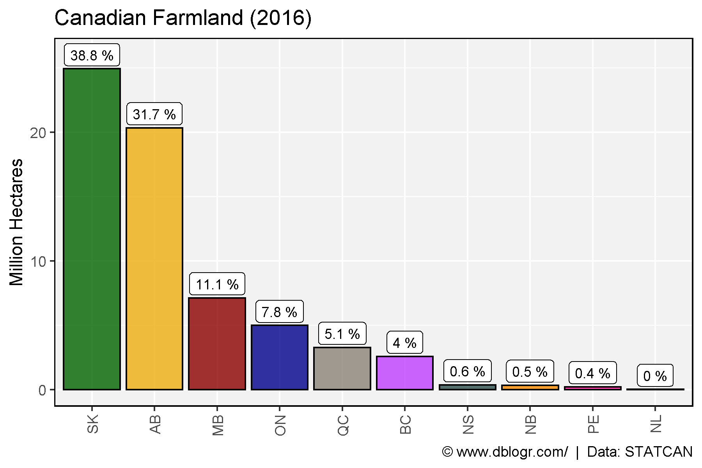
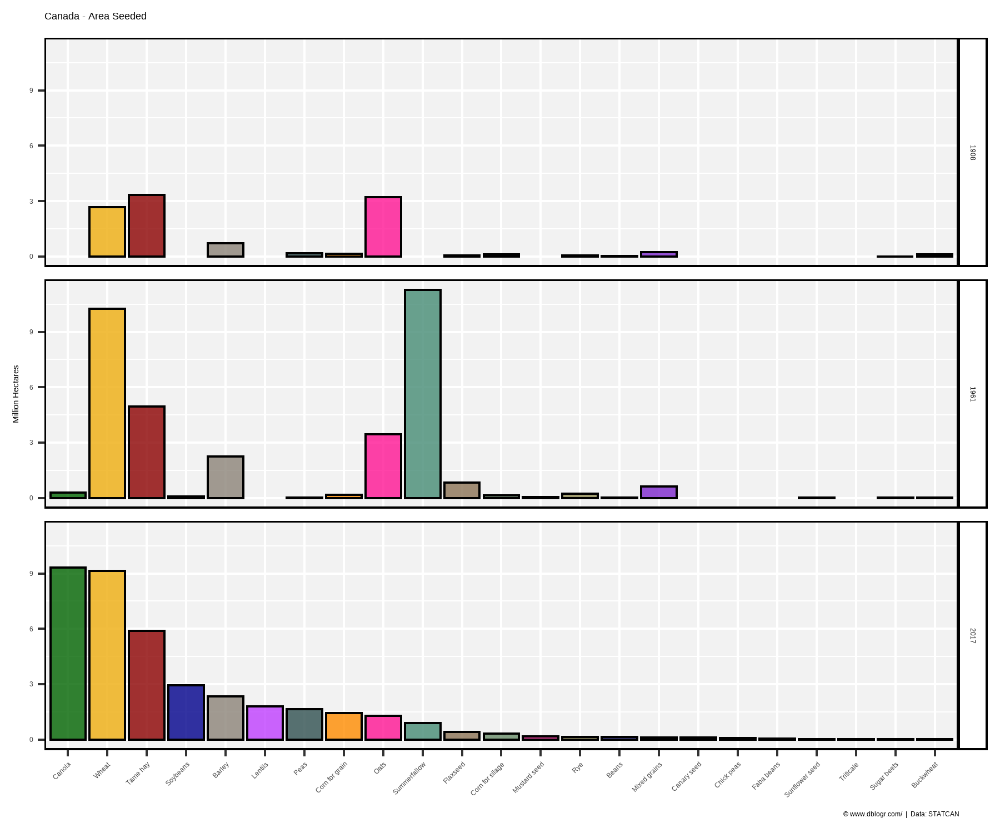
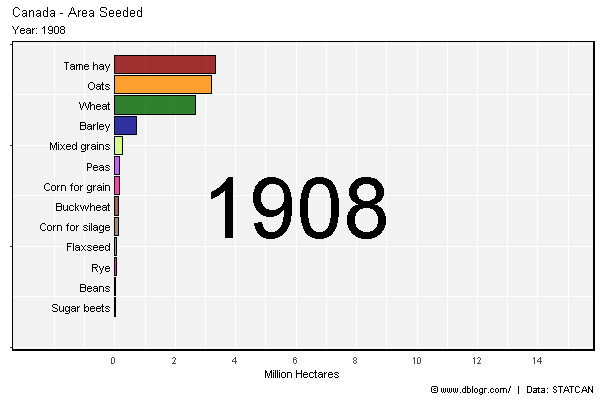
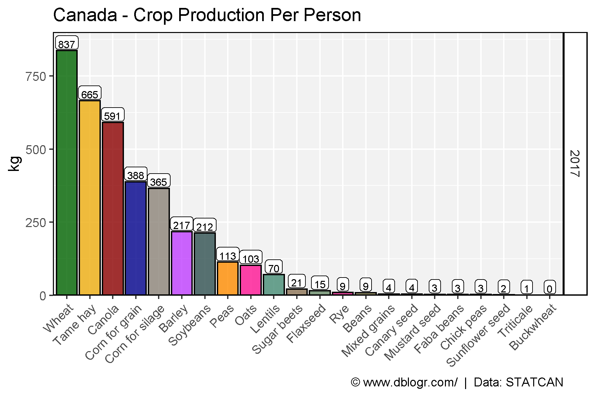
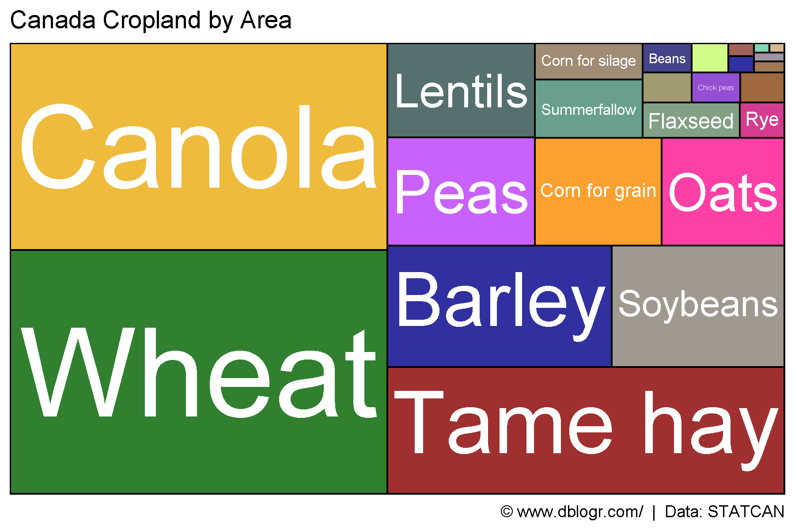

```{r setup, include = FALSE}
knitr::opts_chunk$set(echo = T, message = F, warning = F)
```

---

```{r}
# devtools::install_github("derekmichaelwright/agData")
library(agData) # Loads: tidyverse, ggpubr, ggbeeswarm, ggrepel
library(gganimate)
library(treemapify)
```

---

# Crop Production

```{r}
# Create function to determine top crops
cropList <- function(measurement, years) {
  # Prep data
  xx <- agData_STATCAN_Crops %>% 
    filter(Area == "Canada", Measurement == measurement, Year %in% years) 
  # Get top 15 crops from each year
  topcrops <- function(x, year) {
    x <- x %>% filter(Year == year) %>% arrange(desc(Value)) %>% 
      pull(Crop) %>% unique() %>% as.character()
  }
  myCrops <- NULL
  for(i in years) { myCrops <- c(myCrops, topcrops(xx, i)) }
  unique(myCrops)
}
```

---

## Crop Production 1908, 1961, 2017

```{r}
# Prep data
myCrops <- cropList(measurement = "Production", years = c(2017, 1961, 1908))
xx <- agData_STATCAN_Crops %>% 
    filter(Area == "Canada", Year %in% c(2017, 1961, 1908),
           Measurement == "Production", Crop %in% myCrops) %>%
  mutate(Crop = factor(Crop, levels = myCrops),
         Crop = recode(Crop, "Beans, all dry (white and coloured)" = "Beans, all dry") )
# Plot
mp <- ggplot(xx, aes(x = Crop, y = Value / 1000000, fill = Crop)) + 
  geom_bar(stat = "identity", color = "Black", alpha = 0.8) + 
  facet_grid(Year~.) + 
  scale_fill_manual(values = alpha(agData_Colors, 0.75)) +
  theme_agData(legend.position = "none", 
               axis.text.x = element_text(angle = 45, hjust = 1)) +
  labs(title = "Canada - Crop Production", y = "Million Tonnes", x = NULL,
       caption = "\xa9 www.dblogr.com/  |  Data: STATCAN")
ggsave("crops_canada_01.png", mp, width = 6, height = 5)
```



---

## Crop Area 1908, 1961, 2017

```{r}
# Prep data
myCrops <- cropList(measurement = "Seeded area", years = c(2017, 1961, 1908))
xx <- agData_STATCAN_Crops %>% 
    filter(Area == "Canada", Year %in% c(2017, 1961, 1908),
           Measurement == "Seeded area", Crop %in% myCrops) %>%
  mutate(Crop = factor(Crop, levels = myCrops),
         Crop = recode(Crop, "Beans, all dry (white and coloured)" = "Beans, all dry") )
# Plot
mp <- ggplot(xx, aes(x = Crop, y = Value / 1000000, fill = Crop)) + 
  geom_bar(stat = "identity", color = "Black", alpha = 0.8) + 
  facet_grid(Year~.) + 
  scale_fill_manual(values = alpha(agData_Colors, 0.75)) +
  theme_agData(legend.position = "none", 
               axis.text.x = element_text(angle = 45, hjust = 1)) + 
  labs(title = "Canada - Area Seeded", y = "Million Hectares", x = NULL,
       caption = "\xa9 www.dblogr.com/  |  Data: STATCAN")
ggsave("crops_canada_02.png", mp, width = 6, height = 5)
```

```{r echo = F}
ggsave("featured.png", mp, width = 6, height = 5)
```



---

# Race Chart

```{r eval = F}
# Prep data
xx <- agData_STATCAN_Crops %>% 
    filter(Area == "Canada", 
           Measurement == "Seeded area") %>% 
  group_by(Year) %>%
  arrange(Year, -Value) %>%
  mutate(Rank = 1:n()) %>%
  filter(Rank < 15) %>% 
  arrange(desc(Year)) %>%
  mutate(Crop = factor(Crop, levels = unique(.$Crop)))
# Plot
mp <- ggplot(xx, aes(xmin = 0, xmax = Value / 1000000, 
                     ymin = Rank - 0.45, ymax = Rank + 0.45, y = Rank, 
                     fill = Crop)) + 
  geom_rect(alpha = 0.8, color = "black") + 
  scale_fill_manual(values = alpha(agData_Colors, 0.75)) +
  scale_x_continuous(limits = c(-2.5,15), breaks = c(0,2,4,6,8,10,12,14)) +
  geom_text(col = "black", hjust = "right", aes(label = Crop), x = -0.1) +
  scale_y_reverse() +
  theme_agData(legend.position = "none",
               axis.text.y = element_blank(), 
               axis.ticks.x = element_blank()) + 
  labs(title = "Canada - Area Seeded", 
       subtitle = "Year: {frame_time}",
       x = "Million Hectares", y = NULL,
       caption = "\xa9 www.dblogr.com/  |  Data: STATCAN") +
  # gganimate
  facet_null() +
  geom_text(x = 6, y = -8,
            aes(label = as.character(Year)),
            size = 30, col = "black") +
  transition_time(Year)
mp <- animate(mp, nframes = 2*(max(xx$Year) - min(xx$Year)), fps = 5, 
              end_pause = 20, width = 600, height = 400)
anim_save("crops_canada_gifs_01.gif", mp)
```



---

## Per Person

```{r}
# Prep data
pp <- agData_STATCAN_Population %>% 
  filter(Month == 1, Area == "Canada", Year == 2017) %>%
  pull(Value)
myCrops <- cropList(measurement = "Production", years = 2017)
xx <- agData_STATCAN_Crops %>% 
  filter(Area == "Canada", Year %in% 2017,
         Measurement == "Production", Crop %in% myCrops) %>%
  mutate(Crop = factor(Crop, levels = myCrops),
         PerPerson = 1000 * Value / pp)
# Plot
mp <- ggplot(xx, aes(x = Crop, y = PerPerson, fill = Crop)) + 
  geom_bar(stat = "identity", color = "Black", alpha = 0.8) + 
  geom_label(aes(label = round(PerPerson)), vjust = -0.1, fill = "White", 
             size = 2.5, label.padding = unit(0.15, "lines")) +
  facet_grid(Year~.) + 
  scale_y_continuous(limits = c(0,900), expand = c(0,0)) +
  scale_fill_manual(values = alpha(agData_Colors, 0.75)) +
  theme_agData(legend.position = "none", 
               axis.text.x = element_text(angle = 45, hjust = 1)) + 
  labs(title = "Canada - Crop Production Per Person", y = "kg", x = NULL,
       caption = "\xa9 www.dblogr.com/  |  Data: STATCAN")
ggsave("crops_canada_03.png", mp, width = 6, height = 4)
```



---

# Treemap

```{r}
# Prep data
xx <- agData_STATCAN_Crops %>% 
  filter(Area == "Canada", Year == 2019, Measurement == "Seeded area") %>%
  arrange(desc(Value)) %>% mutate(Crop = factor(Crop, levels = unique(Crop)))
# Plot
mp <- ggplot(xx, aes(area = Value, fill = Crop, label = Crop)) +
  geom_treemap(color = "black", alpha = 0.8, size = 1.5) +
  geom_treemap_text(place = "centre", grow = T, color = "white") +
  scale_fill_manual(values = alpha(agData_Colors, 0.75)) +
  theme_agData(legend.position = "none") +
  labs(title = "Canada Cropland by Area",
       caption = "\xa9 www.dblogr.com/  |  Data: STATCAN")
ggsave("crops_canada_04.png", mp, width = 6, height = 4)
```



---

&copy; Derek Michael Wright [www.dblogr.com/](https://dblogr.com/)