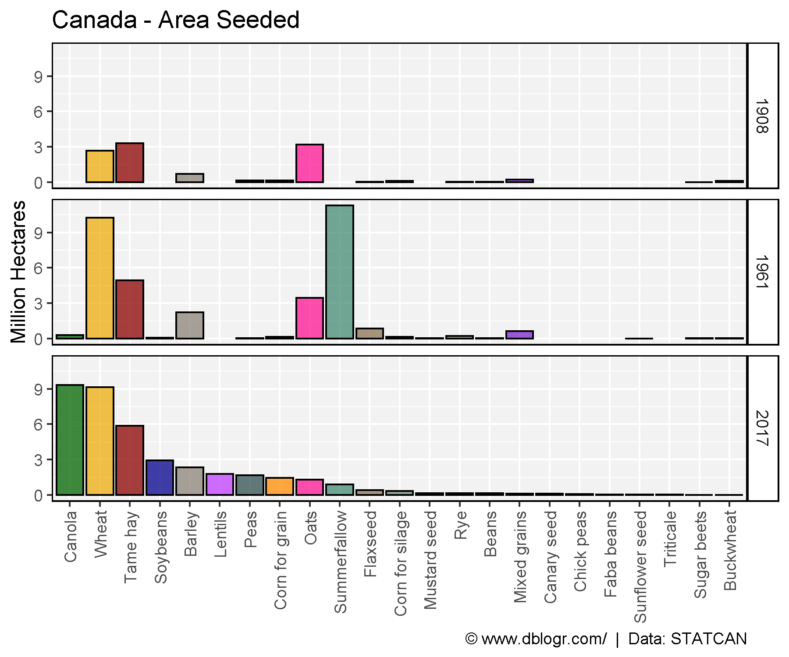
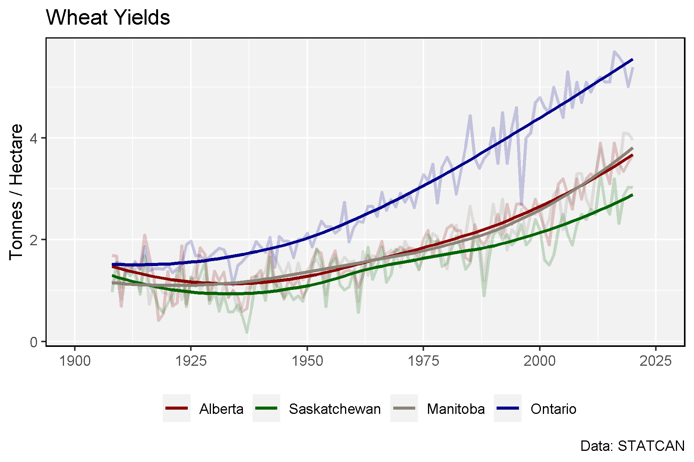

```{r setup, include = FALSE}
knitr::opts_chunk$set(echo = T, message = F, warning = F)
```

---

```{r}
# devtools::install_github("derekmichaelwright/agData")
library(agData) # Loads: tidyverse, ggpubr, ggbeeswarm, ggrepel
library(gganimate)
library(treemapify)
```

---

# Farmland by Province

## 2016

```{r}
# Prep data
yy <- agData_STATCAN_Region_Table
xx <- agData_STATCAN_FarmLand_Use %>% 
  filter(Year == 2016, Item == "Total area of farms", Unit == "Hectares")
x1 <- xx %>% filter(Area == "Canada")
xx <- xx %>% filter(Area != "Canada") %>% 
  mutate(Percent = round(100 * Value / x1$Value, 1)) %>% 
  arrange(Percent) %>%
  mutate(Area = factor(Area, levels  = rev(Area)),
         Area_Short = plyr::mapvalues(Area, yy$Area, yy$Area_Short))
# What is the total amount of farmland in Canada?
sum(xx$Value)
# Plot
mp <- ggplot(xx, aes(x = Area_Short, y = Value / 1000000)) +
  geom_bar(aes(fill = Area), stat = "identity", color = "black") +
  geom_label(aes(label = paste(Percent, "%")), nudge_y = 1.1, size = 3) +
  scale_fill_manual(values = agData_Colors) +
  theme_agData(legend.position = "none", 
               axis.text.x = element_text(angle = 90, hjust = 1, vjust = 0.5)) +
  labs(title = "Canadian Farmland (2016)",
       caption = "\xa9 www.dblogr.com/  |  Data: STATCAN",
       x = NULL, y = "Million Hectares")
ggsave("crops_canada_01.png", mp, width = 6, height = 4)
```


---

## Provinces

```{r}
xx <- agData_STATCAN_FarmLand_Farms %>%
  filter(Measurement == "Total area of farms",
         Area != "Canada")
mp <- ggplot(xx, aes(x = Year, y = Value / 1000000)) +
  geom_line(color = "darkgreen", size = 1.25) +
  facet_wrap(. ~ Area, scales = "free_y", ncol = 5) +
  theme_agData() +
  labs(title = "Canadian Farmland",
       caption = "\xa9 www.dblogr.com/  |  Data: STATCAN",
       x = NULL, y = "Million Hectares")
ggsave("crops_canada_02.png", mp, width = 12, height = 5)
```


---

# Treemap

```{r}
# Prep data
xx <- agData_STATCAN_Crops %>% 
  filter(Area == "Canada", Year == 2019, Measurement == "Seeded area") %>%
  arrange(desc(Value)) %>% mutate(Crop = factor(Crop, levels = unique(Crop)))
# Plot
mp <- ggplot(xx, aes(area = Value, fill = Crop, label = Crop)) +
  geom_treemap(color = "black") +
  geom_treemap_text(place = "centre", grow = T, color = "white") +
  scale_fill_manual(values = alpha(agData_Colors, 0.75)) +
  theme_agData(legend.position = "none") +
  labs(title = "Canada Cropland by Area",
       caption = "\xa9 www.dblogr.com/  |  Data: STATCAN")
ggsave("crops_canada_03.png", mp, width = 6, height = 4)
```


---

# Crop Production

```{r}
# Create function to determine top crops
cropList <- function(measurement) {
  # Prep data
  xx <- agData_STATCAN_Crops %>% 
    filter(Area == "Canada", Measurement == measurement, Year %in% c(1908, 1961, 2017)) 
  # Get top 15 crops from each year
  topcrops <- function(x, year) {
    x <- x %>% filter(Year == year) %>% arrange(desc(Value)) %>% 
      pull(Crop) %>% unique() %>% as.character()
  }
  crops1908 <- topcrops(xx, 1908)
  crops1961 <- topcrops(xx, 1961)
  crops2017 <- topcrops(xx, 2017)
  # Order crop list based on 2017 production
  myCrops <- unique(c(crops1908, crops1961, crops2017))
  xx %>% filter(Year == 2017, Crop %in% myCrops) %>%
    arrange(desc(Value)) %>% pull(Crop) %>% as.character()
}
```

---

## Crop Production 1908, 1961, 2017

```{r}
# Prep data
myCrops <- cropList(measurement = "Production")
xx <- agData_STATCAN_Crops %>% 
    filter(Area == "Canada", Year %in% c(1908, 1961, 2017),
           Measurement == "Production", Crop %in% myCrops) %>%
  mutate(Crop = factor(Crop, levels = myCrops),
         Crop = recode(Crop, "Beans, all dry (white and coloured)" = "Beans, all dry") )
# Plot
mp <- ggplot(xx, aes(x = Crop, y = Value / 1000000, fill = Crop)) + 
  geom_bar(stat = "identity", color = "Black") + 
  facet_grid(Year~.) + 
  scale_fill_manual(values = alpha(agData_Colors, 0.75)) +
  theme_agData(legend.position = "none", 
               axis.text.x = element_text(angle = 90, hjust = 1, vjust = 0.5)) +
  labs(title = "Canada - Crop Production", y = "Million Tonnes", x = NULL,
       caption = "\xa9 www.dblogr.com/  |  Data: STATCAN")
ggsave("crops_canada_04.png", mp, width = 6, height = 5)
```


---

## Crop Area 1908, 1961, 2017

```{r}
# Prep data
myCrops <- cropList(measurement = "Seeded area")
xx <- agData_STATCAN_Crops %>% 
    filter(Area == "Canada", Year %in% c(1908, 1961, 2017),
           Measurement == "Seeded area", Crop %in% myCrops) %>%
  mutate(Crop = factor(Crop, levels = myCrops),
         Crop = recode(Crop, "Beans, all dry (white and coloured)" = "Beans, all dry") )
# Plot
mp <- ggplot(xx, aes(x = Crop, y = Value / 1000000, fill = Crop)) + 
  geom_bar(stat = "identity", color = "Black") + 
  facet_grid(Year~.) + 
  scale_fill_manual(values = alpha(agData_Colors, 0.75)) +
  theme_agData(legend.position = "none", 
               axis.text.x = element_text(angle = 90, hjust = 1, vjust = 0.5)) + 
  labs(title = "Canada - Area Seeded", y = "Million Hectares", x = NULL,
       caption = "\xa9 www.dblogr.com/  |  Data: STATCAN")
ggsave("crops_canada_05.png", mp, width = 6, height = 5)
```

```{r echo = F}
ggsave("featured.png", mp, width = 6, height = 5)
```



---

```{r eval = F}
# Prep data
myCrops <- cropList(measurement = "Seeded area")
xx <- agData_STATCAN_Crops %>% 
    filter(Area == "Canada", 
           Measurement == "Seeded area", Crop %in% myCrops) %>%
  mutate(Crop = factor(Crop, levels = myCrops),
         Crop = recode(Crop, "Beans, all dry (white and coloured)" = "Beans, all dry") )
# Plot
mp <- ggplot(xx, aes(x = Crop, y = Value / 1000000, fill = Crop)) + 
  geom_bar(stat = "identity", color = "Black") + 
  geom_text(aes(label = Year), x = 17, y = 14, size = 15) +
  scale_fill_manual(values = alpha(agData_Colors, 0.75)) +
  theme_agData(legend.position = "none", 
               axis.text.x = element_text(angle = 90, hjust = 1, vjust = 0.5)) + 
  labs(title = "Canada - Area Seeded", y = "Million Hectares", x = NULL,
       caption = "\xa9 www.dblogr.com/  |  Data: STATCAN") +
  # gganimate
  transition_states(Year)
mp <- animate(mp, nframes = 2*(max(xx$Year) - min(xx$Year)), fps = 5, end_pause = 5)
anim_save("crops_canada_gifs_01.gif", mp, width = 600, height = 400)
```


---

# Wheat

```{r}
# Prep data
areas <- c("Alberta", "Saskatchewan", "Manitoba", "Ontario")
colors <- c("darkred", "darkgreen", "antiquewhite4", "darkblue")
xx <- agData_STATCAN_Crops %>% 
  filter(Crop == "Wheat", Measurement == "Yield",
         Area %in% areas)
# Plot
mp <- ggplot(xx, aes(x = Year, y = Value / 1000, color = Area)) +
  geom_line(size = 1, alpha = 0.2) +
  geom_smooth(method = "loess", alpha = 0.8, se = F) +
  scale_color_manual(name = NULL, values = colors) +
  scale_x_continuous(breaks = seq(1900, 2025, 25), limits = c(1900,2025)) +
  theme_agData(legend.position = "bottom") +
  labs(title = "Wheat Yields", 
       y = "Tonnes / Hectare", x = NULL,
       caption = "Data: STATCAN")
ggsave("crops_canada_06.png", mp, width = 6, height = 4)
```



---

&copy; Derek Michael Wright [www.dblogr.com/](https://dblogr.com/)