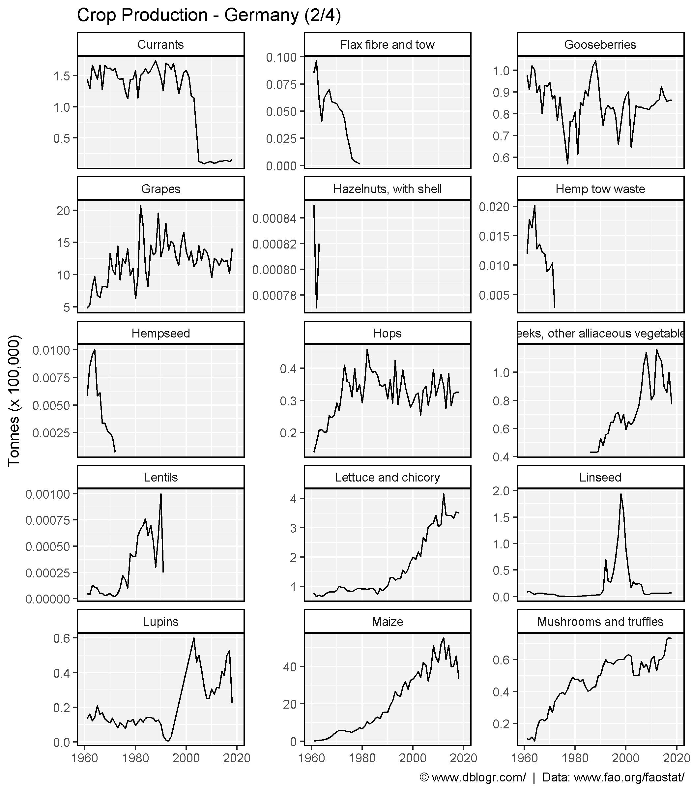
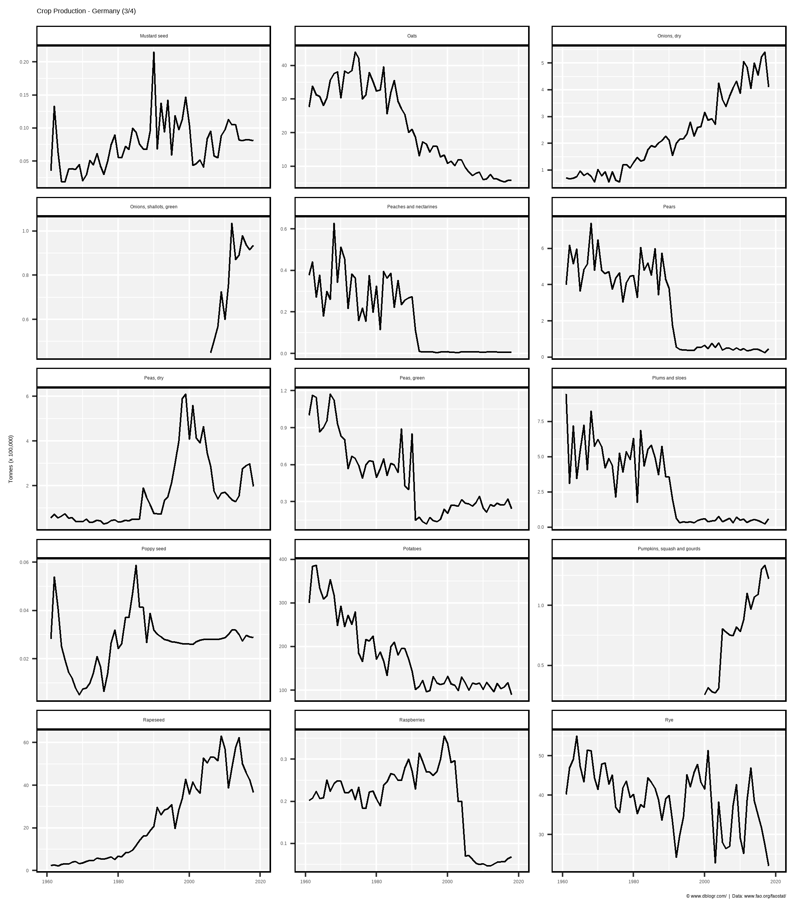
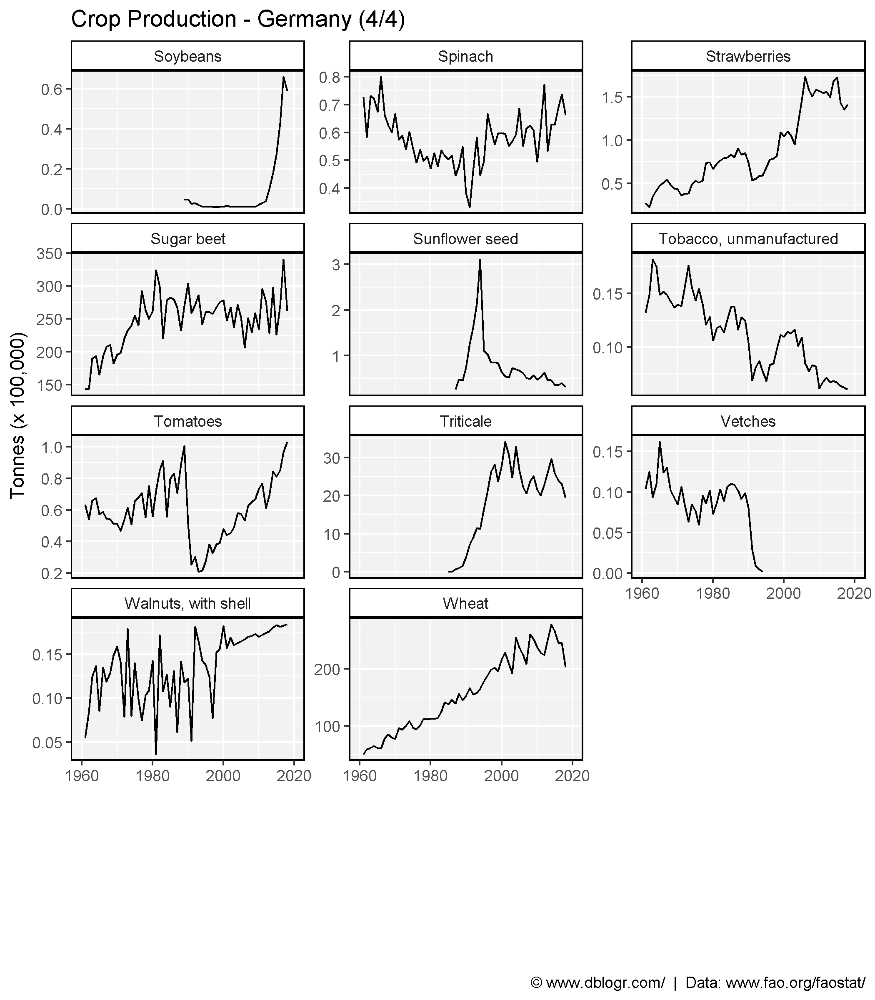
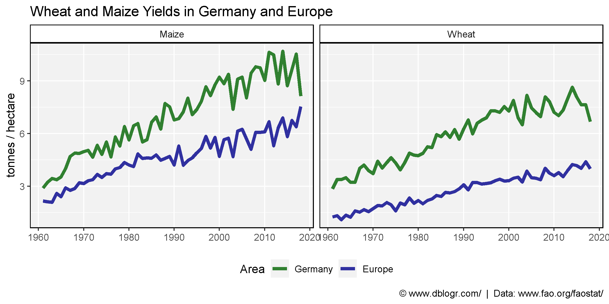

```{r setup, include = FALSE}
knitr::opts_chunk$set(echo = T, message = F, warning = F)
```

---

```{r}
library(agData) # devtools::install_github("derekmichaelwright/agData")
library(ggforce) # facet_wrap_paginate()
```

---

# All Countries

```{r}
# Prep data
colors <- c("darkgreen", "darkred", "darkgoldenrod2")
xx <- agData_FAO_Crops %>% 
  filter(Area == "Germany")
crops <- unique(xx$Crop)
# Plot
pdf("crops_germany_fao.pdf", width = 12, height = 4)
for(i in crops) {
  xi <- xx %>% filter(Crop == i)
  print(ggplot(xi, aes(x = Year, y = Value, color = Measurement)) +
    geom_line(size = 1.5, alpha = 0.8) +
    facet_wrap(. ~ Measurement, scales = "free_y", ncol = 3) +
    scale_color_manual(values = colors) +
    scale_x_continuous(breaks = seq(1960, 2020, by = 5) ) +
    theme_agData(legend.position = "none", 
                 axis.text.x = element_text(angle = 45, hjust = 1)) +
    labs(title = i, y = NULL, x = NULL,
         caption = "\xa9 www.dblogr.com/  |  Data: FAOSTAT") )
}
dev.off()
```

```{r echo = F}
downloadthis::download_link(
  link = "https://github.com/derekmichaelwright/dblogr/blob/master/content/agdata/crops_germany/crops_germany_fao.pdf",
  button_label = "crops_germany_fao.pdf",
  button_type = "success",
  has_icon = TRUE,
  icon = "fa fa-file-pdf",
  self_contained = FALSE
)
```

---

```{r }
# Prep data
xx <- agData_FAO_Crops %>% 
  filter(Area == "Germany", Measurement == "Production")
# Plot
ggcropplot <- function(x) {
  ggplot(xx, aes(x = Year, y = Value / 100000)) + 
  geom_line() + 
  scale_x_continuous(limits       =   c(1960, 2020),
                     breaks       = seq(1960, 2020, 20), 
                     minor_breaks = seq(1960, 2020, 10)) +
  theme_agData() +
  theme(legend.position = "none") +
  labs(caption = "\xa9 www.dblogr.com/  |  Data: www.fao.org/faostat/",
       y = "Tonnes (x 100,000)", x = NULL)
}
```

```{r}
# Plot
mp1 <- ggcropplot(xx) + 
  facet_wrap_paginate(Crop~., scales = "free_y", ncol = 3, nrow= 5, page = 1) +
  labs(title = "Crop Production - Germany (1/4)")
mp2 <- ggcropplot(xx) +
  facet_wrap_paginate(Crop~., scales = "free_y", ncol = 3, nrow= 5, page = 2) +
  labs(title = "Crop Production - Germany (2/4)")
mp3 <- ggcropplot(xx) +
  facet_wrap_paginate(Crop~., scales = "free_y", ncol = 3, nrow= 5, page = 3) +
  labs(title = "Crop Production - Germany (3/4)")
mp4 <- ggcropplot(xx) + 
  facet_wrap_paginate(Crop~., scales = "free_y", ncol = 3, nrow= 5, page = 4) +
  labs(title = "Crop Production - Germany (4/4)")
ggsave("crops_germany_01.png", mp1, width = 7, height = 8)
ggsave("crops_germany_02.png", mp2, width = 7, height = 8)
ggsave("crops_germany_03.png", mp3, width = 7, height = 8)
ggsave("crops_germany_04.png", mp4, width = 7, height = 8)
```








---

# Germany vs Europe

```{r}
# Prep data
xx <- agData_FAO_Crops %>% 
  filter(Area %in% c("Germany", "Europe"), Crop %in% c("Maize", "Wheat"),
         Measurement == "Yield") %>%
  mutate(Area = factor(Area, levels = c("Germany", "Europe")))
# Plot
mp <- ggplot(xx, aes(x = Year, y = Value, color = Area)) +
  geom_line(alpha = 0.8, size = 1.5) +
  facet_grid(.~Crop, scales = "free_y") + 
  scale_color_manual(values = c("darkgreen", "darkblue")) +
  scale_x_continuous(breaks = seq(1960, 2020, 10), minor_breaks = NULL) +
  theme_agData() + theme(legend.position = "bottom") +
  labs(title = "Wheat and Maize Yields in Germany and Europe",
       caption = "\xa9 www.dblogr.com/  |  Data: www.fao.org/faostat/",
       x = NULL, y = "tonnes / hectare")
ggsave("crops_germany_05.png", mp, width = 8, height = 4)
```

```{r echo = F}
ggsave("featured.png", mp, width = 8, height = 4)
```



---

&copy; Derek Michael Wright [www.dblogr.com/](https://dblogr.com/)