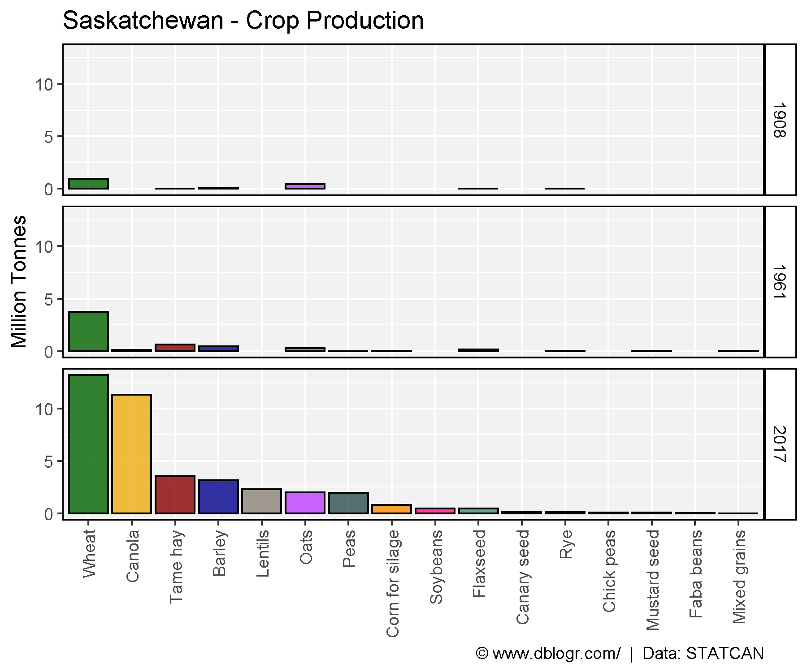
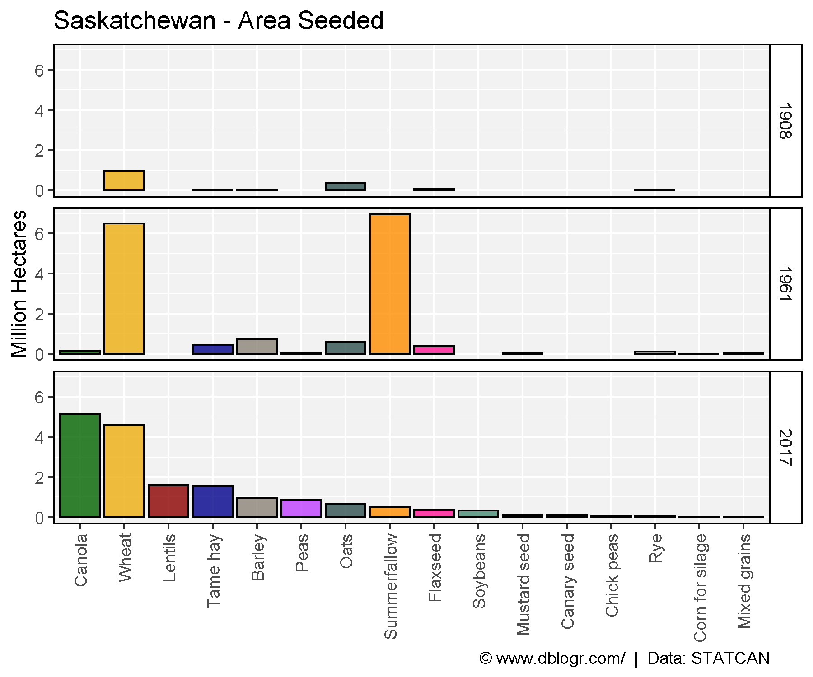
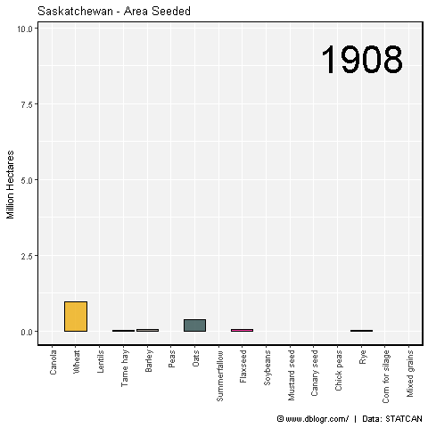
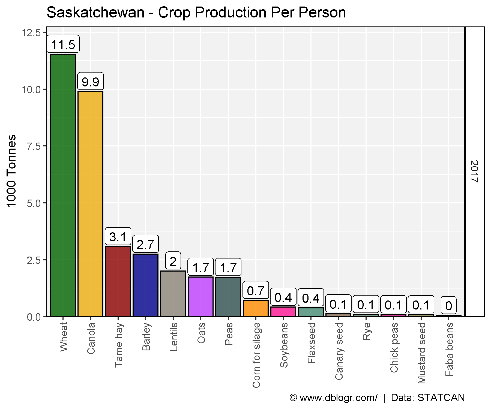
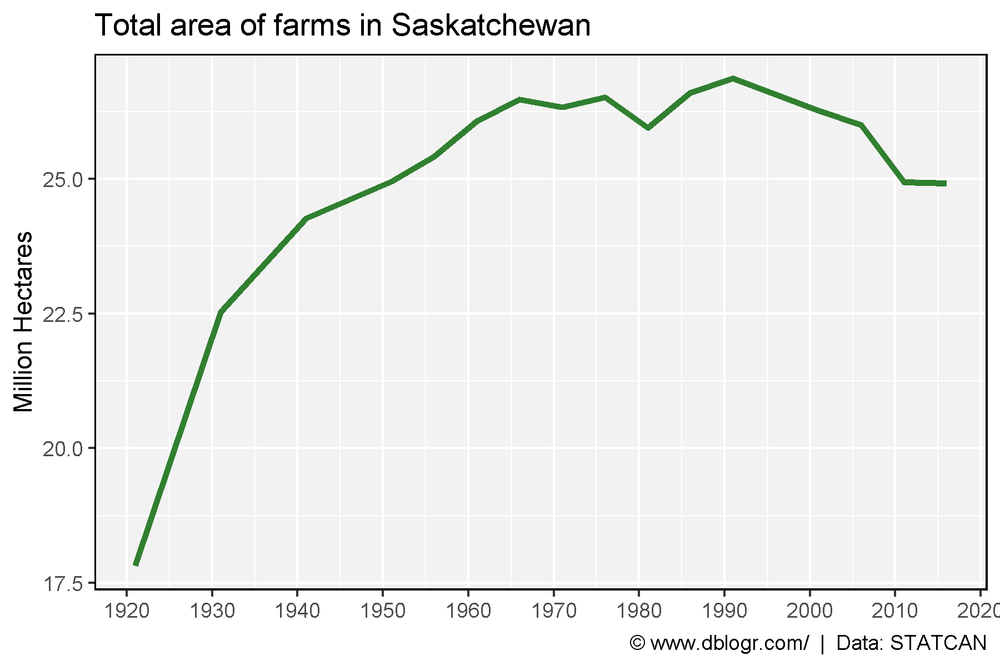
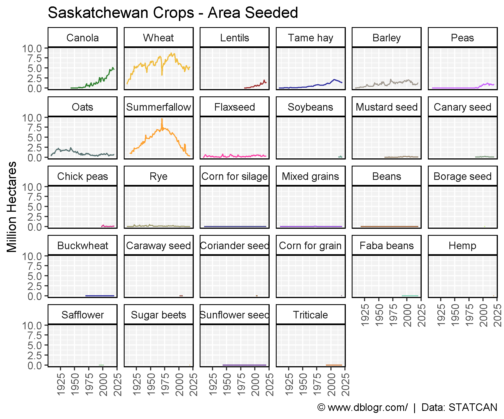
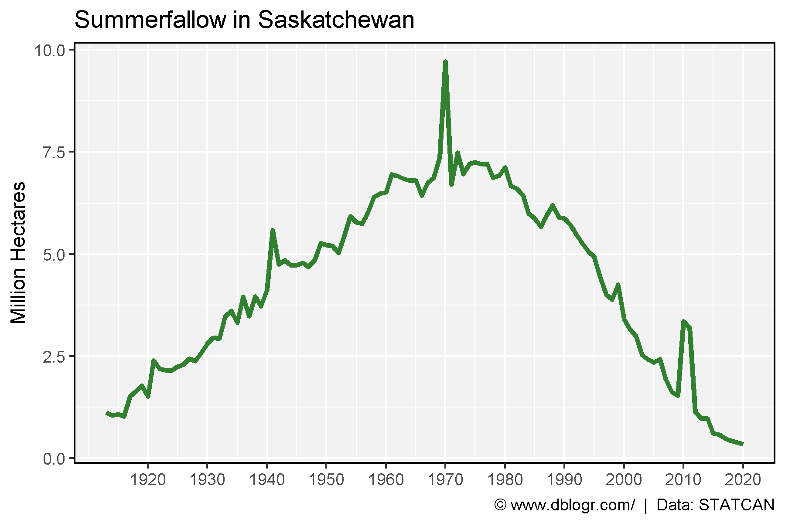
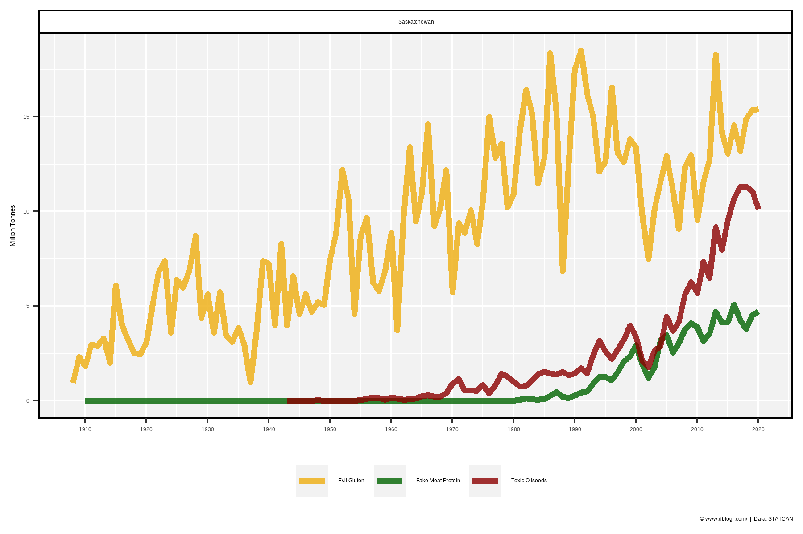

```{r setup, include = FALSE}
knitr::opts_chunk$set(echo = T, message = F, warning = F)
```

---

```{r}
# devtools::install_github("derekmichaelwright/agData")
library(agData) # Loads: tidyverse, ggpubr, ggbeeswarm, ggrepel
library(treemapify) # geom_treemap()
library(gganimate)
```

---

# Crop Production

```{r}
# Create function to determine top crops
cropList <- function(measurement = "Production", years = c(1908, 1961, 2017)) {
  # Prep data
  xx <- agData_STATCAN_Crops %>% 
    filter(Area == "Saskatchewan", 
           Year %in% years,
           Measurement == measurement)
  # Get top 15 crops from each year
  topcrops <- function(x, year, num) {
    x <- x %>% filter(Year == year) %>% arrange(desc(Value)) %>% 
      slice(1:num) %>% pull(Crop) %>% unique() %>% as.character()
    x
  }
  myCrops <- NULL
  for(i in years) {  }
  crops1908 <- topcrops(xx, 1908, 15)
  crops1961 <- topcrops(xx, 1961, 15)
  crops2017 <- topcrops(xx, 2017, 15)
  # Order crop list based on 2017 production
  myCrops <- unique(c(crops1908, crops1961, crops2017))
  xx %>% filter(Year == 2017, Crop %in% myCrops) %>%
    arrange(desc(Value)) %>% pull(Crop) %>% as.character()
}
```

---

## Crop Production 1908, 1961, 2017

```{r}
# Prep data
myCrops <- cropList(measurement = "Production")
xx <- agData_STATCAN_Crops %>% 
  filter(Area == "Saskatchewan", Year %in% c(1908, 1961, 2017),
         Measurement == "Production", Crop %in% myCrops) %>%
  mutate(Crop = factor(Crop, levels = myCrops) )
# Plot
mp <- ggplot(xx, aes(x = Crop, y = Value / 1000000, fill = Crop)) + 
  geom_bar(stat = "identity", color = "Black", alpha = 0.8) + 
  facet_grid(Year ~ .) + 
  scale_fill_manual(values = alpha(agData_Colors, 0.75)) +
  theme_agData(legend.position = "none", 
               axis.text.x = element_text(angle = 90, hjust = 1, vjust = 0.5)) + 
  labs(title = "Saskatchewan - Crop Production", y = "Million Tonnes", x = NULL,
       caption = "\xa9 www.dblogr.com/  |  Data: STATCAN")
ggsave("crops_saskatchewan_01.png", mp, width = 6, height = 5)
```

```{r echo = F}
ggsave("featured.png", mp, width = 6, height = 5)
```



---

## Crop Area 1908, 1961, 2017

```{r}
# Prep data
myCrops <- cropList(measurement = "Seeded area")
xx <- agData_STATCAN_Crops %>% 
  filter(Area == "Saskatchewan", Year %in% c(1908, 1961, 2017),
         Measurement == "Seeded area", Crop %in% myCrops) %>%
  mutate(Crop = factor(Crop, levels = myCrops) )
# Plot
mp <- ggplot(xx, aes(x = Crop, y = Value / 1000000, fill = Crop)) + 
  geom_bar(stat = "identity", color = "Black", alpha = 0.8) + 
  facet_grid(Year ~ .) + 
  scale_fill_manual(values = alpha(agData_Colors, 0.75)) +
  theme_agData(legend.position = "none", 
               axis.text.x = element_text(angle = 90, hjust = 1, vjust = 0.5)) + 
  labs(title = "Saskatchewan - Area Seeded", y = "Million Hectares", x = NULL,
       caption = "\xa9 www.dblogr.com/  |  Data: STATCAN")
ggsave("crops_saskatchewan_02.png", mp, width = 6, height = 5)
```



---

```{r eval = F}
# Prep data
myCrops <- cropList(measurement = "Seeded area")
xx <- agData_STATCAN_Crops %>% 
    filter(Area == "Saskatchewan", 
           Measurement == "Seeded area", Crop %in% myCrops) %>%
  mutate(Crop = factor(Crop, levels = myCrops) )
# Plot
mp <- ggplot(xx, aes(x = Crop, y = Value / 1000000, fill = Crop)) + 
  geom_bar(stat = "identity", color = "Black", alpha = 0.8) + 
  geom_text(aes(label = Year), x = 14, y = 9, size = 15) +
  scale_fill_manual(values = alpha(agData_Colors, 0.75)) +
  theme_agData(legend.position = "none", 
               axis.text.x = element_text(angle = 90, hjust = 1, vjust = 0.5)) + 
  labs(title = "Saskatchewan - Area Seeded", y = "Million Hectares", x = NULL,
       caption = "\xa9 www.dblogr.com/  |  Data: STATCAN") +
  # gganimate
  transition_states(Year)
mp <- animate(mp, nframes = 2*(max(xx$Year) - min(xx$Year)), fps = 5, end_pause = 5)
anim_save("crops_saskatchewan_gifs_01.gif", mp, width = 600, height = 400)
```



---

## Per Person

```{r}
# Prep data
pp <- agData_STATCAN_Population %>% 
  filter(Month == 1, Area == "Saskatchewan", Year == 2017) %>%
  pull(Value)
myCrops <- cropList(measurement = "Production", years = 2017)
xx <- agData_STATCAN_Crops %>% 
  filter(Area == "Saskatchewan", Year %in% 2017,
         Measurement == "Production", Crop %in% myCrops) %>%
  mutate(Crop = factor(Crop, levels = myCrops),
         PerPerson = Value / pp)
# Plot
mp <- ggplot(xx, aes(x = Crop, y = PerPerson, fill = Crop)) + 
  geom_bar(stat = "identity", color = "Black", alpha = 0.8) + 
  geom_label(aes(label = round(PerPerson,1)), vjust = -0.1, fill = "White") +
  facet_grid(Year~.) + 
  scale_y_continuous(limits = c(0,12.75), expand = c(0,0)) +
  scale_fill_manual(values = alpha(agData_Colors, 0.75)) +
  theme_agData(legend.position = "none", 
               axis.text.x = element_text(angle = 90, hjust = 1, vjust = 0.5)) + 
  labs(title = "Saskatchewan - Crop Production Per Person", y = "1000 Tonnes", x = NULL,
       caption = "\xa9 www.dblogr.com/  |  Data: STATCAN")
ggsave("crops_saskatchewan_03.png", mp, width = 6, height = 5)
```



---

# Farm Area

```{r}
# Prep data
xx <- agData_STATCAN_FarmLand_Use %>% 
  filter(Area == "Saskatchewan", Item == "Total area of farms", 
         Unit == "Hectares", !is.na(Value))
# Plot
mp <- ggplot(xx, aes(x = Year, y = Value / 1000000)) + 
  geom_line(color = "darkgreen", size = 1.25, alpha = 0.8) +
  scale_x_continuous(breaks = seq(1920, 2020, 10)) +
  theme_agData() +
  labs(title = "Total area of farms in Saskatchewan", y = "Million Hectares", x = NULL,
       caption = "\xa9 www.dblogr.com/  |  Data: STATCAN")
ggsave("crops_saskatchewan_04.png", mp, width = 6, height = 4)
```



---

# All Crops

```{r}
# Prep data
xx <- agData_STATCAN_Crops %>% 
  filter(Area == "Saskatchewan", Measurement == "Seeded area") 
myCrops <- unique(c(cropList(measurement = "Seeded area"), as.character(xx$Crop)))
xx <- xx %>% mutate(Crop = factor(Crop, levels = myCrops))
# Plot
mp <- ggplot(xx, aes(x = Year, y = Value / 1000000, color = Crop)) + 
  geom_line(alpha = 0.8) + 
  facet_wrap(Crop ~ ., ncol = 6) + 
  scale_color_manual(values = alpha(agData_Colors, 0.75)) +
  theme_agData(legend.position = "none", 
               axis.text.x = element_text(angle = 90, hjust = 1, vjust = 0.5)) + 
  labs(title = "Saskatchewan Crops - Area Seeded", y = "Million Hectares", x = NULL,
       caption = "\xa9 www.dblogr.com/  |  Data: STATCAN")
ggsave("crops_saskatchewan_05.png", mp, width = 6, height = 5)
```



---

# Summerfallow

```{r}
# Prep data
xx <- agData_STATCAN_Crops %>% 
  filter(Area == "Saskatchewan", Crop == "Summerfallow", 
         Measurement == "Seeded area")
# Plot
mp <- ggplot(xx, aes(x = Year, y = Value / 1000000)) + 
  geom_line(color = "darkgreen", size = 1.25, alpha = 0.8) +
  scale_x_continuous(breaks = seq(1920, 2020, 10)) +
  theme_agData() +
  labs(title = "Summerfallow in Saskatchewan", y = "Million Hectares", x = NULL,
       caption = "\xa9 www.dblogr.com/  |  Data: STATCAN")
ggsave("crops_saskatchewan_06.png", mp, width = 6, height = 4)
```



---

# Treemap

```{r}
# Prep data
xx <- agData_STATCAN_Crops %>% 
  filter(Area == "Saskatchewan", Year == 2019, Measurement == "Seeded area") %>%
  arrange(desc(Value)) %>% mutate(Crop = factor(Crop, levels = unique(Crop)))
# Plot
mp <- ggplot(xx, aes(area = Value, fill = Crop, label = Crop)) +
  geom_treemap(color = "black", alpha = 0.8) +
  geom_treemap_text(place = "centre", grow = T, color = "white") +
  scale_fill_manual(values = alpha(agData_Colors, 0.75)) +
  theme_agData(legend.position = "none") +
  labs(title = "Saskatchewan Cropland by Area",
       caption = "\xa9 www.dblogr.com/  |  Data: STATCAN")
ggsave("crops_saskatchewan_07.png", mp, width = 6, height = 4)
```


---

```{r}
# Prep data
x1 <- agData_STATCAN_Crops %>% 
  filter(Area == "Saskatchewan", Measurement == "Production",
         Crop %in% c("Lentils","Peas","Beans","Chickpeas")) %>%
  group_by(Year) %>% 
  summarise(Value = sum(Value)) %>%
  mutate(Crop = "Fake Meat Protein")
x2 <- agData_STATCAN_Crops %>% 
  filter(Area == "Saskatchewan", Measurement == "Production",
         Crop %in% c("Canola","Wheat")) %>%
  mutate(Crop = plyr::mapvalues(Crop, c("Canola","Wheat"), c("Toxic Oilseeds","Evil Gluten")))
xx <- bind_rows(x1, x2)
# Plot
mp <- ggplot(xx, aes(x = Year, y = Value / 1000000, color = Crop)) +
  geom_line(size = 1.5, alpha = 0.8) +
  facet_wrap("Saskatchewan" ~ .) +
  scale_color_manual(name = NULL, values = c("darkgoldenrod2","darkgreen","darkred")) +
  scale_x_continuous(breaks = seq(1910,2020,10)) +
  theme_agData(legend.position = "bottom") +
  labs(y = "Million Tonnes", x = NULL,
       caption = "\xa9 www.dblogr.com/  |  Data: STATCAN")
ggsave("crops_saskatchewan_08.png", mp, width = 6, height = 4)
```



---

&copy; Derek Michael Wright [www.dblogr.com/](https://dblogr.com/)