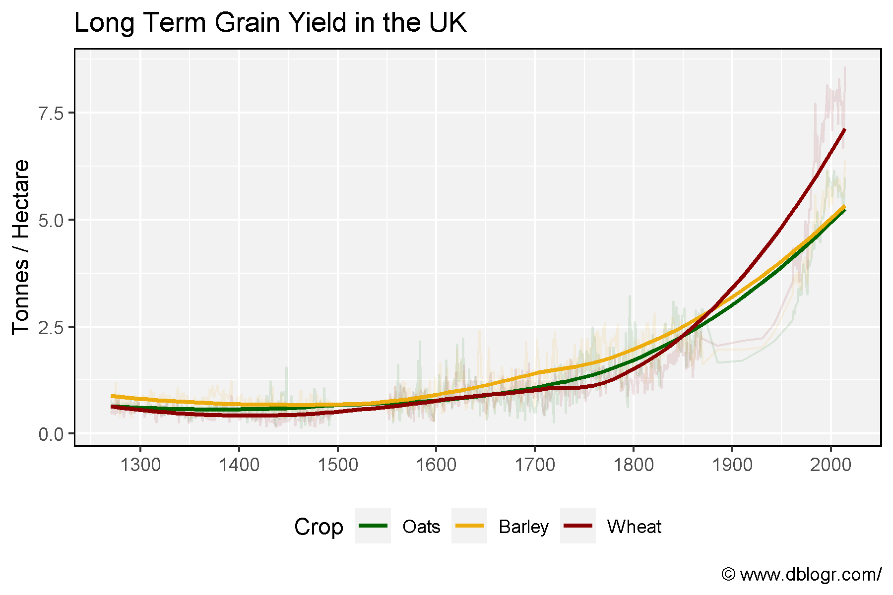

```{r setup, include = FALSE}
knitr::opts_chunk$set(echo = T, message = F, warning = F)
```

---

```{r}
# devtools::install_github("derekmichaelwright/agData")
library(agData) # Loads: tidyverse, ggpubr, ggbeeswarm, ggrepel
```

---

# 

```{r}
# Prep data
xx <- agData_UK_Yields
# Plot
mp <- ggplot(xx, aes(x = Year, y = Value, color = Crop)) +
  geom_line(alpha = 0.1) +
  geom_smooth(method = "loess", se = F) +
  scale_x_continuous(breaks = seq(1300, 2000, by = 100)) +
  scale_color_manual(values = agData_Colors) +
  theme_agData(legend.position = "bottom") +
  labs(title = "Long Term Grain Yield in the UK", 
       y = "Tonnes / Hectare", x = NULL,
       caption = "\xa9 www.dblogr.com/")
ggsave("crops_uk_01.png", mp, width = 6, height = 4)
```

```{r echo = F}
ggsave("featured.png", mp, width = 6, height = 4)
```



---

&copy; Derek Michael Wright [www.dblogr.com/](https://dblogr.com/)