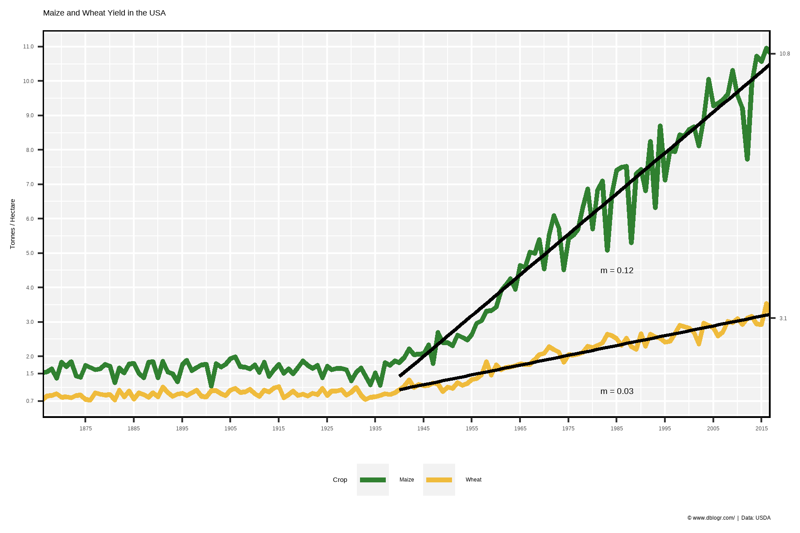
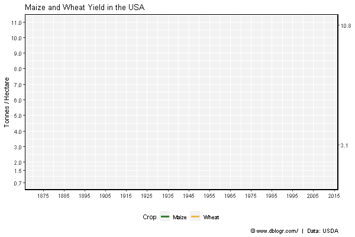
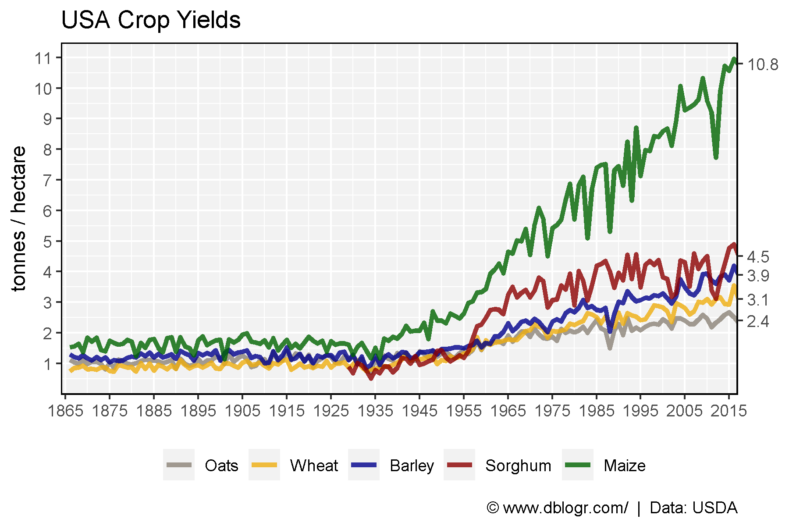
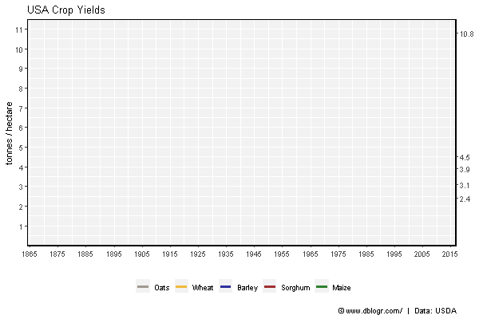
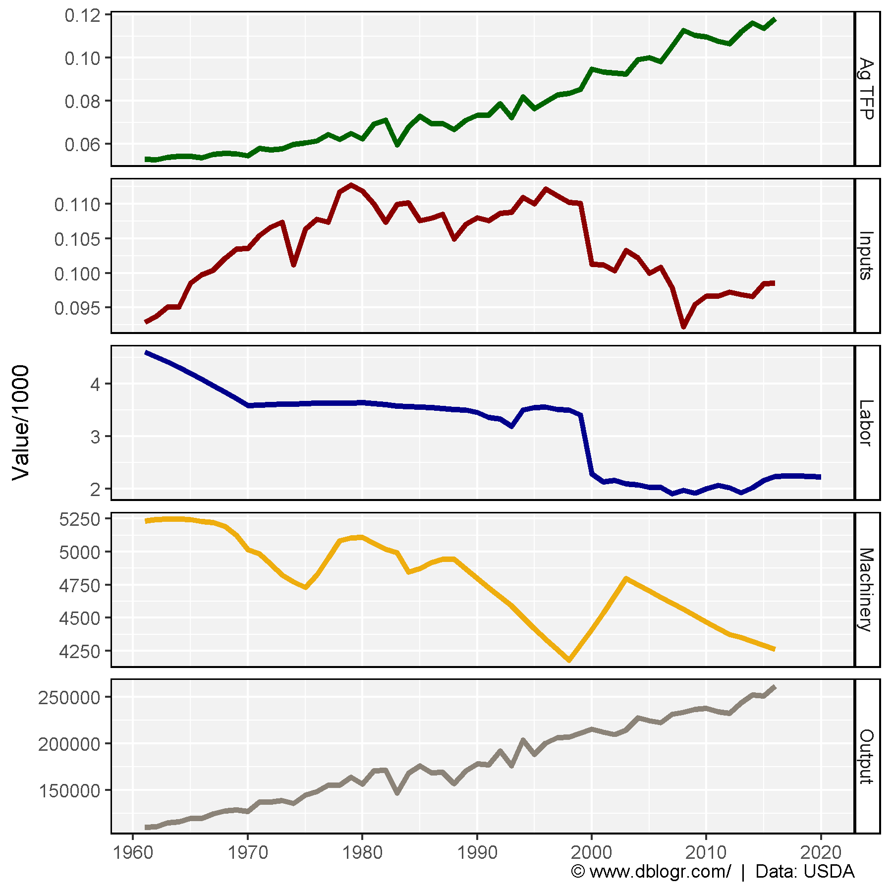
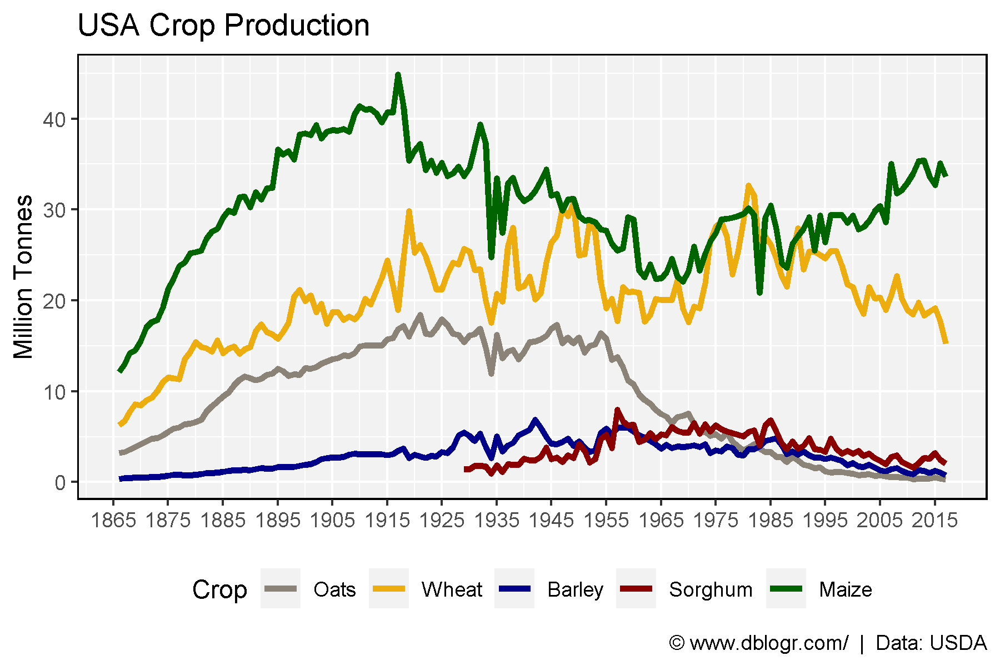
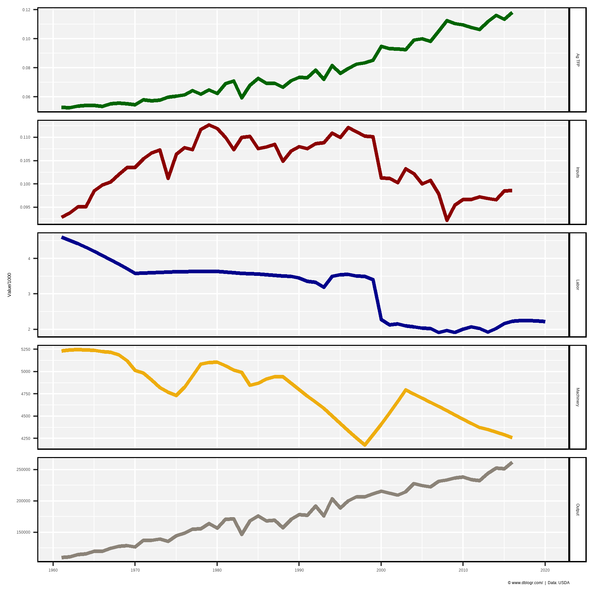

```{r setup, include = FALSE}
knitr::opts_chunk$set(echo = T, message = F, warning = F)
```

---

```{r}
# devtools::install_github("derekmichaelwright/agData")
library(agData) # Loads: tidyverse, ggpubr, ggbeeswarm, ggrepel
library(gganimate)
```

---

# Maize vs Wheat Yields

```{r}
# Prep data
xx <- agData_USDA_Crops %>% 
  filter(Crop %in% c("Maize", "Wheat"), Measurement == "Yield")
x1 <- xx %>% filter(Crop == "Maize", Year >= 1940)
x2 <- xx %>% filter(Crop == "Wheat", Year >= 1940)
m1 <- round(summary(lm(data = x1, Value ~ Year))$coefficients[2], 2)
m2 <- round(summary(lm(data = x2, Value ~ Year))$coefficients[2], 2)
xE1 <- xx %>% top_n(-1, Year) %>% pull(Value) %>% round(1)
xE2 <- xx %>% top_n(1, Year) %>% pull(Value) %>% round(1)
# Plot
mp <- ggplot(xx, aes(x = Year, y = Value, color = Crop)) +
  geom_line(size = 1.25, alpha = 0.8) +
  geom_smooth(data = x1, method = "lm", se = F, color = "Black") +
  geom_smooth(data = x2, method = "lm", se = F, color = "Black") +
  annotate("text", x = 1985, y = 4.5, size = 5, label = paste("m =", m1) ) +
  annotate("text", x = 1985, y = 1,   size = 5, label = paste("m =", m2) ) +
  scale_y_continuous(breaks = c(xE1, 2:11), 
                     sec.axis = sec_axis(~ ., breaks = xE2)) +
  scale_x_continuous(breaks = seq(1865, 2015, by = 10)) +
  coord_cartesian(xlim = c(min(xx$Year)+7, max(xx$Year)-7)) +
  scale_color_manual(values = c("darkgreen", "darkgoldenrod2") ) +
  theme_agData(legend.position = "bottom") +
  labs(title = "Maize and Wheat Yield in the USA", 
       y = "Tonnes / Hectare", x = NULL,
       caption = "\xa9 www.dblogr.com/  |  Data: USDA")
ggsave("crops_usa_01.png", mp, width = 6, height = 4)
```

```{r echo = F}
ggsave("featured.png", mp, width = 6, height = 4)
```



---

```{r}
# Plot
mp <- ggplot(xx, aes(x = Year, y = Value, color = Crop)) +
  geom_line(size = 1.25, alpha = 0.8) +
  scale_y_continuous(breaks = c(xE1, 2:11), 
                     sec.axis = sec_axis(~ ., breaks = xE2)) +
  scale_x_continuous(breaks = seq(1865, 2015, by = 10)) +
  coord_cartesian(xlim = c(min(xx$Year)+7, max(xx$Year)-7)) +
  scale_color_manual(values = c("darkgreen", "darkgoldenrod2") ) +
  theme_agData(legend.position = "bottom") +
  labs(title = "Maize and Wheat Yield in the USA", 
       y = "Tonnes / Hectare", x = NULL,
       caption = "\xa9 www.dblogr.com/  |  Data: USDA") +
  # gganimate
  transition_reveal(Year) +
  ease_aes('linear')
mp <- animate(mp, end_pause = 20, width = 600, height = 400)
anim_save("crops_usa_gifs_01.gif", mp)
```



---

# Major Crops

```{r}
# Prep data
colors <- c("antiquewhite4", "darkgoldenrod2", "darkblue", "darkred", "darkgreen")
crops <- c("Oats", "Wheat", "Barley", "Sorghum", "Maize")
xx <- agData_USDA_Crops %>% 
  filter(Measurement == "Yield") %>% 
  mutate(Crop = factor(Crop, levels = crops))
x1 <- xx %>% 
  filter(Year %in% c(min(Year), max(Year), 1929)) %>%
  select(Crop, Year, Value) %>% 
  spread(Year, Value)
xE <- xx %>% top_n(1, Year) %>% pull(Value) %>% round(1)
# Plot
mp <- ggplot(xx, aes(x = Year, y = Value, label = Value, color = Crop)) + 
  geom_line(size = 1.25, alpha = 0.8) +
  scale_y_continuous(breaks = 1:11, sec.axis = sec_axis(~ ., breaks = xE)) +
  scale_x_continuous(breaks = seq(1865, 2015, 10)) +
  coord_cartesian(xlim = c(min(xx$Year)+5, max(xx$Year)-7)) +
  scale_color_manual(name = NULL, values = colors) +
  theme_agData(legend.position = "bottom") + 
  labs(title = "USA Crop Yields",
       x = NULL, y = "tonnes / hectare",
       caption = "\xa9 www.dblogr.com/  |  Data: USDA")
ggsave("crops_usa_02.png", mp, width = 6, height = 4)
```



---

```{r}
mp <- mp + 
  # gganimate
  transition_reveal(Year) +
  ease_aes('linear')
mp <- animate(mp, end_pause = 20, width = 600, height = 400)
anim_save("crops_usa_gifs_02.gif", mp)
```



---

```{r}
# Prep data
colors <- c("antiquewhite4", "darkgoldenrod2", "darkblue", "darkred", "darkgreen")
crops <- c("Oats", "Wheat", "Barley", "Sorghum", "Maize")
xx <- agData_USDA_Crops %>% 
  filter(Measurement == "Production") %>% 
  mutate(Crop = factor(Crop, levels = crops))
# Plot
mp <- ggplot(xx, aes(x = Year, y = Value / 1000000, color = Crop)) +
  geom_line(size = 1.25) +
  scale_x_continuous(breaks = seq(1865, 2015, 10)) +
  scale_color_manual(values = colors) +
  theme_agData(legend.position = "bottom") +
  labs(title = "USA Crop Production", y = "Million Tonnes", x = NULL, 
       caption = "\xa9 www.dblogr.com/  |  Data: USDA")
ggsave("crops_usa_03.png", mp, width = 6, height = 6)
```



---

```{r}
# Prep data
colors <- c("antiquewhite4", "darkgoldenrod2", "darkblue", "darkred", "darkgreen")
crops <- c("Oats", "Wheat", "Barley", "Sorghum", "Maize")
xx <- agData_USDA_Crops %>% 
  filter(Measurement == "Area harvested") %>% 
  mutate(Crop = factor(Crop, levels = crops))
# Plot
mp <- ggplot(xx, aes(x = Year, y = Value / 1000000, color = Crop)) +
  geom_line(size = 1.25) +
  scale_x_continuous(breaks = seq(1865, 2015, 10)) +
  scale_color_manual(values = colors) +
  theme_agData(legend.position = "bottom") +
  labs(title = "USA Crop Production", y = "Million Tonnes", x = NULL, 
       caption = "\xa9 www.dblogr.com/  |  Data: USDA")
ggsave("crops_usa_04.png", mp, width = 6, height = 6)
```



---

# Agricultural total factor productivity 

```{r}
# Prep data
colors <- c("darkgreen", "darkred", "darkblue", "darkgoldenrod2", "antiquewhite4")
measures <- c("Ag TFP", "Inputs", "Output", "Labor", "Machinery")
xx <- agData_USDA_TFP %>% 
  filter(Area == "USA", Measurement %in% measures)
# Plot
mp <- ggplot(xx, aes(x = Year, y = Value / 1000, color = Measurement)) +
  geom_line(size = 1.25) +
  facet_grid(Measurement ~ ., scales = "free_y") +
  scale_x_continuous(breaks = seq(1960, 2020, 10)) +
  scale_color_manual(values = colors) +
  theme_agData(legend.position = "none") +
  labs(x = NULL, caption = "\xa9 www.dblogr.com/  |  Data: USDA")
ggsave("crops_usa_05.png", mp, width = 6, height = 6)
```



---

&copy; Derek Michael Wright [www.dblogr.com/](https://dblogr.com/)