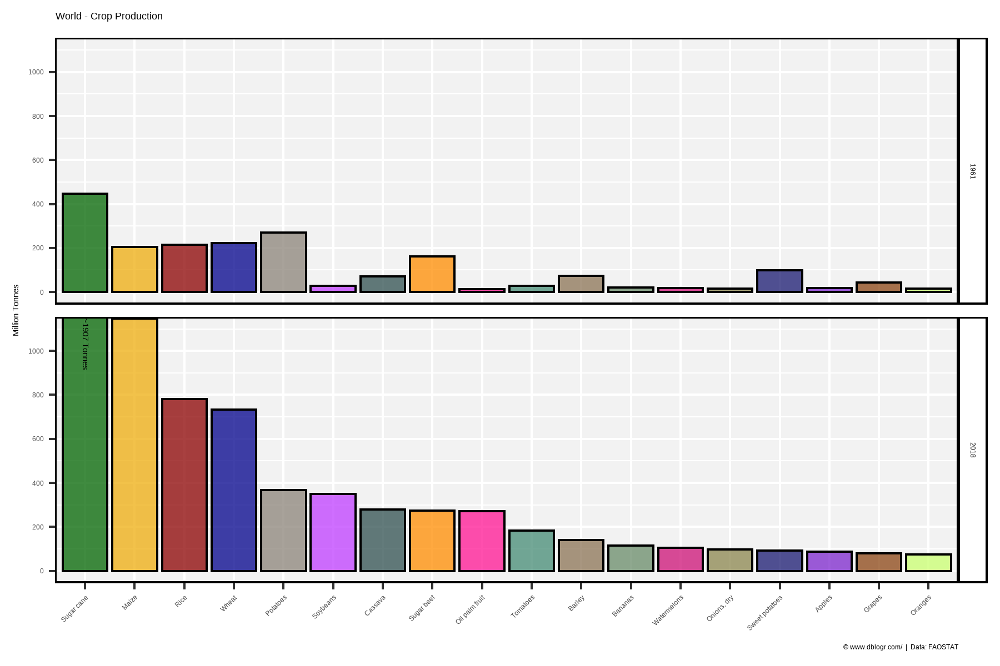
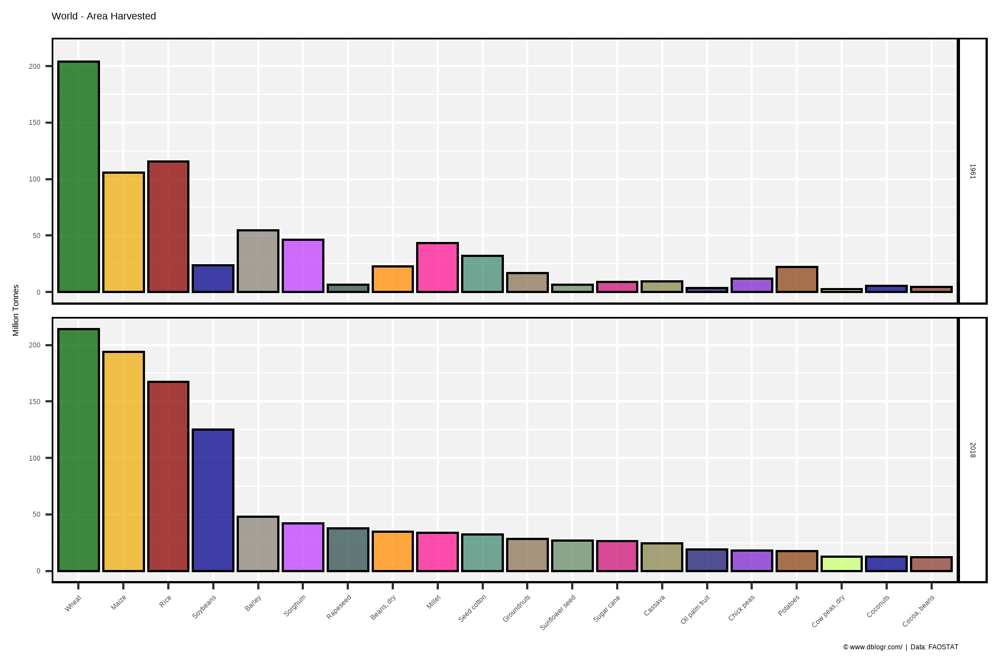
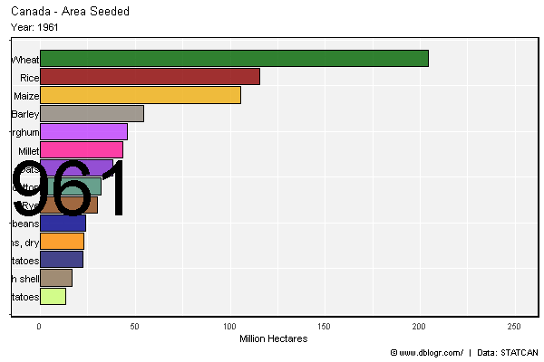
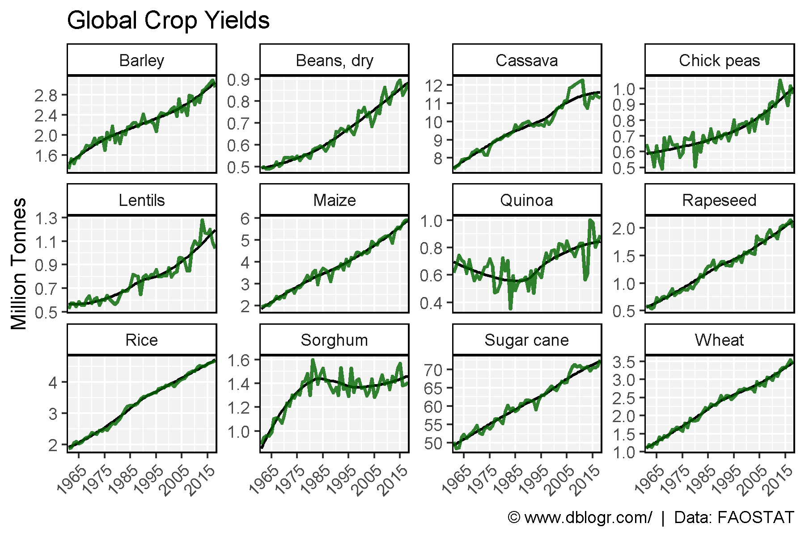
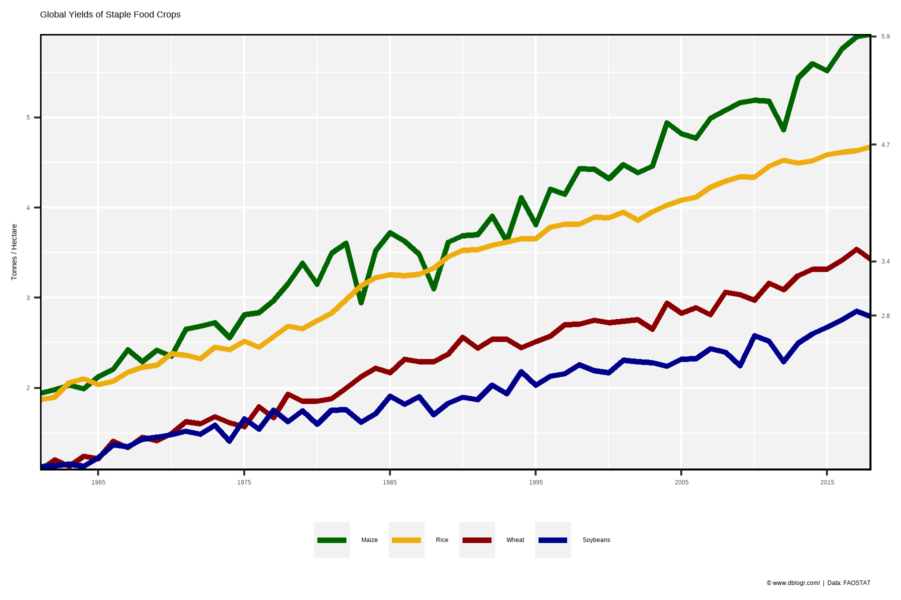

```{r setup, include = FALSE}
knitr::opts_chunk$set(echo = T, message = F, warning = F)
```

---

```{r}
# devtools::install_github("derekmichaelwright/agData")
library(agData) # Loads: tidyverse, ggpubr, ggbeeswarm, ggrepel
```

---

```{r}
# Create function to determine top crops
cropList <- function(measurement, years) {
  # Prep data
  xx <- agData_FAO_Crops %>% 
    filter(Area == "World", Measurement == measurement, Year %in% years) 
  # Get top 15 crops from each year
  topcrops <- function(x, year) {
    x <- x %>% filter(Year == year) %>% arrange(desc(Value)) %>% 
      pull(Crop) %>% unique() %>% as.character()
  }
  myCrops <- NULL
  for(i in years) { myCrops <- c(myCrops, topcrops(xx, i)) }
  unique(myCrops)
}
```

---

# Crop Production 1961 and 2018

```{r}
# Prep data
myCrops <- cropList(measurement = "Production", years = c(2018, 1961))[1:18]
xx <- agData_FAO_Crops %>% 
    filter(Area == "World", Year %in% c(2018, 1961),
           Measurement == "Production", Crop %in% myCrops) %>% 
  mutate(Text = ifelse(Crop == "Sugar cane" & Year == 2018, 
                       paste0("~", round(Value / 1000000), " Tonnes"), NA),
         Crop = factor(Crop, levels = myCrops) )
# Plot
mp <- ggplot(xx, aes(x = Crop, y = Value / 1000000, fill = Crop)) + 
  geom_bar(stat = "identity", color = "Black") + 
  geom_text(aes(label = Text), y = 1150, angle = 270, hjust = 0, vjust = 0.5 ) + 
  facet_grid(Year ~ .) + 
  scale_fill_manual(values = alpha(agData_Colors, 0.75)) +
  scale_y_continuous(breaks = seq(0, 1000, by = 200)) +
  coord_cartesian(ylim = c(0,1100)) +
  theme_agData(legend.position = "none", 
               axis.text.x = element_text(angle = 45, hjust = 1)) +
  labs(title = "World - Crop Production", y = "Million Tonnes", x = NULL,
       caption = "\xa9 www.dblogr.com/  |  Data: FAOSTAT")
ggsave("crops_world_01.png", mp, width = 6, height = 4)
```

```{r echo = F}
ggsave("featured.png", mp, width = 6, height = 4)
```



---

# Crop Area 1961 and 2018

```{r}
# Prep data
myCrops <- cropList(measurement = "Area harvested", years = c(2018, 1961))[1:20]
xx <- agData_FAO_Crops %>% 
    filter(Area == "World", Year %in% c(2018, 1961),
           Measurement == "Area harvested", Crop %in% myCrops) %>% 
  mutate(Crop = factor(Crop, levels = myCrops),
         Crop = plyr::mapvalues(Crop, "Groundnuts, with shell", "Groundnuts"))
# Plot
mp <- ggplot(xx, aes(x = Crop, y = Value / 1000000, fill = Crop)) + 
  geom_bar(stat = "identity", color = "Black") + 
  facet_grid(Year ~ .) + 
  scale_fill_manual(values = alpha(agData_Colors, 0.75)) +
  theme_agData(legend.position = "none", 
               axis.text.x = element_text(angle = 45, hjust = 1)) +
  labs(title = "World - Area Harvested", y = "Million Tonnes", x = NULL,
       caption = "\xa9 www.dblogr.com/  |  Data: FAOSTAT")
ggsave("crops_world_02.png", mp, width = 6, height = 4)
```



---

# Race Chart

```{r eval = F}
# Prep data
xx <- agData_FAO_Crops %>% 
    filter(Area == "World", 
           Measurement == "Area harvested") %>% 
  group_by(Year) %>%
  arrange(Year, -Value) %>%
  mutate(Rank = 1:n()) %>%
  filter(Rank < 15) %>% 
  arrange(desc(Year)) %>%
  mutate(Crop = factor(Crop, levels = unique(.$Crop)))
# Plot
mp <- ggplot(xx, aes(xmin = 0, xmax = Value / 1000000, 
                     ymin = Rank - 0.45, ymax = Rank + 0.45, y = Rank, 
                     fill = Crop)) + 
  geom_rect(alpha = 0.8, color = "black") + 
  scale_fill_manual(values = alpha(agData_Colors, 0.75)) +
  scale_x_continuous(limits = c(-2.5,250), breaks = c(0,50,100,150,200,250)) +
  geom_text(col = "black", hjust = "right", aes(label = Crop), x = -0.1) +
  scale_y_reverse() +
  theme_agData(legend.position = "none",
               axis.text.y = element_blank(), 
               axis.ticks.x = element_blank()) + 
  labs(title = "Canada - Area Seeded", 
       subtitle = "Year: {frame_time}",
       x = "Million Hectares", y = NULL,
       caption = "\xa9 www.dblogr.com/  |  Data: STATCAN") +
  # gganimate
  facet_null() +
  geom_text(x = 6, y = -8,
            aes(label = as.character(Year)),
            size = 30, col = "black") +
  transition_time(Year)
mp <- animate(mp, nframes = 2*(max(xx$Year) - min(xx$Year)), fps = 5, 
              end_pause = 20, width = 600, height = 400)
anim_save("crops_world_gifs_01.gif", mp)
```



---

# Crop Yields

```{r}
# Prep data
crops <- c("Barley", "Beans, dry", "Cassava", "Chick peas", 
           "Lentils", "Maize", "Quinoa", "Rapeseed", 
           "Rice", "Sorghum", "Sugar cane", "Wheat" )
xx <- agData_FAO_Crops %>% 
  filter(Area == "World", Measurement == "Yield", Crop %in% crops) 
# Plot
mp <- ggplot(xx, aes(x = Year, y = Value)) + 
  geom_smooth(se = F, color = "black", size = 0.75) +
  geom_line(stat = "identity", color = "darkgreen", size = 1, alpha = 0.8) + 
  facet_wrap(Crop ~ ., scale = "free_y", ncol = 4) + 
  scale_x_continuous(breaks = seq(1965, 2015, by = 10)) +
  coord_cartesian(xlim = c(min(xx$Year)+2, max(xx$Year)-2)) +
  theme_agData(axis.text.x = element_text(angle = 45, hjust = 1)) +
  labs(title = "Global Crop Yields", y = "Million Tonnes", x = NULL,
       caption = "\xa9 www.dblogr.com/  |  Data: FAOSTAT")
ggsave("crops_world_03.png", mp, width = 6, height = 4)
```



---

# Major Crop Yields

```{r}
# Prep data
crops <- c("Maize", "Rice", "Wheat", "Soybeans")
colors <- c("darkgreen", "darkgoldenrod2", "darkred", "darkblue")
xx <- agData_FAO_Crops %>% 
  filter(Area == "World", Measurement == "Yield", Crop %in% crops) %>%
  mutate(Crop = factor(Crop, levels = crops))
xT <- xx %>% filter(Year == max(Year))
# Plot
mp <- ggplot(xx, aes(x = Year, y = Value, color = Crop)) + 
  geom_line(size = 1.25) + 
  scale_x_continuous(breaks = seq(1965, 2015, by = 10)) +
  scale_y_continuous(sec.axis = sec_axis(~., breaks = round(xT$Value,1))) +
  scale_color_manual(name = NULL, values = colors) +
  coord_cartesian(xlim = c(min(xx$Year), max(xx$Year)), expand = 0) +
  theme_agData(legend.position = "bottom") +
  labs(title = "Global Yields of Staple Food Crops", y = "Tonnes / Hectare", x = NULL,
       caption = "\xa9 www.dblogr.com/  |  Data: FAOSTAT")
ggsave("crops_world_04.png", mp, width = 6, height = 4)
```



---

&copy; Derek Michael Wright [www.dblogr.com/](https://dblogr.com/)