```{r setup, include = FALSE}
knitr::opts_chunk$set(echo = T, message = F, warning = F)
```

---

```{r}
# devtools::install_github("derekmichaelwright/agData")
library(agData) # Loads: tidyverse, ggpubr, ggbeeswarm, ggrepel
```

---

# Farmland by Province

## 2016

```{r}
# Prep data
yy <- agData_STATCAN_Region_Table
xx <- agData_STATCAN_FarmLand_Use %>% 
  filter(Year == 2016, Item == "Total area of farms", Unit == "Hectares")
x1 <- xx %>% filter(Area == "Canada")
xx <- xx %>% filter(Area != "Canada") %>% 
  mutate(Percent = round(100 * Value / x1$Value, 1)) %>% 
  arrange(Percent) %>%
  mutate(Area = factor(Area, levels  = rev(Area)),
         Area_Short = plyr::mapvalues(Area, yy$Area, yy$Area_Short))
# What is the total amount of farmland in Canada?
sum(xx$Value)
# Plot
mp <- ggplot(xx, aes(x = Area_Short, y = Value / 1000000)) +
  geom_bar(aes(fill = Area), stat = "identity", color = "black", alpha = 0.8) +
  geom_label(aes(label = paste(Percent, "%")), nudge_y = 1.1, size = 3) +
  scale_fill_manual(values = agData_Colors) +
  theme_agData(legend.position = "none", 
               axis.text.x = element_text(angle = 90, hjust = 1, vjust = 0.5)) +
  labs(title = "Canadian Farmland (2016)",
       caption = "\xa9 www.dblogr.com/  |  Data: STATCAN",
       x = NULL, y = "Million Hectares")
ggsave("farmland_canada_1_01.png", mp, width = 6, height = 4)
```

```{r echo = F}
ggsave("featured.png", mp, width = 6, height = 4)
```


---

## Provinces

```{r}
xx <- agData_STATCAN_FarmLand_Farms %>%
  filter(Measurement == "Total area of farms",
         Area != "Canada")
mp <- ggplot(xx, aes(x = Year, y = Value / 1000000)) +
  geom_line(color = "darkgreen", size = 1.25, alpha = 0.8) +
  facet_wrap(. ~ Area, scales = "free_y", ncol = 5) +
  scale_x_continuous(breaks = seq(1925, 2015, 20), expand = c(0.01,0)) +
  theme_agData() +
  labs(title = "Canadian Farmland",
       caption = "\xa9 www.dblogr.com/  |  Data: STATCAN",
       x = NULL, y = "Million Hectares")
ggsave("farmland_canada_1_02.png", mp, width = 12, height = 5)
```

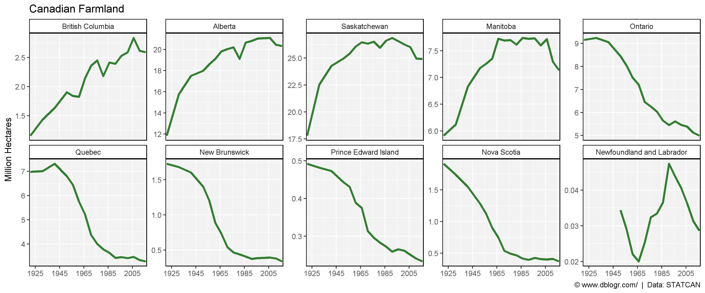

---

## Ontario & Quebec

```{r}
xx <- agData_STATCAN_FarmLand_Farms %>%
  filter(Measurement == "Total area of farms",
         Area %in% c("Ontario", "Quebec"))
mp <- ggplot(xx, aes(x = Year, y = Value / 1000000, color = Area)) +
  geom_line(size = 1.25, alpha = 0.8) +
  scale_color_manual(name = NULL, values = c("darkblue", "steelblue")) +
  scale_x_continuous(breaks = seq(1925, 2015, 10), expand = c(0.01,0)) +
  theme_agData(legend.position = "bottom") +
  labs(title = "Farmland",
       caption = "\xa9 www.dblogr.com/  |  Data: STATCAN",
       x = NULL, y = "Million Hectares")
ggsave("farmland_canada_1_03.png", mp, width = 6, height = 4)
```

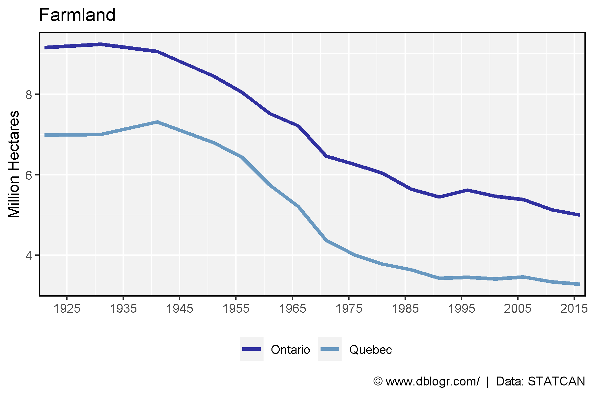

---

# Average Farm Size

## Canada

```{r}
# Prep data
xx <- agData_STATCAN_FarmLand_Farms %>% 
  filter(Measurement %in% c("Total area of farms", "Total number of farms")) %>%
  select(-Measurement, -Unit) %>% 
  spread(Item, Value) %>%
  mutate(Size = Hectares / Number)
# Plot
mp <- ggplot(xx %>% filter(Area == "Canada"), aes(y = Size, x = Year)) + 
  geom_line(color = "darkgreen", size = 1.5, alpha = 0.8) +
  scale_x_continuous(breaks = seq(1925, 2015, 10), expand = c(0.01,0)) +
  facet_grid(. ~ Area) +
  theme_agData() +
  labs(title = "Average Farm Size", y = "Hectares / Farm", x = NULL,
       caption = "\xa9 www.dblogr.com/  |  Data: STATCAN")
ggsave("farmland_canada_2_01.png", mp, width = 6, height = 4)
```

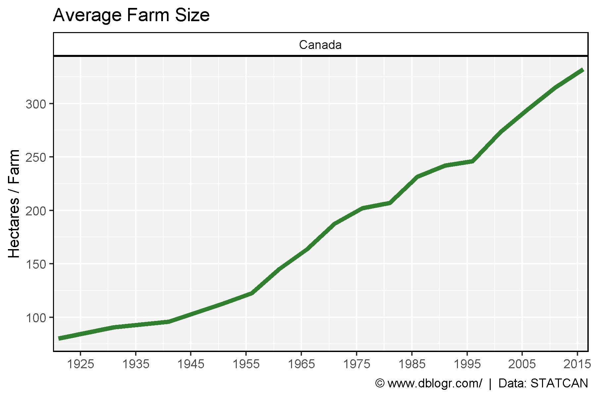

---

## Provinces

```{r}
# Plot
mp <- ggplot(xx %>% filter(Area != "Canada"), aes(y = Size, x = Year)) + 
  geom_line(color = "darkgreen", size = 1.5, alpha = 0.8) +
  facet_wrap(Area ~ ., ncol = 5) +
  scale_x_continuous(breaks = seq(1925, 2005, 20)) +
  theme_agData(legend.position = "bottom") +
  labs(title = "Average Farm Size", y = "Hectares / Farm", x = NULL,
       caption = "\xa9 www.dblogr.com/  |  Data: STATCAN")
ggsave("farmland_canada_2_02.png", mp, width = 12, height = 5)
```

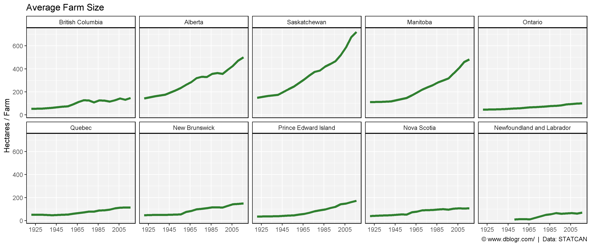

---

# Number vs. Area

## Canada

```{r}
# Prep data
xx <- agData_STATCAN_FarmLand_Farms %>% 
  filter(Area == "Canada",
         Measurement %in% c("Total area of farms", "Total number of farms")) %>%
  mutate(Value = ifelse(Unit == "Hectares", Value / 100000, Value / 1000),
         Unit = plyr::mapvalues(Unit, c("Hectares", "Number of farms reporting"), 
                                c("Total area of farms (100,000 hectares)","Number of farms (x1000)")))
# Plot
mp <- ggplot(xx, aes(y = Value, x = Year, color = Unit)) + 
  geom_line(size = 1.5, alpha = 0.8) +
  scale_color_manual(name = NULL, values = c("darkorange", "darkgreen")) +
  scale_x_continuous(breaks = seq(1925, 2015, 10), expand = c(0.01,0)) +
  facet_wrap(Area ~ .) +
  theme_agData(legend.position = "bottom") +
  labs(title = "Average Farm Size", y = NULL, x = NULL,
       caption = "\xa9 www.dblogr.com/  |  Data: STATCAN")
ggsave("farmland_canada_2_03.png", mp, width = 6, height = 4)
```

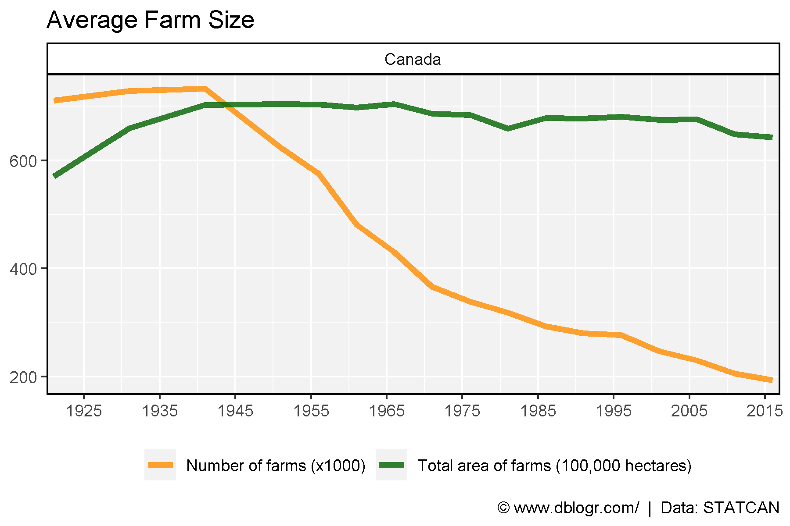

---

## Provinces

```{r}
# Prep data
xx <- agData_STATCAN_FarmLand_Farms %>% 
  filter(Area != "Canada",
         Measurement %in% c("Total area of farms", "Total number of farms")) %>%
  mutate(Value = ifelse(Unit == "Hectares", Value / 100000, Value / 1000),
         Unit = plyr::mapvalues(Unit, c("Hectares", "Number of farms reporting"), 
                                c("Total area of farms (100,000 hectares)","Number of farms (x1000)")))
# Plot
mp <- ggplot(xx, aes(y = Value, x = Year, color = Unit)) + 
  geom_line(size = 2, alpha = 0.8) +
  facet_wrap(Area ~ ., scales = "free_y", ncol = 5) +
  scale_color_manual(name = NULL, values = c("darkorange", "darkgreen")) +
  scale_x_continuous(breaks = seq(1925, 2005, 20)) +
  theme_agData(legend.position = "bottom") +
  labs(title = "Average Farm Size", y = NULL, x = NULL,
       caption = "\xa9 www.dblogr.com/  |  Data: STATCAN")
ggsave("farmland_canada_2_04.png", mp, width = 12, height = 5)
```

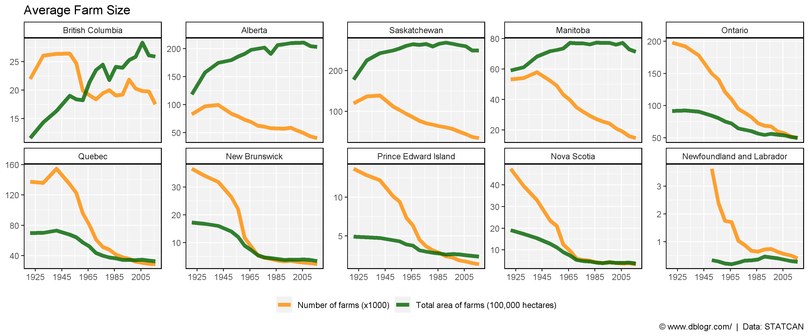

---

# Farm Size

## Canada

### Unscaled

```{r}
# Prep data
xx <- agData_STATCAN_FarmLand_Size %>% 
  filter(Area == "Canada", Measurement != "Total number of farms") 
# Plot
mp <- ggplot(xx, aes(x = Year, y = Value / 1000)) + 
  geom_line(color = "darkgreen", size = 1.5, alpha = 0.8) + 
  facet_wrap(Measurement ~ ., ncol = 7) +
  theme_agData() +
  labs(title = "Canada - Farm Size", y = "Thousand Farms", x = NULL,
       caption = "\xa9 www.dblogr.com/  |  Data: STATCAN")
ggsave("farmland_canada_2_05.png", mp, width = 14, height = 5)
```

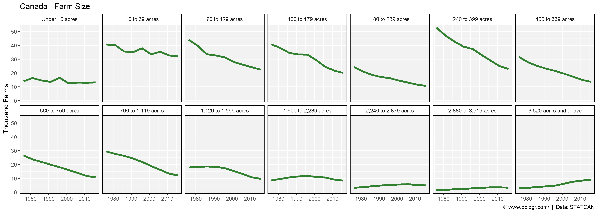

---

### Scaled

```{r}
# Plot
mp <- ggplot(xx, aes(x = Year, y = Value / 1000)) + 
  geom_line(color = "darkgreen", size = 1.5, alpha = 0.8) + 
  facet_wrap(Measurement ~ ., scales = "free_y", ncol = 7) +
  theme_agData() +
  labs(title = "Canada - Farm Size", y = "Thousand Farms", x = NULL,
       caption = "\xa9 www.dblogr.com/  |  Data: STATCAN")
ggsave("farmland_canada_2_06.png", mp, width = 14, height = 5)
```

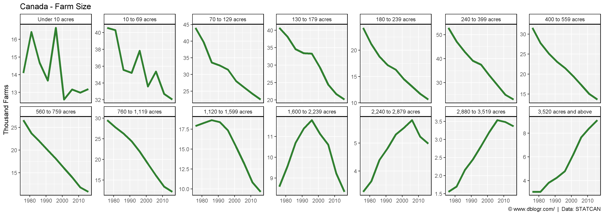

---

### Bar Charts

```{r}
cols <- c(alpha("darkgreen",0.2), alpha("darkgreen",0.3), alpha("darkgreen",0.4),
          alpha("darkgreen",0.5), alpha("darkgreen",0.6), alpha("darkgreen",0.7),
          alpha("darkgreen",0.8), alpha("darkgreen",0.9), "darkgreen")
#
mp <- ggplot(xx, aes(y = Value / 1000, x = Measurement, fill = as.factor(Year))) + 
  geom_bar(stat = "identity", position = "dodge", color = "black") +
  scale_fill_manual(name = NULL, values = cols) +
  theme_agData(axis.text.x = element_text(angle = 90, hjust = 1, vjust = 0.5)) +
  labs(title = "Canada - Farm Size", y = "Thousand Farms", x = NULL,
       caption = "\xa9 www.dblogr.com/  |  Data: STATCAN")
ggsave("farmland_canada_2_07.png", mp, width = 6, height = 4)
```

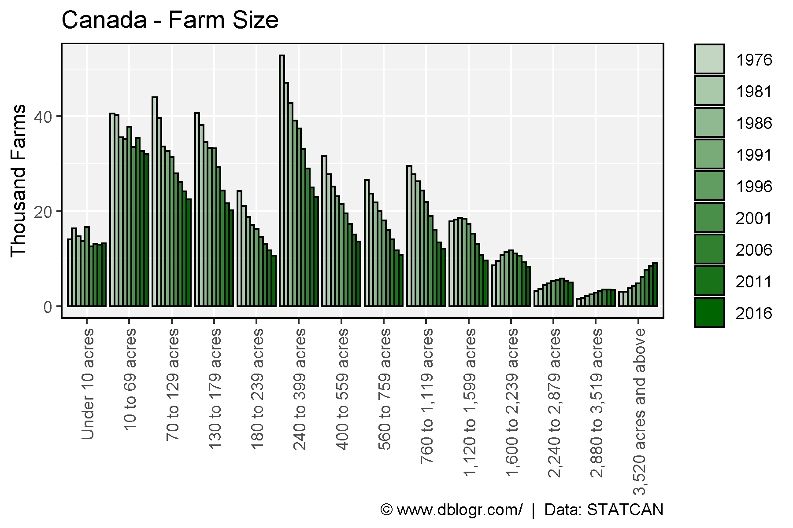

---

## Saskatchewan

### Unscaled

```{r}
# Prep data
xx <- agData_STATCAN_FarmLand_Size %>% 
  filter(Area == "Saskatchewan", Measurement != "Total number of farms") 
# Plot
mp <- ggplot(xx, aes(x = Year, y = Value / 1000)) + 
  geom_line(color = "darkgreen", size = 1.5, alpha = 0.8) + 
  facet_wrap(Measurement ~ ., ncol = 7) +
  theme_agData() +
  labs(title = "Saskatchewan - Farm Size", y = "Thousand Farms", x = NULL,
       caption = "\xa9 www.dblogr.com/  |  Data: STATCAN")
ggsave("farmland_canada_2_08.png", mp, width = 14, height = 5)
```

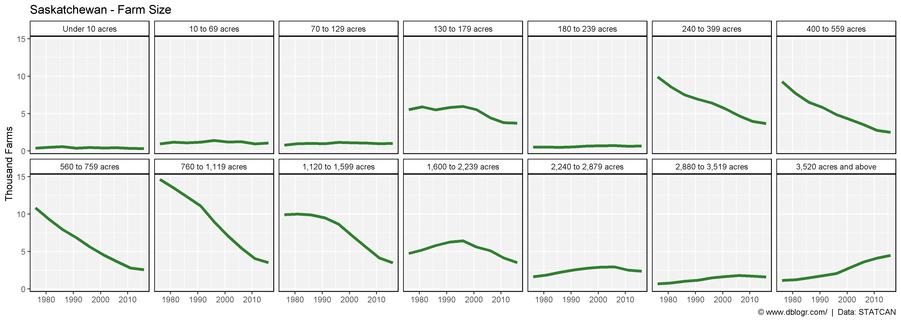

---

### Scaled

```{r}
# Plot
mp <- ggplot(xx, aes(x = Year, y = Value / 1000)) + 
  geom_line(color = "darkgreen", size = 1.5, alpha = 0.8) + 
  facet_wrap(Measurement ~ ., scales = "free_y", ncol = 7) +
  theme_agData() +
  labs(title = "Farm Size - Saskatchewan", y = "Thousand Farms", x = NULL,
       caption = "\xa9 www.dblogr.com/  |  Data: STATCAN")
ggsave("farmland_canada_2_09.png", mp, width = 14, height = 5)
```

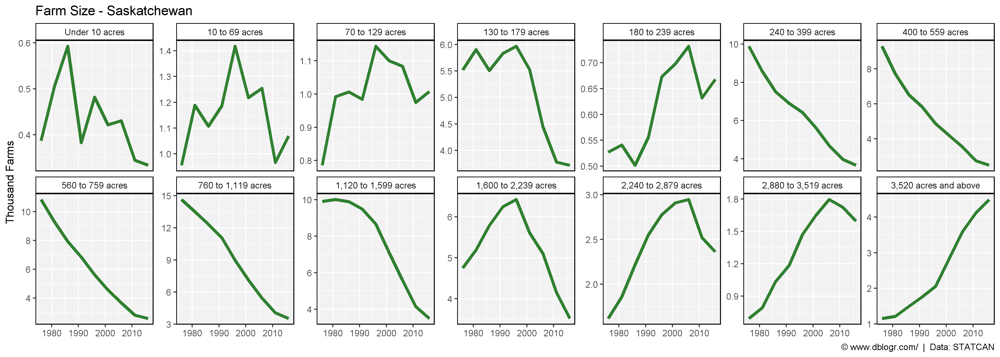

---

### Bar Charts

```{r}
cols <- c(alpha("darkgreen",0.2), alpha("darkgreen",0.3), alpha("darkgreen",0.4),
          alpha("darkgreen",0.5), alpha("darkgreen",0.6), alpha("darkgreen",0.7),
          alpha("darkgreen",0.8), alpha("darkgreen",0.9), "darkgreen")
#
mp <- ggplot(xx, aes(y = Value / 1000, x = Measurement, fill = as.factor(Year))) + 
  geom_bar(stat = "identity", position = "dodge", color = "black") +
  scale_fill_manual(name = NULL, values = cols) +
  facet_grid(. ~ Area) +
  theme_agData(axis.text.x = element_text(angle = 90, hjust = 1, vjust = 0.5)) +
  labs(title = "Farm Size", y = "Thousand Farms", x = NULL,
       caption = "\xa9 www.dblogr.com/  |  Data: STATCAN")
ggsave("farmland_canada_2_10.png", mp, width = 6, height = 4)
```

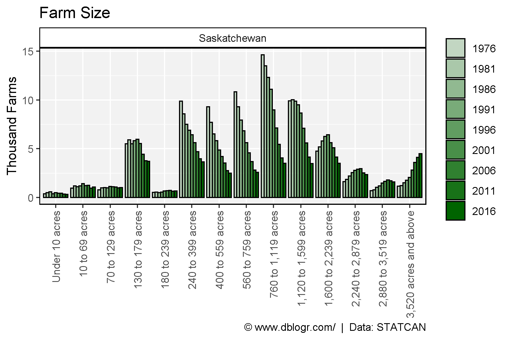

---

## Provinces

```{r}
# Prep data
areas <- c("British Columbia", "Alberta", "Saskatchewan",
           "Manitoba", "Ontario", "Quebec")
xx <- agData_STATCAN_FarmLand_Size %>% 
  filter(Area %in% areas, Measurement != "Total number of farms") 
cols <- c(alpha("darkgreen",0.2), alpha("darkgreen",0.3), alpha("darkgreen",0.4),
          alpha("darkgreen",0.5), alpha("darkgreen",0.6), alpha("darkgreen",0.7),
          alpha("darkgreen",0.8), alpha("darkgreen",0.9), "darkgreen")
#
mp <- ggplot(xx, aes(y = Value / 1000, x = Measurement, fill = as.factor(Year))) + 
  geom_bar(stat = "identity", position = "dodge", color = "black") +
  facet_grid(Area ~ .) +
  scale_fill_manual(name = NULL, values = cols) +
  theme_agData(axis.text.x = element_text(angle = 90, hjust = 1, vjust = 0.5)) +
  labs(title = "Farm Size - Canada", y = "Thousand Farms", x = NULL,
       caption = "\xa9 www.dblogr.com/  |  Data: STATCAN")
ggsave("farmland_canada_2_11.png", mp, width = 6, height = 8)
```

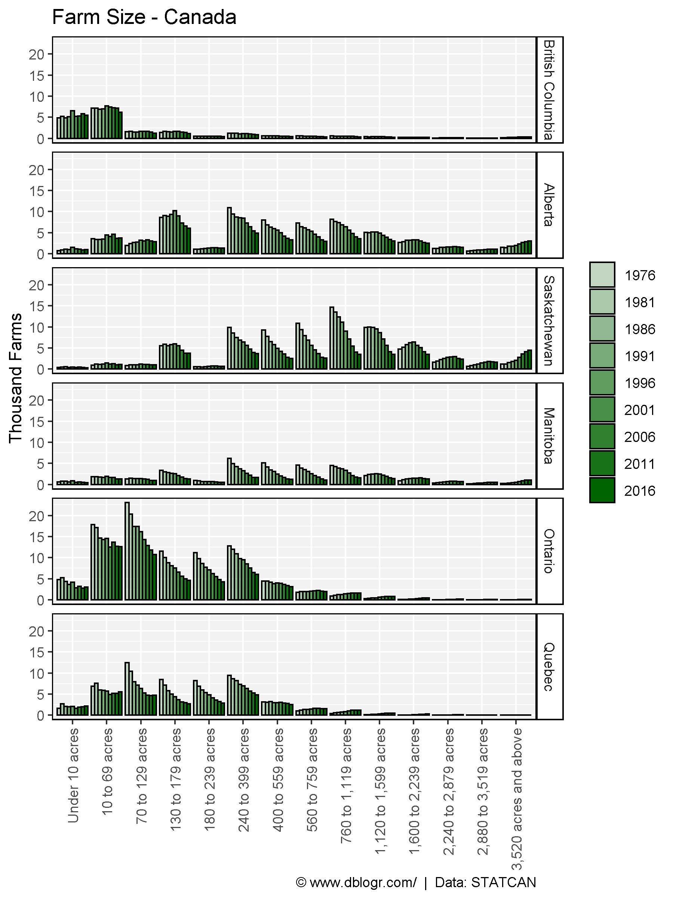

---

```{r eval = F, echo = F}
# Prep data
xx <- agData_STATCAN_FarmLand_Use
# Plot
ggplot(xx, aes(x = Year, y = Value)) + 
  geom_line() + 
  facet_wrap(Item + Measurement + Unit ~ ., scales = "free_y")
```

```{r eval = F, echo = F}
# Prep data
xx <- agData_STATCAN_FarmLand_Farms %>% 
  filter(Area == "Canada")
# Plot
ggplot(xx, aes(x = Year, y = Value)) + 
  geom_line() + 
  facet_wrap(Measurement + Unit ~ ., scales = "free")
```

```{r eval = F, echo = F}
# Prep data
xx <- agData_STATCAN_FarmLand_Crops %>% 
  filter(Area == "Canada", Crop == "Total wheat")
# Plot
ggplot(xx, aes(x = Year, y = Value)) + 
  geom_line() + 
  facet_wrap(Measurement + Unit ~ ., scales = "free_y")
```

&copy; Derek Michael Wright [www.dblogr.com/](https://dblogr.com/)