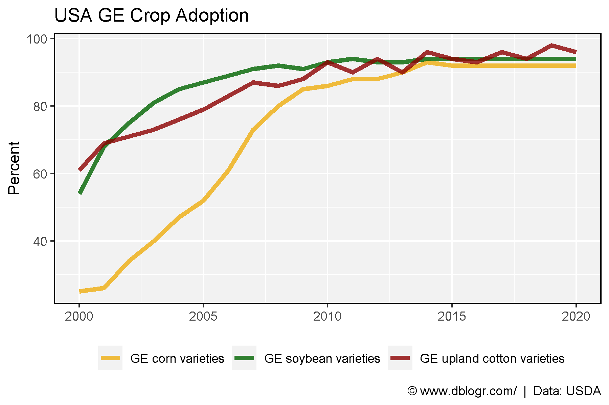
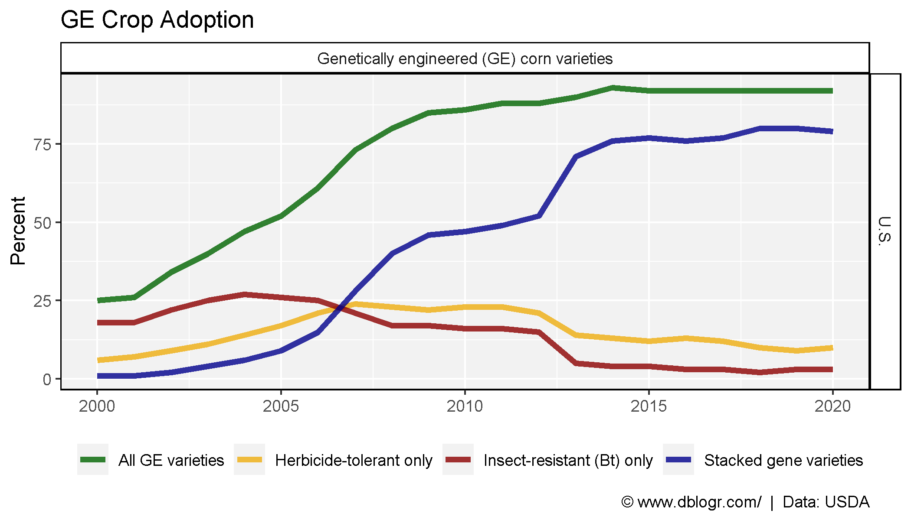
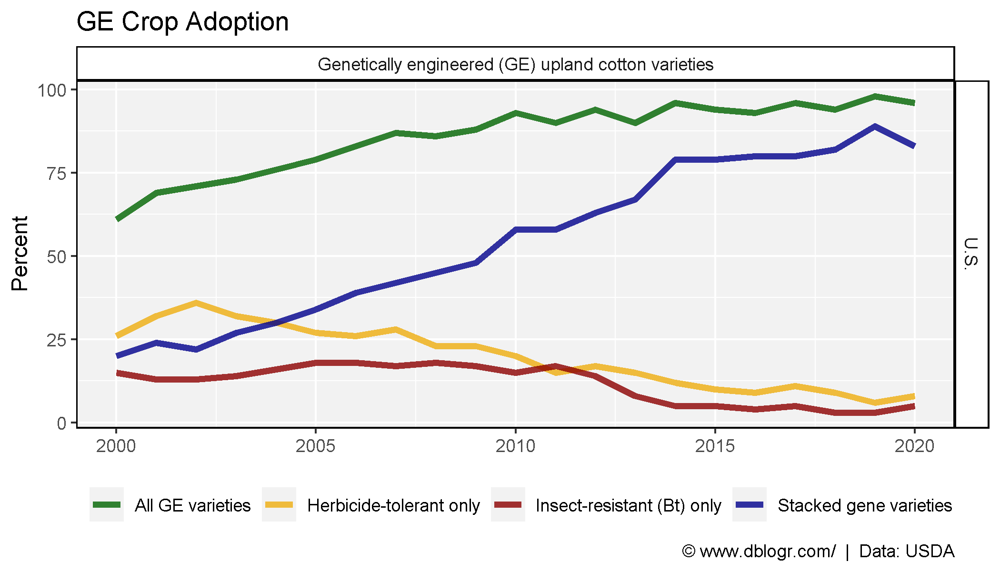
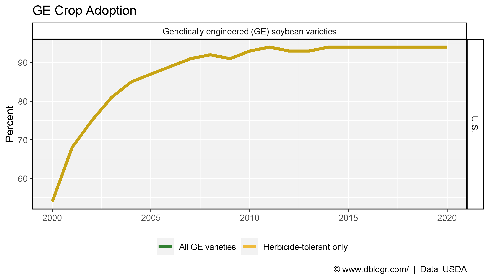
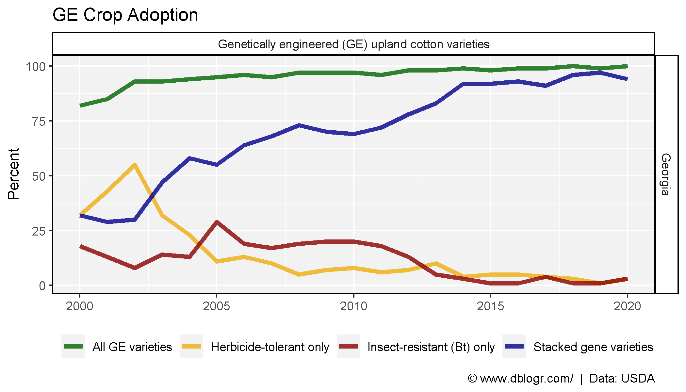

```{r setup, include = FALSE}
knitr::opts_chunk$set(echo = T, message = F, warning = F)
```

---

```{r}
# devtools::install_github("derekmichaelwright/agData")
library(agData) # Loads: tidyverse, ggpubr, ggbeeswarm, ggrepel
```

---

# All

```{r}
# Prep data
xx <- agData_USDA_GE_Crops %>% 
  filter(Area == "U.S.", Measurement == "All GE varieties") %>%
  mutate(Crop = gsub("Genetically engineered \\(GE\\)", "GE", Crop))
# Plot
mp <- ggplot(xx, aes(x = Year, y = Value, color = Crop)) +
  geom_line(size = 1.5, alpha = 0.8) +
  scale_color_manual(name = NULL, values = agData_Colors[c(2,1,3)]) +
  theme_agData(legend.position = "bottom") +
  labs(title = "USA GE Crop Adoption", 
       y = "Percent", x = NULL,
       caption = "\xa9 www.dblogr.com/  |  Data: USDA")
ggsave("ge_crops_01.png", mp, width = 6, height = 4)
```

```{r echo = F}
ggsave("featured.png", mp, width = 6, height = 4)
```



---

# Maize

```{r}
# Prep data
xx <- agData_USDA_GE_Crops %>% 
  filter(Area == "U.S.", Crop == "Genetically engineered (GE) corn varieties")
# Plot
mp <- ggplot(xx, aes(x = Year, y = Value, color = Measurement, group = Measurement)) +
  geom_line(size = 1.5, alpha = 0.8) +
  facet_grid(Area ~ Crop) +
  scale_color_manual(name = NULL, values = agData_Colors) +
  theme_agData(legend.position = "bottom") +
  labs(title = "GE Crop Adoption", 
       y = "Percent", x = NULL,
       caption = "\xa9 www.dblogr.com/  |  Data: USDA")
ggsave("ge_crops_02.png", mp, width = 7, height = 4)
```



---

# Cotton

```{r}
# Prep data
xx <- agData_USDA_GE_Crops %>% 
  filter(Area == "U.S.", Crop == "Genetically engineered (GE) upland cotton varieties")
# Plot
mp <- ggplot(xx, aes(x = Year, y = Value, color = Measurement, group = Measurement)) +
  geom_line(size = 1.5, alpha = 0.8) +
  facet_grid(Area ~ Crop) +
  scale_color_manual(name = NULL, values = agData_Colors) +
  theme_agData(legend.position = "bottom") +
  labs(title = "GE Crop Adoption", 
       y = "Percent", x = NULL,
       caption = "\xa9 www.dblogr.com/  |  Data: USDA")
ggsave("ge_crops_03.png", mp, width = 7, height = 4)
```



---

# Soybeans

```{r}
# Prep data
xx <- agData_USDA_GE_Crops %>% 
  filter(Area == "U.S.", Crop == "Genetically engineered (GE) soybean varieties")
# Plot
mp <- ggplot(xx, aes(x = Year, y = Value, color = Measurement, group = Measurement)) +
  geom_line(size = 1.5, alpha = 0.8) +
  facet_grid(Area ~ Crop) +
  scale_color_manual(name = NULL, values = agData_Colors) +
  theme_agData(legend.position = "bottom") +
  labs(title = "GE Crop Adoption", 
       y = "Percent", x = NULL,
       caption = "\xa9 www.dblogr.com/  |  Data: USDA")
ggsave("ge_crops_04.png", mp, width = 7, height = 4)
```



---

# Georgia

```{r}
# Prep data
xx <- agData_USDA_GE_Crops %>% 
  filter(Area == "Georgia", Crop == "Genetically engineered (GE) upland cotton varieties")
# Plot
mp <- ggplot(xx, aes(x = Year, y = Value, color = Measurement, group = Measurement)) +
  geom_line(size = 1.5, alpha = 0.8) +
  facet_grid(Area ~ Crop) +
  scale_color_manual(name = NULL, values = agData_Colors) +
  theme_agData(legend.position = "bottom") +
  labs(title = "GE Crop Adoption", 
       y = "Percent", x = NULL,
       caption = "\xa9 www.dblogr.com/  |  Data: USDA")
ggsave("ge_crops_05.png", mp, width = 7, height = 4)
```



&copy; Derek Michael Wright [www.dblogr.com/](https://dblogr.com/)