```{r setup, include = FALSE}
knitr::opts_chunk$set(echo = T, message = F, warning = F)
```

---

```{r}
# devtools::install_github("derekmichaelwright/agData")
library(agData) # Loads: tidyverse, ggpubr, ggbeeswarm, ggrepel
```

---

# Global Hectares

## Global Area

```{r}
# Prep data
xx <- agData_ISAAA_Area %>% filter(Measurement == "Area")
# Plot
mp <- ggplot(xx, aes(x = Year, y = Value / 1000000)) +
  geom_bar(stat = "identity", alpha = 0.25, fill = "darkgreen") +
  geom_line(color = "darkgreen", size = 1.5) +
  scale_x_continuous(breaks = c(1996, 2000, 2005, 2010, 2015),
                     minor_breaks = seq(1996, 2020, by = 1)) +
  theme_agData() +
  labs(title = "Global Area of GE Crops", 
       y = "Million Hectares", x = NULL,
       caption = "\xa9 www.dblogr.com/  |  Data: ISAAA")
ggsave("ge_crops_world_01.png", mp, width = 6, height = 4)
```

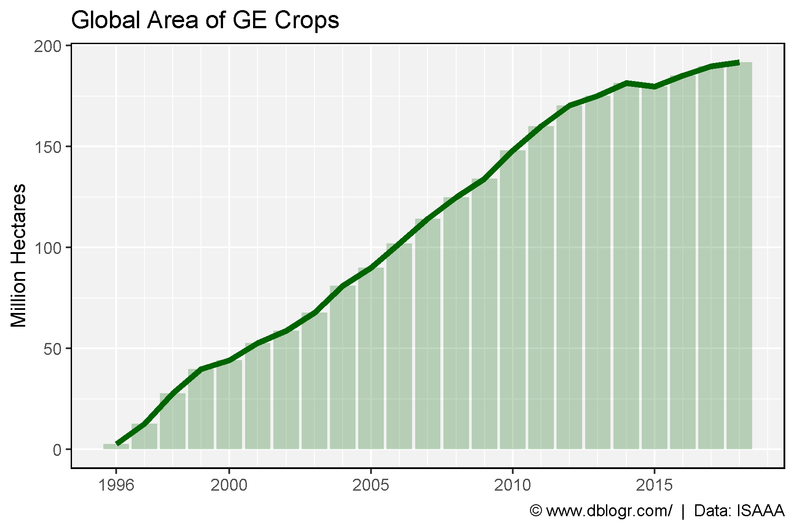

---

## Year to Year Change

```{r}
# Prep data
xx <- agData_ISAAA_Area %>% 
  mutate(Value = ifelse(Measurement != "Percent Change", Value / 1000000, Value),
         Unit  = ifelse(Measurement != "Percent Change", paste("Million", Unit), Unit),
         Text  = ifelse((Measurement == "Percent Change" & Year %in% 1997:1999), Value, NA),
         Value = ifelse((Measurement == "Percent Change" & Year %in% 1997:1999), NA, Value))
# Plot
mp <- ggplot(xx, aes(x = Year, y = Value)) + 
  geom_bar(stat = "identity", alpha = 0.5, color = "Black", fill = "darkgreen") + 
  geom_text(aes(label = Text), y = 0, angle = 270, hjust = 1, vjust = 0.5 ) + 
  facet_grid(Measurement + Unit ~ ., scales = "free_y", switch = "y") +
  scale_x_continuous(breaks = c(1996, 2000, 2005, 2010, 2015),
                     minor_breaks = seq(1996, 2020, by = 1)) +
  coord_cartesian(xlim = c(min(xx$Year)+0.4, max(xx$Year)-0.4)) +
  theme_agData(strip.placement = "outside") +
  labs(title = "Global Area of GE Crops", 
       y = NULL, x = NULL,
       caption = "\xa9 www.dblogr.com/  |  Data: ISAAA")
ggsave("ge_crops_world_02.png", mp, width = 6, height = 4)
```

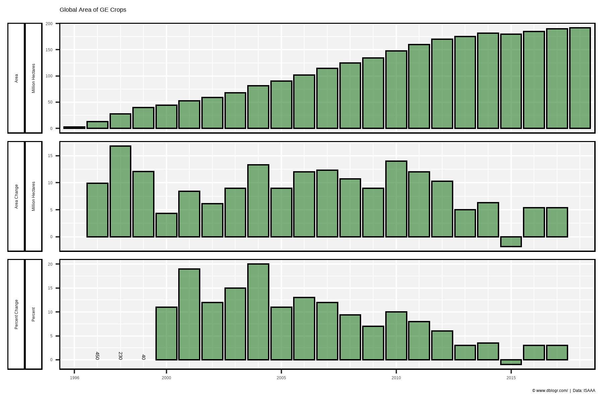

---

# Devloping vs Developed Countries

## Area

```{r}
# Prep data
xx <- agData_ISAAA_DVDDVG %>% filter(Unit == "Hectares")
xE <- xx %>% top_n(1, Year) %>% pull(Value) / 1000000
# Plot
mp <- ggplot(xx, aes(x = Year, y = Value / 1000000, color = Area)) + 
  geom_line(size = 1.5, alpha = 0.8) + 
  scale_color_manual(values = c("darkgreen", "darkred")) +
  scale_y_continuous(breaks = seq(0, 100, by = 10), 
                     sec.axis = sec_axis(~ ., breaks = xE)) +
  scale_x_continuous(breaks = c(1996, 2000, 2005, 2010, 2015),
                     minor_breaks = seq(1996, 2020, by = 1)) +
  coord_cartesian(xlim = c(min(xx$Year)+0.5, max(xx$Year)-0.9)) +
  theme_agData(legend.position = "bottom") +
  labs(title = "Global Area of GE Crops", 
       y = "Million Hectares", x = NULL,
       caption = "\xa9 www.dblogr.com/  |  Data: ISAAA/")
ggsave("ge_crops_world_03.png", mp, width = 6, height = 4)
```

```{r echo = F}
ggsave("featured.png", mp, width = 6, height = 4)
```

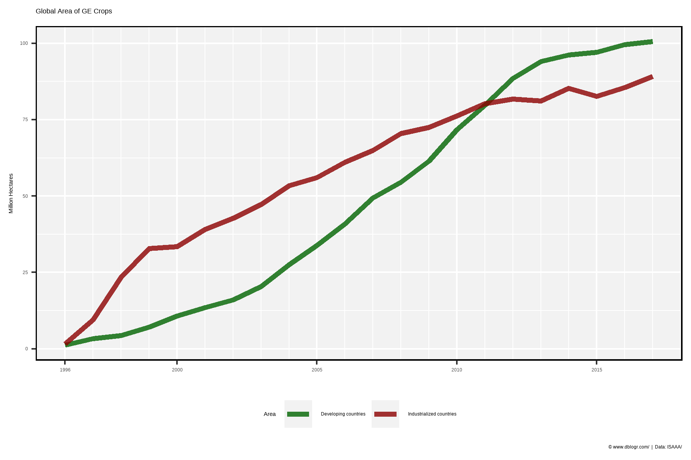

---

## Percentage

```{r}
# Prep data
xx <- agData_ISAAA_DVDDVG %>% filter(Unit == "Percent")
# Plot
mp <- ggplot(xx, aes(x = Year, y = Value, color = Area)) + 
  geom_line(size = 1.5, alpha = 0.8) + 
  scale_color_manual(values = c("darkgreen", "darkred")) +
  scale_x_continuous(breaks = c(1996, 2000, 2005, 2010, 2015),
                     minor_breaks = seq(1996, 2020, by = 1)) +
  theme_agData(legend.position = "bottom") +
  labs(title = "Global Area of GE Crops", 
       y = "Percent", x = NULL,
       caption = "\xa9 www.dblogr.com/  |  Data: ISAAA")
ggsave("ge_crops_world_04.png", mp, width = 6, height = 4)
```

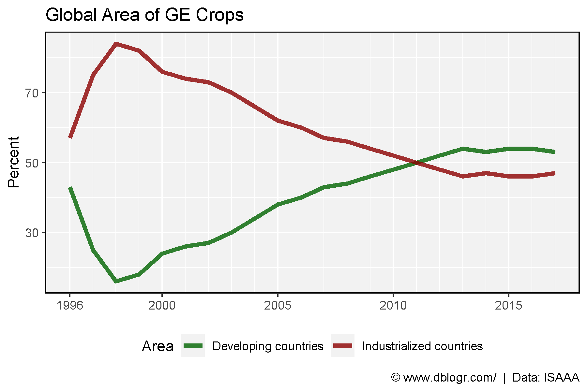

---

# Crops

## Area

```{r}
# Prep Data
crops <- c("Soybean", "Maize", "Cotton", "Canola")
colors <- c("darkblue", "darkgreen", "darkred", "darkgoldenrod2")
xx <- agData_ISAAA_Crop %>% 
  filter(Measurement == "Area", Crop %in% crops) %>%
  mutate(Crop = factor(Crop, levels = crops))
xE <- xx %>% top_n(1, Year) %>% pull(Value) / 1000000
# Plot
mp <- ggplot(xx, aes(x = Year, y = Value / 1000000, color = Crop)) +
  geom_line(size = 1.5, alpha = 0.8) +
  scale_color_manual(values = colors) +
  scale_y_continuous(breaks = seq(0, 100, by = 10), 
                     sec.axis = sec_axis(~ ., breaks = xE)) +
  scale_x_continuous(breaks = c(1996, 2000, 2005, 2010, 2015),
                     minor_breaks = seq(1996, 2020, by = 1)) +
  coord_cartesian(xlim = c(min(xx$Year)+0.5, max(xx$Year)-0.9)) +
  theme_agData(legend.position = "bottom") +
  labs(title = "Global Area of GE Crops", 
       y = "Million Hectares", x = NULL,
       caption = "\xa9 www.dblogr.com/  |  Data: ISAAA")
ggsave("ge_crops_world_05.png", mp, width = 6, height = 4)
```

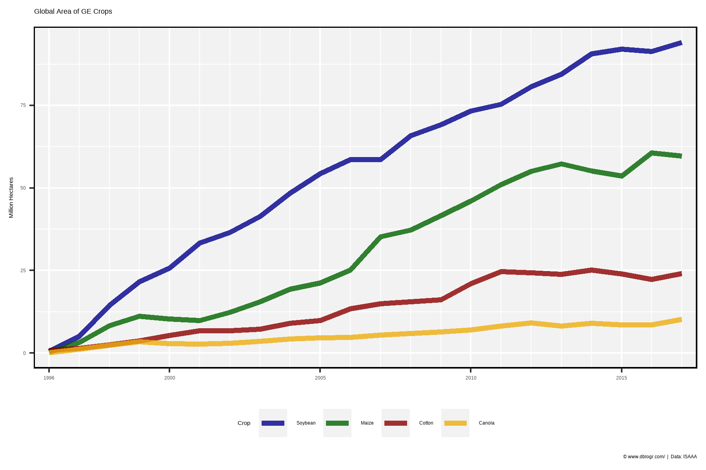

---

## Percentage

```{r}
# Prep Data
crops <- c("Soybean", "Maize", "Cotton", "Canola")
colors <- c("darkblue", "darkgreen", "darkred", "darkgoldenrod2")
xx <- agData_ISAAA_Crop %>% 
  filter(Measurement == "Percent of GE Area", Crop %in% crops) %>%
  mutate(Crop = factor(Crop, levels = crops))
xE <- xx %>% top_n(1, Year) %>% pull(Value)
# Plot
mp <- ggplot(xx, aes(x = Year, y = Value, color = Crop)) +
  geom_line(size = 1.5, alpha = 0.8) +
  scale_color_manual(values = colors) +
  scale_y_continuous(breaks = seq(0, 60, by = 10), 
                     sec.axis = sec_axis(~ ., breaks = xE, labels = paste(xE,"%"))) +
  scale_x_continuous(breaks = c(1996, 2000, 2005, 2010, 2015),
                     minor_breaks = seq(1996, 2020, by = 1)) +
  coord_cartesian(xlim = c(min(xx$Year)+0.5, max(xx$Year)-0.9)) +
  theme_agData(legend.position = "bottom") +
  labs(title = "Percent of GE Area", y = "Percent", x = NULL,
       caption = "\xa9 www.dblogr.com/  |  Data: ISAAA")
ggsave("ge_crops_world_06.png", mp, width = 6, height = 4)
```

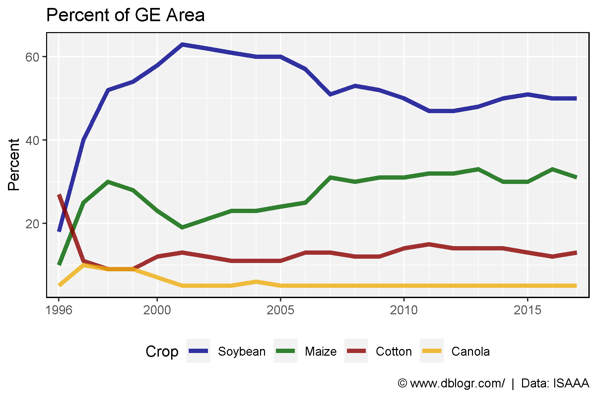

---

## Year to Year Change

```{r}
# Prep Data
crops <- c("Soybean", "Maize", "Cotton", "Canola")
colors <- c("darkblue", "darkgreen", "darkred", "darkgoldenrod2")
xx <- agData_ISAAA_Crop %>% 
  filter(Measurement == "Area Change", Crop %in% crops) %>%
  mutate(Crop = factor(Crop, levels = crops))
# Plot
mp <- ggplot(xx, aes(x = Year, y = Value / 1000000, fill = Crop)) +
  geom_bar(stat = "identity", color = "black", alpha = 0.8) +
  facet_grid(Crop ~ ., scales = "free_y") +
  scale_fill_manual(values = colors) +
  scale_x_continuous(breaks = c(1996, 2000, 2005, 2010, 2015),
                     minor_breaks = seq(1996, 2020, by = 1)) +
  coord_cartesian(xlim = c(min(xx$Year)+0.4, max(xx$Year)-0.4)) +
  theme_agData(legend.position = "none") +
  labs(title = "Year to Year Change in GE Crop Hectares", 
       y = "Million Hectares", x = NULL,
       caption = "\xa9 www.dblogr.com/  |  Data: ISAAA")
ggsave("ge_crops_world_07.png", mp, width = 6, height = 4)
```

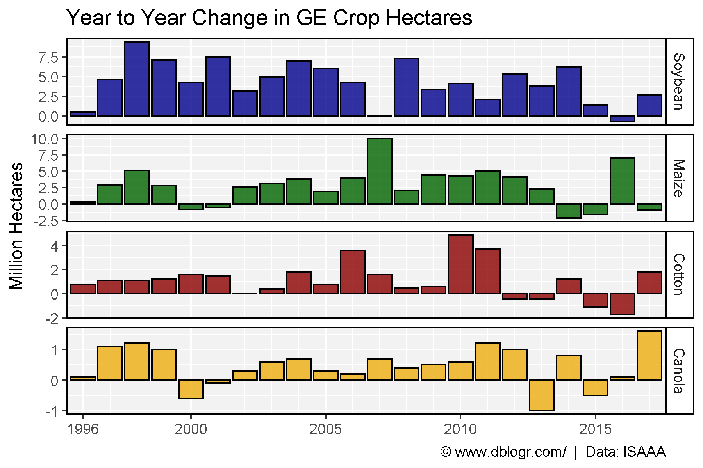

---

## Year to Year Percentage Change

```{r}
# Prep Data
crops <- c("Soybean", "Maize", "Cotton", "Canola")
colors <- c("darkblue", "darkgreen", "darkred", "darkgoldenrod2")
xx <- agData_ISAAA_Crop %>% 
  filter(Measurement == "Percent Change", Year > 1997, Crop %in% crops) %>%
  mutate(Crop = factor(Crop, levels = crops))
# Plot
mp <- ggplot(xx, aes(x = Year, y = Value, fill = Crop)) +
  geom_bar(stat = "identity", color = "black", alpha = 0.8) +
  facet_grid(Crop ~ ., scales = "free_y") +
  scale_fill_manual(values = colors) +
  scale_x_continuous(breaks = c(1996, 2000, 2005, 2010, 2015),
                     minor_breaks = seq(1996, 2020, by = 1)) +
  coord_cartesian(xlim = c(min(xx$Year)+0.3, max(xx$Year)-0.3)) +
  theme_agData(legend.position = "none") +
  labs(title = "Percent change of GE Crops Year to Year", 
       y = "Percent", x = NULL,
       caption = "\xa9 www.dblogr.com/  |  Data: ISAAA")
ggsave("ge_crops_world_08.png", mp, width = 6, height = 4)
```

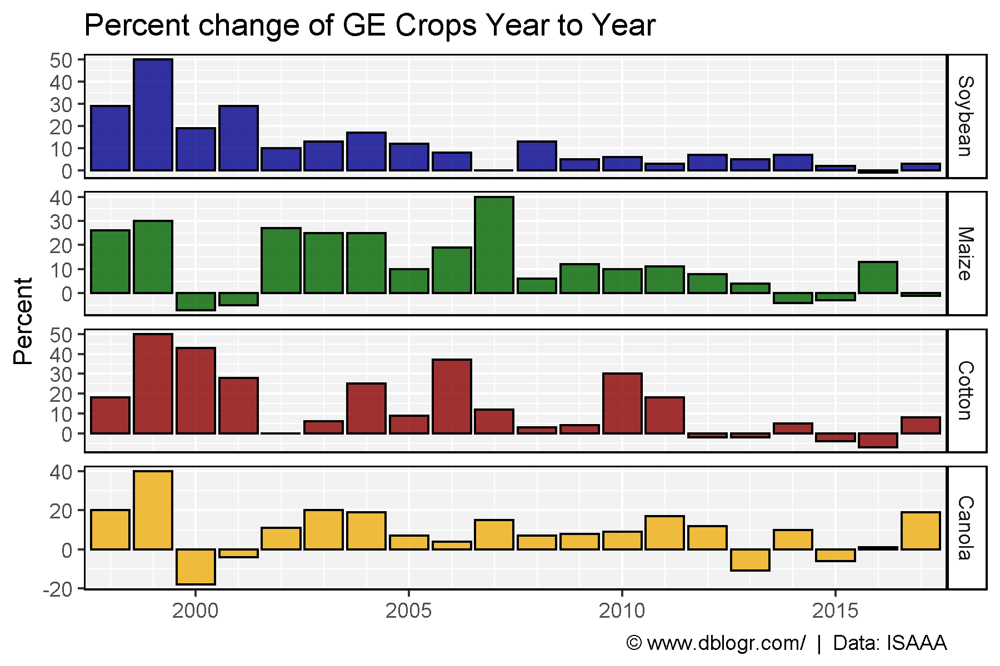

---

# Adoption of Genetically Engineered Crops

## Percentage

```{r}
# Prep Data
crops <- c("Soybean", "Maize", "Cotton", "Canola")
colors <- c("darkblue", "darkgreen", "darkred", "darkgoldenrod2")
xx <- agData_ISAAA_CropPercent %>% 
  filter(Measurement == "Percent", Crop != "Others") %>%
  mutate(Crop = factor(Crop, levels = crops))
xE <- xx %>% top_n(1, Year) %>% pull(Value)
# Plot
mp <- ggplot(xx, aes(x = Year, y = Value, color = Crop)) +
  geom_line(size = 1.5, alpha = 0.8) +
  scale_color_manual(values = colors) +
  scale_y_continuous(breaks = seq(0, 80, by = 10), 
                     sec.axis = sec_axis(~ ., breaks = xE, labels = paste(xE,"%"))) +
  scale_x_continuous(breaks = c(1996, 2000, 2005, 2010, 2015),
                     minor_breaks = seq(1996, 2020, by = 1)) +
  coord_cartesian(xlim = c(min(xx$Year)+0.5, max(xx$Year)-0.7)) +
  theme_agData(legend.position = "bottom") +
  labs(title = "Adoption of GE Crops", 
       subtitle = "Percent of global cropland planted with GE varieties",
       y = "Percent", x = NULL,
       caption = "\xa9 www.dblogr.com/  |  Data: ISAAA")
ggsave("ge_crops_world_09.png", mp, width = 6, height = 4)
```

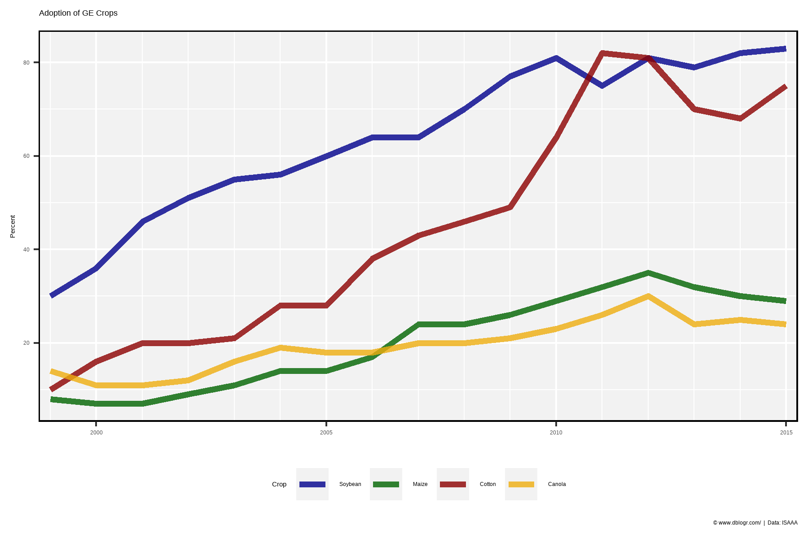

---

## Area

```{r}
# Prep Data
xx <- agData_ISAAA_CropPercent %>% 
  filter(Crop != "Others", Measurement != "Percent") %>%
  mutate(Measurement = plyr::mapvalues(Measurement, "Area", "Total Area"))
# Plot
mp <- ggplot(xx, aes(x = Year, y = Value / 1000000, color = Measurement)) +
  geom_line(size = 1.5, alpha = 0.8) +
  facet_wrap(Crop ~ ., ncol= 2, scales = "free_y") +
  scale_color_manual(values = c("black", "darkgreen")) +
  scale_x_continuous(breaks = c(2000, 2005, 2010, 2015),
                     minor_breaks = seq(1996, 2020, by = 1)) +
  theme_agData(legend.position = "bottom") +
  labs(title = "Adoption of GE Crops", y = "Million Hectares", x = NULL,
       caption = "\xa9 www.dblogr.com/  |  Data: ISAAA")
ggsave("ge_crops_world_10.png", mp, width = 6, height = 4)
```

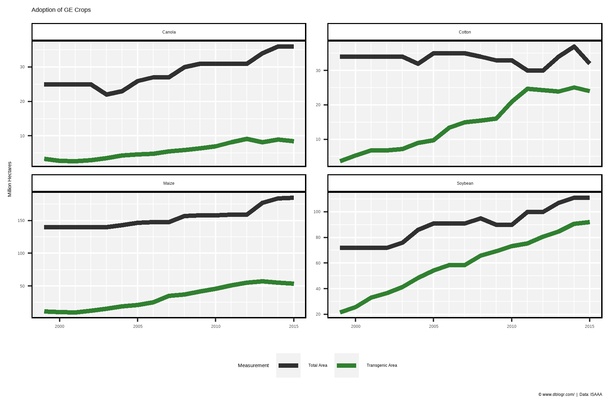

---

## Top Countries

```{r}
# Prep Data
colors <- c("darkblue", "antiquewhite4", "darkslategrey", "darkgreen" , 
            "darkgoldenrod2", "darkred", "darkorchid1")
xx<- agData_ISAAA_Country %>% filter(Measurement == "Area")
yy <- xx %>% filter(Value > 3000000) %>% pull(Area) %>% unique()
xx <- xx %>% filter(Area %in% yy) %>%
  arrange(desc(Value)) %>%
  mutate(Area = factor(Area, levels = unique(.$Area)),
         Value = Value / 1000000)
xE <- xx %>% top_n(1, Year) %>% pull(Value)
# Plot
mp <- ggplot(xx, aes(x = Year, y = Value, color = Area)) + 
  geom_line(size = 1.5, alpha = 0.8) + 
  scale_color_manual(values = colors) +
  scale_y_continuous(breaks = seq(0, 80, by = 10), 
                     sec.axis = sec_axis(~ ., breaks = xE[c(1:4,6)])) +
  scale_x_continuous(breaks = c(1996, 2000, 2005, 2010, 2015),
                     minor_breaks = seq(1996, 2020, by = 1)) +
  coord_cartesian(xlim = c(min(xx$Year)+0.5, max(xx$Year)-0.9)) +
  theme_agData() +
  labs(title = "Area of GE Crops", y = "Million Hectares", x = NULL,
       caption = "\xa9 www.dblogr.com/  |  Data: ISAAA")
ggsave("ge_crops_world_11.png", mp, width = 6, height = 4)
```

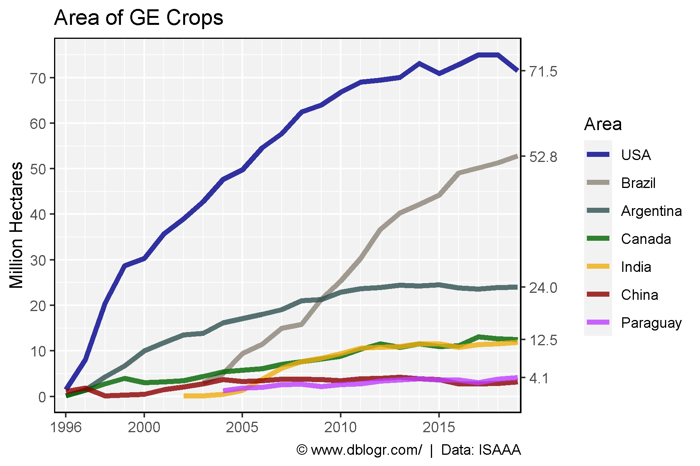

---

## All Countries  

```{r}
# Prep Data
xx<- agData_ISAAA_Country %>%
  filter(Measurement == "Area") %>%
  arrange(desc(Value)) %>%
  mutate(Area = factor(Area, levels = unique(.$Area)))
# Plot
mp <- ggplot(xx, aes(x = Year, y = Value / 1000000)) + 
  geom_bar(stat = "identity", fill = "darkgreen", alpha = 0.6, color = "black") +
  facet_wrap(Area ~ ., scales = "free_y", ncol = 10) +
  theme_agData() +
  theme(axis.text.x = element_text(angle = 90, hjust = 1, vjust = 0.5)) +
  labs(title = "Area of GE Crop by Country", y = "Million Hectares", x = NULL,
       caption = "\xa9 www.dblogr.com/  |  Data: ISAAA")
ggsave("ge_crops_world_12.png", mp, width = 20, height = 8)
```

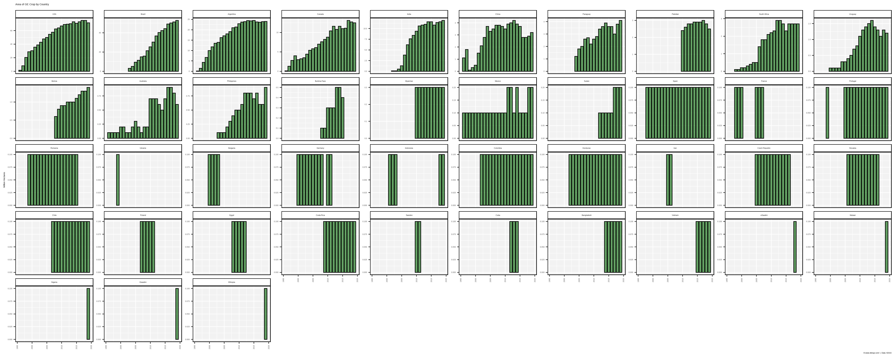

---

# Value of GE Seed

```{r}
# Plot 
mp <- ggplot(agData_ISAAA_Value, aes(x = Year, y = Value)) +
  geom_bar(stat = "identity", alpha = 0.25, fill = "darkgreen") +
  geom_line(color = "darkgreen", size = 1.5) +
  scale_x_continuous(breaks = c(1996, 2000, 2005, 2010, 2015),
                     minor_breaks = seq(1996, 2020, by = 1)) +
  theme_agData() +
  labs(title = "Value of GE Seed", y = "Billion USD", x = NULL,
       caption = "\xa9 www.dblogr.com/  |  Data: ISAAA")
ggsave("ge_crops_world_13.png", mp, width = 6, height = 4)
```

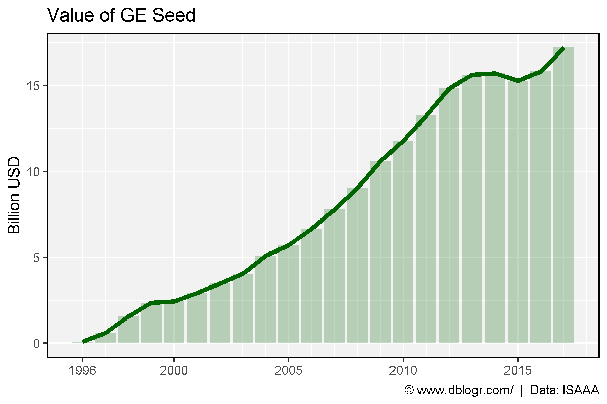

---

```{r eval = F, echo = F}
# Regulations of New Breeding Technologies
# under construction...
# Prep data
xx <- agData_NBT_Limits %>% 
  mutate(Limiting.Factor = as.character(Limiting.Factor),
         PercentLabel = paste(Percent, "%"))
xx$Limiting.Factor[9] <- "Inadequate infrastructure"
xx <- xx %>% 
  mutate(Limiting.Factor = factor(Limiting.Factor, levels = rev(Limiting.Factor)))
# Plot
mp <- ggplot(xx, aes(x = Limiting.Factor, y = Percent, label = PercentLabel)) + 
  geom_bar(stat = "identity", alpha = 0.8, color = "black", fill = "darkred") + 
  geom_text(color = "white", nudge_y = -1.5) + 
  theme_agData() + 
  coord_flip() +
  labs(title = "Regulatory Barriers for NBTs", x = NULL,
       caption = "\xa9 www.dblogr.com/  |  Data: ?") 
ggsave("ge_crops_world_14.png", mp, width = 6, height = 4)
```

```{r echo = F, eval = F}
xx <- agData_ISAAA_CropPercent %>% filter(Crop == "Others")
ggplot(xx, aes(x = Year, y = Value, color = Crop)) +
  geom_line(size = 2) +
  facet_grid(.~) +
  theme_agData() +
  scale_color_manual(values = agData_Colors)
```

&copy; Derek Michael Wright [www.dblogr.com/](https://dblogr.com/)