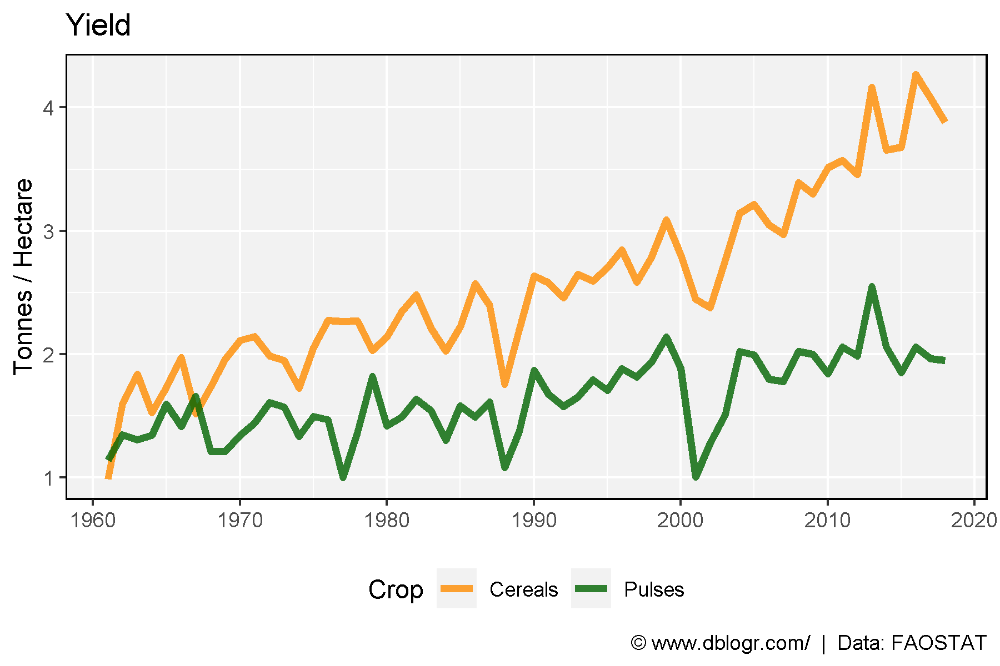
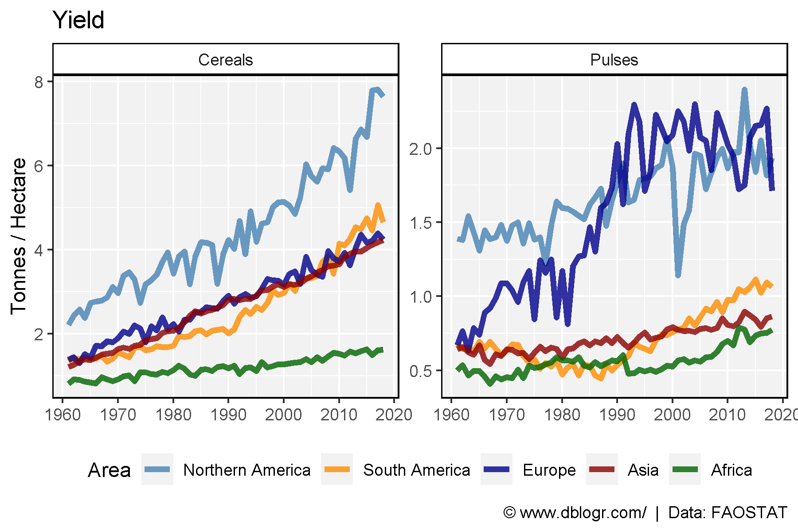

```{r setup, include = FALSE}
knitr::opts_chunk$set(echo = T, message = F, warning = F)
```

---

```{r}
# devtools::install_github("derekmichaelwright/agData")
library(agData) # Loads: tidyverse, ggpubr, ggbeeswarm, ggrepel
```

---

# Prepare data

```{r}
# Prep data
dd <- agData_FAO_Crops2 %>% 
  filter(Crop %in% c("Pulses", "Cereals"),
         Measurement == "Yield")
```

---

# World

```{r}
# Prep data
xx <- dd %>% filter(Area == "Canada")
# Plot
mp <- ggplot(xx, aes(x = Year, y = Value, color = Crop)) +
  geom_line(size = 1.5, alpha = 0.8) +
  scale_color_manual(values = c("darkorange", "darkgreen")) +
  scale_x_continuous(breaks = seq(1960, 2020, 10)) +
  theme_agData(legend.position = "bottom") +
  labs(title = "Yield", y = "Tonnes / Hectare", x = NULL,
       caption = "\xa9 www.dblogr.com/  |  Data: FAOSTAT")
ggsave("grains_yields_01.png", mp, width = 6, height = 4)
```



---

```{r}
# Prep data
colors <- c("steelblue", "darkorange", "darkblue", "darkred", "darkgreen")
areas <- c("Northern America", "South America", "Europe", "Asia", "Africa")
xx <- dd %>% filter(Area %in% areas) %>%
  mutate(Area = factor(Area, levels = areas))
# Plot
mp <- ggplot(xx, aes(x = Year, y = Value, color = Area)) +
  geom_line(size = 1.5, alpha = 0.8) +
  facet_wrap(Crop ~ ., ncol = 2, scales = "free_y") +
  scale_color_manual(values = colors) +
  scale_x_continuous(breaks = seq(1960, 2020, 10)) +
  theme_agData(legend.position = "bottom") +
  labs(title = "Yield", y = "Tonnes / Hectare", x = NULL,
       caption = "\xa9 www.dblogr.com/  |  Data: FAOSTAT")
ggsave("grains_yields_02.png", mp, width = 6, height = 4)
```

```{r echo = F}
ggsave("featured.png", mp, width = 6, height = 4)
```



---

&copy; Derek Michael Wright [www.dblogr.com/](https://dblogr.com/)