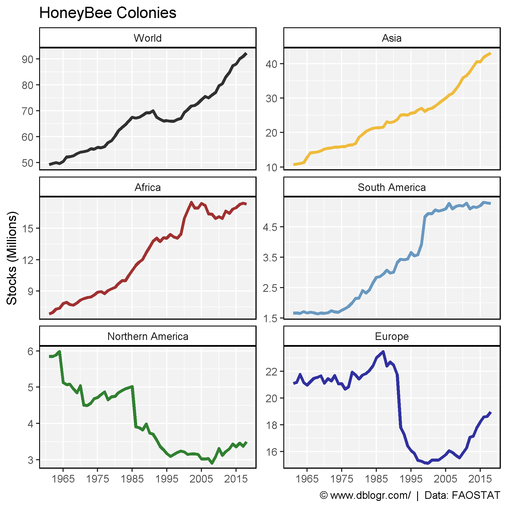
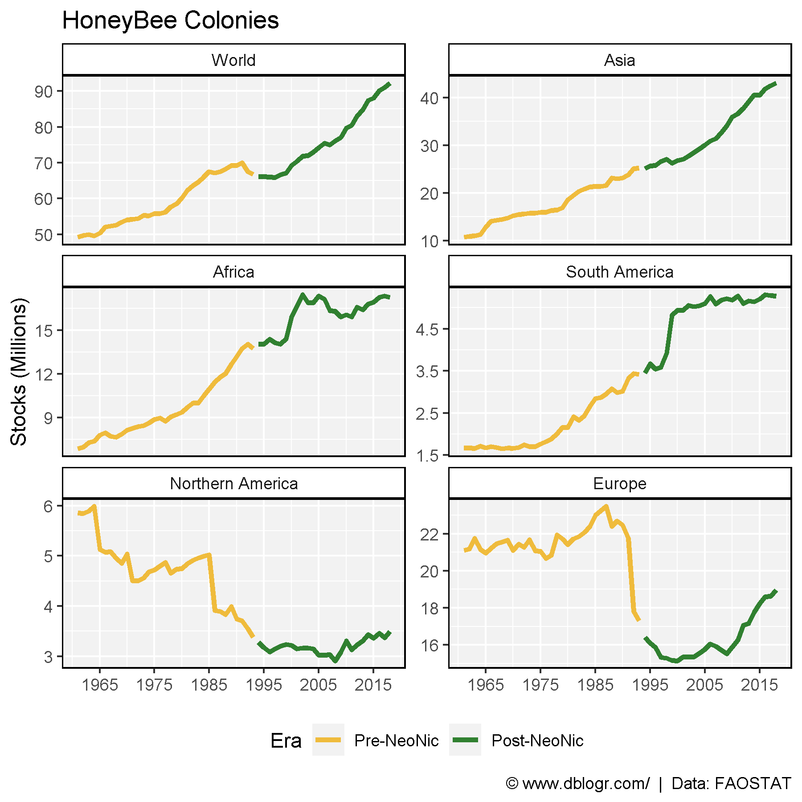
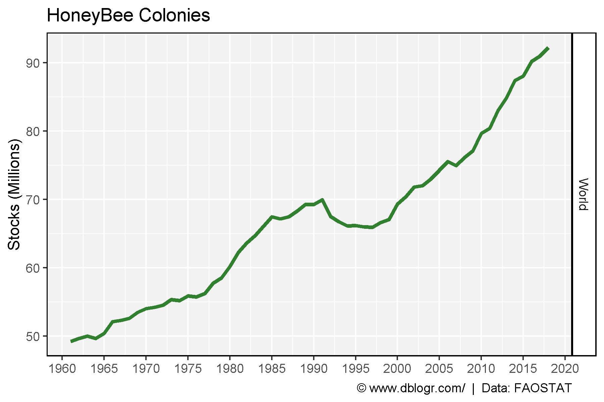

```{r setup, include = FALSE}
knitr::opts_chunk$set(echo = T, message = F, warning = F)
```

---

```{r}
# devtools::install_github("derekmichaelwright/agData")
library(agData) # Loads: tidyverse, ggpubr, ggbeeswarm, ggrepel
```

---

# Regions

```{r}
# Prep data
areas <- c("World", "Asia", "Africa", "South America", "Northern America", "Europe")
colors <- c("black", "darkgoldenrod2", "darkred", "steelblue", "darkgreen", "darkblue")
xx <- agData_FAO_Livestock %>% 
  filter(Animal == "Beehives") %>%
  mutate(Era = ifelse(Year >= 1994, "Post-NeoNic", "Pre-NeoNic"),
         Era = factor(Era, levels = c("Pre-NeoNic", "Post-NeoNic") ) ) %>%
  filter(Area %in% areas) %>% 
  mutate(Area = factor(Area, levels = areas))
```

```{r}
# Plot
mp <- ggplot(xx, aes(x = Year, y = Value / 1000000)) + 
  geom_line(aes(color = Area), size = 1.25, alpha = 0.8) +
  facet_wrap(Area ~ ., scales = "free_y", ncol = 2) +
  scale_x_continuous(breaks = seq(1965, 2015, by = 10)) + 
  scale_color_manual(values = colors) +
  theme_agData(legend.position = "none") +
  labs(title = "HoneyBee Colonies", y = "Stocks (Millions)", x = NULL,
       caption = "\xa9 www.dblogr.com/  |  Data: FAOSTAT")
ggsave("honeybee_01.png", mp, width = 6, height = 6)
```

```{r echo = F}
ggsave("featured.png", mp, width = 6, height = 6)
```



---

```{r}
# Plot
mp <- ggplot(xx, aes(x = Year, y = Value / 1000000)) + 
  geom_line(aes(color = Era), size = 1.25, alpha = 0.8) +
  facet_wrap(Area ~ ., scales = "free_y", ncol = 2) + 
  theme_agData(legend.position = "bottom") +
  scale_color_manual(values = c("darkgoldenrod2", "Dark Green")) +
  scale_x_continuous(breaks = seq(1965, 2015, by = 10)) + 
  labs(title = "HoneyBee Colonies", y = "Stocks (Millions)", x = NULL,
       caption = "\xa9 www.dblogr.com/  |  Data: FAOSTAT")
ggsave("honeybee_02.png", mp, width = 6, height = 6)
```



---

# Global Colonies

```{r}
# Prep data
xw <- xx %>% filter(Area == "World")
# Plot
mp <- ggplot(data = xw, aes(x = Year, y = Value / 1000000)) + 
  geom_line(size = 1.25, alpha = 0.8, color = "darkgreen") +
  facet_grid(Area ~ ., scales = "free_y", labeller = label_wrap_gen(width = 10)) + 
  scale_x_continuous(breaks = seq(1960, 2020, by = 5)) + 
  theme_agData() +
  labs(title = "HoneyBee Colonies", y = "Stocks (Millions)", x = NULL,
       caption = "\xa9 www.dblogr.com/  |  Data: FAOSTAT")
ggsave("honeybee_03.png", mp, width = 6, height = 4)
```



---

&copy; Derek Michael Wright [www.dblogr.com/](https://dblogr.com/)