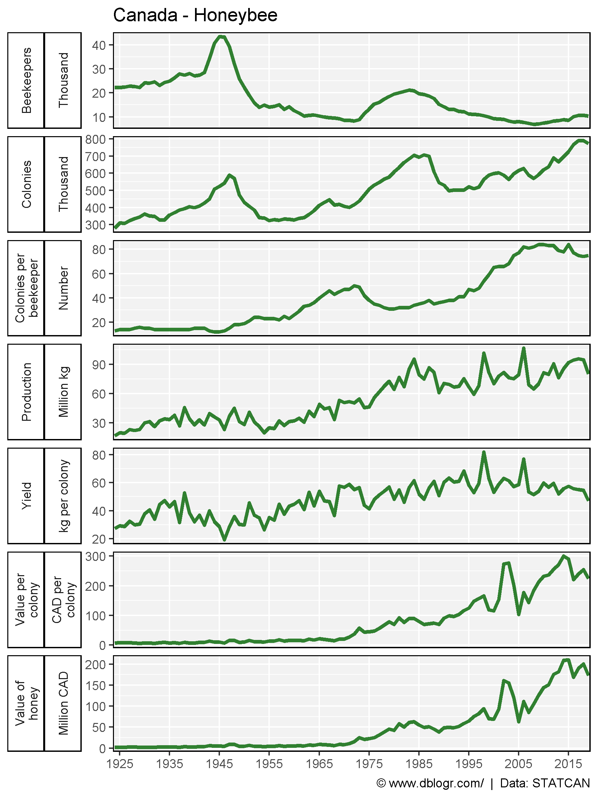
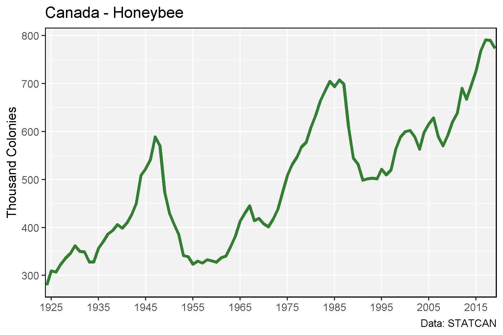
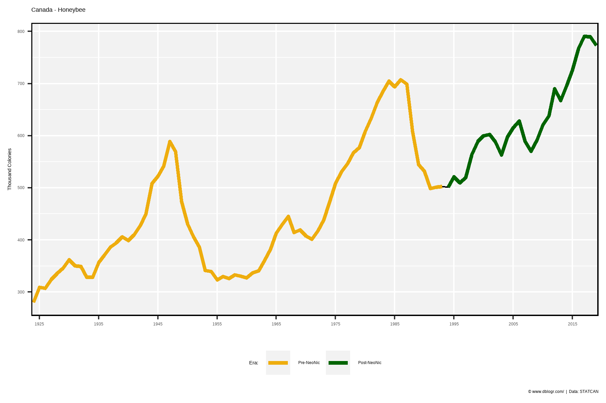
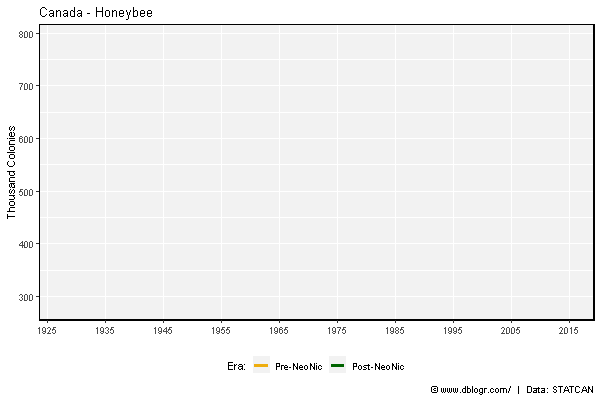
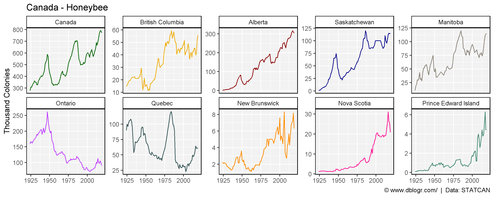
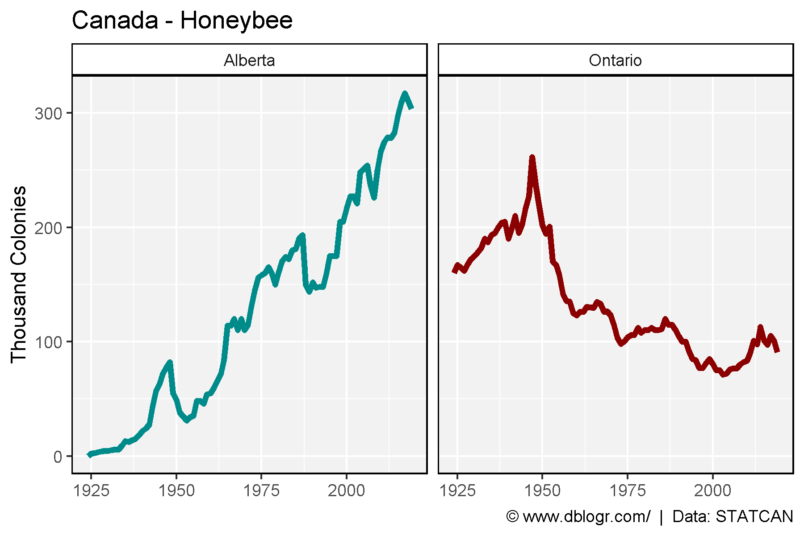
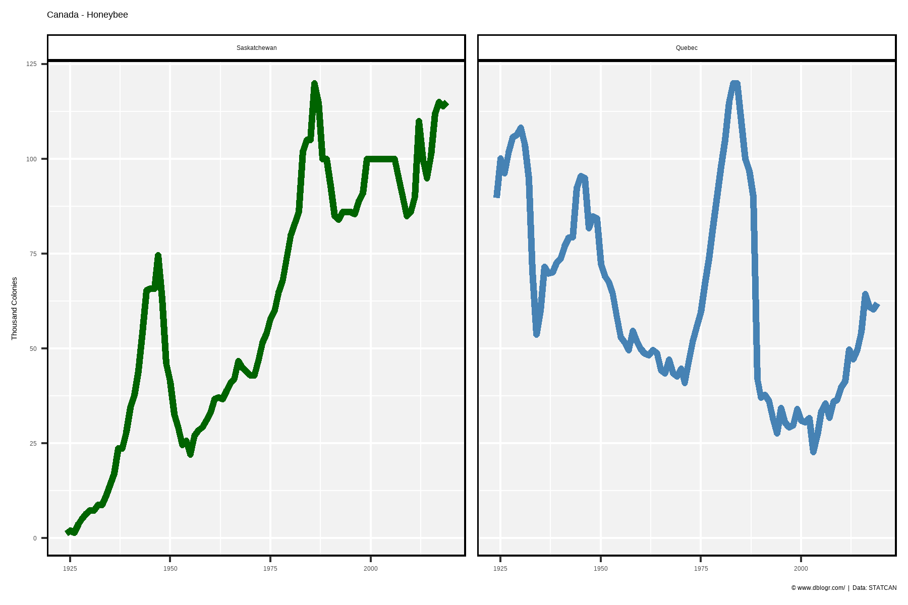

```{r setup, include = FALSE}
knitr::opts_chunk$set(echo = T, message = F, warning = F)
```

---

```{r}
# devtools::install_github("derekmichaelwright/agData")
library(agData) # Loads: tidyverse, ggpubr, ggbeeswarm, ggrepel
library(gganimate)
```

---

# All Data

```{r}
# Prep data
xx <- agData_STATCAN_Beehives %>%
  filter(Area == "Canada", Measurement != "Value of honey and wax") %>%
  mutate(Era   = ifelse(Year >= 1994, "Post-NeoNic", "Pre-NeoNic"),
         Era   = factor(Era, levels = c("Pre-NeoNic", "Post-NeoNic")))
# Plot
mp <- ggplot(xx, aes(x = Year, y = Value)) + 
  geom_line(size = 1.25, color = "darkgreen", alpha = 0.8) + 
  facet_grid(Measurement + Unit ~ ., scales = "free", switch = "y",
             labeller = label_wrap_gen(width = 14, multi_line = TRUE)) +
  scale_x_continuous(breaks = seq(1925, 2020, 10), minor_breaks = NULL) + 
  coord_cartesian(xlim = c(min(xx$Year)+4, max(xx$Year)-4)) +
  theme_agData(strip.placement = "outside", legend.position = "bottom") + 
  labs(title = "Canada - Honeybee", y = NULL, x = NULL,
       caption = "\xa9 www.dblogr.com/  |  Data: STATCAN")
ggsave("honeybee_canada_01.png", mp, width = 6, height = 8)
```

```{r echo = F}
ggsave("featured.png", mp, width = 6, height = 8)
```



---

# Colonies

```{r}
# Plot
mp <- ggplot(xx %>% filter(Measurement == "Colonies"), aes(x = Year, y = Value)) + 
  geom_line(size = 1.25, color = "darkgreen", alpha = 0.8) + 
  scale_colour_manual(name = "Era:", values = c("darkgoldenrod2", "Dark Green")) +
  scale_x_continuous(breaks = seq(1925, 2020, 10), minor_breaks = NULL) + 
  coord_cartesian(xlim = c(min(xx$Year)+4, max(xx$Year)-4)) +
  theme_agData(strip.placement = "outside", legend.position = "bottom") + 
  labs(title = "Canada - Honeybee", y = "Thousand Colonies", x = NULL,
       caption = "\xa9 www.dblogr.com/  |  Data: STATCAN" )
ggsave("honeybee_canada_02.png", mp, width = 6, height = 4)
```



---

```{r}
# Plot
mp <- ggplot(xx %>% filter(Measurement == "Colonies"), aes(x = Year, y = Value)) + 
  geom_line() + 
  geom_line(aes(color = Era), size = 1.25) +
  scale_colour_manual(name = "Era:", values = c("darkgoldenrod2", "Dark Green")) +
  scale_x_continuous(breaks = seq(1925, 2020, 10), minor_breaks = NULL) + 
  coord_cartesian(xlim = c(min(xx$Year)+4, max(xx$Year)-4)) +
  theme_agData(strip.placement = "outside", legend.position = "bottom") + 
  labs(title = "Canada - Honeybee", y = "Thousand Colonies", x = NULL,
       caption = "\xa9 www.dblogr.com/  |  Data: STATCAN" )
ggsave("honeybee_canada_03.png", mp, width = 6, height = 4)
```



---

```{r}
# Plot
mp <- mp +
  # gganimate
  transition_reveal(Year) +
  ease_aes('linear')
anim_save("honeybee_canada_gifs_01.gif", mp, width = 600, height = 400)
```



---

# Provinces

```{r}
# Prep data
xx <- agData_STATCAN_Beehives %>%
  filter(Measurement == "Colonies")
# Plot
mp <- ggplot(xx, aes(x = Year, y = Value, color = Area)) +
  geom_line() +
  facet_wrap(Area ~ ., scales= "free_y", ncol = 5) +
  scale_color_manual(values = agData_Colors) +
  theme_agData(legend.position = "none") +
  labs(title = "Canada - Honeybee", y = "Thousand Colonies", x = NULL,
       caption = "\xa9 www.dblogr.com/  |  Data: STATCAN" )
ggsave("honeybee_canada_04.png", mp, width = 10, height = 4)
```



---

# Alberta vs. Ontario

```{r}
# Prep data
xx <- agData_STATCAN_Beehives %>%
  filter(Measurement == "Colonies", 
         Area %in% c("Alberta","Ontario"))
# Plot
mp <- ggplot(xx, aes(x = Year, y = Value, color = Area)) +
  geom_line(size = 1.5) +
  facet_wrap(Area ~ ., ncol = 5) +
  scale_color_manual(values = c("darkcyan", "darkred")) +
  theme_agData(legend.position = "none") +
  labs(title = "Canada - Honeybee", y = "Thousand Colonies", x = NULL,
       caption = "\xa9 www.dblogr.com/  |  Data: STATCAN" )
ggsave("honeybee_canada_05.png", mp, width = 6, height = 4)
```



# Saskatchewan vs. Quebec

```{r}
# Prep data
xx <- agData_STATCAN_Beehives %>%
  filter(Measurement == "Colonies", 
         Area %in% c("Saskatchewan", "Quebec"))
# Plot
mp <- ggplot(xx, aes(x = Year, y = Value, color = Area)) +
  geom_line(size = 1.5) +
  facet_wrap(Area ~ ., ncol = 5) +
  scale_color_manual(values = c("darkgreen", "steelblue")) +
  theme_agData(legend.position = "none") +
  labs(title = "Canada - Honeybee", y = "Thousand Colonies", x = NULL,
       caption = "\xa9 www.dblogr.com/  |  Data: STATCAN" )
ggsave("honeybee_canada_06.png", mp, width = 6, height = 4)
```



---

&copy; Derek Michael Wright [www.dblogr.com/](https://dblogr.com/)