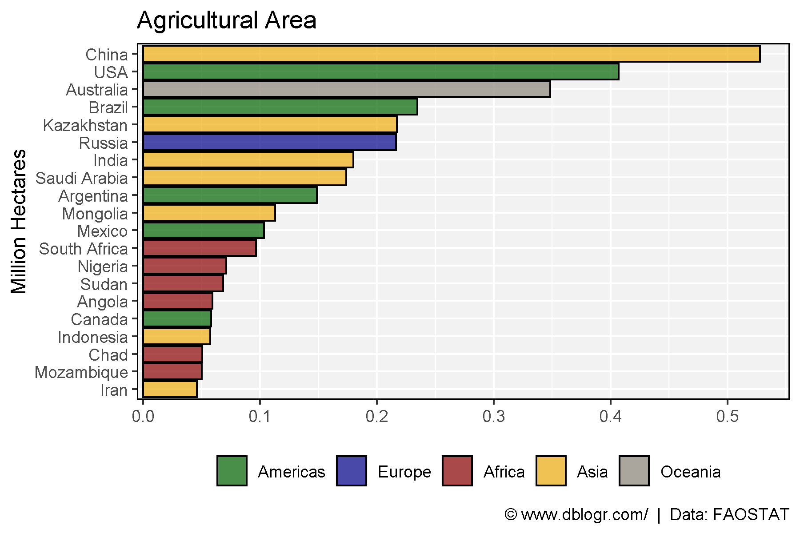
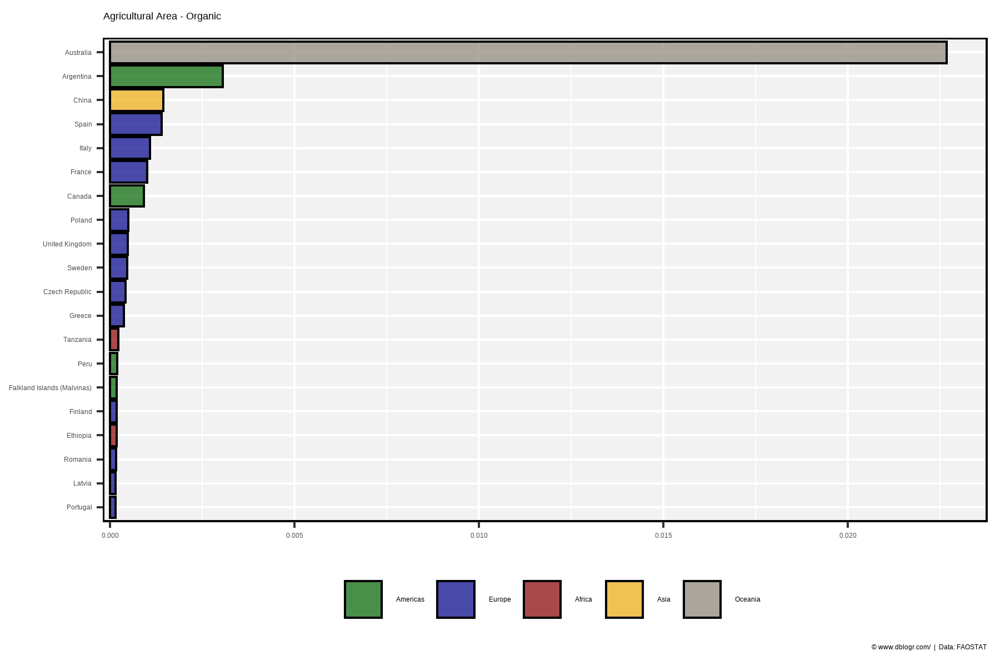
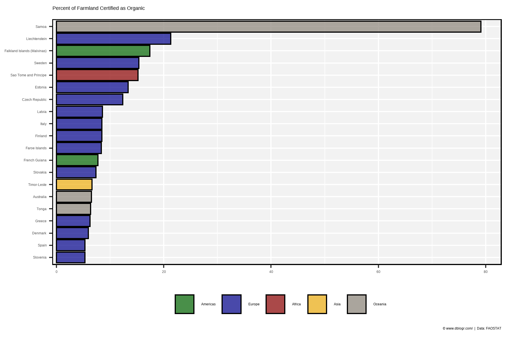
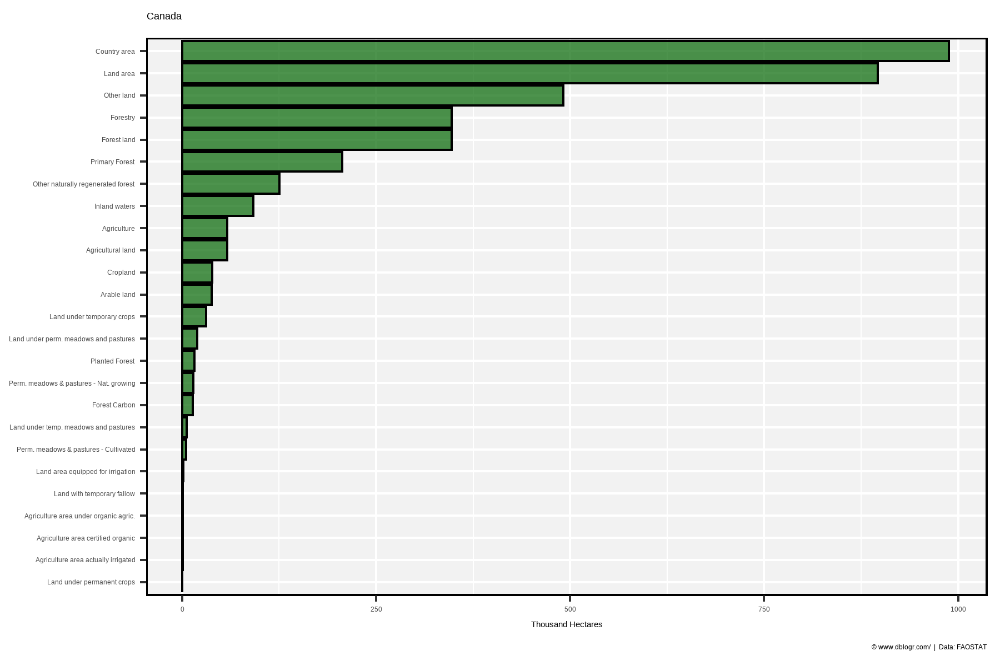

```{r setup, include = FALSE}
knitr::opts_chunk$set(echo = T, warning = F, message = F)
```

---

```{r}
# devtools::install_github("derekmichaelwright/agData")
library(agData) # Loads: tidyverse, ggpubr, ggbeeswarm, ggrepel
```

---

# Agricultural Area

```{r}
# Prep Data
colors <- c("darkgreen", "darkblue", "darkred", "darkgoldenrod2", "antiquewhite4")
xx <- agData_FAO_LandUse %>% 
  filter(Item == "Agricultural land",
         Year == 2015) %>%
  region_Info() %>%
  filter(Area %in% agData_FAO_Country_Table$Country) %>%
  arrange(desc(Value)) %>%
  slice(1:20) %>%
  mutate(Area = factor(Area, levels = unique(Area)))
# Plot Data
mp <- ggplot(xx, aes(x = Area, y = Value / 1000000, fill = Region)) + 
  geom_bar(stat = "identity", color = "black", alpha = 0.7) +
  scale_fill_manual(name = NULL, values = colors) +
  scale_x_discrete(limits = rev(levels(xx$Area))) +
  theme_agData(legend.position = "bottom") + 
  coord_flip(ylim = c(0.02, max(xx$Value) / 1000000)) +
  labs(title = "Agricultural Area",
       caption = "\xa9 www.dblogr.com/  |  Data: FAOSTAT",
       y = NULL, x = "Million Hectares")
ggsave("land_use_01.png", mp, width = 6, height = 4)
```

```{r echo = F}
ggsave("featured.png", mp, width = 6, height = 4)
```



---

# Organic Area

```{r}
# Prep Data
colors <- c("darkgreen", "darkblue", "darkred", "darkgoldenrod2", "antiquewhite4")
xx <- agData_FAO_LandUse %>% 
  filter(Item == "Agriculture area certified organic",
         Year == 2015) %>%
  region_Info() %>%
  filter(Area %in% agData_FAO_Country_Table$Country) %>%
  arrange(desc(Value)) %>%
  slice(1:20) %>%
  mutate(Area = factor(Area, levels = unique(Area)))
# Plot Data
mp <- ggplot(xx, aes(x = Area, y = Value / 1000000, fill = Region)) + 
  geom_bar(stat = "identity", color = "black", alpha = 0.7) +
  scale_fill_manual(name = NULL, values = colors) +
  scale_x_discrete(limits = rev(levels(xx$Area))) +
  theme_agData(legend.position = "bottom") +
  coord_flip(ylim = c(0.0009, max(xx$Value) / 1000000)) +
  labs(title = "Agricultural Area - Organic",
       caption = "\xa9 www.dblogr.com/  |  Data: FAOSTAT",
       y = NULL, x = NULL)
ggsave("land_use_02.png", mp, width = 6, height = 4)
```



---

# Organic Percent

```{r}
# Prep Data
colors <- c("darkgreen", "darkblue", "darkred", "darkgoldenrod2", "antiquewhite4")
xx <- agData_FAO_LandUse %>% 
  filter(Item %in% c("Agriculture area certified organic", "Agricultural land"),
         Year == 2015) %>%
  select(-Measurement, -Unit) %>%
  spread(Item, Value) %>%
  mutate(Value = 100 * `Agriculture area certified organic` / `Agricultural land`) %>%
  region_Info() %>%
  filter(Area %in% agData_FAO_Country_Table$Country) %>%
  arrange(desc(Value)) %>%
  slice(1:20) %>%
  mutate(Area = factor(Area, levels = unique(Area)))
# Plot Data
mp <- ggplot(xx, aes(x = Area, y = Value, fill = Region)) + 
  geom_bar(stat = "identity", color = "black", alpha = 0.7) +
  scale_fill_manual(name = NULL, values = colors) +
  scale_x_discrete(limits = rev(levels(xx$Area))) +
  theme_agData(legend.position = "bottom") +
  coord_flip(ylim = c(3, max(xx$Value))) +
  labs(title = "Percent of Farmland Certified as Organic",
       caption = "\xa9 www.dblogr.com/  |  Data: FAOSTAT",
       y = NULL, x = NULL)
ggsave("land_use_03.png", mp, width = 6, height = 4)
```



---

# Canada

```{r}
# Prep Data
xx <- agData_FAO_LandUse %>% 
  filter(Area == "Canada", Year == 2015) %>%
  arrange(desc(Value)) %>%
  mutate(Item = factor(Item, levels = unique(Item)))
# Plot Data
mp <- ggplot(xx, aes(x = Item, y = Value / 1000)) + 
  geom_bar(stat = "identity", color = "black", 
           fill = "darkgreen", alpha = 0.7) +
  scale_x_discrete(limits = rev(levels(xx$Item))) +
  theme_agData(legend.position = "none") + 
  coord_flip(ylim = c(3, max(xx$Value) / 1000)) +
  labs(title = "Canada",
       caption = "\xa9 www.dblogr.com/  |  Data: FAOSTAT",
       y = "Thousand Hectares", x = NULL)
ggsave("land_use_04.png", mp, width = 6, height = 4)
```



---

&copy; Derek Michael Wright [www.dblogr.com/](https://dblogr.com/)