```{r setup, include = FALSE}
knitr::opts_chunk$set(echo = T, message = F, warning = F)
```

---

```{r}
# devtools::install_github("derekmichaelwright/agData")
library(agData) # Loads: tidyverse, ggpubr, ggbeeswarm, ggrepel
library(gganimate)
```

---

# All Data - PDF

```{r}
# Prep data
colors <- c("darkgreen", "darkred", "darkgoldenrod2")
areas <- c("World",
  levels(agData_FAO_Country_Table$Region),
  levels(agData_FAO_Country_Table$SubRegion),
  levels(agData_FAO_Country_Table$Country))
xx <- agData_FAO_Crops %>% 
  filter(Crop == "Lentils") %>%
  mutate(Value = ifelse(Measurement %in% c("Area harvested","Production"),
                        Value / 1000000, Value),
         Unit = plyr::mapvalues(Unit, c("hectares","tonnes"), 
                        c("Million hectares","Million tonnes")))
areas <- areas[areas %in% xx$Area]
# Plot
pdf("lentil_fao.pdf", width = 12, height = 4)
for(i in areas) {
  print(ggplot(xx %>% filter(Area == i)) +
    geom_line(aes(x = Year, y = Value, color = Measurement),
              size = 1.5, alpha = 0.8) +
    facet_wrap(. ~ Measurement + Unit, ncol = 3, scales = "free_y") +
    theme_agData(legend.position = "none", rotx = T) +
    scale_color_manual(values = colors) +
    scale_x_continuous(breaks = seq(1960, 2020, by = 5) ) +
    labs(title = i, y = NULL, x = NULL,
         caption = "\xa9 www.dblogr.com/  |  Data: FAOSTAT") )
}
dev.off()
```

**PDF**: [lentil_fao.pdf](https://github.com/derekmichaelwright/dblogr/blob/master/content/agdata/lentil/lentil_fao.pdf)

---

# Production

```{r}
# Prep data
areas <- c("Canada", "Southern Asia", "USA", "Turkey", "Europe", "Africa",  "Oceania")
colors <- c("darkgreen", "darkgoldenrod2", "darkblue", "darkslategrey", 
            "antiquewhite4", "darkred", "darkorchid1")
xx <- agData_FAO_Crops %>% 
  filter(Area %in% areas, Crop == "Lentils", Measurement == "Production") %>%
  mutate(Area = factor(Area, levels = areas) )
# Plot
mp <- ggplot(xx, aes(x = Year, y = Value / 1000000, color = Area)) + 
  geom_line(size = 1.5, alpha = 0.8) + 
  scale_color_manual(name = NULL, values = colors) +
  scale_x_continuous(breaks = seq(1960, 2020, 5), minor_breaks = NULL) +
  coord_cartesian(xlim = c(min(xx$Year)+1, max(xx$Year)-2)) +
  theme_agData(legend.position = "bottom") +
  guides(color = guide_legend(nrow = 1)) +
  labs(title = "Lentil Production", y = "Million Tonnes", x = NULL,
       caption = "\xa9 www.dblogr.com/  |  Data: FAOSTAT")
ggsave("lentil_01.png", width = 7, height = 4)
```

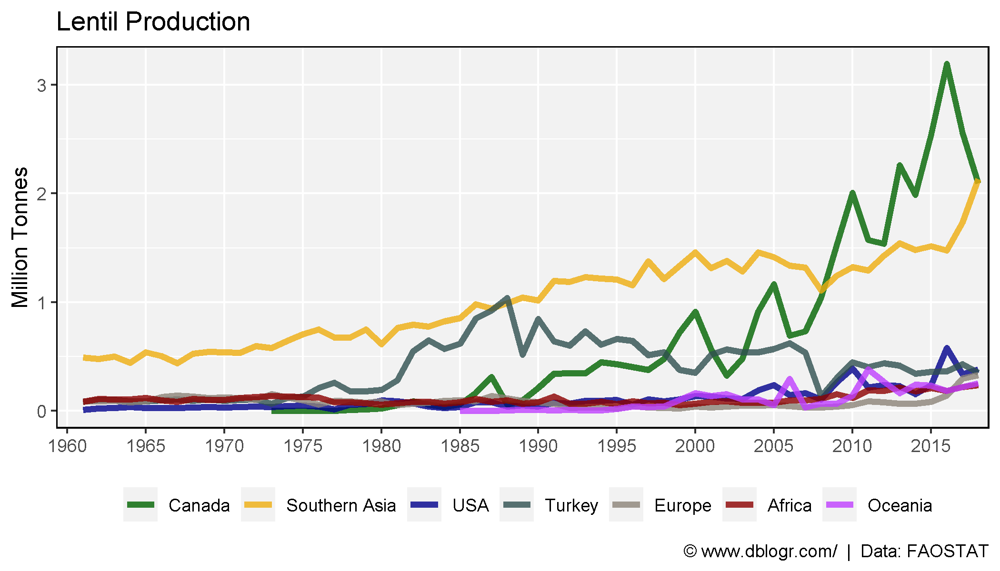

---

```{r}
# Prep data
colors <- c("darkgreen", "darkblue", "darkgoldenrod2", "darkslategrey")
xx <- agData_FAO_Crops %>% region_Info() %>%
  filter(Area %in% agData_FAO_Country_Table$Country,
         Year == max(Year), Crop == "Lentils", Measurement == "Production") %>%
  arrange(desc(Value)) %>% 
  slice(1:10) %>%
  mutate(Area = factor(Area, levels = Area) )
# Plot
mp <- ggplot(xx, aes(x = Area, y = Value / 1000000, fill = Region)) + 
  geom_bar(stat = "identity", color = "black", alpha = 0.8) +
  scale_fill_manual(values = colors) +
  theme_agData(rotx = T) +
  labs(title = paste("Top Lentil Producers for", max(xx$Year)), 
       y = "Million Tonnes", x = NULL,
       caption = "\xa9 www.dblogr.com/  |  Data: FAOSTAT")
ggsave("lentil_02.png", mp, width = 6, height = 4)
```

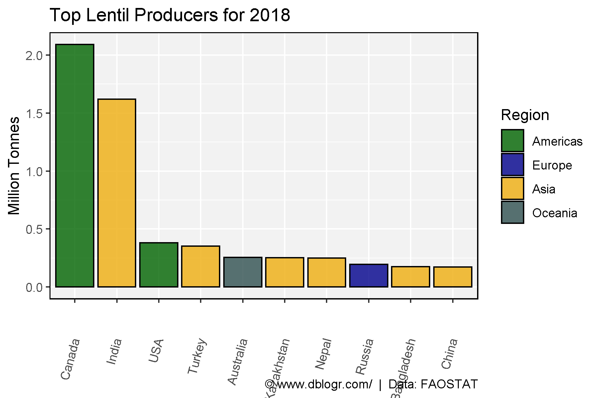

---

```{r}
# Prep data
colors <- c("darkgreen", "darkblue", "darkred", "darkgoldenrod2", "darkslategrey")
areas <- agData_FAO_Crops %>% region_Info() %>%
  filter(Area %in% agData_FAO_Country_Table$Country,
         Year == max(Year), Crop == "Lentils", Measurement == "Production") %>%
  arrange(desc(Value)) %>% 
  slice(1:10) %>% 
  pull(Area)
xx <- agData_FAO_Crops %>% region_Info() %>%
  filter(Area %in% agData_FAO_Country_Table$Country,
         Crop == "Lentils", Measurement == "Production") %>%
  arrange(desc(Value)) %>% 
  mutate(Area = factor(Area, levels = unique(.$Area)) )
# Plot
mp <- ggplot(xx, aes(x = Area, y = Value / 1000000, fill = Region)) + 
  geom_bar(stat = "identity", color = "black") +
  geom_text(aes(label = Year), x = 35, y = 3, size = 3) +
  scale_fill_manual(values = colors) +
  theme_agData(rotx = T) +
  labs(title = "Top Lentil Producers", y = "Million Tonnes", x = NULL,
       caption = "\xa9 www.dblogr.com/  |  Data: FAOSTAT") +
  # gganimate
  transition_states(Year)
anim_save("lentil_gifs_01.gif", mp, width = 600, height = 400)
```

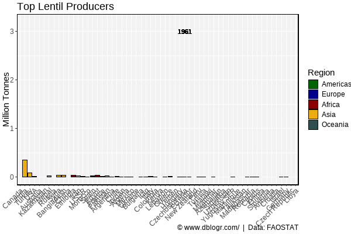

```{r echo = F, eval = F}
#library(barRacer) # devtools::install_github("jl5000/barRacer")
xx <- NULL
for(i in min(agData_FAO_Crops$Year):max(agData_FAO_Crops$Year)) {
  xi <- agData_FAO_Crops %>% 
    filter(Crop == "Lentils", Measurement == "Production",
           Year == i, Area %in% agData_FAO_Country_Table$Country) %>%
    arrange(desc(Value)) %>% 
    slice(1:10) %>% 
    region_Info()
  xx <- bind_rows(xx, xi) 
}
bar_chart_race(xx, Area, Value, Year)
```

---

# Yields

```{r}
# Prep data
colors <- c("darkgreen", "darkblue", "darkred", "antiquewhite4", 
            "darkgoldenrod2", "darkslategrey")
x1 <- agData_FAO_Crops %>% 
  filter(Crop == "Lentils", Measurement == "Area harvested", Year == max(Year),
         Area %in% agData_FAO_Country_Table$Country) %>%
    top_n(10, Value)
xx <- agData_FAO_Crops %>% 
  filter(Crop == "Lentils", Measurement == "Yield",
         Year > max(Year)-5, Area %in% x1$Area) %>% 
  group_by(Area) %>%
  summarise(Value = mean(Value)) %>% 
  region_Info() %>%
  arrange(desc(Value)) %>%
  mutate(Area = factor(Area, levels = Area))
# Plot
mp <- ggplot(xx, aes(x = Area, y = Value, fill = SubRegion)) + 
  geom_bar(stat = "identity", color = "black") + 
  scale_fill_manual(name = NULL, values = colors) +
  theme_agData(legend.position = "bottom", rotx = T) +
  labs(title = "Lentil Yields - 5 year average",
       y = "Tonnes / Hectare", x = NULL,
       caption = "\xa9 www.dblogr.com/  |  Data: FAOSTAT")
ggsave("lentil_03.png", mp, width = 6, height = 4)
```

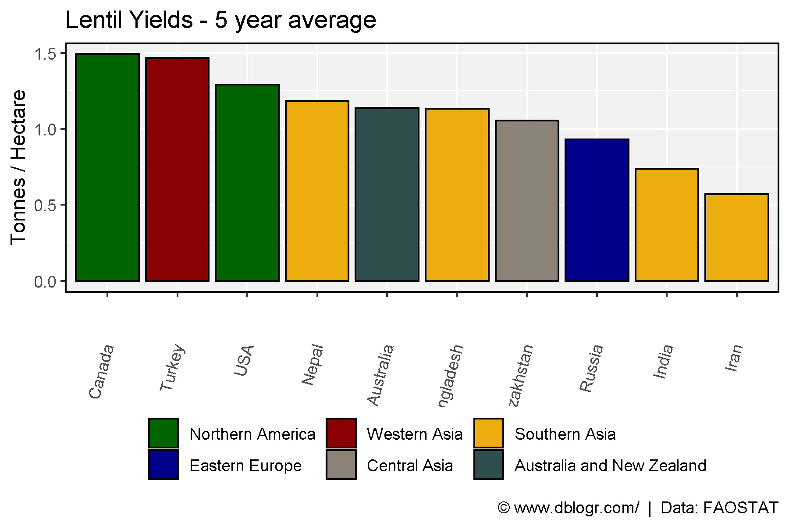

```{r}
# Prep data
areas <- c("Canada", "India", "Ethiopia", "Turkey")
colors <- c("darkgreen", "darkgoldenrod2", "darkred", "darkslategrey")
xx <- agData_FAO_Crops %>%
  filter(Crop == "Lentils", Area %in% areas, Measurement == "Yield") %>%
  mutate(Area = factor(Area, levels = areas))
# Plot
mp <- ggplot(xx, aes(x = Year, y = Value, color = Area)) +
  geom_line(alpha = 0.2) +
  geom_smooth(method = "loess", size = 1.5, se = F) +
  scale_x_continuous(breaks = seq(1960, 2020, by = 5), minor_breaks = NULL) +
  coord_cartesian(xlim = c(min(xx$Year)+1, max(xx$Year)-2)) +
  scale_color_manual(name = NULL, values = colors) +
  theme_agData(legend.position = "bottom") +
  labs(title = "Lentil Yields", y = "Tonnes / Hectare", x = NULL,
       caption = "\xa9 www.dblogr.com/  |  Data: FAOSTAT")
ggsave("lentil_04.png", mp, width = 6, height = 4)
```

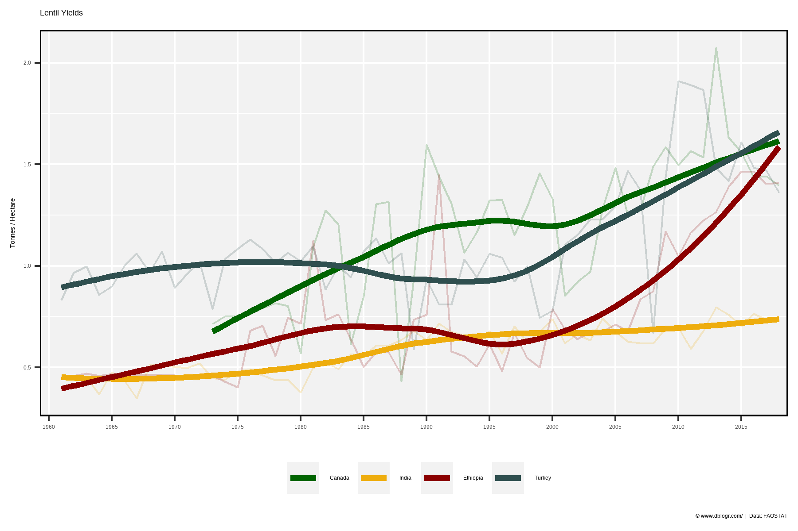

---

```{r}
# Prep data
areas <- c("World", "Canada", "India", "Nepal", "Bangladesh")
colors <- c("black", "darkgreen", "darkgoldenrod2", "darkred", "darkslategrey")
xx <- agData_FAO_Crops %>%
  filter(Crop == "Lentils", Area %in% areas, Measurement == "Yield") %>%
  mutate(Area = factor(Area, levels = areas))
# Plot
mp <- ggplot(xx, aes(x = Year, y = Value, color = Area)) +
  geom_line(alpha = 0.2) +
  geom_smooth(method = "loess", size = 1.5, se = F) +
  scale_x_continuous(breaks = seq(1960, 2020, by = 5), minor_breaks = NULL) +
  coord_cartesian(xlim = c(min(xx$Year)+1, max(xx$Year)-2)) +
  scale_color_manual(name = NULL, values = colors) +
  theme_agData(legend.position = "bottom") +
  labs(title = "Lentil Yields", y = "Tonnes / Hectare", x = NULL,
       caption = "\xa9 www.dblogr.com/  |  Data: FAOSTAT")
ggsave("lentil_05.png", mp, width = 6, height = 4)
```

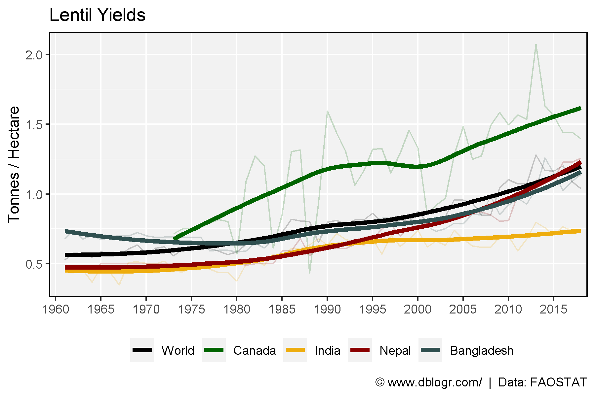

---

# Canada's Global Contribution

```{r}
# Prep data
xx <- agData_FAO_Crops %>% 
  filter(Crop == "Lentils", Measurement == "Production",
         Area %in% c("Canada", "World") ) %>%
  mutate(Area = factor(Area, levels = c("World", "Canada")))
# Plot
mp <- ggplot(xx, aes(x = Year, y = Value / 1000000, fill = Area, color = I("Black"))) +
  geom_area(position = "identity", alpha = 0.6) +
  theme(legend.position = "bottom") +
  scale_fill_manual(name = NULL, values = alpha(c("darkgreen", "darkred"), 0.6)) +
  scale_x_continuous(breaks = seq(1960, 2020, 5), minor_breaks = NULL)  +
  coord_cartesian(xlim = c(min(xx$Year)+1, max(xx$Year)-3)) +
  theme_agData() +
  labs(title   = "Canada's Contribution to Global Lentil Production", 
       y = "Million Tonnes", x = NULL,
       caption = "\xa9 www.dblogr.com/  |  Data: FAOSTAT")
ggsave("lentil_06.png", mp, width = 6, height = 4)
```

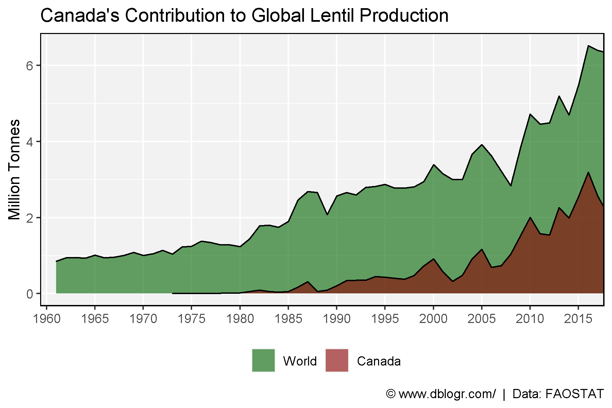

---

# Import/Export 

## Canada vs India

```{r}
# Prep data
xx <- agData_FAO_Trade %>%
  filter(Measurement %in% c("Import Quantity", "Export Quantity"),
         Crop == "Lentils", Area %in% c("Canada","India") )
# Plot
mp <- ggplot(xx, aes(x = Year, y = Value / 1000000, group = Measurement, 
                     color = Measurement)) + 
  geom_line(size = 1.25, alpha = 0.8) + 
  facet_grid(. ~ Area) +
  theme(legend.position = "bottom") +
  scale_color_manual(name = NULL, values = c("darkorange", "darkblue")) +
  scale_x_continuous(breaks       = seq(1965, 2015, by = 10),
                     minor_breaks = seq(1965, 2015, by = 5))  +
  theme_agData() +
  labs(title = "Lentil Import/Export", y = "Million Tonnes", x = NULL,
       caption = "Data: \xa9 www.dblogr.com/  |  FAOSTAT")
ggsave("lentil_07.png", mp, width = 6, height = 4)
```

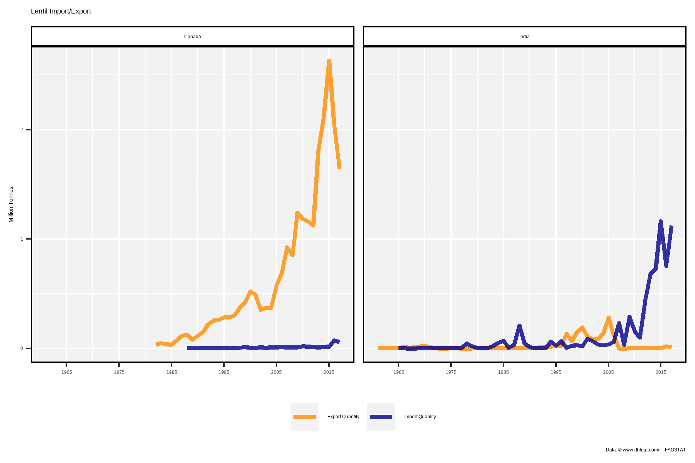

---

## Regions

```{r}
# Prep data
xx <- agData_FAO_Trade %>%
  region_Info() %>%
  filter(Measurement %in% c("Import Quantity", "Export Quantity"),
         Crop == "Lentils", Area %in% agData_FAO_Country_Table$Region)
# Plot
mp <- ggplot(xx, aes(x = Year, y = Value / 1000000, group = Area, color = Area)) + 
  geom_line(size = 1, alpha = 0.8) + 
  facet_grid(. ~ Measurement) +
  scale_x_continuous(breaks       = seq(1965, 2015, by = 10),
                     minor_breaks = seq(1965, 2015, by = 5))  +
  scale_color_manual(name = NULL, values = agData_Colors) +
  theme_agData(legend.position = "bottom") + 
  labs(title = "Lentil Import/Export", y = "Million Tonnes", x = NULL,
       caption = "\xa9 www.dblogr.com/  |  Data: FAOSTAT")
ggsave("lentil_08.png", mp, width = 6, height = 4)
```

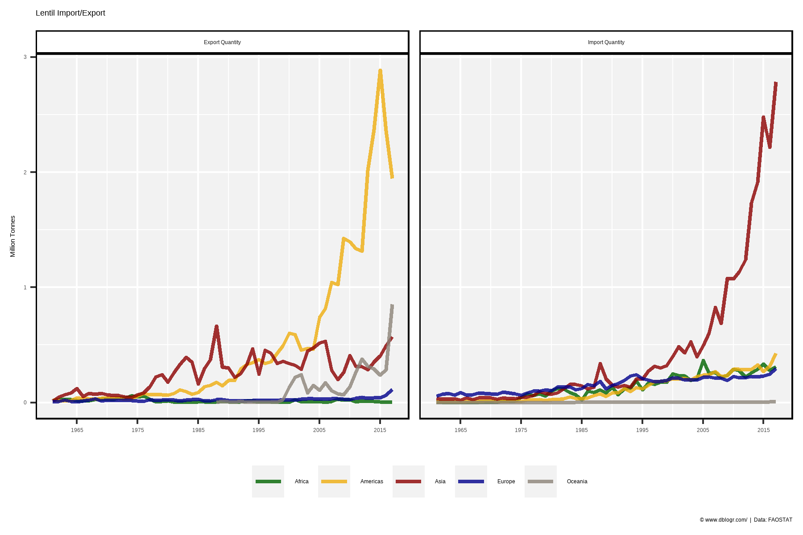

---

# Production Pie Charts

```{r}
blank_theme <- theme_minimal() +
    theme(
      axis.title   = element_blank(),
      axis.ticks.y = element_blank(),
      axis.text.y  = element_blank(),
      panel.border = element_blank(),
      panel.grid   = element_blank(),
      plot.title   = element_text(size = 14, face = "bold")
  )
# Plot function
ggPie <- function(crop, measurement = "Production", year = 2018, other = 0.01) {
  xx <- agData_FAO_Crops %>% region_Info() %>%
    filter(Crop == crop, Year == year, Measurement == measurement,
           Area %in% agData_FAO_Country_Table$Country)
  total <- agData_FAO_Crops %>% 
    filter(Area == "World", Year == year, Crop == crop, 
           Measurement == measurement) %>%
    pull(Value)
  limit <- total * other
  x1 <- xx %>% filter(Value > limit) %>% arrange(desc(Value))
  areas <- c(as.character(x1$Area), "Other")
  x2 <- xx %>% filter(Value < limit) %>% 
    group_by(Crop, Measurement, Unit, Year) %>%
    summarise(Value = sum(Value)) %>% ungroup() %>%
    mutate(Area = "Other")
  xx <- bind_rows(x2, x1 %>% arrange(Value)) %>%
    mutate(Percentage = round(100 * Value / total), 
           Cummulative_P = cumsum(Percentage),
           Label_y = Cummulative_P - (Percentage / 2),
           Area = factor(Area, levels = areas),
           ISO2 = ifelse(Area == "Other", "", ISO2))
  #
  ggplot(xx, aes(x = Crop, fill = Area)) +
    geom_bar(aes(y = Percentage), stat = "identity", color = "black") +
    coord_polar("y", start = 0) +
    geom_text(aes(label = Percentage, y = Label_y), color = "white", nudge_x = 0.3) +
    blank_theme +
    scale_y_continuous(breaks = xx$Label_y, labels = xx$ISO2) +
    scale_fill_manual(name = NULL, values = agData_Colors, 
                      labels = rev(paste0(xx$Area," (",xx$Percentage," %)"))) +
    labs(title = paste("Lentil |", year),
         caption = "\xa9 www.dblogr.com/  |  Data: FAOSTAT")
}
#
ggPie_anim <- function(crop, measurement = "Production", other = 0.01) {
  xx <- agData_FAO_Crops %>% region_Info() %>%
    filter(Crop == crop, Measurement == measurement,
           Area %in% agData_FAO_Country_Table$Country)
  total <- agData_FAO_Crops %>% 
    filter(Area == "World", Crop == crop, 
           Measurement == measurement) %>%
    pull(Value) %>% max()
  limit <- total * other
  x1 <- xx %>% filter(Value > limit) %>% arrange(desc(Value))
  areas <- c(as.character(unique(x1$Area)), "Other")
  x2 <- xx %>% filter(Value < limit) %>% 
    group_by(Crop, Measurement, Unit, Year) %>%
    summarise(Value = sum(Value)) %>% ungroup() %>%
    mutate(Area = "Other")
  xx <- bind_rows(x1, x2) %>%
    arrange(Value) %>%
    mutate(Area = factor(Area, levels = areas),
           ISO2 = ifelse(Area == "Other", "", ISO2))
  ggplot(xx, aes(x = Crop, fill = Area)) +
    geom_bar(aes(y = Value), stat = "identity", color = "black") +
    coord_polar("y", start = 0) +
    blank_theme +
    theme(axis.text = element_blank()) +
    #scale_y_continuous(aes(breaks = Label_y, labels = ISO2)) +
    scale_fill_manual(values = agData_Colors) +
    labs(title = "Lentil - {round(frame_time)}",
         caption = "\xa9 www.dblogr.com/  |  Data: FAOSTAT") +
  # gganimate specific bits
  transition_time(Year) +
  ease_aes('linear')
}
```

---

## 2017

```{r}
# Plot
mp <- ggPie(crop = "Lentils", measurement = "Production", year = 2018, other = 0.02)
ggsave("lentil_09.png", mp, width = 6, height = 4)
```

```{r echo = F}
ggsave("featured.png", mp, width = 6, height = 4)
```

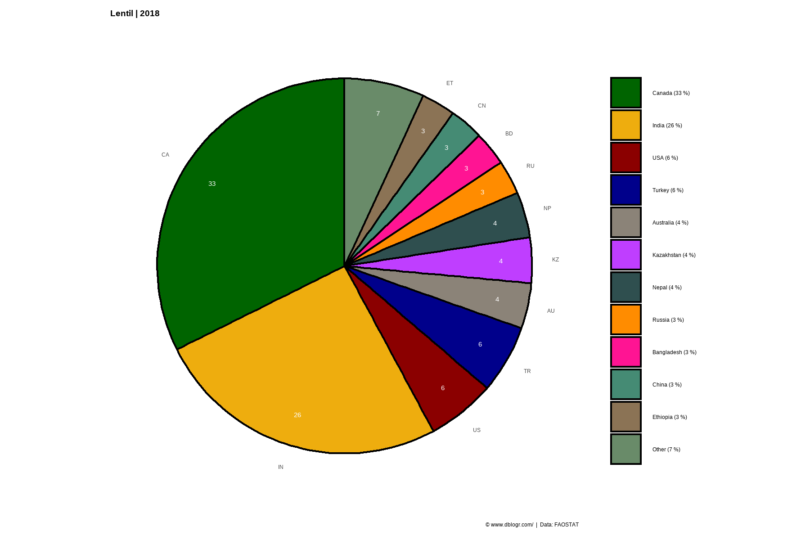

---

## 1961

```{r}
# Plot
mp <- ggPie(crop = "Lentils", measurement = "Production", year = 1961, other = 0.02)
ggsave("lentil_10.png", mp, width = 6, height = 4)
```

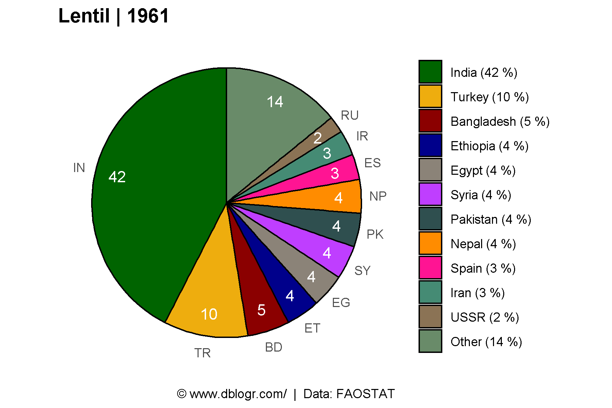

---

```{r}
# Plot function
mp <- ggPie_anim(crop = "Lentils")
anim_save("lentil_gifs_02.gif", mp, width = 600, height = 400)
```

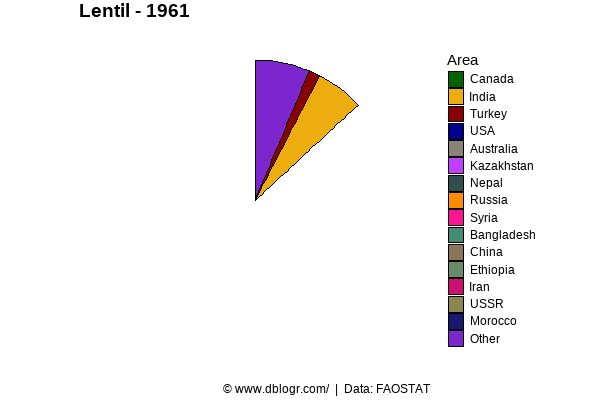

---

# Heatmap

```{r}
# Prep data
x1 <- agData_FAO_Crops %>% 
  filter(Crop == "Lentils", Measurement == "Production", Year == 2018,
         Area %in% agData_FAO_Country_Table$Country) %>%
    top_n(10, Value)
xx <- agData_FAO_Crops %>% 
  filter(Crop == "Lentils", Measurement == "Production", 
         Area %in% x1$Area)
colors <- c("lightgrey", "darkgreen")
# Plot
mp <- ggplot(xx, aes(x = Year, y = Area, fill = Value)) +
  geom_tile(color = "white", size = 0.35) +
  scale_x_continuous(expand = c(0,0)) +
  scale_fill_gradientn(colors = colors, na.value = 'white') +
  theme_minimal() + 
  theme(panel.grid = element_blank()) +
        coord_cartesian(clip = 'off') +
        ylab("") + xlab("") +  
        theme(legend.position = "bottom", text = element_text(size = 8)) +
  labs(caption = "\xa9 www.dblogr.com/  |  Data: FAOSTAT")
ggsave("lentil_11.png", mp, width = 6, height = 4)
```

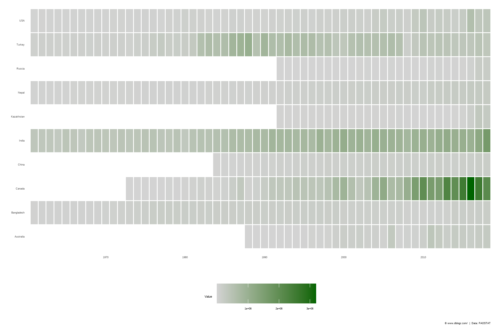

---

&copy; Derek Michael Wright [www.dblogr.com/](https://dblogr.com/)