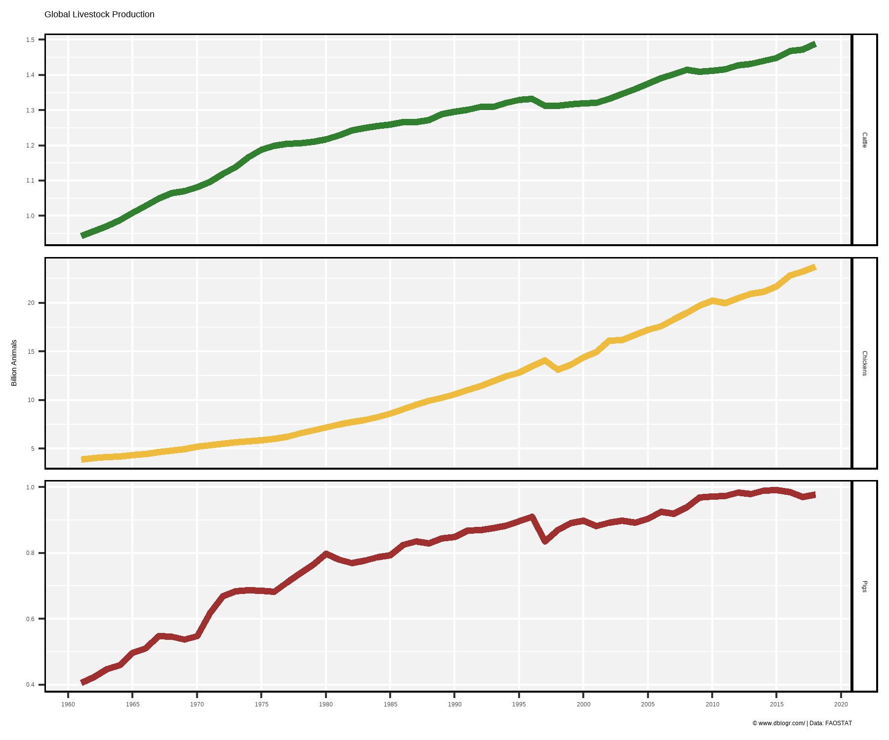
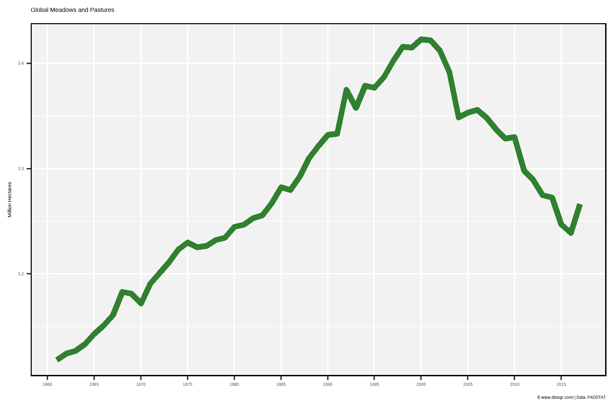

```{r setup, include = FALSE}
knitr::opts_chunk$set(echo = T, warning = F, message = F)
```

---

```{r}
# devtools::install_github("derekmichaelwright/agData")
library(agData) # Loads: tidyverse, ggpubr, ggbeeswarm, ggrepel
```

---

# Production

```{r}
# Prep Data
colors <- c("darkgreen", "darkgoldenrod2", "darkred")
xx <- agData_FAO_Livestock %>% 
  filter(Animal %in% c("Cattle","Pigs","Chickens"), Area == "World")
# Plot Data
mp <- ggplot(xx, aes(x = Year, y = Value / 1000000000, color = Animal)) + 
  geom_line(size = 1.5, alpha = 0.8) +
  facet_grid(Animal~., scales = "free_y") +
  scale_x_continuous(breaks = seq(1960, 2020, 5), minor_breaks = NULL) +
  scale_color_manual(values = colors) +
  theme_agData(legend.position = "none") +
  labs(title = "Global Livestock Production", y = "Billion Animals", x = NULL,
       caption = "\xa9 www.dblogr.com/ | Data: FAOSTAT")
ggsave("livestock_01.png", mp, width = 6, height = 5)
```

```{r echo = F}
ggsave("featured.png", mp, width = 6, height = 5)
```



---

# Permanent meadows and pastures

```{r}
# Prep Data
xx <- agData_FAO_LandUse %>% 
  filter(Item == "Land under perm. meadows and pastures",
         Area == "World")
# Plot
mp <- ggplot(xx, aes(x = Year, y = Value / 1000000)) + 
  geom_line(color = "darkgreen", size = 2, alpha = 0.8) + 
  scale_x_continuous(breaks = seq(1960, 2020, 5), minor_breaks = NULL) +
  theme_agData() +
  labs(y = "Million Hectares", x = NULL, title = "Global Meadows and Pastures",
       caption = "\xa9 www.dblogr.com/ | Data: FAOSTAT")
ggsave("livestock_02.png", mp, width = 6, height = 4)
```



---

&copy; Derek Michael Wright [www.dblogr.com/](https://dblogr.com/)