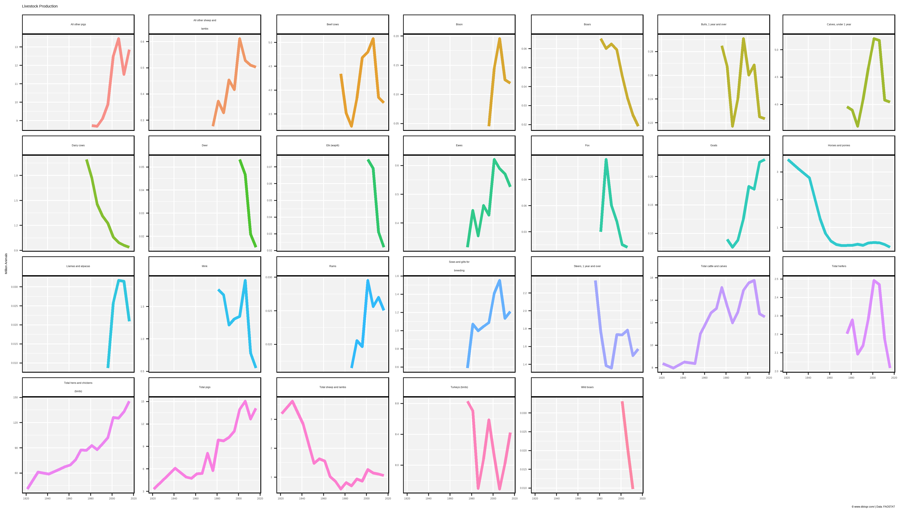
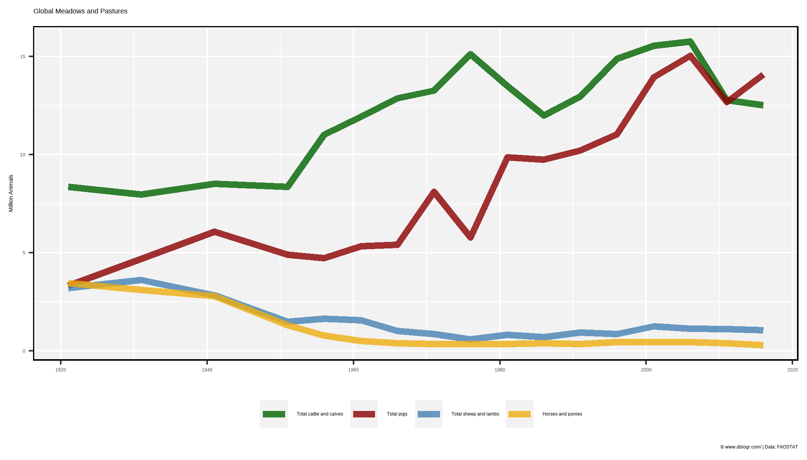
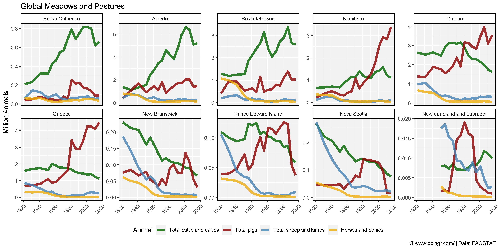

```{r setup, include = FALSE}
knitr::opts_chunk$set(echo = T, warning = F, message = F)
```

---

```{r}
# devtools::install_github("derekmichaelwright/agData")
library(agData) # Loads: tidyverse, ggpubr, ggbeeswarm, ggrepel
```

---

# Production

```{r}
# Prep Data
xx <- agData_STATCAN_Livestock %>% 
  filter(Area == "Canada", Measurement == "Number of animals")
# Plot Data
mp <- ggplot(xx, aes(x = Year, y = Value / 1000000, color = Animal)) + 
  geom_line(size = 1.5, alpha = 0.8) +
  facet_wrap(Animal ~ ., scales = "free_y", ncol = 7,
             labeller = label_wrap_gen(width = 25)) +
  scale_x_continuous(breaks = seq(1920, 2020, 20), minor_breaks = NULL) +
  theme_agData(legend.position = "none") +
  labs(title = "Livestock Production ", y = "Million Animals", x = NULL,
       caption = "\xa9 www.dblogr.com/ | Data: FAOSTAT")
ggsave("livestock_canada_01.png", mp, width = 14, height = 8)
```

```{r echo = F}
ggsave("featured.png", mp, width = 6, height = 5)
```



---

# Permanent meadows and pastures

```{r}
# Prep Data
colors <- c("darkgreen", "darkred", "steelblue", "darkgoldenrod2")
animals <- c("Total cattle and calves", "Total pigs", 
             "Total sheep and lambs", "Horses and ponies")
xx <- agData_STATCAN_Livestock %>% 
  filter(Area == "Canada", Animal %in% animals,
         Measurement == "Number of animals") %>%
  mutate(Animal = factor(Animal, levels = animals))
# Plot
mp <- ggplot(xx, aes(x = Year, y = Value / 1000000, color = Animal)) + 
  geom_line(size = 2, alpha = 0.8) + 
  scale_color_manual(name = NULL, values = colors) +
  theme_agData(legend.position = "bottom") +
  labs(y = "Million Animals", x = NULL, title = "Global Meadows and Pastures",
       caption = "\xa9 www.dblogr.com/ | Data: FAOSTAT")
ggsave("livestock_canada_02.png", mp, width = 7, height = 4)
```



---

```{r}
# Prep Data
colors <- c("darkgreen", "darkred", "steelblue", "darkgoldenrod2")
animals <- c("Total cattle and calves", "Total pigs", 
             "Total sheep and lambs", "Horses and ponies")
xx <- agData_STATCAN_Livestock %>% 
  filter(Area != "Canada", Animal %in% animals,
         Measurement == "Number of animals") %>%
  mutate(Animal = factor(Animal, levels = animals))
# Plot
mp <- ggplot(xx, aes(x = Year, y = Value / 1000000, color = Animal)) + 
  geom_line(size = 2, alpha = 0.8) + 
  facet_wrap(Area ~ ., ncol = 5, scales = "free_y") +
  scale_color_manual(values = colors) +
  theme_agData(legend.position = "bottom",
               axis.text.x = element_text(angle = 45, hjust = 1)) +
  labs(y = "Million Animals", x = NULL, title = "Global Meadows and Pastures",
       caption = "\xa9 www.dblogr.com/ | Data: FAOSTAT")
ggsave("livestock_canada_03.png", mp, width = 12, height = 6)
```



---

&copy; Derek Michael Wright [www.dblogr.com/](https://dblogr.com/)