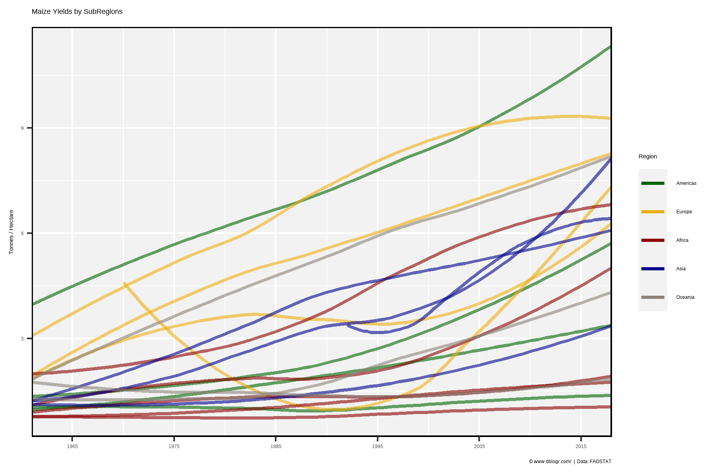
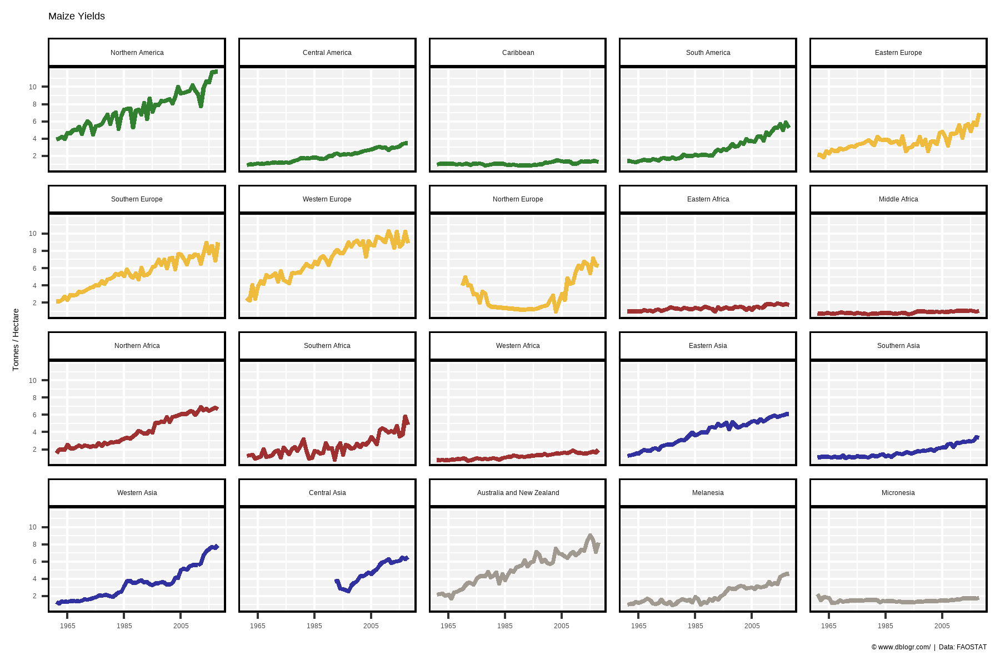
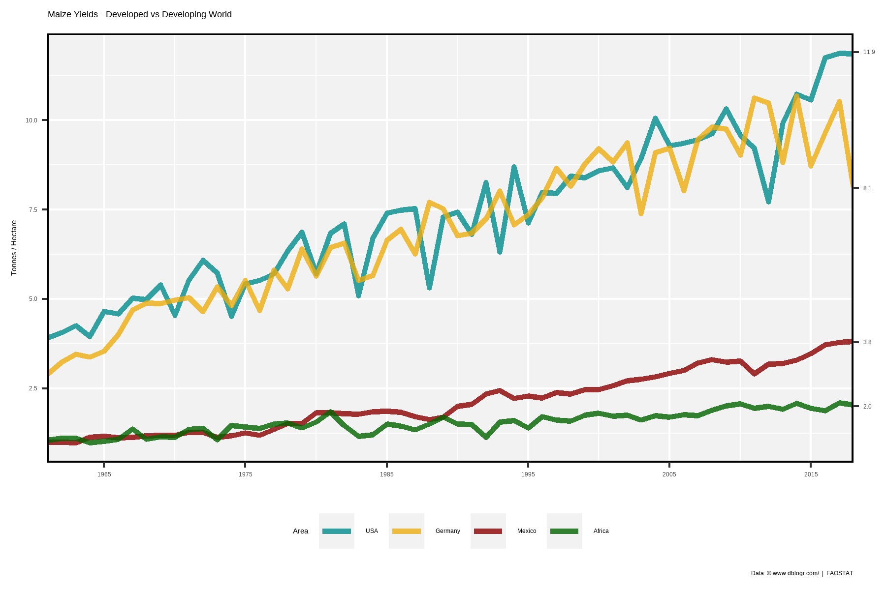
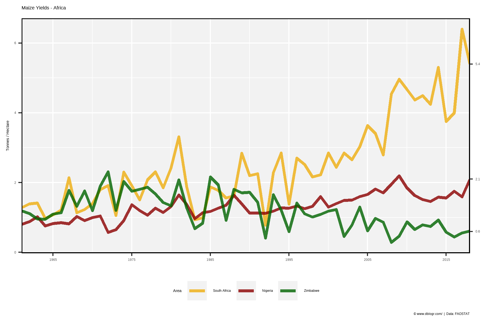

```{r setup, include = FALSE}
knitr::opts_chunk$set(echo = T, message = F, warning = F)
```

---

```{r}
# devtools::install_github("derekmichaelwright/agData")
library(agData) # Loads: tidyverse, ggpubr, ggbeeswarm, ggrepel
```

---

# All Data - PDF

```{r}
# Prep data
colors <- c("darkgreen", "darkgoldenrod2", "darkred")
areas <- c("World",
  levels(agData_FAO_Country_Table$Region),
  levels(agData_FAO_Country_Table$SubRegion),
  levels(agData_FAO_Country_Table$Country))
xx <- agData_FAO_Crops %>% 
  filter(Crop == "Maize") %>%
  mutate(Value = ifelse(Measurement %in% c("Area harvested","Production"),
                        Value / 1000000, Value),
         Unit = plyr::mapvalues(Unit, c("hectares","tonnes"), 
                        c("Million hectares","Million tonnes")))
areas <- areas[areas %in% xx$Area]
# Plot
pdf("maize_fao.pdf", width = 12, height = 4)
for(i in areas) {
  print(ggplot(xx %>% filter(Area == i)) +
    geom_line(aes(x = Year, y = Value, color = Measurement),
              size = 1.5, alpha = 0.8) +
    facet_wrap(. ~ Measurement + Unit, ncol = 3, scales = "free_y") +
    theme_agData(legend.position = "none", 
                 axis.text.x = element_text(angle = 90, hjust = 1, vjust = 0.5)) +
    scale_color_manual(values = colors) +
    scale_x_continuous(breaks = seq(1960, 2020, by = 5) ) +
    labs(title = i, y = NULL, x = NULL,
         caption = "\xa9 www.dblogr.com/  |  Data: FAOSTAT") )
}
dev.off()
```

```{r echo = F}
downloadthis::download_link(
  link = "https://github.com/derekmichaelwright/dblogr/blob/master/content/agdata/maize/maize_fao.pdf",
  button_label = "maize_fao.pdf",
  button_type = "success",
  has_icon = TRUE,
  icon = "fa fa-file-pdf",
  self_contained = FALSE
)
```

---

# Yields

```{r}
# Prep data
colors <- c("darkgreen", "darkgoldenrod2", "darkred", "darkblue", "antiquewhite4")
xx <- agData_FAO_Crops %>% 
  filter(Crop == "Maize", Measurement == "Yield",
         Area %in% agData_FAO_Country_Table$SubRegion) %>%
  left_join(agData_FAO_Country_Table, by = c("Area"="SubRegion")) %>%
  arrange(Region) %>%
  mutate(Area = factor(Area, levels = unique(Area)))
# Plot
mp <- ggplot(xx, aes(x = Year, y = Value)) + 
  geom_smooth(aes(color = Region, group = Area), 
              method = "loess", se = F) +
  scale_color_manual(values = alpha(colors, 0.6)) + 
  scale_x_continuous(breaks = seq(1965, 2015, by = 10), expand = c(0,0) ) +
  theme_agData() +
  labs(title = "Maize Yields by SubRegions", y = "Tonnes / Hectare", x = NULL,
       caption = "\xa9 www.dblogr.com/  |  Data: FAOSTAT")
ggsave("maize_01.png", mp, width = 6, height = 4)
```



---

# Yields by Country

```{r}
# Plot
mp <- ggplot(xx, aes(x = Year, y = Value, color = Region) ) +
  geom_line(size = 1, alpha = 0.8) +
  facet_wrap(Area~., ncol = 5) +
  scale_color_manual(values = colors) +
  scale_x_continuous(breaks = seq(1965, 2005, by = 20)) +
  scale_y_continuous(breaks = c(2, 4, 6, 8, 10)) +
  theme_agData(legend.position = "none") +
  labs(title = "Maize Yields", y = "Tonnes / Hectare", x = NULL,
       caption = "\xa9 www.dblogr.com/  |  Data: FAOSTAT")
ggsave("maize_02.png", mp, width = 6, height = 4)
```



---

# USA, Germany, Mexico and Africa

```{r}
# Prep data
areas <- c("USA", "Germany", "Mexico", "Africa")
colors <- c("darkcyan", "darkgoldenrod2", "darkred", "darkgreen")
xx <- agData_FAO_Crops %>%
  filter(Crop == "Maize", Measurement == "Yield", Area %in% areas) %>%
  mutate(Area = factor(Area, levels = areas) )
xE <- xx %>% top_n(1, Year) %>% pull(Value) %>% round(1)
# Plot
mp <- ggplot(xx, aes(x = Year, y = Value, color = Area)) +
  geom_line(size = 1.25, alpha = 0.8) +
  scale_color_manual(values = colors) + 
  scale_x_continuous(breaks = seq(1865, 2015, by = 10), expand = c(0, 0)) +
  scale_y_continuous(sec.axis = sec_axis(~ ., breaks = xE)) +
  theme_agData(legend.position = "bottom") +
  labs(title   = "Maize Yields - Developed vs Developing World",
       caption = "Data: \xa9 www.dblogr.com/  |  FAOSTAT",
       y = "Tonnes / Hectare", x = NULL)
ggsave("maize_03.png", mp, width = 6, height = 4)
```

```{r echo = F}
ggsave("featured.png", mp, width = 6, height = 4)
```



---

# South Africa, Nigeria and Zimbabwe

```{r}
# Prep data
areas <- c("South Africa", "Nigeria", "Zimbabwe")
colors <- c("darkgoldenrod2", "darkred", "darkgreen")
xx <- agData_FAO_Crops %>%
  filter(Crop == "Maize", Area %in% areas, Measurement == "Yield" ) %>%
  mutate(Area = factor(Area, levels = areas) )
xE <- xx %>% top_n(1, Year) %>% pull(Value) %>% round(1)
# Plot
mp <- ggplot(xx, aes(x = Year, y = Value, color = Area)) +
  geom_line(size = 1.25, alpha = 0.8) +
  theme_agData() +
  theme(legend.position = "bottom") +
  scale_color_manual(values = colors) + 
  scale_x_continuous(breaks = seq(1865, 2015, by = 10), expand = c(0, 0)) +
  scale_y_continuous(sec.axis = sec_axis(~ ., breaks = xE)) +
  labs(title   = "Maize Yields - Africa",
       caption = "\xa9 www.dblogr.com/  |  Data: FAOSTAT",
       y = "Tonnes / Hectare", x = NULL)
ggsave("maize_04.png", mp, width = 6, height = 4)
```



---

&copy; Derek Michael Wright [www.dblogr.com/](https://dblogr.com/)