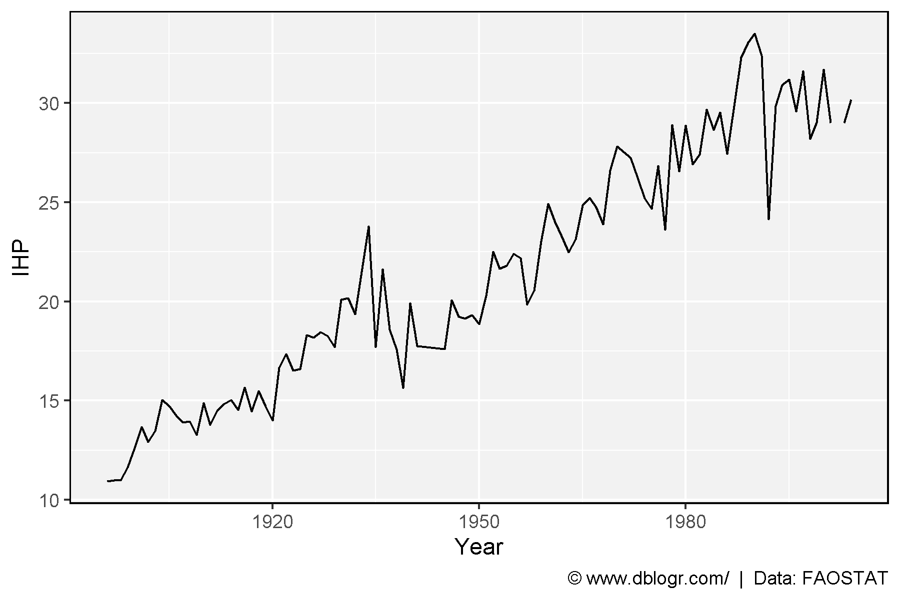

```{r setup, include = FALSE}
knitr::opts_chunk$set(echo = T, message = F, warning = F)
```

---

```{r}
# devtools::install_github("derekmichaelwright/agData")
library(agData) # Loads: tidyverse, ggpubr, ggbeeswarm, ggrepel
```

---

# All Data - PDF

```{r}
# Prep data
xx <- agData_LongTermMaize %>% 
  group_by(Year, GEN) %>% 
  summarise(IHP = mean(IHP, na.rm = T))
# Plot
mp <- ggplot(xx, aes(x = Year, y = IHP)) +
  geom_line() +
  theme_agData() +
  labs(caption = "\xa9 www.dblogr.com/  |  Data: FAOSTAT")
ggsave("maize_long_term_01.png", mp, width = 6, height = 4)
```

```{r echo = F}
ggsave("featured.png", mp, width = 6, height = 4)
```



---

&copy; Derek Michael Wright [www.dblogr.com/](https://dblogr.com/)