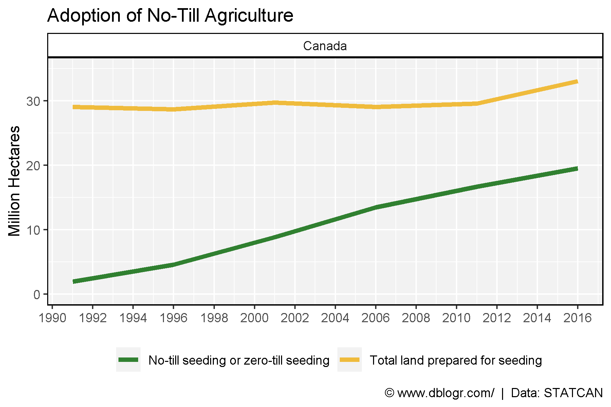
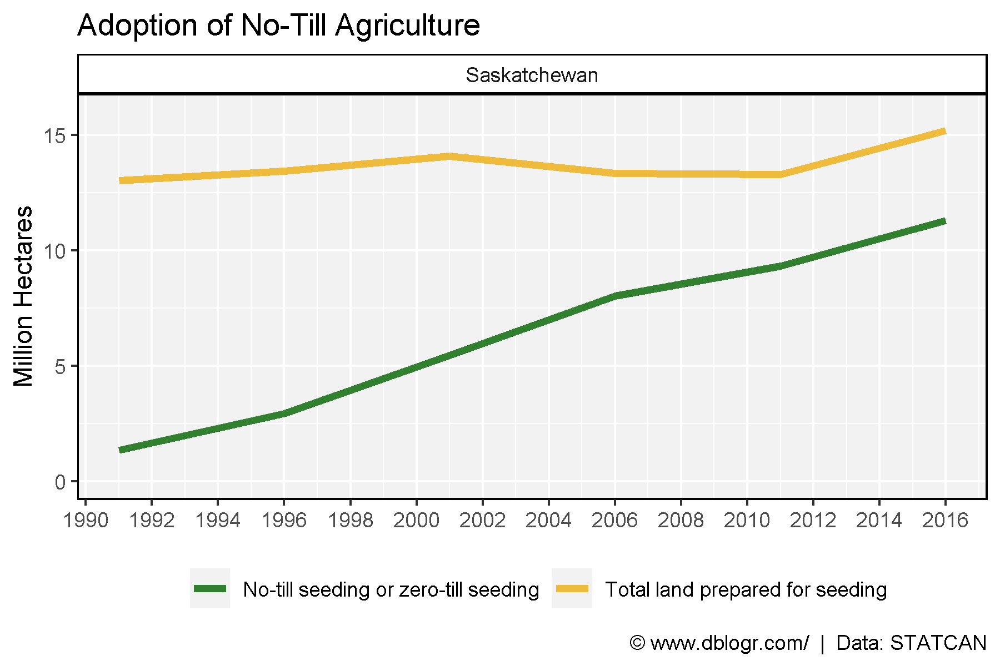
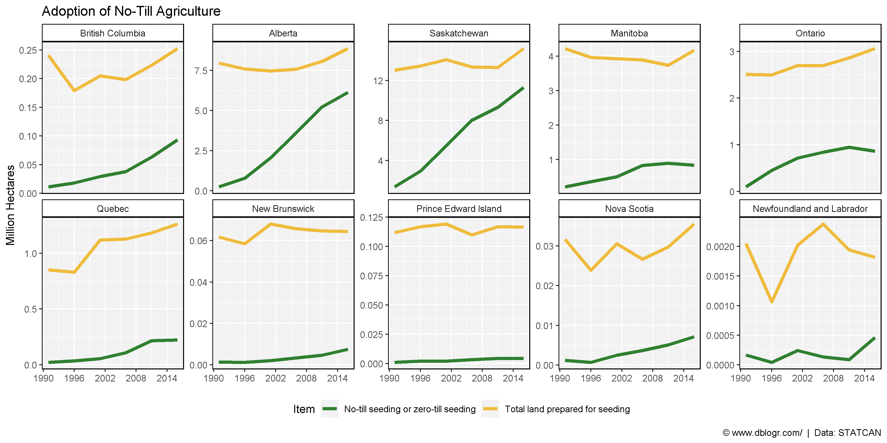
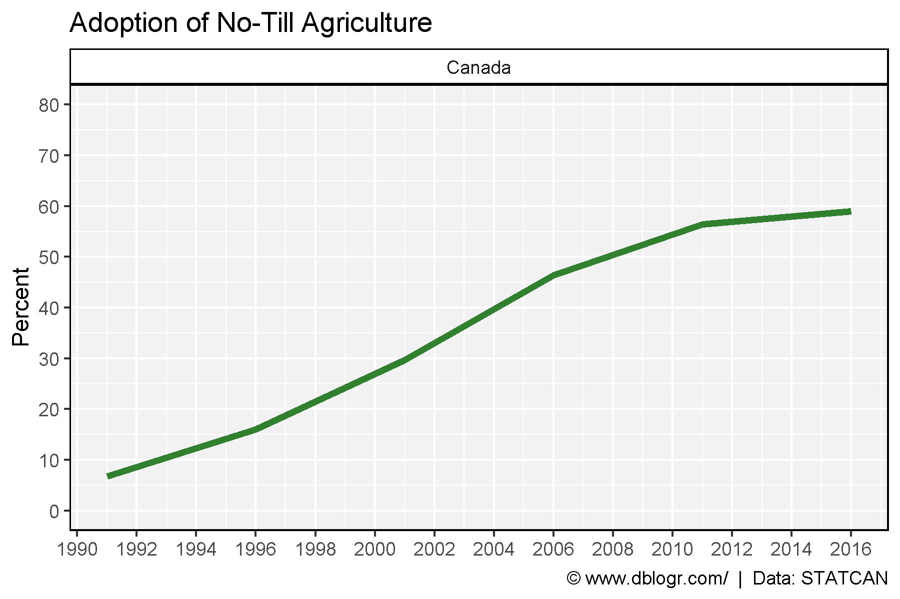
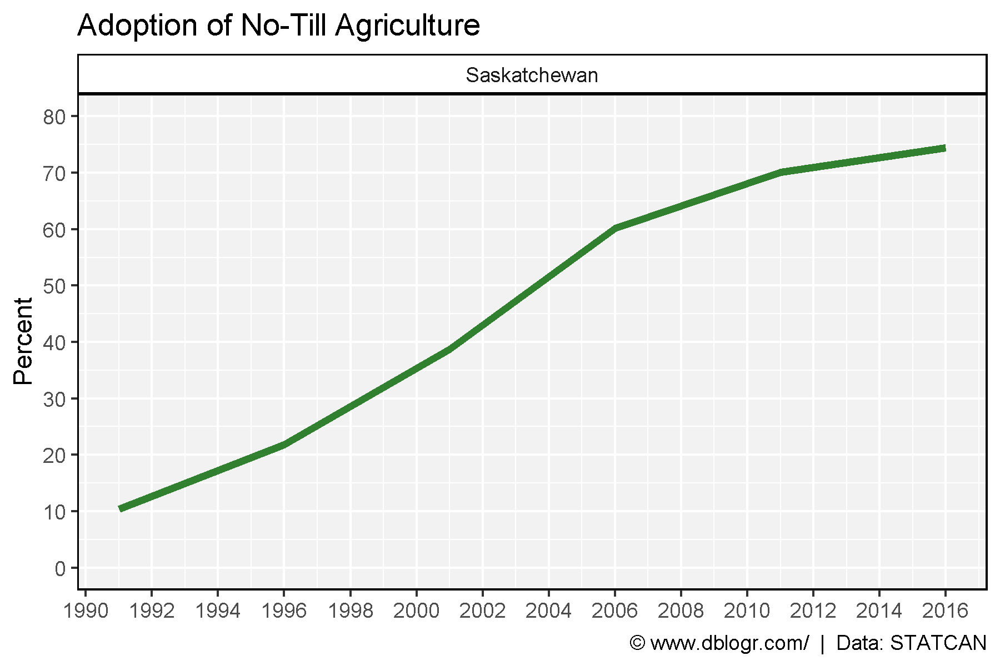
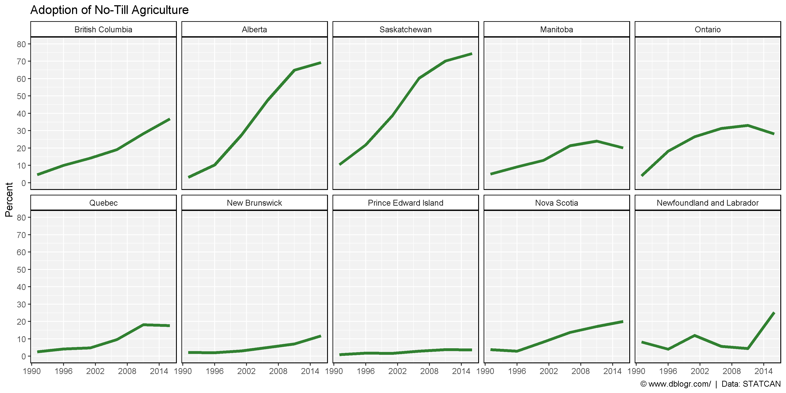
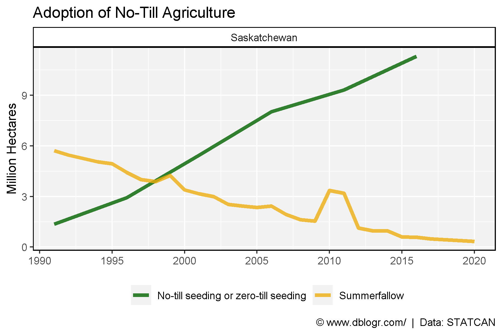

```{r setup, include = FALSE}
knitr::opts_chunk$set(echo = T, message = F, warning = F)
```

---

```{r}
# devtools::install_github("derekmichaelwright/agData")
library(agData) # Loads: tidyverse, ggpubr, ggbeeswarm, ggrepel
library(gganimate)
library(treemapify)
```

---

# No-Till Adoption

## Canada

```{r}
# Prep data
xx <- agData_STATCAN_FarmLand_NoTill %>% 
  filter(Area == "Canada", Unit == "Hectares")
# Plot
mp <- ggplot(xx, aes(x = Year, y = Value / 1000000, color = Item)) +
  geom_line(size = 1.5, alpha = 0.8) +
  facet_grid(.~ Area) +
  scale_color_manual(name = NULL, values = agData_Colors) +
  scale_x_continuous(breaks = seq(1990, 2016, 2)) + 
  scale_y_continuous(limits = c(0, 35)) +
  theme_agData(legend.position = "bottom") +
  labs(title = "Adoption of No-Till Agriculture",
       caption = "\xa9 www.dblogr.com/  |  Data: STATCAN",
       x = NULL, y = "Million Hectares")
ggsave("no_till_01.png", mp, width = 6, height = 4)
```



---

## Saskatchewan

```{r}
# Prep data
xx <- agData_STATCAN_FarmLand_NoTill %>% 
  filter(Area == "Saskatchewan", Unit == "Hectares")
# Plot
mp <- ggplot(xx, aes(x = Year, y = Value / 1000000, color = Item)) +
  geom_line(size = 1.5, alpha = 0.8) +
  facet_grid(.~ Area) +
  scale_color_manual(name = NULL, values = agData_Colors) +
  scale_x_continuous(breaks = seq(1990, 2016, 2)) + 
  scale_y_continuous(limits = c(0, 16)) +
  theme_agData(legend.position = "bottom") +
  labs(title = "Adoption of No-Till Agriculture",
       caption = "\xa9 www.dblogr.com/  |  Data: STATCAN",
       x = NULL, y = "Million Hectares")
ggsave("no_till_02.png", mp, width = 6, height = 4)
```



## Provinces

```{r}
# Prep data
xx <- agData_STATCAN_FarmLand_NoTill %>% 
  filter(Area != "Canada", Unit == "Hectares")
# Plot
mp <- ggplot(xx, aes(x = Year, y = Value / 1000000, color = Item)) +
  geom_line(size = 1.5, alpha = 0.8) +
  facet_wrap(Area ~ ., scales = "free_y", ncol = 5) +
  scale_color_manual(values = agData_Colors) +
  scale_x_continuous(breaks = seq(1990, 2016, 6)) + 
  theme_agData(legend.position = "bottom") +
  labs(title = "Adoption of No-Till Agriculture",
       caption = "\xa9 www.dblogr.com/  |  Data: STATCAN",
       x = NULL, y = "Million Hectares")
ggsave("no_till_03.png", mp, width = 12, height = 6)
```



---

# Percent

## Canada

```{r}
# Prep data
xx <- agData_STATCAN_FarmLand_NoTill %>% 
  filter(Area == "Canada", Unit == "Hectares") %>%
  spread(Item, Value) %>%
  mutate(Percent = 100* `No-till seeding or zero-till seeding` / `Total land prepared for seeding`)
# Plot
mp <- ggplot(xx, aes(x = Year, y = Percent)) +
  geom_line(color = "darkgreen", size = 1.5, alpha = 0.8) +
  facet_grid(. ~ Area) +
  scale_fill_manual(values = agData_Colors) +
  scale_x_continuous(breaks = seq(1990, 2016, 2)) + 
  scale_y_continuous(breaks = seq(0, 80, 10), limits = c(0, 80)) +
  theme_agData() +
  labs(title = "Adoption of No-Till Agriculture", x = NULL,
       caption = "\xa9 www.dblogr.com/  |  Data: STATCAN")
ggsave("no_till_04.png", mp, width = 6, height = 4)
```



---

## Saskatchewan

```{r}
# Prep data
xx <- agData_STATCAN_FarmLand_NoTill %>% 
  filter(Area == "Saskatchewan", Unit == "Hectares") %>%
  spread(Item, Value) %>%
  mutate(Percent = 100* `No-till seeding or zero-till seeding` / `Total land prepared for seeding`)
# Plot
mp <- ggplot(xx, aes(x = Year, y = Percent)) +
  geom_line(color = "darkgreen", size = 1.5, alpha = 0.8) +
  facet_grid(. ~ Area) +
  scale_fill_manual(values = agData_Colors) +
  scale_x_continuous(breaks = seq(1990, 2016, 2)) + 
  scale_y_continuous(breaks = seq(0, 80, 10), limits = c(0, 80)) +
  theme_agData() +
  labs(title = "Adoption of No-Till Agriculture", x = NULL,
       caption = "\xa9 www.dblogr.com/  |  Data: STATCAN")
ggsave("no_till_05.png", mp, width = 6, height = 4)
```



---

## Provinces

```{r}
# Prep data
xx <- agData_STATCAN_FarmLand_NoTill %>% 
  filter(Area != "Canada", Unit == "Hectares") %>%
  spread(Item, Value) %>%
  mutate(Percent = 100* `No-till seeding or zero-till seeding` / `Total land prepared for seeding`)
# Plot
mp <- ggplot(xx, aes(x = Year, y = Percent)) +
  geom_line(color = "darkgreen", size = 1.5, alpha = 0.8) +
  facet_wrap(Area ~ ., ncol = 5) +
  scale_fill_manual(values = agData_Colors) +
  scale_x_continuous(breaks = seq(1990, 2016, 6)) + 
  scale_y_continuous(breaks = seq(0, 80, 10), limits = c(0, 80)) +
  theme_agData() +
  labs(title = "Adoption of No-Till Agriculture", x = NULL,
       caption = "\xa9 www.dblogr.com/  |  Data: STATCAN")
ggsave("no_till_06.png", mp, width = 12, height = 6)
```



---

## East vs West

```{r}
# Prep data
areas <- c("Saskatchewan", "Alberta", "Ontario", "Quebec")
colors <- c("darkgreen", "darkred", "darkblue", "steelblue")
xx <- xx %>% 
  filter(Area %in% areas) %>%
  mutate(Area = factor(Area, levels = areas))
# Plot
mp <- ggplot(xx, aes(x = Year, y = Percent, color = Area)) +
  geom_line(size = 1.5, alpha = 0.8) +
  scale_color_manual(name = NULL, values = colors) +
  scale_x_continuous(breaks = seq(1990, 2016, 5)) + 
  theme_agData(legend.position = "bottom") +
  labs(title = "Adoption of No-Till Agriculture", x = NULL,
       caption = "\xa9 www.dblogr.com/  |  Data: STATCAN")
ggsave("no_till_07.png", mp, width = 6, height = 4)
```

```{r echo = F}
ggsave("featured.png", mp, width = 6, height = 4)
```


---

# Saskatchewan

```{r}
# Prep data
x1 <- agData_STATCAN_FarmLand_NoTill %>% 
  filter(Area == "Saskatchewan", Unit == "Hectares",
         Item == "No-till seeding or zero-till seeding")
x2 <- agData_STATCAN_Crops %>% 
  filter(Area == "Saskatchewan", Crop == "Summerfallow", 
         Measurement == "Seeded area", Year > 1990) %>%
  rename(Item=Crop)
xx <- bind_rows(x1, x2)
# Plot
mp <- ggplot(xx, aes(x = Year, y = Value / 1000000, color = Item)) +
  geom_line(size = 1.5, alpha = 0.8) +
  facet_grid(. ~ Area) +
  scale_color_manual(name = NULL, values = agData_Colors) +
  scale_x_continuous(breaks = seq(1990, 2020, 5)) + 
  theme_agData(legend.position = "bottom") +
  labs(title = "Adoption of No-Till Agriculture", 
       y = "Million Hectares", x = NULL,
       caption = "\xa9 www.dblogr.com/  |  Data: STATCAN")
ggsave("no_till_08.png", mp, width = 6, height = 4)
```



---

&copy; Derek Michael Wright [www.dblogr.com/](https://dblogr.com/)