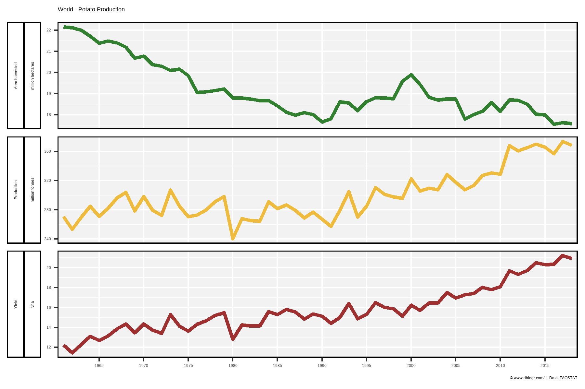
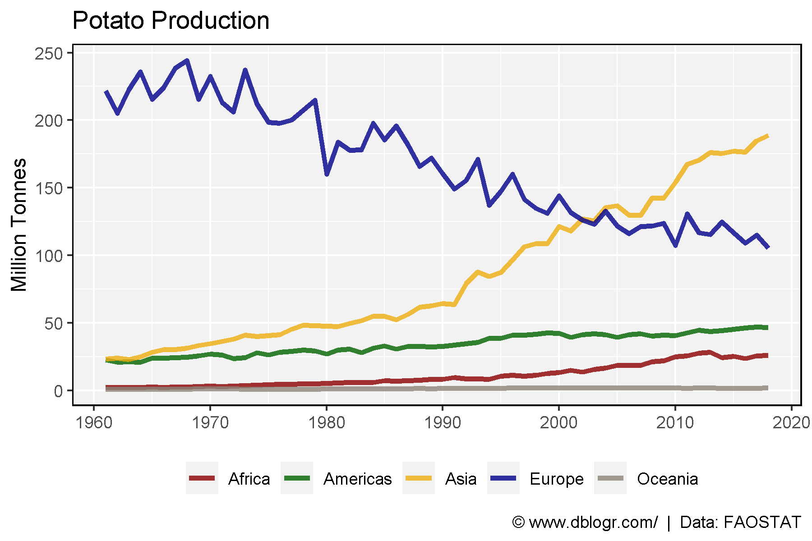
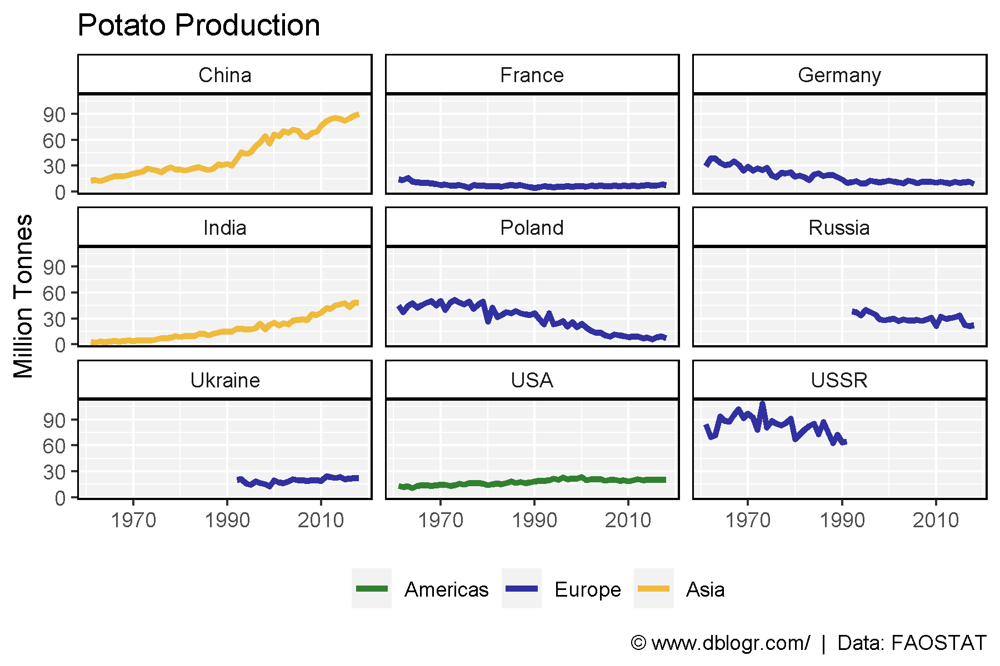
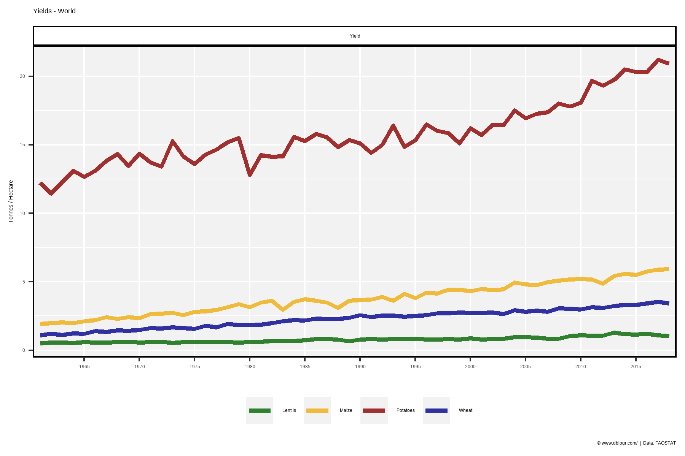

```{r setup, include = FALSE}
knitr::opts_chunk$set(echo = TRUE, message = F, warning = F)
```

---

```{r}
# devtools::install_github("derekmichaelwright/agData")
library(agData) # Loads: tidyverse, ggpubr, ggbeeswarm, ggrepel
```

---

# All Data - PDF

```{r}
# Prep data
colors <- c("darkgreen", "darkred", "darkgoldenrod2")
areas <- c("World",
  levels(agData_FAO_Country_Table$Region),
  levels(agData_FAO_Country_Table$SubRegion),
  levels(agData_FAO_Country_Table$Country))
xx <- agData_FAO_Crops %>% 
  filter(Crop == "Potatoes") %>%
  mutate(Value = ifelse(Measurement %in% c("Area harvested","Production"),
                        Value / 1000000, Value),
         Unit = plyr::mapvalues(Unit, c("hectares","tonnes"), 
                        c("Million hectares","Million tonnes")))
areas <- areas[areas %in% xx$Area]
# Plot
pdf("potato_fao.pdf", width = 12, height = 4)
for(i in areas) {
  print(ggplot(xx %>% filter(Area == i)) +
    geom_line(aes(x = Year, y = Value, color = Measurement),
              size = 1.5, alpha = 0.8) +
    facet_wrap(. ~ Measurement + Unit, ncol = 3, scales = "free_y") +
    theme_agData(legend.position = "none", rotx = T) +
    scale_color_manual(values = colors) +
    scale_x_continuous(breaks = seq(1960, 2020, by = 5) ) +
    labs(title = i, y = NULL, x = NULL,
         caption = "\xa9 www.dblogr.com/  |  Data: FAOSTAT") )
}
dev.off()
```

**PDF**: [Potato_fao.pdf](https://github.com/derekmichaelwright/dblogr/blob/master/content/agdata/potato/potato_fao.pdf)

---

# Global Production

```{r}
# Prep data
colors <- c("darkgreen", "darkgoldenrod2", "darkred")
xx <- agData_FAO_Crops %>% 
  filter(Area == "World", Crop == "Potatoes") %>%
  mutate(Value = ifelse(Measurement != "Yield", Value / 1000000, Value),
         Unit = plyr::mapvalues(Unit, c("tonnes","hectares"),
                                c("million tonnes","million hectares")))
# Plot
mp <- ggplot(xx, aes(x = Year, y = Value, color = Measurement)) + 
  geom_line(size = 1.25, alpha = 0.8) + 
  facet_grid(Measurement+Unit~., scales = "free", switch = "y") +
  scale_color_manual(values = colors) +
  scale_x_continuous(breaks = seq(1960, 2015, 5), minor_breaks = NULL) +
  coord_cartesian(xlim = c(min(xx$Year)+2, max(xx$Year)-2)) +
  theme_agData(legend.position = "none",
               strip.placement = "outside") +
  labs(title = "World - Potato Production", y = NULL, x = NULL,
       caption = "\xa9 www.dblogr.com/  |  Data: FAOSTAT")
ggsave("potato_01.png", mp, width = 6, height = 4)
```



---

# Production by Region

```{r}
# Prep data
colors <- c("darkred", "darkgreen", "darkgoldenrod2", "darkblue", "antiquewhite4")
xx <- agData_FAO_Crops %>% 
  filter(Area %in% agData_FAO_Region_Table$Region, 
         Measurement == "Production", Crop == "Potatoes")
# Plot
mp <- ggplot(xx, aes(x = Year, y = Value/1000000, color = Area)) + 
  geom_line(size = 1.25, alpha = 0.8) +
  scale_color_manual(name = NULL, values = colors) +
  scale_x_continuous(breaks = seq(1960, 2020, 10)) +
  theme_agData(legend.position = "bottom") +
  labs(title = "Potato Production", x = NULL, y = "Million Tonnes",
       caption = "\xa9 www.dblogr.com/  |  Data: FAOSTAT")
ggsave("potato_02.png", mp, width = 6, height = 4)
```



---

```{r}
# Prep data
colors <- c("darkgreen", "darkblue", "darkgoldenrod2")
areas <- agData_FAO_Crops %>% 
  filter(Year %in% c(1961,2017), Area %in% agData_FAO_Country_Table$Country,
         Measurement == "Production", Crop == "Potatoes") %>% 
  arrange(desc(Value)) %>% slice(1:9) %>% pull(Area) %>% unique()
xx <- agData_FAO_Crops %>% addRegionInfo() %>%
  filter(Area %in% areas, Measurement == "Production", Crop == "Potatoes")
# Plot
mp <- ggplot(xx, aes(x = Year, y = Value / 1000000, color = Region)) + 
  geom_line(size = 1.25, alpha = 0.8) +
  facet_wrap(Area ~ .) +
  scale_x_continuous(breaks = seq(1970, 2010, 20)) +
  scale_color_manual(name = NULL, values = colors) +
  theme_agData(legend.position = "bottom") +
  labs(title = "Potato Production", x = NULL, y = "Million Tonnes",
       caption = "\xa9 www.dblogr.com/  |  Data: FAOSTAT")
ggsave("potato_03.png", mp, width = 6, height = 4)
```



---

# Potato vs Other Crops

```{r}
# Prep data
colors <- c("darkgreen", "darkgoldenrod2", "darkred", "darkblue")
xx <- agData_FAO_Crops %>% 
  filter(Area == "World", Measurement == "Yield", 
         Crop %in% c("Potatoes", "Wheat", "Maize", "Lentils"))
# Plot
mp <- ggplot(xx, aes(x = Year, y = Value, color = Crop)) + 
  geom_line(size = 1.25, alpha = 0.8) + 
  facet_wrap(. ~ Measurement, scales = "free") +
  scale_color_manual(name = NULL, values = agData_Colors) +
  scale_x_continuous(breaks = seq(1960, 2015, 5), minor_breaks = NULL) +
  coord_cartesian(xlim = c(min(xx$Year)+2, max(xx$Year)-2)) +
  theme_agData(legend.position = "bottom") +
  labs(title = "Yields - World", y = "Tonnes /\ Hectare", x = NULL,
       caption = "\xa9 www.dblogr.com/  |  Data: FAOSTAT")
ggsave("potato_04.png", mp, width = 6, height = 4)
```

```{r echo = F}
ggsave("featured.png", mp, width = 6, height = 4)
```



---

&copy; Derek Michael Wright [www.dblogr.com/](https://dblogr.com/)