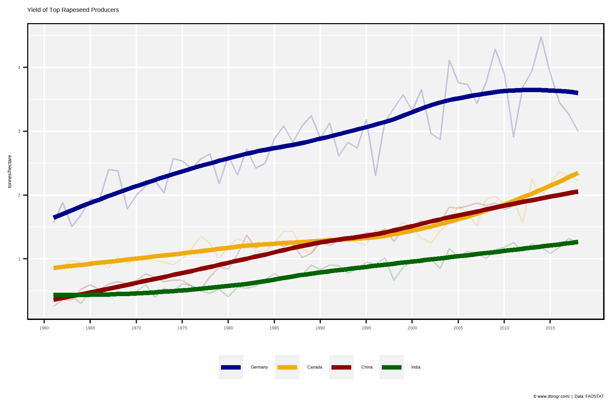
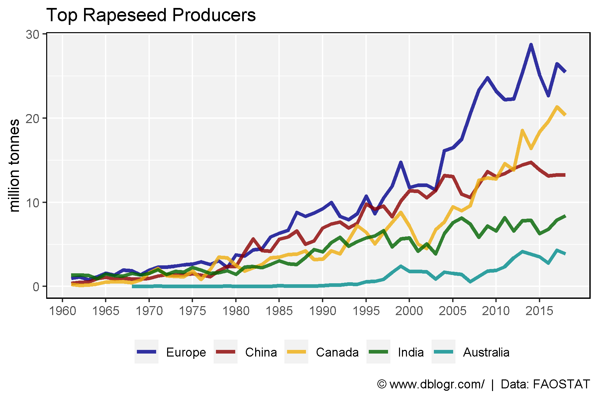

```{r setup, include = FALSE}
knitr::opts_chunk$set(echo = T, message = F, warning = F, out.width = "100%")
```

---

```{r}
# devtools::install_github("derekmichaelwright/agData")
library(agData) # Loads: tidyverse, ggpubr, ggbeeswarm, ggrepel
```

---

# All Data - PDF

```{r}
# Prep data
colors <- c("darkgreen", "darkred", "darkgoldenrod2")
areas <- c("World",
  levels(agData_FAO_Country_Table$Region),
  levels(agData_FAO_Country_Table$SubRegion),
  levels(agData_FAO_Country_Table$Country))
xx <- agData_FAO_Crops %>% 
  filter(Crop == "Rapeseed") %>%
  mutate(Value = ifelse(Measurement %in% c("Area harvested","Production"),
                        Value / 1000000, Value),
         Unit = plyr::mapvalues(Unit, c("hectares","tonnes"), 
                        c("Million hectares","Million tonnes")))
areas <- areas[areas %in% xx$Area]
# Plot
pdf("rapeseed_fao.pdf", width = 12, height = 4)
for(i in areas) {
  print(ggplot(xx %>% filter(Area == i)) +
    geom_line(aes(x = Year, y = Value, color = Measurement),
              size = 1.5, alpha = 0.8) +
    facet_wrap(. ~ Measurement + Unit, ncol = 3, scales = "free_y") +
    theme_agData(legend.position = "none", 
                 axis.text.x = element_text(angle = 45, hjust = 1)) +
    scale_color_manual(values = colors) +
    scale_x_continuous(breaks = seq(1960, 2020, by = 5) ) +
    labs(title = i, y = NULL, x = NULL,
         caption = "\xa9 www.dblogr.com/  |  Data: FAOSTAT") )
}
dev.off()
```

```{r echo = F}
downloadthis::download_link(
  link = "https://github.com/derekmichaelwright/dblogr/blob/master/content/agdata/rapeseed/rapeseed_fao.pdf",
  button_label = "rapeseed_fao.pdf",
  button_type = "success",
  has_icon = TRUE,
  icon = "fa fa-file-pdf",
  self_contained = FALSE
)
```

---

# Yield

```{r}
# Prep data
areas <- c("Germany", "Canada", "China", "India")
colors  <- c("darkblue", "darkgoldenrod2", "darkred", "darkgreen")
xx <- agData_FAO_Crops %>% 
  filter(Crop == "Rapeseed", Area %in% areas, Measurement == "Yield") %>%
  mutate(Area = factor(Area, levels = areas))
# Plot
mp <- ggplot(xx, aes(x = Year, y = Value, color = Area)) +
  geom_line(alpha = 0.2) + 
  geom_smooth(method = "loess", size = 1.5, se = F, alpha = 0.8) +
  scale_color_manual(name = NULL, values = colors) +
  scale_x_continuous(breaks = seq(1960, 2015, 5), minor_breaks = NULL) +
  theme_agData(legend.position = "bottom") +
  labs(title = "Yield of Top Rapeseed Producers", y = "tonnes/hectare", x = NULL,
       caption = "\xa9 www.dblogr.com/  |  Data: FAOSTAT")
ggsave("rapeseed_01.png", mp, width = 6, height = 4)
```



---

# Production

```{r}
# Prep data
areas <- c("Europe", "China", "Canada", "India", "Australia")
colors  <- c("darkblue", "darkred", "darkgoldenrod2", "darkgreen", "darkcyan")
xx <- agData_FAO_Crops %>% 
  filter(Crop == "Rapeseed", Area %in% areas,  Measurement == "Production") %>%
  mutate(Area = factor(Area, levels = areas))
# Plot
mp <- ggplot(xx, aes(x = Year, y = Value / 1000000, color = Area)) +
  geom_line(size = 1.25, alpha = 0.8) + 
  scale_color_manual(name = NULL, values = colors) +
  scale_x_continuous(breaks = seq(1960, 2015, 5), minor_breaks = NULL) +
  theme_agData(legend.position = "bottom") +
  labs(title = "Top Rapeseed Producers", y = "million tonnes", x = NULL,
       caption = "\xa9 www.dblogr.com/  |  Data: FAOSTAT")
ggsave("rapeseed_02.png", width = 6, height = 4)
```

```{r echo = F}
ggsave("featured.png", mp, width = 6, height = 4)
```



---

&copy; Derek Michael Wright [www.dblogr.com/](https://dblogr.com/)