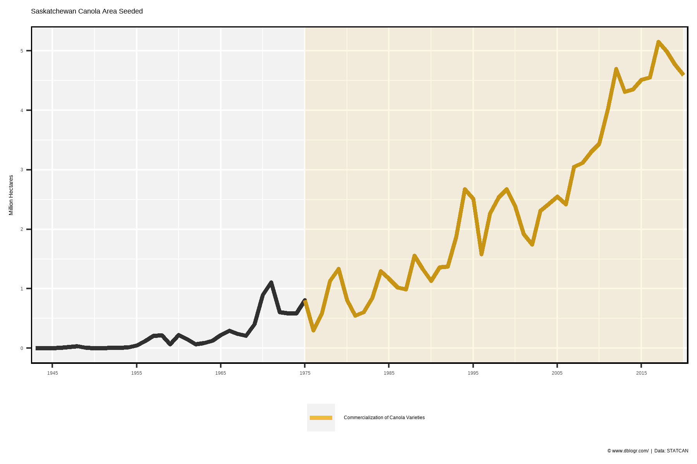
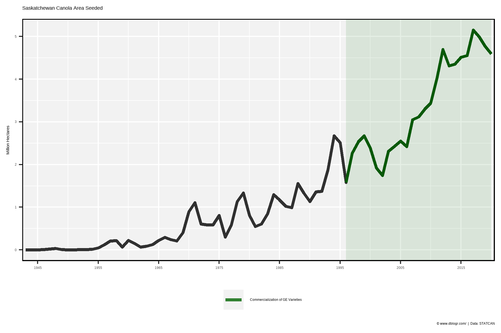
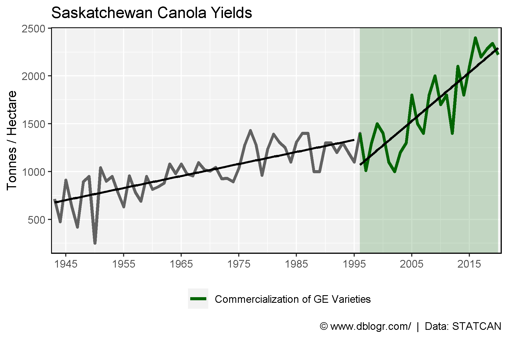

```{r setup, include = FALSE}
knitr::opts_chunk$set(echo = T, message = F, warning = F)
```

---

```{r}
# devtools::install_github("derekmichaelwright/agData")
library(agData) # Loads: tidyverse, ggpubr, ggbeeswarm, ggrepel
```

---

# Area

```{r}
# Prep data
xx <- agData_STATCAN_Crops %>% 
  filter(Crop == "Canola", Area =="Saskatchewan", Measurement == "Seeded area")
# Plot
mp <- ggplot() +
  geom_rect(aes(xmin = 1975, xmax = 2020, ymin = -Inf, ymax = Inf, 
                fill = "Commercialization of Canola Varieties"), alpha = 0.1) +
  geom_line(data = xx, aes(x = Year, y = Value / 1000000), size = 1.25, alpha = 0.8) +
  geom_line(data = xx %>% filter(Year >= 1975), size = 1.25, alpha = 0.8,
            aes(x = Year, y = Value / 1000000, color = "Commercialization of Canola Varieties")) +
  scale_x_continuous(breaks = seq(1945, 2015, by = 10)) +
  coord_cartesian(xlim = c(min(xx$Year)+3, max(xx$Year)-3)) +
  scale_color_manual(name = NULL, values = "darkgoldenrod2") +
  scale_fill_manual(values = "darkgoldenrod2") +
  guides(fill = F) +
  theme_agData(legend.position = "bottom") + 
  labs(title = "Saskatchewan Canola Area Seeded", y = "Million Hectares", x = NULL,
       caption = "\xa9 www.dblogr.com/  |  Data: STATCAN")
ggsave("rapeseed_canada_01.png", mp, width = 6, height = 4)
```

```{r echo = F}
ggsave("featured.png", mp, width = 6, height = 4)
```



---

```{r}
# Prep data
xx <- agData_STATCAN_Crops %>% 
  filter(Crop == "Canola", Area =="Saskatchewan", Measurement == "Seeded area")
# Plot
mp <- ggplot() +
  geom_rect(aes(xmin = 1996, xmax = 2020, ymin = -Inf, ymax = Inf, 
                fill = "Commercialization of GE Varieties"), alpha = 0.1) +
  geom_line(data = xx, aes(x = Year, y = Value / 1000000), size = 1.25, alpha = 0.8) +
  geom_line(data = xx %>% filter(Year >= 1996), size = 1.25, alpha = 0.8,
            aes(x = Year, y = Value / 1000000, color = "Commercialization of GE Varieties")) +
  scale_x_continuous(breaks = seq(1945, 2015, by = 10)) +
  coord_cartesian(xlim = c(min(xx$Year)+3, max(xx$Year)-3)) +
  scale_color_manual(name = NULL, values = "darkgreen") +
  scale_fill_manual(values = "darkgreen") +
  guides(fill = F) +
  theme_agData(legend.position = "bottom") + 
  labs(title = "Saskatchewan Canola Area Seeded", y = "Million Hectares", x = NULL,
       caption = "\xa9 www.dblogr.com/  |  Data: STATCAN")
ggsave("rapeseed_canada_02.png", mp, width = 6, height = 4)
```



---

# Yield

```{r}
# Prep data
xx <- agData_STATCAN_Crops %>% 
  filter(Crop == "Canola", Area == "Saskatchewan", Measurement == "Yield")
# Plot
mp <- ggplot() +
  geom_rect(aes(xmin = 1996, xmax = 2020, ymin = -Inf, ymax = Inf, 
                fill = "Commercialization of GE Varieties"), alpha = 0.2) +
  geom_line(data = xx, aes(x = Year, y = Value), size = 1.25, alpha = 0.6) +
  geom_line(data = xx %>% filter(Year >= 1996), size = 1.25,
            aes(x = Year, y = Value, color = "Commercialization of GE Varieties")) +
  geom_smooth(data = xx %>% filter(Year >= 1996), color = "black",
              aes(x = Year, y = Value), method = "lm", se = F) +
  geom_smooth(data = xx %>% filter(Year < 1996),  color = "black",
              aes(x = Year, y = Value), method = "lm", se = F) +
  scale_x_continuous(breaks = seq(1945, 2015, by = 10)) +
  coord_cartesian(xlim = c(min(xx$Year)+3, max(xx$Year)-3)) +
  scale_color_manual(name = NULL, values = "darkgreen") +
  scale_fill_manual(values = "darkgreen") +
  guides(fill = F) +
  theme_agData(legend.position = "bottom") +
  labs(title = "Saskatchewan Canola Yields", y = "Tonnes / Hectare", x = NULL,
       caption = "\xa9 www.dblogr.com/  |  Data: STATCAN")
ggsave("rapeseed_canada_03.png", mp, width = 6, height = 4)
```



---

&copy; Derek Michael Wright [www.dblogr.com/](https://dblogr.com/)