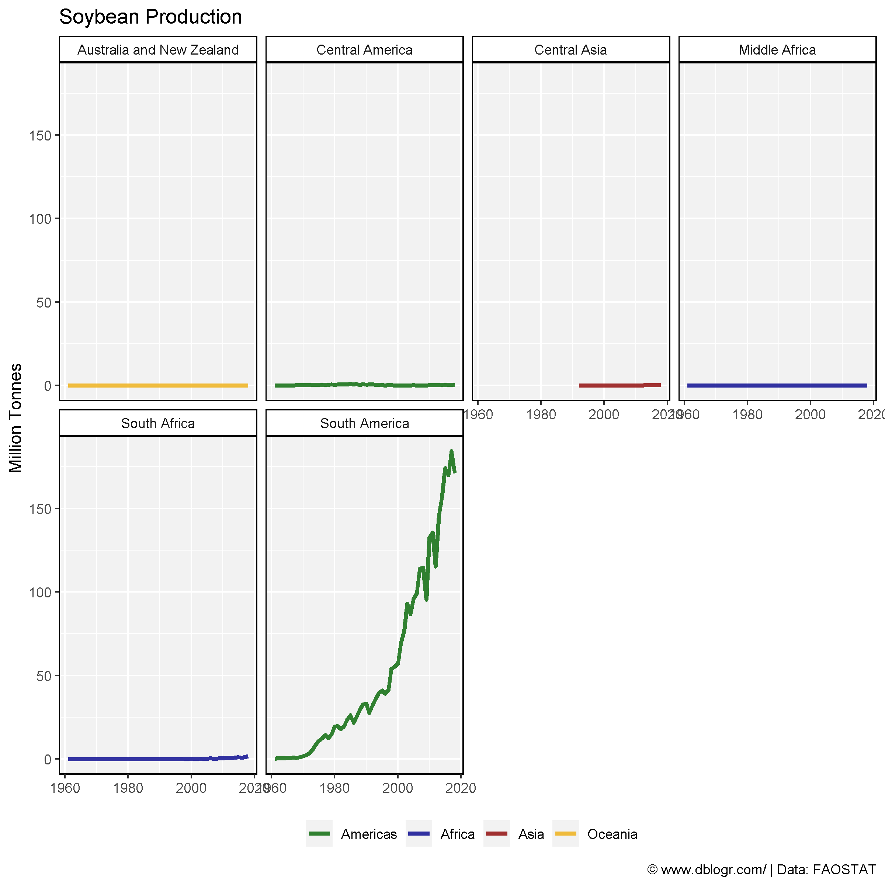
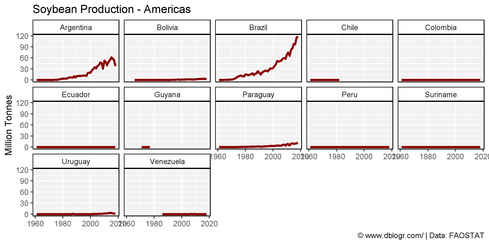
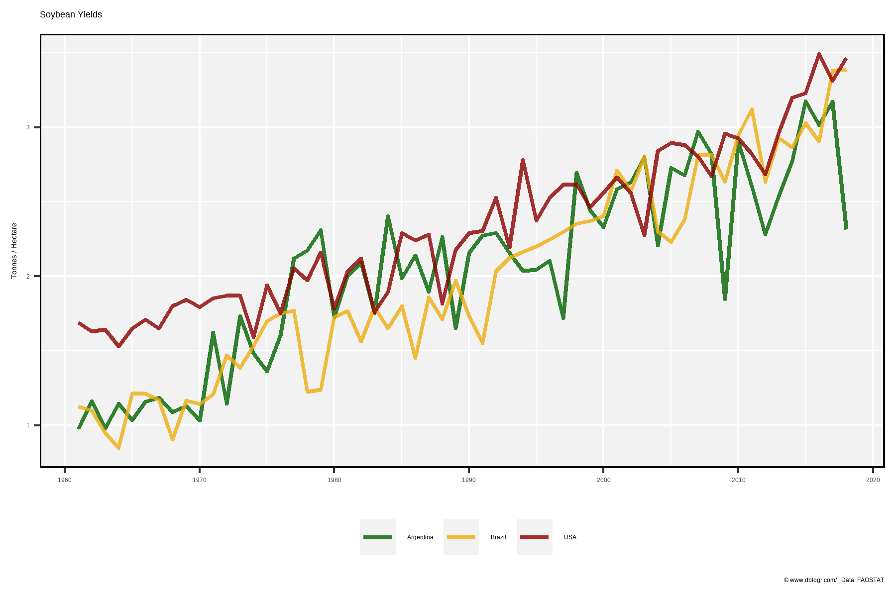
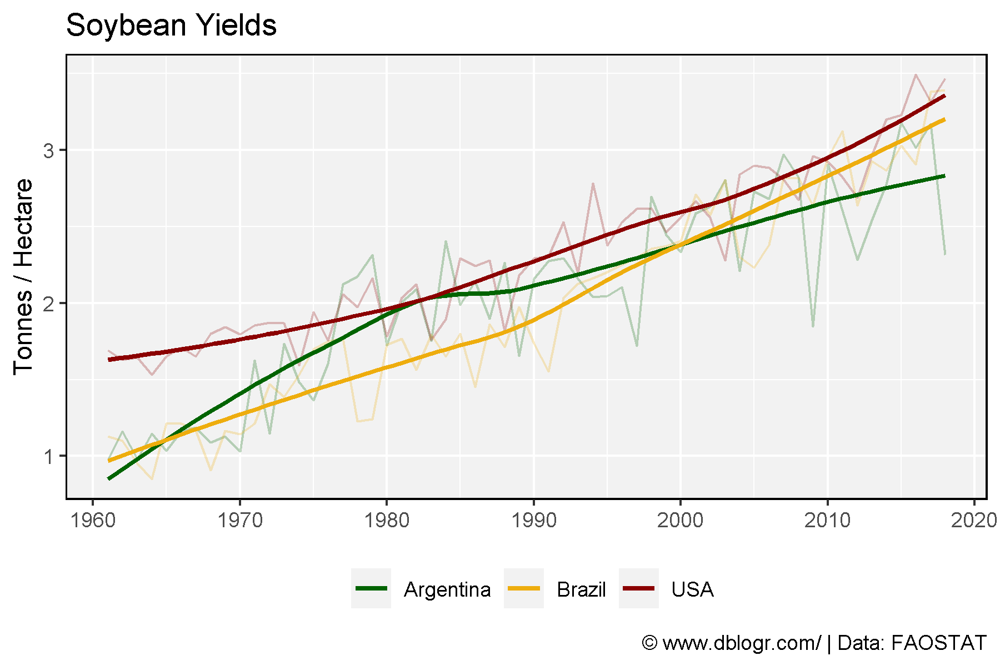
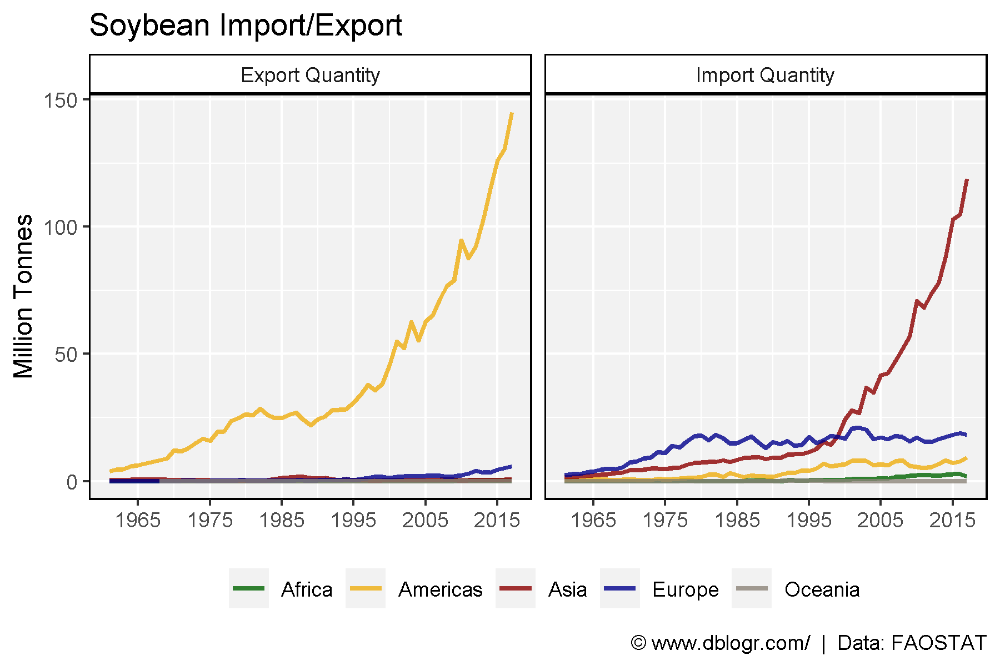
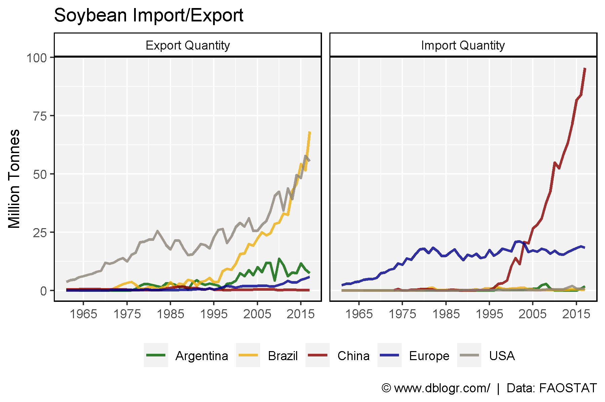

```{r setup, include = FALSE}
knitr::opts_chunk$set(echo = T, warning = F, message = F)
```

---

```{r}
# devtools::install_github("derekmichaelwright/agData")
library(agData) # Loads: tidyverse, ggpubr, ggbeeswarm, ggrepel
```

---

# All Data - PDF

```{r}
# Prep data
colors <- c("darkgreen", "darkred", "darkgoldenrod2")
areas <- c("World",
  levels(agData_FAO_Country_Table$Region),
  levels(agData_FAO_Country_Table$SubRegion),
  levels(agData_FAO_Country_Table$Country))
xx <- agData_FAO_Crops %>% 
  filter(Crop == "Soybeans") %>%
  mutate(Value = ifelse(Measurement %in% c("Area harvested","Production"),
                        Value / 1000000, Value),
         Unit = plyr::mapvalues(Unit, c("hectares","tonnes"), 
                        c("Million hectares","Million tonnes")))
areas <- areas[areas %in% xx$Area]
# Plot
pdf("soybean_fao.pdf", width = 12, height = 4)
for(i in areas) {
  print(ggplot(xx %>% filter(Area == i)) +
    geom_line(aes(x = Year, y = Value, color = Measurement),
              size = 1.5, alpha = 0.8) +
    facet_wrap(. ~ Measurement + Unit, ncol = 3, scales = "free_y") +
    theme_agData(legend.position = "none", rotx = T) +
    scale_color_manual(values = colors) +
    scale_x_continuous(breaks = seq(1960, 2020, by = 5) ) +
    labs(title = i, y = NULL, x = NULL,
         caption = "\xa9 www.dblogr.com/  |  Data: FAOSTAT") )
}
dev.off()
```

**PDF**: [soybean_fao.pdf](https://github.com/derekmichaelwright/dblogr/blob/master/content/agdata/soybean/soybean_fao.pdf)

---

# Production

```{r}
# Prep data
colors <- c("darkgreen", "darkblue", "darkred", "darkgoldenrod2", "antiquewhite4")
xx <- agData_FAO_Crops %>% 
  filter(Crop == "Soybeans", Measurement == "Production",
         Area %in% agData_FAO_Region_Table$SubRegion) %>%
  left_join(select(agData_FAO_Region_Table, Area=SubRegion, Region), by = "Area")
# Plot
mp <- ggplot(xx, aes(x = Year, y = Value / 1000000, color = Region)) + 
  geom_line(size = 1.25, alpha = 0.8) + 
  facet_wrap(Area ~ ., ncol = 4) +
  scale_color_manual(name = NULL, values = colors) +
  theme_agData(legend.position = "bottom") +
  labs(title = "Soybean Production", y = "Million Tonnes", x = NULL,
       caption = "\xa9 www.dblogr.com/ | Data: FAOSTAT")
ggsave("soybean_01.png", mp, width = 8, height = 8)
```

```{r echo = F}
ggsave("featured.png", mp, width = 8, height = 8)
```



---

```{r}
# Prep data
xx <- agData_FAO_Crops %>% addRegionInfo() %>%
  filter(Crop == "Soybeans", Measurement == "Production",
         SubRegion %in% c("South America", "Northern America")) 
# Plot
mp <- ggplot(xx, aes(x = Year, y = Value / 1000000, color = SubRegion)) + 
  geom_line(size = 1.25) + 
  facet_wrap(Area ~ ., ncol = 5) +
  scale_color_manual(values = c("darkred", "darkgreen")) +
  theme_agData(legend.position = "none") +
  labs(title = "Soybean Production - Americas", y = "Million Tonnes", x = NULL,
       caption = "\xa9 www.dblogr.com/ | Data: FAOSTAT")
ggsave("soybean_02.png", mp, width = 8, height = 4)
```



---

```{r}
# Prep data
colors <- c("darkgreen", "darkgoldenrod2", "darkred")
xx <- agData_FAO_Crops %>% 
  filter(Crop == "Soybeans", Measurement == "Yield",
         Area %in% c("Argentina", "Brazil", "USA")) 
# Plot
mp <- ggplot(xx, aes(x = Year, y = Value, color = Area)) + 
  geom_line(size = 1, alpha = 0.8) + 
  theme_agData(legend.position = "bottom") +
  scale_color_manual(name = NULL, values = agData_Colors) +
  scale_x_continuous(breaks = seq(1960, 2020, 10)) +
  labs(title = "Soybean Yields", y = "Tonnes / Hectare", x = NULL,
       caption = "\xa9 www.dblogr.com/ | Data: FAOSTAT")
ggsave("soybean_03.png", mp, width = 6, height = 4)
```



---

```{r}
# Plot
mp <- ggplot(xx, aes(x = Year, y = Value, color = Area)) + 
  geom_line(alpha = 0.25) + 
  geom_smooth(se = F) + 
  scale_color_manual(name = NULL, values = colors) +
  scale_x_continuous(breaks = seq(1960, 2020, 10)) +
  theme_agData(legend.position = "bottom") +
  labs(title = "Soybean Yields", y = "Tonnes / Hectare", x = NULL,
       caption = "\xa9 www.dblogr.com/ | Data: FAOSTAT")
ggsave("soybean_04.png", mp, width = 6, height = 4)
```



---

# Import and Export

```{r}
# Prep data
colors <- c("darkgreen", "darkgoldenrod2", "darkred", "darkblue", "antiquewhite4")
xx <- agData_FAO_Trade %>%
  filter(Measurement %in% c("Import Quantity", "Export Quantity"),
         Crop == "Soybeans", Area %in% agData_FAO_Region_Table$Region)
# Plot
mp <- ggplot(xx, aes(x = Year, y = Value / 1000000, group = Area, color = Area)) + 
  geom_line(size = 1, alpha = 0.8) + 
  facet_grid(. ~ Measurement) +
  scale_x_continuous(breaks       = seq(1965, 2015, by = 10),
                     minor_breaks = seq(1965, 2015, by = 5))  +
  scale_color_manual(name = NULL, values = colors) +
  theme_agData(legend.position = "bottom") + 
  labs(title = "Soybean Import/Export", y = "Million Tonnes", x = NULL,
       caption = "\xa9 www.dblogr.com/  |  Data: FAOSTAT")
ggsave("soybean_05.png", mp, width = 6, height = 4)
```



---

```{r}
# Prep data
colors <- c("darkgreen", "darkgoldenrod2", "darkred", "darkblue", "antiquewhite4")
xx <- agData_FAO_Trade %>%
  filter(Measurement %in% c("Import Quantity", "Export Quantity"),
         Crop == "Soybeans", 
         Area %in% c("USA", "Brazil", "Argentina", "Europe", "China"))
# Plot
mp <- ggplot(xx, aes(x = Year, y = Value / 1000000, group = Area, color = Area)) + 
  geom_line(size = 1, alpha = 0.8) + 
  facet_grid(. ~ Measurement) +
  scale_x_continuous(breaks       = seq(1965, 2015, by = 10),
                     minor_breaks = seq(1965, 2015, by = 5))  +
  scale_color_manual(name = NULL, values = colors) +
  theme_agData(legend.position = "bottom") + 
  labs(title = "Soybean Import/Export", y = "Million Tonnes", x = NULL,
       caption = "\xa9 www.dblogr.com/  |  Data: FAOSTAT")
ggsave("soybean_06.png", mp, width = 6, height = 4)
```



---

&copy; Derek Michael Wright [www.dblogr.com/](https://dblogr.com/)