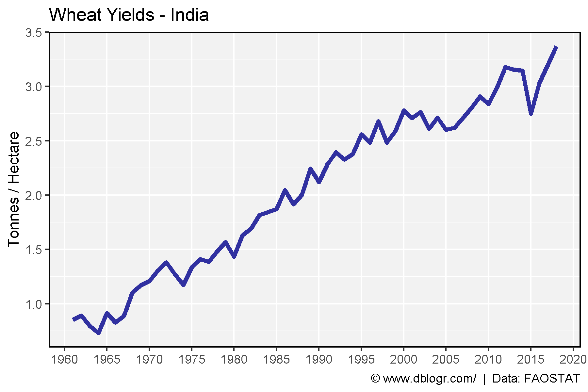
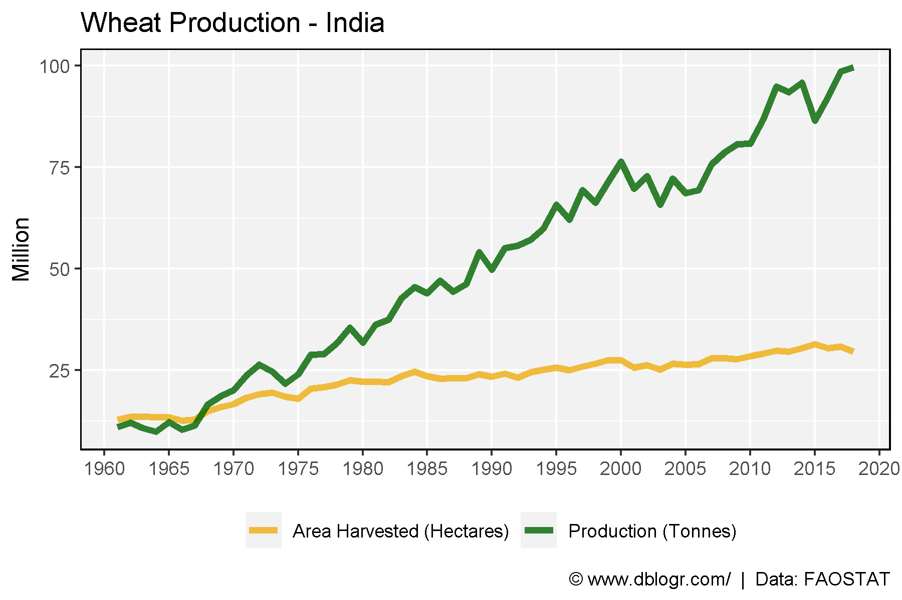
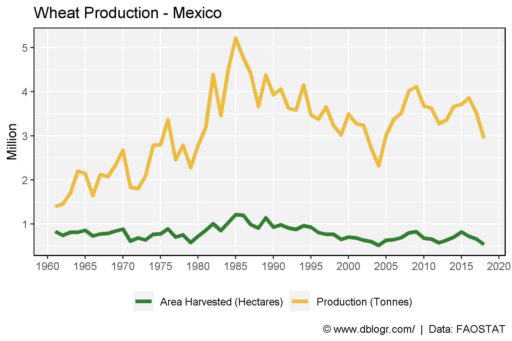
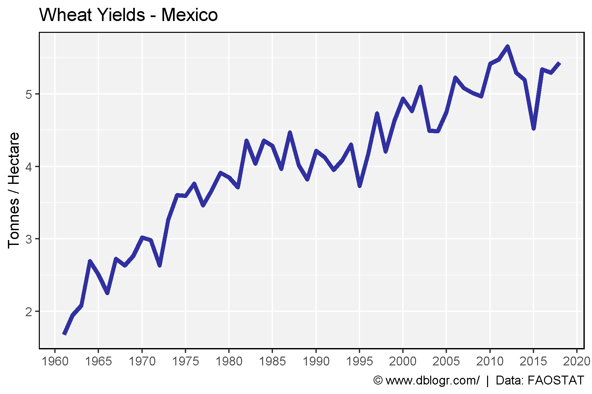

```{r setup, include = FALSE}
knitr::opts_chunk$set(echo = T, message = F, warning = F)
```

---

```{r}
# devtools::install_github("derekmichaelwright/agData")
library(agData) # Loads: tidyverse, ggpubr, ggbeeswarm, ggrepel
```

---

# All Data - PDF

```{r}
# Prep data
colors <- c("darkgreen", "darkred", "darkgoldenrod2")
areas <- c("World",
  levels(agData_FAO_Country_Table$Region),
  levels(agData_FAO_Country_Table$SubRegion),
  levels(agData_FAO_Country_Table$Country))
xx <- agData_FAO_Crops %>% 
  filter(Crop == "Wheat") %>%
  mutate(Value = ifelse(Measurement %in% c("Area harvested","Production"),
                        Value / 1000000, Value),
         Unit = plyr::mapvalues(Unit, c("hectares","tonnes"), 
                        c("Million hectares","Million tonnes")))
areas <- areas[areas %in% xx$Area]
# Plot
pdf("wheat_fao.pdf", width = 12, height = 4)
for(i in areas) {
  print(ggplot(xx %>% filter(Area == i)) +
    geom_line(aes(x = Year, y = Value, color = Measurement),
              size = 1.5, alpha = 0.8) +
    facet_wrap(. ~ Measurement + Unit, ncol = 3, scales = "free_y") +
    theme_agData(legend.position = "none", rotx = T) +
    scale_color_manual(values = colors) +
    scale_x_continuous(breaks = seq(1960, 2020, by = 5) ) +
    labs(title = i, y = NULL, x = NULL,
         caption = "\xa9 www.dblogr.com/  |  Data: FAOSTAT") )
}
dev.off()
```

**PDF**: [wheat_fao.pdf](https://github.com/derekmichaelwright/dblogr/blob/master/content/agdata/wheat/wheat_fao.pdf)

---

# India

## Yield

```{r}
# Prep data
xx <- agData_FAO_Crops %>% 
  filter(Crop == "Wheat", Area == "India", Measurement == "Yield")
# Plot yield data
mp <- ggplot(xx %>% filter(Measurement =="Yield"), aes(x = Year, y = Value) ) +
  geom_line(size = 1.5, alpha = 0.8, color = "darkblue") +
  scale_x_continuous(breaks = seq(1960, 2020, 5), minor_breaks = NULL) +
  theme_agData() +
  labs(title = "Wheat Yields - India", y = "Tonnes / Hectare", x = NULL,
       caption = "\xa9 www.dblogr.com/  |  Data: FAOSTAT")
ggsave("wheat_india_01.png", mp, width = 6, height = 4)
```



---

## Area and Production

```{r}
# Prep data
xx <- agData_FAO_Crops %>% 
  filter(Crop == "Wheat", Area == "India", Measurement != "Yield")
# Plot production data
mp <- ggplot(xx, aes(x = Year, y = Value/1000000, color = Measurement) ) +
  geom_line(size = 1.5, alpha = 0.8) +
  scale_x_continuous(breaks = seq(1960, 2020, 5), minor_breaks = NULL) +
  scale_color_manual(name   = NULL,
                     labels = c("Area Harvested (Hectares)", "Production (Tonnes)"),
                     values = c("darkgoldenrod2",            "darkgreen")) +
  theme_agData(legend.position = "bottom") + 
  labs(title = "Wheat Production - India", y = "Million", x = NULL,
       caption = "\xa9 www.dblogr.com/  |  Data: FAOSTAT")
ggsave("wheat_india_02.png", mp, width = 6, height = 4)
```

```{r echo = F}
#ggsave(".../articles/Norman_Borlaug/wheat_india_01.png", width = 6, height = 4)
ggsave("featured.png", mp, width = 6, height = 4)
```



---

# Mexico

## Yield 

```{r}
# Prep data
xx <- agData_FAO_Crops %>% 
  filter(Crop == "Wheat", Area == "Mexico", Measurement != "Yield")
# Plot production data
mp1 <- ggplot(xx, aes(x = Year, y = Value / 1000000, color = Measurement) ) +
  geom_line(size = 1.5, alpha = 0.8) +
  theme_agData(legend.position = "bottom") +
  scale_color_manual(name   = NULL, values = c("darkgreen", "darkgoldenrod2"),
                     labels = c("Area Harvested (Hectares)", "Production (Tonnes)")) +
  scale_x_continuous(breaks = seq(1960, 2020, 5), minor_breaks = NULL) +
  labs(title = "Wheat Production - Mexico", y = "Million", x = NULL,
       caption = "\xa9 www.dblogr.com/  |  Data: FAOSTAT")
ggsave("wheat_mexico_01.png", mp1, width = 6, height = 4)
```



---

## Area and Production

```{r}
# Prep data
xx <- agData_FAO_Crops %>% 
  filter(Crop == "Wheat", Area == "Mexico", Measurement == "Yield")
# Plot yield data
mp2 <- ggplot(xx %>% filter(Measurement == "Yield"), aes(x = Year, y = Value) ) + 
  geom_line(size = 1.5, alpha = 0.8, color = "darkblue") +
  scale_x_continuous(breaks = seq(1960, 2020, 5), minor_breaks = NULL) +
  theme_agData() +
  labs(title   = "Wheat Yields - Mexico", y = "Tonnes / Hectare", x = NULL,
       caption = "\xa9 www.dblogr.com/  |  Data: FAOSTAT")
ggsave("wheat_mexico_02.png", mp2, width = 6, height = 4)
```



---

&copy; Derek Michael Wright [www.dblogr.com/](https://dblogr.com/)