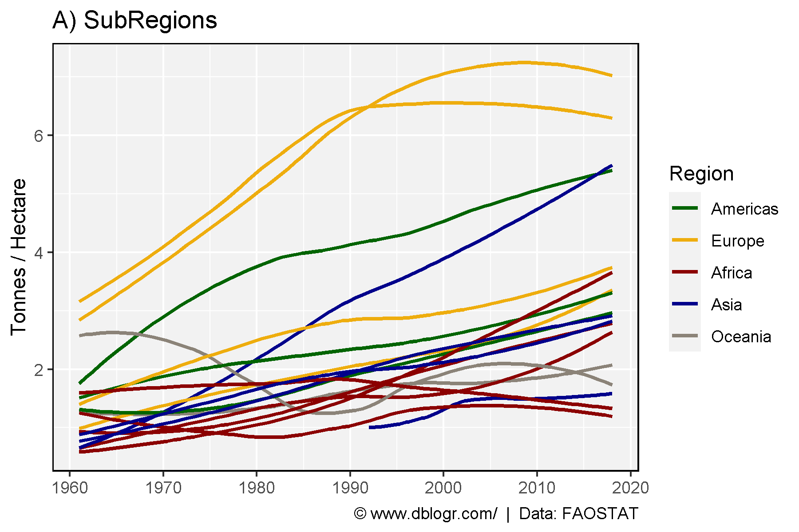
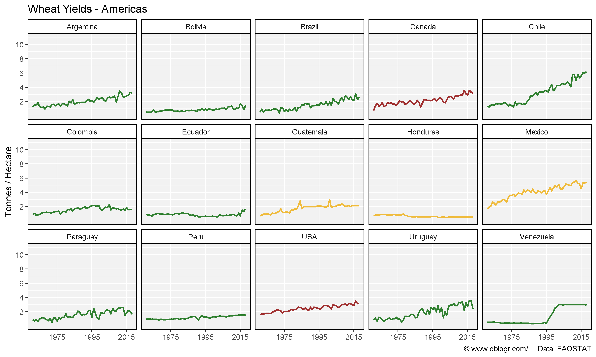
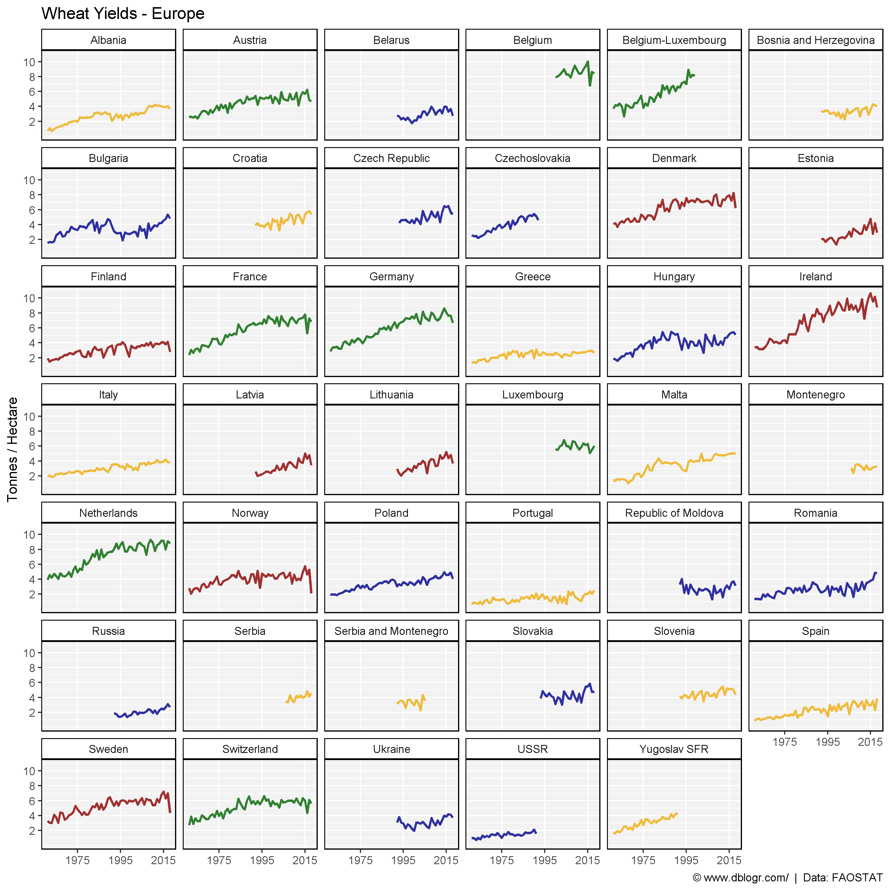
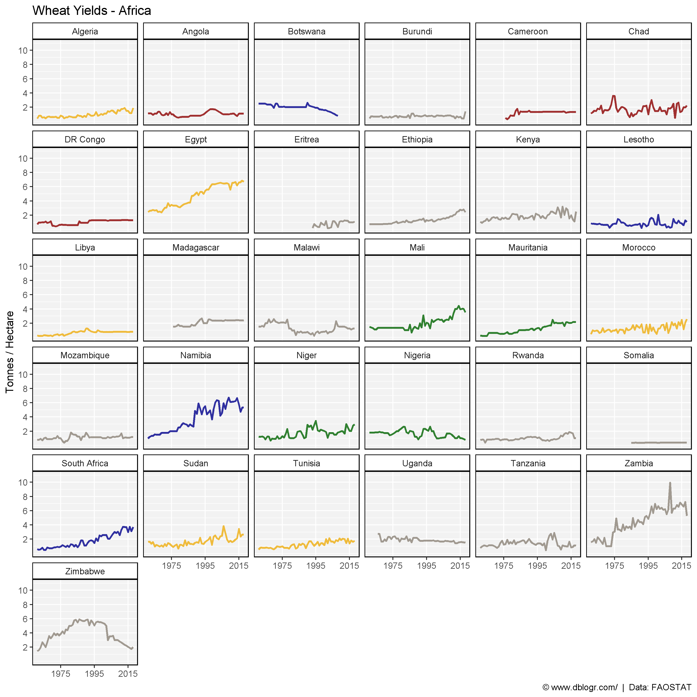
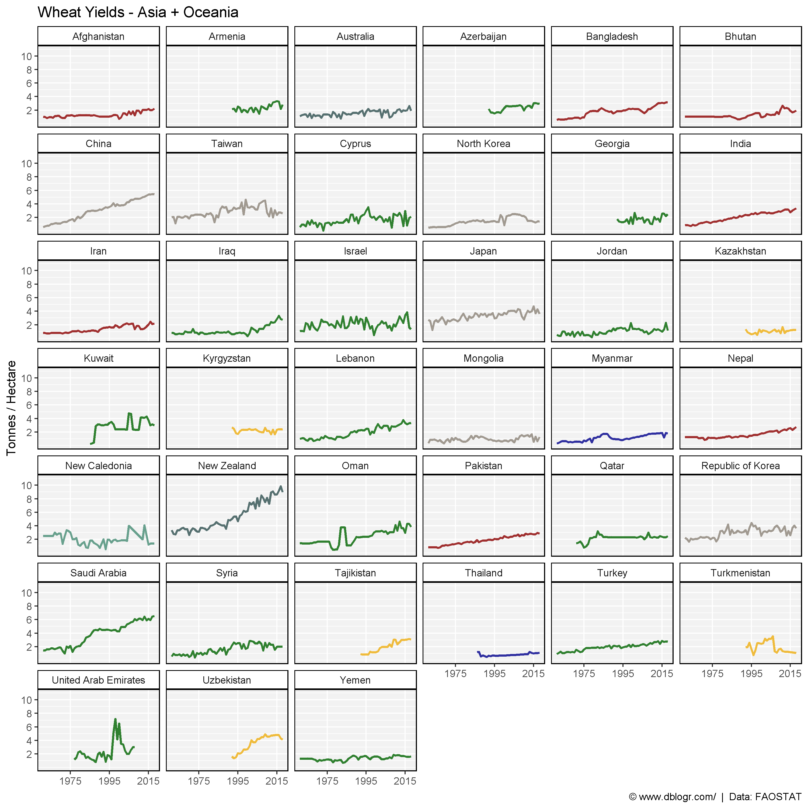
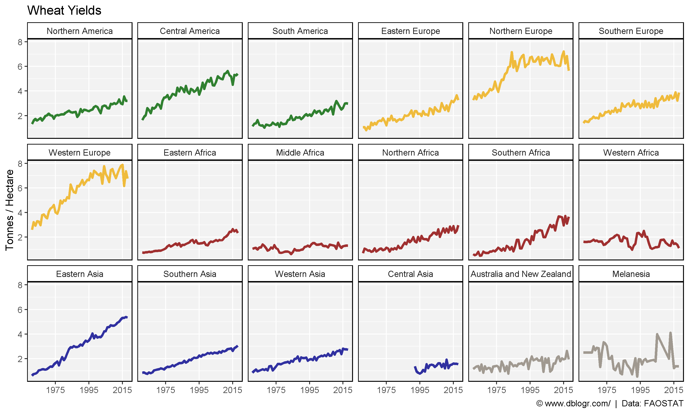
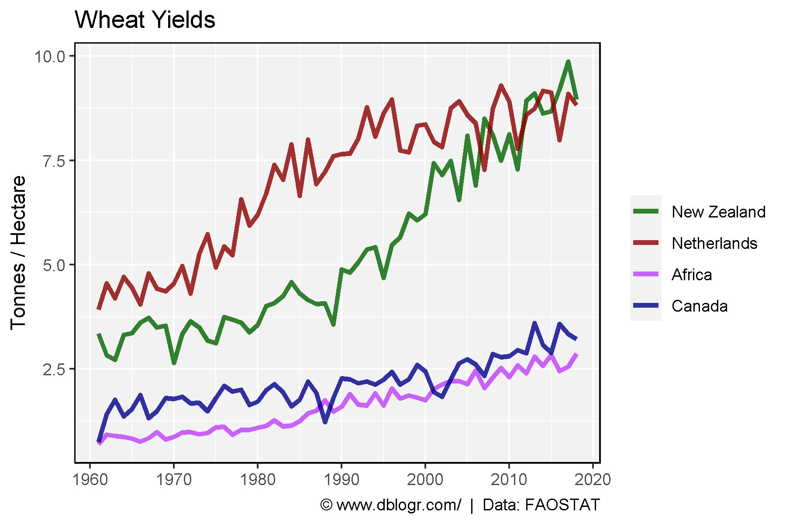

```{r setup, include = FALSE}
knitr::opts_chunk$set(echo = T, message = F, warning = F)
```

---

```{r}
# devtools::install_github("derekmichaelwright/agData")
library(agData) # Loads: tidyverse, ggpubr, ggbeeswarm, ggrepel
```

---

```{r}
# Prep data
colors <- c("darkgreen", "darkgoldenrod2", "darkred", "darkblue", "antiquewhite4")
xx <- agData_FAO_Crops %>% 
  filter(Crop == "Wheat", Measurement == "Yield", 
         Area %in% agData_FAO_Country_Table$SubRegion) %>%
  left_join(agData_FAO_Country_Table, by = c("Area"="SubRegion"))
# Plot
mp <- ggplot(xx, aes(x = Year, y = Value)) + 
  geom_smooth(aes(color = Region, group = Area), 
              method = "loess", se = F, alpha = 0.7) +
  scale_color_manual(values = colors) + 
  scale_x_continuous(breaks = seq(1960, 2020, 10)) +
  theme_agData() +
  labs(title = "A) SubRegions", y = "Tonnes / Hectare", x = NULL,
       caption = "\xa9 www.dblogr.com/  |  Data: FAOSTAT")
ggsave("wheat_yields_01.png", mp, width = 6, height = 4)
```



---

```{r}
# Prep data
xx <- agData_FAO_Crops %>% 
  filter(Crop == "Wheat", Measurement == "Yield", 
         Area %in% agData_FAO_Country_Table$Country) %>%
  left_join(agData_FAO_Country_Table, by = c("Area"="Country"))
x1 <- xx %>% filter(Region == "Americas")
x2 <- xx %>% filter(Region == "Europe")
x3 <- xx %>% filter(Region == "Africa")
x4 <- xx %>% filter(Region %in% c("Asia", "Oceania"))
# Create plot function
my_ggplot <- function(x, ncol){
  colors <- c("darkgreen", "darkgoldenrod2", "darkred", "darkblue", 
              "antiquewhite4", "darkslategrey", "aquamarine4")
  ggplot(x, aes(x = Year, y = Value, color = SubRegion) ) +
    geom_line(size = 1, alpha  = 0.8) +
    facet_wrap(Area ~ ., ncol = ncol) +
    theme_agData(legend.position = "none") +
    scale_color_manual(values = colors) +
    scale_x_continuous(breaks = seq(1975, 2015, by = 20), minor_breaks = NULL) +
    scale_y_continuous(breaks = c(2, 4, 6, 8, 10)) +
    coord_cartesian(ylim = c(0,11)) +
    labs(y = "Tonnes / Hectare", x = NULL,
         caption = "\xa9 www.dblogr.com/  |  Data: FAOSTAT")
}
# Plot
mp <- my_ggplot(x1, 5) + labs(title = "Wheat Yields - Americas")
ggsave("wheat_yields_02.png", mp, width = 10, height = 6)
```



---

```{r}
# Plot
mp <- my_ggplot(x2, 6) + labs(title = "Wheat Yields - Europe")
ggsave("wheat_yields_03.png", mp, width = 10, height = 10)
```



---

```{r}
# Plot
mp <- my_ggplot(x3, 6) + labs(title = "Wheat Yields - Africa")
ggsave("wheat_yields_04.png", mp, width = 10, height = 10)
```



---

```{r}
# Plot
mp <- my_ggplot(x4, 6) + labs(title = "Wheat Yields - Asia + Oceania")
ggsave("wheat_yields_05.png", mp, width = 10, height = 10)
```



---

```{r}
# Prep data
colors <- c("darkgreen", "darkgoldenrod2", "darkred", "darkblue", "antiquewhite4")
xx <- agData_FAO_Crops %>% 
  filter(Crop == "Wheat", Measurement == "Yield",
         Area %in% agData_FAO_Country_Table$SubRegion) %>%
  left_join(agData_FAO_Country_Table, by = c("Area"="SubRegion")) %>%
  arrange(Region) %>%
  mutate(Area = factor(Area, levels = unique(Area)))
# Plot
mp <- ggplot(xx, aes(x = Year, y = Value, color = Region) ) +
  geom_line(size = 1.25, alpha = 0.8) + 
  facet_wrap(Area~., ncol = 6) + 
  theme_agData() +
  theme_agData(legend.position = "none") +
  scale_color_manual(values = colors) +
  scale_x_continuous(breaks = seq(1975, 2015, by = 20), minor_breaks = NULL) +
  scale_y_continuous(breaks = c(2, 4, 6, 8)) +
  labs(title = "Wheat Yields", y = "Tonnes / Hectare", x = NULL,
       caption = "\xa9 www.dblogr.com/  |  Data: FAOSTAT")
ggsave("wheat_yields_06.png", mp, width = 10, height = 6)
```



---

```{r}
# Prep data
areas <- c("New Zealand", "Netherlands", "Africa", "Canada")
colors <- c("darkgreen", "darkred", "darkorchid1", "darkblue")
xx <- agData_FAO_Crops %>% 
  filter(Crop == "Wheat", Measurement == "Yield", 
         Area %in% areas) %>%
  mutate(Area = factor(Area, levels = areas))
# Plot
mp <- ggplot(xx, aes(x = Year, y = Value, color = Area)) +
  geom_line(size = 1.25, alpha = 0.8) +
  scale_color_manual(name = NULL, values = colors) +
  scale_x_continuous(breaks = seq(1960, 2020, 10)) +
  theme_agData() +
  labs(title = "Wheat Yields", x = NULL, y = "Tonnes / Hectare",
       caption = "\xa9 www.dblogr.com/  |  Data: FAOSTAT")
ggsave("wheat_yields_07.png", mp, width = 6, height = 4)
```

```{r echo = F}
ggsave("featured.png", mp, width = 6, height = 4)
```



---

&copy; Derek Michael Wright [www.dblogr.com/](https://dblogr.com/)