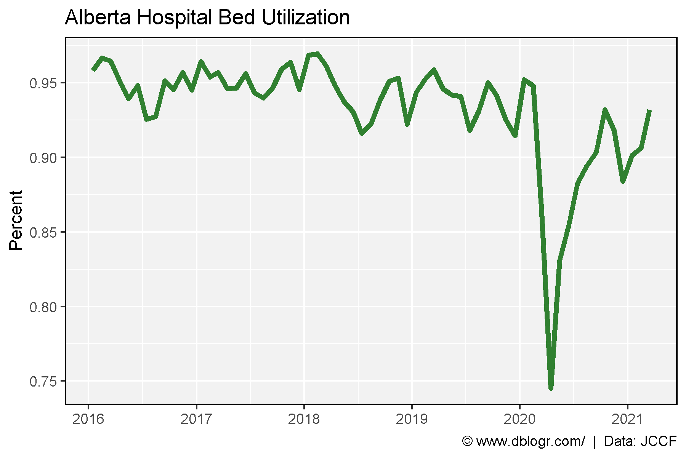
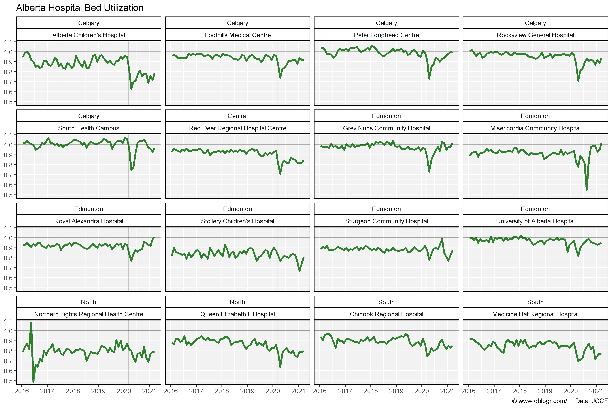
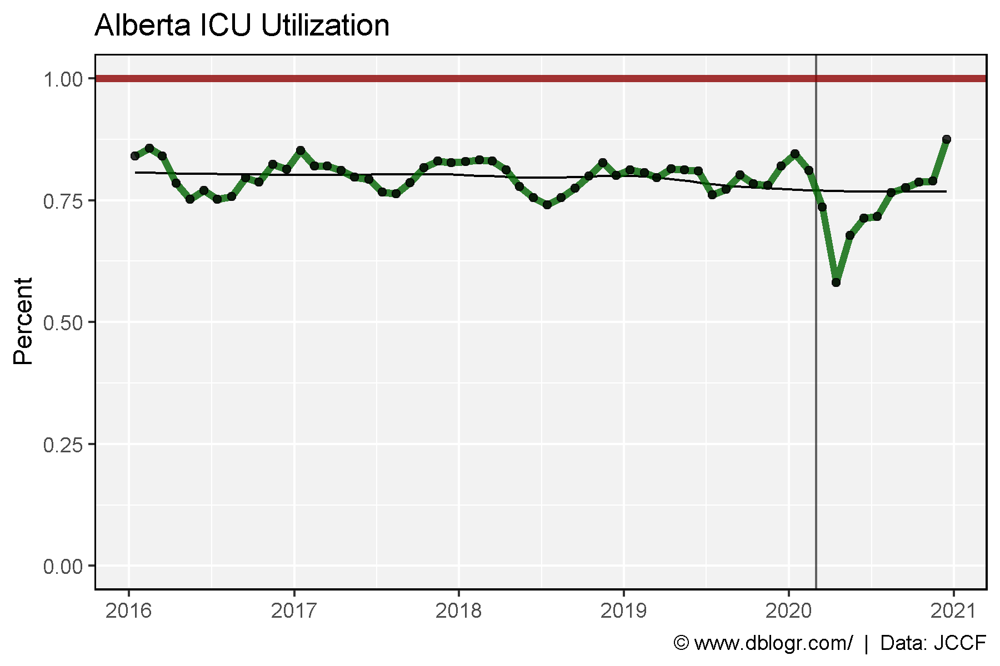
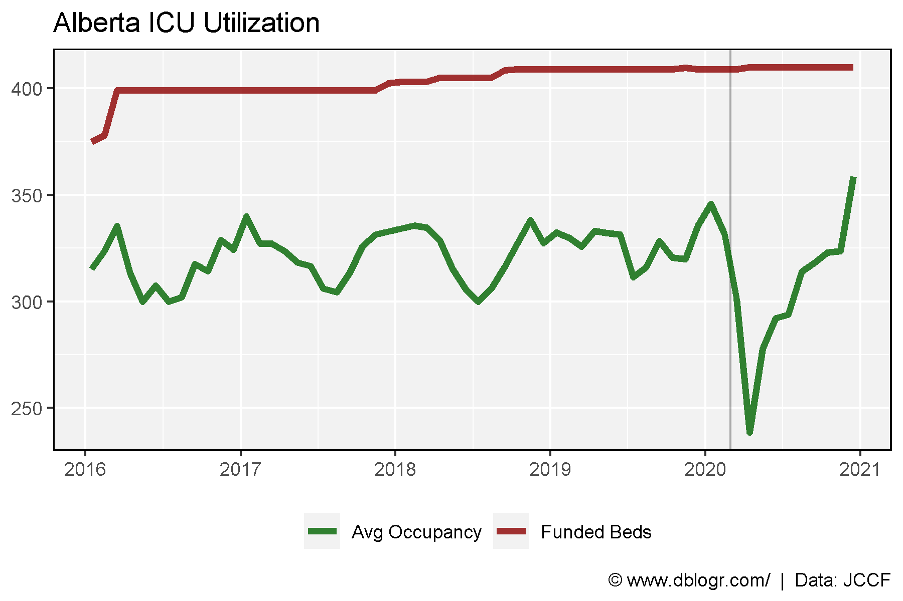
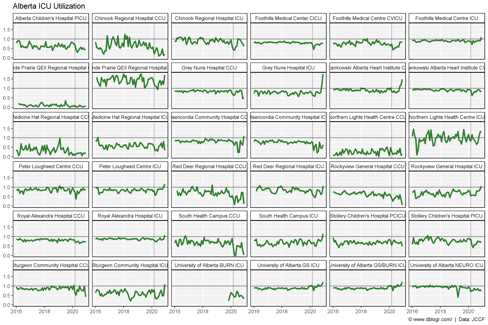
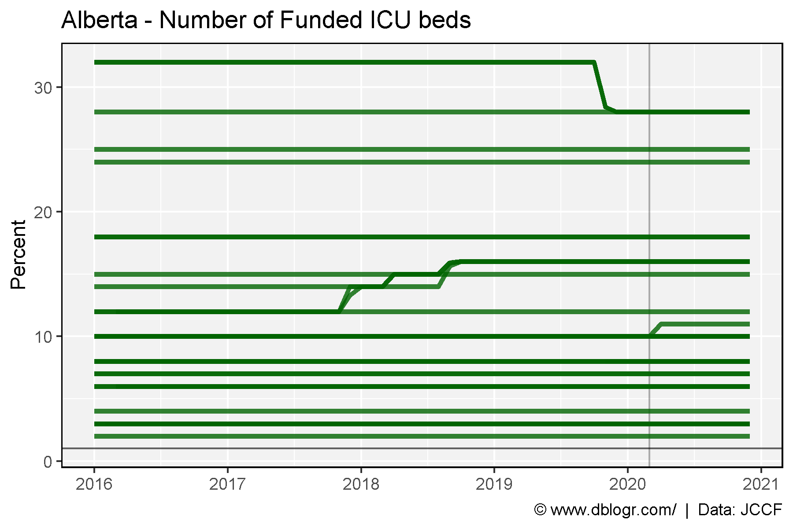

```{r setup, include=FALSE}
knitr::opts_chunk$set(echo = T, message = F, warning = F)
```

---

# Data Sources

https://www.jccf.ca/alberta-governments-own-data-shows-hospital-bed-and-icu-utilization-at-five-year-low/

```{r echo = F}
downloadthis::download_link(
  link = "https://github.com/derekmichaelwright/dblogr/blob/master/content/dblogr/alberta_icu/2021-05-05-FOIP-Request-with-JCCF-calculations.xlsx",
  button_label = "2021-05-05-FOIP-Request-with-JCCF-calculations.xlsx",
  button_type = "success",
  has_icon = TRUE,
  icon = "fa fa-save",
  self_contained = FALSE
)
```

---

# Prepare Data

```{r}
# devtools::install_github("derekmichaelwright/agData")
library(agData) # Loads: tidyverse, ggpubr, ggbeeswarm, ggrepel
library(readxl) # read_xlsx()
```

# Prepare the Data

```{r}
# Hospital bed capacity
d1 <- read_xlsx("2021-05-05-FOIP-Request-with-JCCF-calculations.xlsx", 
                "AcuteCare_P2_Occupancy", range = "D70:J82") %>%
  gather(Year, Value, 2:ncol(.)) %>%
  filter(!is.na(Value)) %>%
  mutate(Date = as.Date(paste(Year, Month, "15", sep = "-"), format = "%Y-%b-%d"))
d2 <- read_xlsx("2021-05-05-FOIP-Request-with-JCCF-calculations.xlsx", 
                "AcuteCare_P2_Occupancy", range = "A2:BN50") %>%
  rename(Measurement=Column1) %>%
  mutate(Zone = fill_NA(Zone),
         Facility = fill_NA(Facility)) %>%
  gather(Month, Value, 4:ncol(.)) %>%
  mutate(Year = c(rep(2016:2020, each = (12*48)), rep(2021, (3*48))),
         Month = substr(Month, 1, 3),
         Date = as.Date(paste(Year, Month, "15", sep = "-"), format = "%Y-%b-%d"))
# ICU capacity
d3 <- read_xlsx("2021-05-05-FOIP-Request-with-JCCF-calculations.xlsx", 
                "ICU_P2_CapacityUtilization", range = "A2142:F2154") %>%
  rename(Month=1) %>%
  gather(Year, Value, 2:ncol(.)) %>%
  mutate(Date = as.Date(paste(Year, Month, "15", sep = "-"), format = "%Y-%b-%d"))
d4 <- read_xlsx("2021-05-05-FOIP-Request-with-JCCF-calculations.xlsx", 
                "ICU_P2_CapacityUtilization", range = "A2124:P2136") %>%
  rename(Month=1) %>%
  gather(Measurement, Value, 2:ncol(.)) %>%
  mutate(Year = rep(2016:2020, each = (12*3)),
         Date = as.Date(paste(Year, Month, "15", sep = "-"), format = "%Y-%b-%d"),
         Measurement = ifelse(grepl("Funded Beds", Measurement), "Funded Beds", Measurement),
         Measurement = ifelse(grepl("Avg Occupancy", Measurement), "Avg Occupancy", Measurement),
         Measurement = ifelse(grepl("Utilization", Measurement), "Utilization", Measurement))
d5 <- read_xlsx("2021-05-05-FOIP-Request-with-JCCF-calculations.xlsx", 
                "ICU_P2_CapacityUtilization", range = "A2:Q2109") %>%
  rename(Date=1) %>%
  mutate(Date = as.Date(Date))
```

---

# Hospital Bed Capacity

## Alberta

```{r}
# Plot
mp <- ggplot(d1, aes(x = Date, y = Value)) +
  geom_line(size = 1.5, alpha = 0.8, color = "darkgreen") +
  scale_x_date(date_breaks = "year", date_labels = "%Y") +
  theme_agData() +
  labs(title = "Alberta Hospital Bed Utilization", 
       y = "Percent", x = NULL,
       caption = "\xa9 www.dblogr.com/  |  Data: JCCF")
ggsave("alberta_icu_01.png", mp, width = 6, height = 4)
```



---

## Region

```{r}
# Prep data
xx <- d2 %>% filter(Measurement == "Occupancy")
# Plot
mp <- ggplot(xx, aes(x = Date, y = Value)) +
  geom_hline(yintercept = 1, alpha = 0.6) +
  geom_vline(xintercept = as.Date("2020-03-01"), alpha = 0.3) +
  geom_line(size = 1.25, alpha = 0.8, color = "darkgreen") +
  scale_x_date(date_breaks = "year", date_labels = "%Y") +
  facet_wrap(Zone + Facility ~ .) +
  theme_agData() +
  labs(title = "Alberta Hospital Bed Utilization", y = NULL, x = NULL,
       caption = "\xa9 www.dblogr.com/  |  Data: JCCF")
ggsave("alberta_icu_02.png", mp, width = 12, height = 8)
```



## Amount

```{r}
# Prep data
xx <- d2 %>% filter(Measurement == "Beds available")
# Plot
mp <- ggplot(xx, aes(x = Date, y = Value, group = Facility)) +
  geom_vline(xintercept = as.Date("2020-03-01"), alpha = 0.3) +
  geom_line(size = 0.75, alpha = 0.5, color = "darkgreen") +
  scale_x_date(date_breaks = "year", date_labels = "%Y") +
  theme_agData() +
  labs(title = "Alberta - Available Hospital Beds", 
       y = "Percent", x = NULL,
       caption = "\xa9 www.dblogr.com/  |  Data: JCCF")
ggsave("alberta_icu_03.png", mp, width = 6, height = 4)
```



---

# ICU Utilization

```{r}
# Plot
mp <- ggplot(d3, aes(x = Date, y = Value)) +
  geom_vline(xintercept = as.Date("2020-03-01"), alpha = 0.3) +
  geom_line(size = 1.5, alpha = 0.8, color = "darkgreen") +
  scale_x_date(date_breaks = "year", date_labels = "%Y") +
  theme_agData() +
  labs(title = "Alberta ICU Utilization", 
       y = "Percent", x = NULL,
       caption = "\xa9 www.dblogr.com/  |  Data: JCCF")
ggsave("alberta_icu_03.png", mp, width = 6, height = 4)
```


---

```{r}
# Prep data
xx <- d4 %>% filter(Measurement != "Utilization")
# Plot
mp <- ggplot(xx, aes(x = Date, y = Value, color = Measurement)) +
  geom_vline(xintercept = as.Date("2020-03-01"), alpha = 0.3) +
  geom_line(size = 1.5, alpha = 0.8) +
  scale_color_manual(name = NULL, values = c("darkgreen", "darkred")) +
  scale_x_date(date_breaks = "year", date_labels = "%Y") +
  theme_agData(legend.position = "bottom") +
  labs(title = "Alberta ICU Utilization", y = NULL, x = NULL,
       caption = "\xa9 www.dblogr.com/  |  Data: JCCF")
ggsave("alberta_icu_04.png", mp, width = 6, height = 4)
```

```{r echo = F}
ggsave("featured.png", mp, width = 6, height = 4)
```



---

```{r}
# Plot
mp <- ggplot(d5, aes(x = Date, y = AVG_OCC_PCT)) +
  geom_hline(yintercept = 1, alpha = 0.6) +
  geom_vline(xintercept = as.Date("2020-03-01"), alpha = 0.3) +
  geom_line(size = 1.25, alpha = 0.8, color = "darkgreen") +
  facet_wrap(REPORTS_SITE_NAME ~ .) +
  theme_agData() +
  labs(title = "Alberta ICU Utilization", y = NULL, x = NULL,
       caption = "\xa9 www.dblogr.com/  |  Data: JCCF")
ggsave("alberta_icu_05.png", mp, width = 12, height = 8)
```



---

```{r}
# Plot
mp <- ggplot(d5, aes(x = Date, y = AVG_FUNDED_BEDS, group = REPORTS_SITE_NAME)) +
  geom_hline(yintercept = 1, alpha = 0.6) +
  geom_vline(xintercept = as.Date("2020-03-01"), alpha = 0.3) +
  geom_line(size = 1.25, alpha = 0.8, color = "darkgreen") +
  scale_x_date(date_breaks = "year", date_labels = "%Y") +
  theme_agData() +
  labs(title = "Alberta - Number of Funded ICU beds", y = "Percent", x = NULL,
       caption = "\xa9 www.dblogr.com/  |  Data: JCCF")
ggsave("alberta_icu_06.png", mp, width = 6, height = 4)
```



---

&copy; Derek Michael Wright [www.dblogr.com/](https://dblogr.com/)