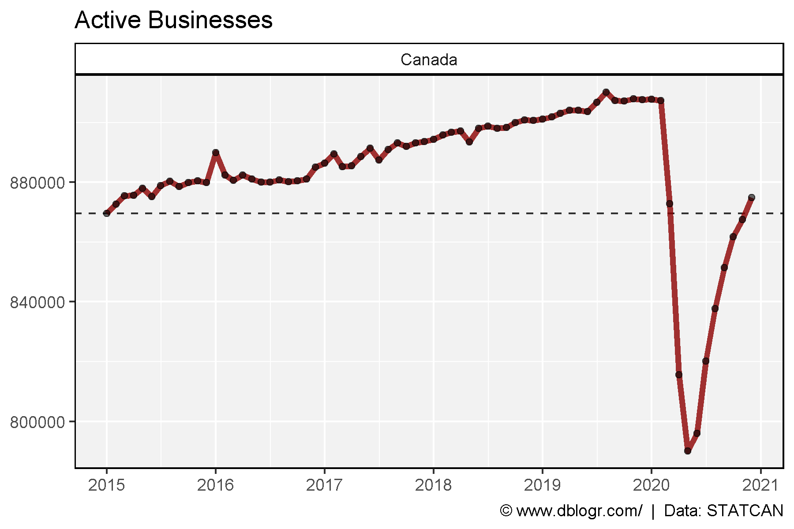
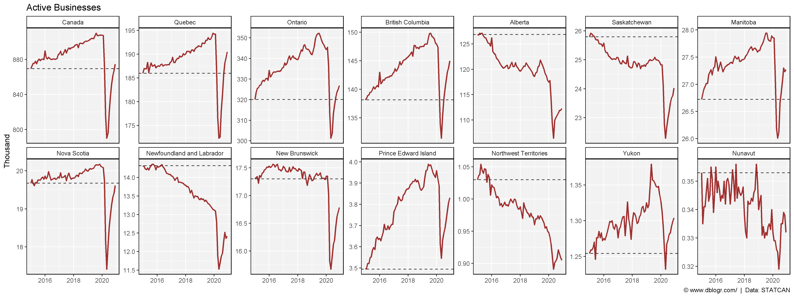
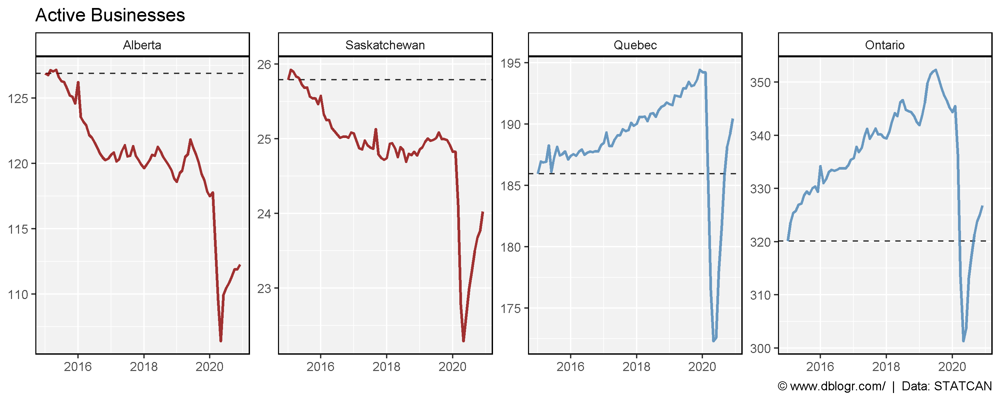
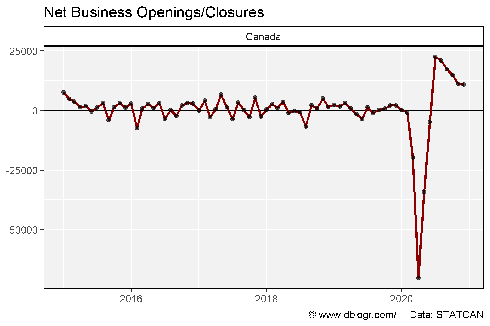
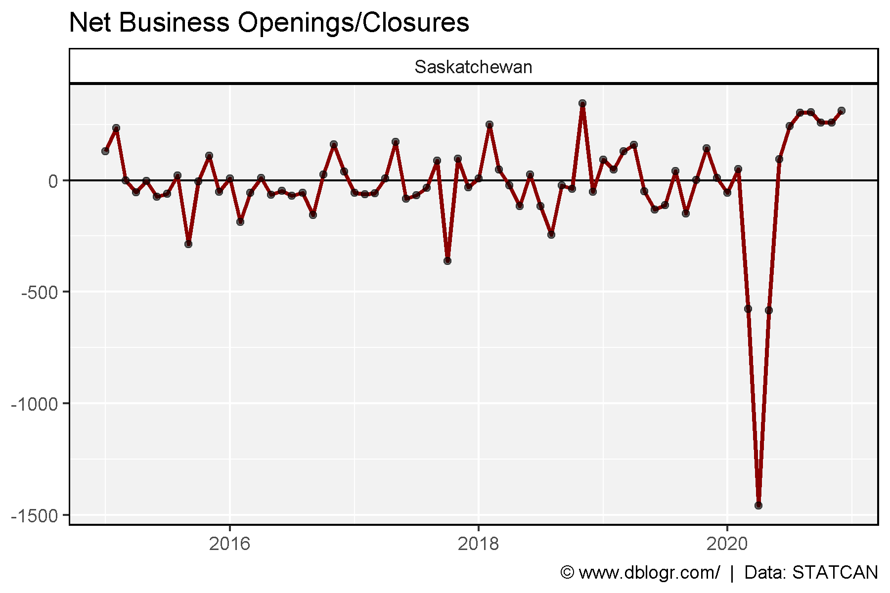
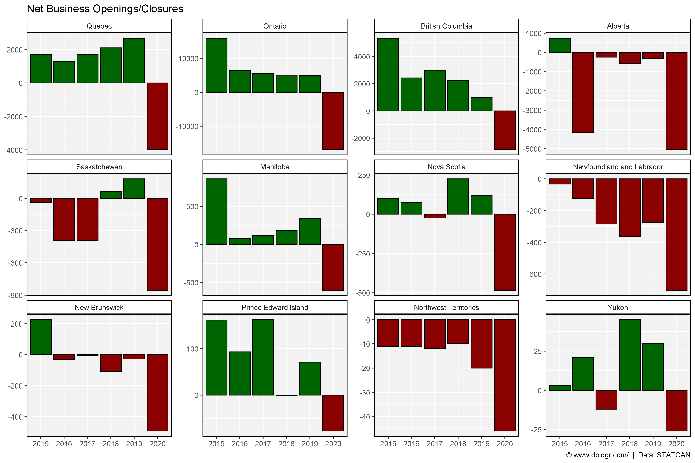
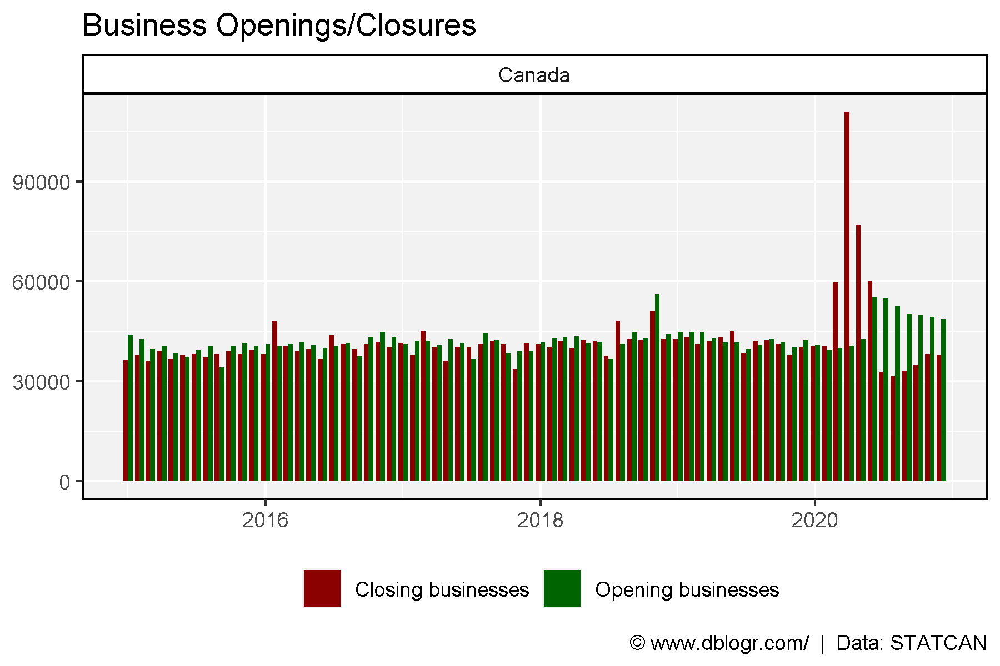
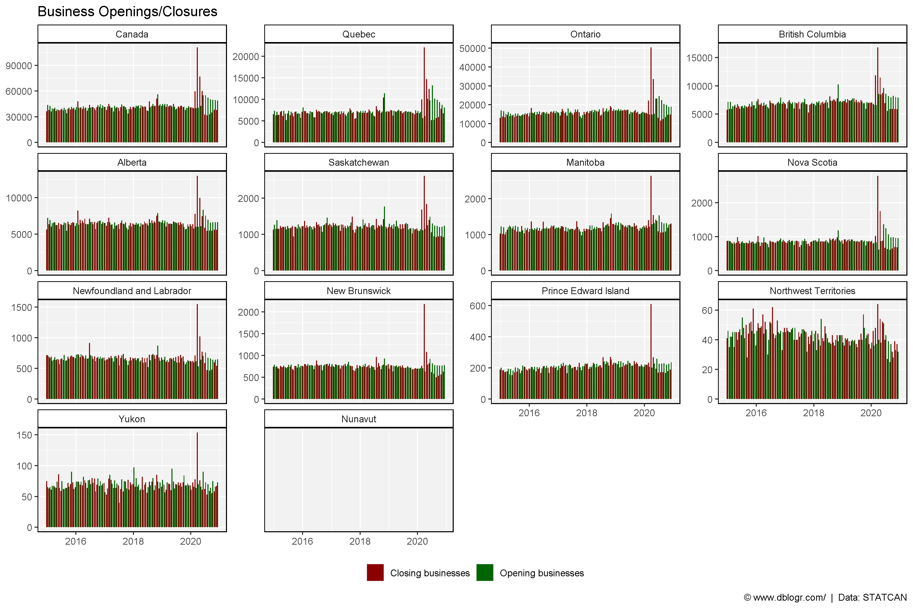

```{r setup, include=FALSE}
knitr::opts_chunk$set(echo = T, message = F, warning = F)
```

---

# Data Source

STATCAN data Tables: 33-10-0270-01

https://www150.statcan.gc.ca/n1/pub/11-626-x/11-626-x2020014-eng.htm

[**< Download Table 33-10-0270-01 >**](https://github.com/derekmichaelwright/dblogr/blob/master/content/dblogr/canada_businesses/3310027001_databaseLoadingData.csv)

```{r echo = F}
downloadthis::download_link(
  link = "https://github.com/derekmichaelwright/dblogr/blob/master/content/dblogr/canada_businesses/3310027001_databaseLoadingData.csv",
  button_label = "STATCAN Table 33-10-0270-01",
  button_type = "success",
  has_icon = TRUE,
  icon = "fa fa-save",
  self_contained = FALSE
)
```

---

# Prepare Data

```{r}
# devtools::install_github("derekmichaelwright/agData")
library(agData) # Loads: tidyverse, ggpubr, ggbeeswarm, ggrepel
```

```{r}
# Prep data
areas <- c("Canada", "Quebec", "Ontario", "British Columbia", 
           "Alberta", "Saskatchewan", "Manitoba", "Nova Scotia",
           "Newfoundland and Labrador", "New Brunswick", "Prince Edward Island", 
           "Northwest Territories", "Yukon", "Nunavut") 
a_ord <- c(1,6,7,11, 10,9,8,4, 2,5,3, 13,12,14) # unique(dd$GEO)
dd <- read.csv("3310027001_databaseLoadingData.csv") %>%
  select(Area=GEO, Date=1, Measurement=Business.dynamics.measure, Value=VALUE) %>%
  filter(!is.na(Value)) %>%
  mutate(Area = plyr::mapvalues(Area, unique(.$Area)[a_ord], areas),
         Area = factor(Area, levels = areas),
         Date = as.Date(paste0(Date, "-01"), format = "%Y-%m-%d")) %>%
  spread(Measurement, Value) %>%
  mutate(Difference = `Opening businesses` - `Closing businesses`)
```

# Active Businesses

```{r}
# Prep data
xx <- dd %>% filter(Area == "Canada")
x1 <- xx %>% filter(Date == min(Date)) %>% pull(`Active businesses`)
# Plot
mp <- ggplot(xx, aes(x = Date, y = `Active businesses`)) +
  geom_hline(yintercept = x1, lty = 2, alpha = 0.8) +
  geom_line(color = "darkred", size = 1.5, alpha = 0.8) +
  geom_point(alpha = 0.6) +
  facet_grid(. ~ Area) +
  scale_fill_manual(name = NULL, values = c("darkred", "darkgreen")) +
  scale_x_date(date_breaks = "1 year", date_labels = "%Y") +
  theme_agData(legend.position = "bottom") +
  labs(title = "Active Businesses", y = NULL, x = NULL,
       caption = "\xa9 www.dblogr.com/  |  Data: STATCAN")
ggsave("canada_businesses_01.png", mp, width = 6, height = 4)
```



---

```{r}
# Prep data
x1 <- dd %>% filter(Date == min(Date))
# Plot
mp <- ggplot(dd, aes(x = Date, y = `Active businesses`/ 1000)) +
  geom_hline(data = x1, aes(yintercept = `Active businesses` / 1000), lty = 2, alpha = 0.8) +
  geom_line(color = "darkred", size = 1, alpha = 0.8) +
  facet_wrap(. ~ Area, scales = "free_y", ncol = 7) +
  scale_fill_manual(name = NULL, values = c("darkred", "darkgreen")) +
  theme_agData(legend.position = "bottom") +
  labs(title = "Active Businesses", y = "Thousand", x = NULL,
       caption = "\xa9 www.dblogr.com/  |  Data: STATCAN")
ggsave("canada_businesses_02.png", mp, width = 16, height = 6)
```



---

```{r}
# Prep data
areas <- c("Alberta", "Saskatchewan", "Quebec", "Ontario")
colors <- c("darkred", "darkred", "steelblue","steelblue")
xx <- dd %>% filter(Area %in% areas) %>%
  mutate(Area = factor(Area, levels = areas))
x1 <- xx %>% filter(Date == min(Date))
# Plot
mp <- ggplot(xx, aes(x = Date, y = `Active businesses` / 1000)) +
  geom_hline(data = x1, aes(yintercept = `Active businesses` / 1000), lty = 2, alpha = 0.8) +
  geom_line(aes(color = Area), size = 1, alpha = 0.8) +
  facet_wrap(. ~ Area, scales = "free_y", ncol = 7) +
  scale_color_manual(name = NULL, values = colors) +
  theme_agData(legend.position = "none") +
  labs(title = "Active Businesses", y = NULL, x = NULL,
       caption = "\xa9 www.dblogr.com/  |  Data: STATCAN")
ggsave("canada_businesses_03.png", mp, width = 10, height = 4)
```



---

# Business Closures

```{r}
sum(dd %>% filter(Area == "Canada", Date > "2020-01-01") %>% pull(Difference))
```

```{r}
# Prep data
xx <- dd %>% filter(Area == "Canada")
# Plot
mp <- ggplot(xx, aes(x = Date, y = Difference)) +
  geom_hline(yintercept = 0) +
  geom_line(size = 1, color = "darkred") + 
  geom_point(alpha = 0.6) +
  facet_grid(. ~ Area) +
  theme_agData(legend.position = "bottom") +
  labs(title = "Net Business Openings/Closures", y = NULL, x = NULL,
       caption = "\xa9 www.dblogr.com/  |  Data: STATCAN")
ggsave("canada_businesses_04.png", mp, width = 6, height = 4)
```

```{r echo = F}
ggsave("featured.png", mp, width = 6, height = 4)
```



---

```{r}
# Prep data
xx <- dd %>% filter(Area == "Saskatchewan")
# Plot
mp <- ggplot(xx, aes(x = Date, y = Difference)) +
  geom_hline(yintercept = 0) +
  geom_line(size = 1, color = "darkred") + 
  geom_point(alpha = 0.6) +
  facet_grid(. ~ Area) +
  theme_agData(legend.position = "bottom") +
  labs(title = "Net Business Openings/Closures", y = NULL, x = NULL,
       caption = "\xa9 www.dblogr.com/  |  Data: STATCAN")
ggsave("canada_businesses_05.png", mp, width = 6, height = 4)
```



---

```{r}
# Prep data
xx <- dd %>% 
  separate(Date, c("Year","Month","Day")) %>% 
  group_by(Area, Year) %>%
  summarise(Businesses = sum(Difference)) %>%
  ungroup() %>% 
  mutate(Pos = ifelse(Businesses > 0, "Yes", "No"))
xc <- xx %>% filter(Area == "Canada")
# Plot
mp <- ggplot(xc, aes(x = Year, y = Businesses, fill = Pos)) +
  geom_bar(stat = "identity", color = "black") + 
  facet_grid(. ~ Area) +
  scale_fill_manual(values = c("darkred","darkgreen")) +
  theme_agData(legend.position = "none") +
  labs(title = "Net Business Openings/Closures", y = NULL, x = NULL,
       caption = "\xa9 www.dblogr.com/  |  Data: STATCAN")
ggsave("canada_businesses_06.png", mp, width = 6, height = 4)
```



---

```{r}
# Prep data
xx <- xx %>% filter(!Area %in% c("Canada", "Nunavut"))
# Plot
mp <- ggplot(xx, aes(x = Year, y = Businesses, fill = Pos)) +
  geom_bar(stat = "identity", color = "black") + 
  facet_wrap(Area ~ ., scales = "free_y", ncol = ) +
  scale_fill_manual(values = c("darkred","darkgreen")) +
  theme_agData(legend.position = "none") +
  labs(title = "Net Business Openings/Closures", y = NULL, x = NULL,
       caption = "\xa9 www.dblogr.com/  |  Data: STATCAN")
ggsave("canada_businesses_07.png", mp, width = 12, height = 8)
```


---

# Openings Vs Closings

```{r}
# Prep data
xx <- dd %>% 
  select(Area, Date, `Opening businesses`, `Closing businesses`) %>%
  gather(Measurement, Value, `Opening businesses`, `Closing businesses`)
x1 <- xx %>% filter(Area == "Canada")
# Plot
mp <- ggplot(x1, aes(x = Date, y = Value, fill = Measurement)) +
  geom_bar(stat = "identity", position = "dodge") +
  scale_fill_manual(name = NULL, values = c("darkred", "darkgreen")) +
  facet_grid(. ~ Area) +
  theme_agData(legend.position = "bottom") +
  labs(title = "Business Openings/Closures", y = NULL, x = NULL,
       caption = "\xa9 www.dblogr.com/  |  Data: STATCAN")
ggsave("canada_businesses_08.png", mp, width = 6, height = 4)
```



---

```{r}
# Plot
mp <- ggplot(xx, aes(x = Date, y = Value, fill = Measurement)) +
  geom_bar(stat = "identity", position = "dodge") +
  facet_wrap(Area ~ ., scales = "free_y") +
  scale_fill_manual(name = NULL, values = c("darkred", "darkgreen")) +
  theme_agData(legend.position = "bottom") +
  labs(title = "Business Openings/Closures", y = NULL, x = NULL,
       caption = "\xa9 www.dblogr.com/  |  Data: STATCAN")
ggsave("canada_businesses_09.png", mp, width = 12, height = 8)
```



---

&copy; Derek Michael Wright [www.dblogr.com/](https://dblogr.com/)