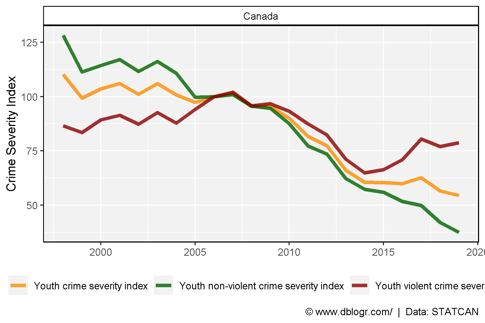

```{r setup, include=FALSE}
knitr::opts_chunk$set(echo = TRUE, message = F, warning = F)
```

---

# Data

## Data Source

https://www150.statcan.gc.ca/t1/tbl1/en/tv.action?pid=3510002601

https://www150.statcan.gc.ca/n1/daily-quotidien/210329/dq210329a-eng.htm

```{r echo = F}
downloadthis::download_link(
  link = "https://github.com/derekmichaelwright/dblogr/blob/master/content/dblogr/canada_crime/3510002601_databaseLoadingData.csv",
  button_label = "3510002601_databaseLoadingData.csv",
  button_type = "success",
  has_icon = TRUE,
  icon = "fa fa-save",
  self_contained = FALSE
)
```

## Prep Data

```{r}
# devtools::install_github("derekmichaelwright/agData")
library(agData) # Loads: tidyverse, ggpubr, ggbeeswarm, ggrepel
# Prep data
dd <- read.csv("3510002601_databaseLoadingData.csv") %>%
  select(Year=1, Area=GEO, Measurement=Statistics, Unit=UOM, Value=VALUE)
d1 <- dd %>% filter(!grepl("Youth",Measurement))
d2 <- dd %>% filter(grepl("Youth",Measurement))
```

# Crime Severity Index

```{r}
# Prep data
colors <- c("darkorange", "darkgreen", "darkred")
xx <- d1 %>% filter(Area == "Canada")
# Plot
mp <- ggplot(xx, aes(x = Year, y = Value, color = Measurement)) + 
  geom_line(size = 1.5, alpha = 0.8) +
  facet_wrap(Area ~ .) +
  scale_color_manual(name = NULL, values = colors) +
  theme_agData(legend.position = "bottom") +
  labs(y = "Crime Severity Index", x = NULL,
       caption = "\xa9 www.dblogr.com/  |  Data: STATCAN")
ggsave("canada_crime_01.png", mp, width = 6, height = 4)
```

```{r echo = F}
ggsave("featured.png", mp, width = 6, height = 4)
```


---

# Youth Crime Severity Index

```{r}
# Prep data
colors <- c("darkorange", "darkgreen", "darkred")
xx <- d2 %>% filter(Area == "Canada")
# Plot
mp <- ggplot(xx, aes(x = Year, y = Value, color = Measurement)) + 
  geom_line(size = 1.5, alpha = 0.8) +
  facet_wrap(Area ~ .) +
  scale_color_manual(name = NULL, values = colors) +
  theme_agData(legend.position = "bottom") +
  labs(y = "Crime Severity Index", x = NULL,
       caption = "\xa9 www.dblogr.com/  |  Data: STATCAN")
ggsave("canada_crime_02.png", mp, width = 6, height = 4)
```



---

&copy; Derek Michael Wright 2020 [www.dblogr.com/](https://dblogr.netlify.com/)