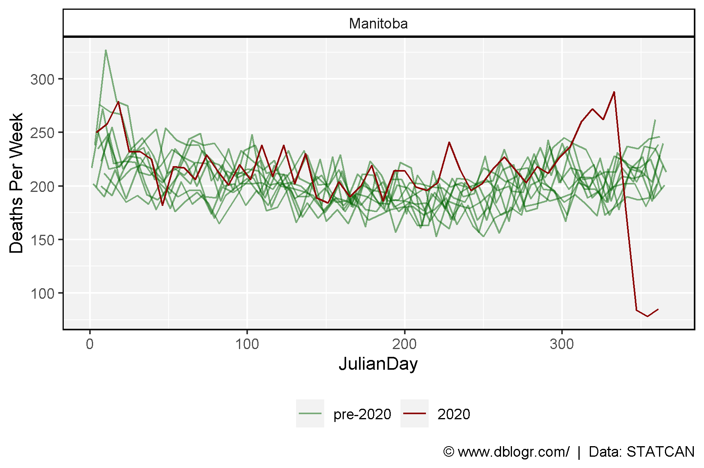
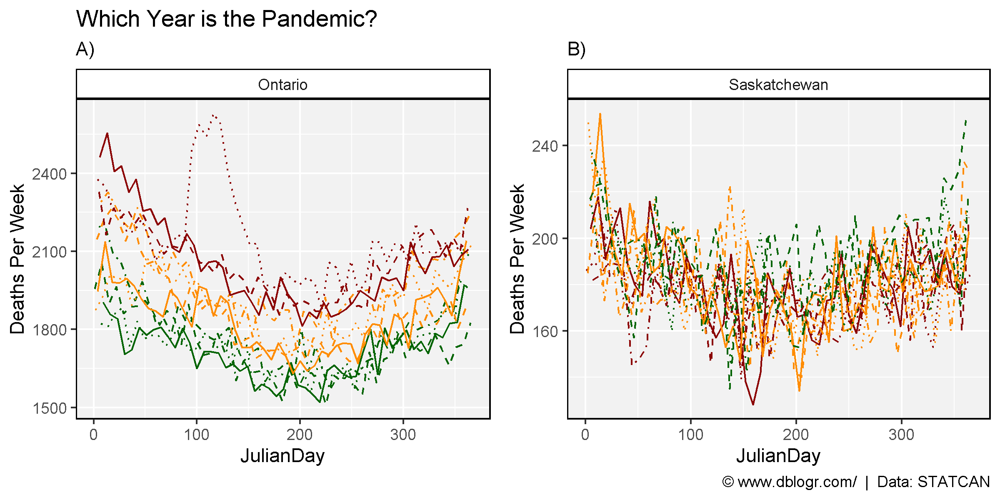
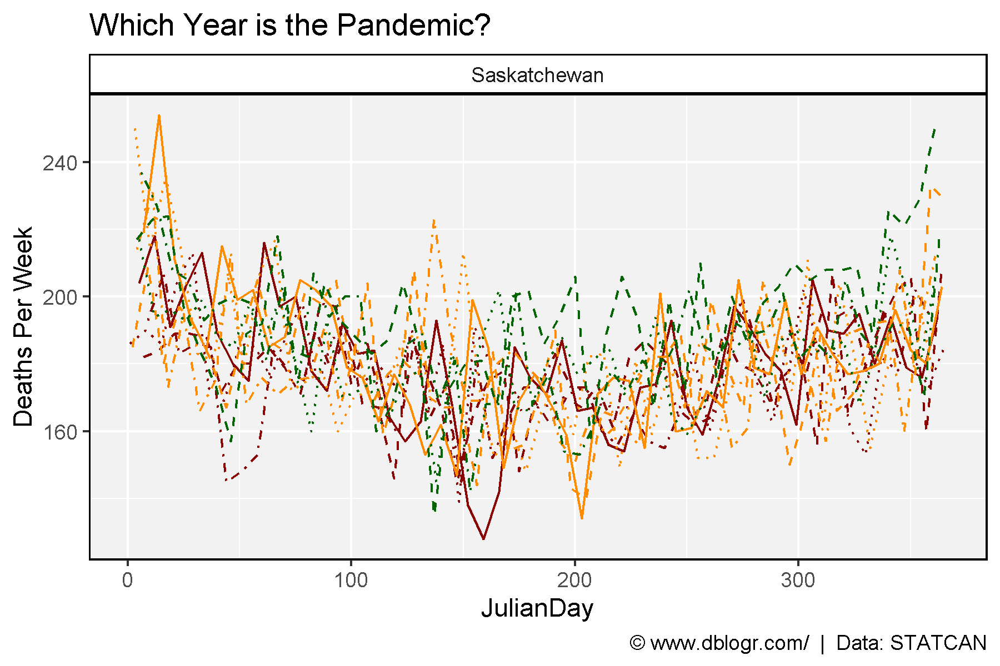
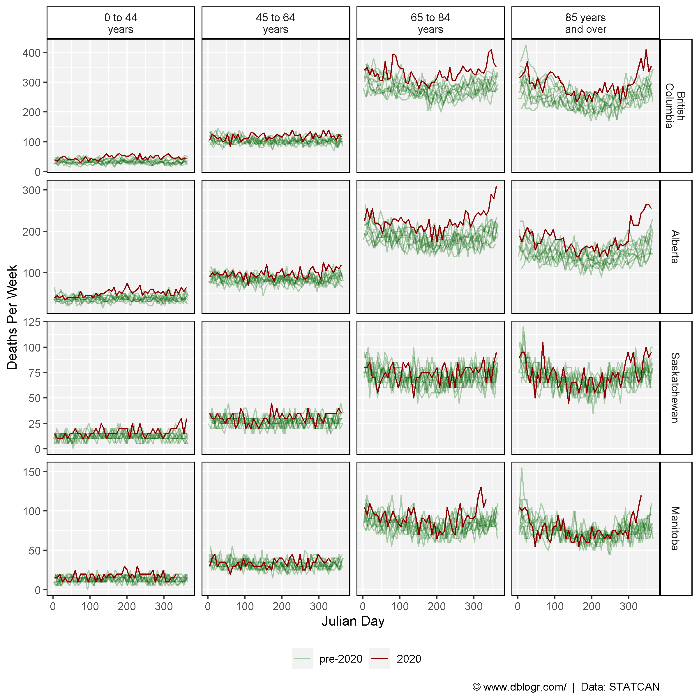
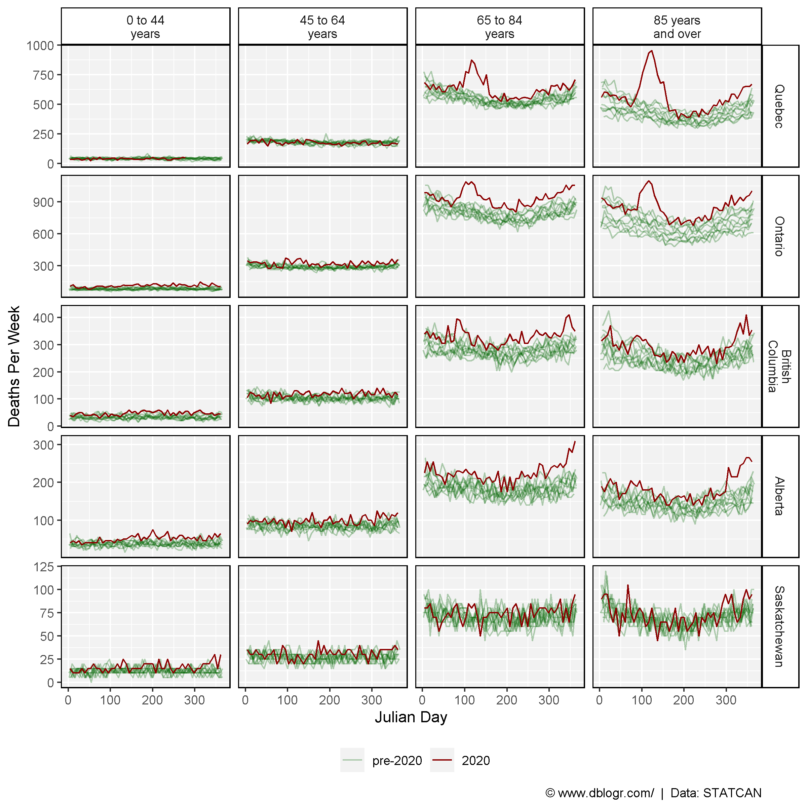
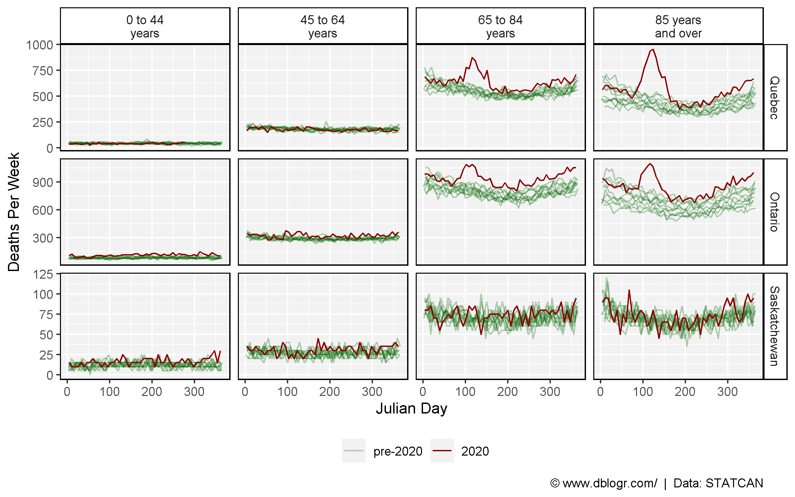
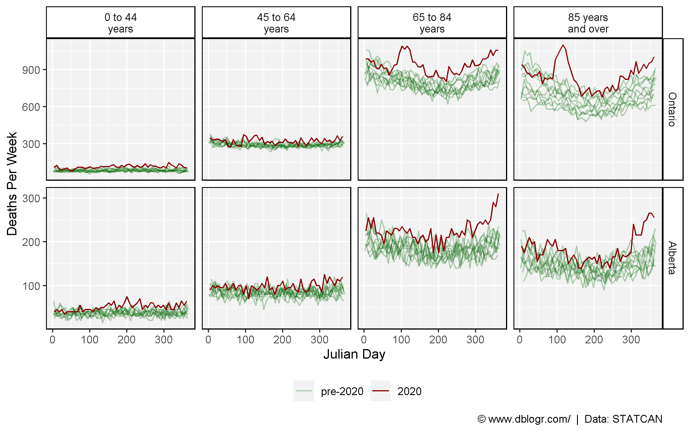

```{r setup, include=FALSE}
knitr::opts_chunk$set(echo = T, message = F, warning = F)
```

---

# STATCAN Interactive Graph

https://www150.statcan.gc.ca/n1/pub/71-607-x/71-607-x2020017-eng.htm

# Data Sources

https://www150.statcan.gc.ca/t1/tbl1/en/cv.action?pid=1310078301

https://www150.statcan.gc.ca/t1/tbl1/en/cv.action?pid=1310076801

https://www150.statcan.gc.ca/t1/tbl1/en/cv.action?pid=1310070801

```{r echo = F}
downloadthis::download_link(
  link = "https://github.com/derekmichaelwright/dblogr/blob/master/content/dblogr/canada_deaths/1310078301_databaseLoadingData.csv",
  button_label = "STATCAN Table 13-10-0783-01",
  button_type = "success",
  has_icon = TRUE,
  icon = "fa fa-save",
  self_contained = FALSE
)
downloadthis::download_link(
  link = "https://github.com/derekmichaelwright/dblogr/blob/master/content/dblogr/canada_deaths/1310076801_databaseLoadingData.csv",
  button_label = "STATCAN Table 13-10-0768-01",
  button_type = "success",
  has_icon = TRUE,
  icon = "fa fa-save",
  self_contained = FALSE
)
downloadthis::download_link(
  link = "(https://github.com/derekmichaelwright/dblogr/blob/master/content/dblogr/canada_deaths/1310070801_databaseLoadingData.csv",
  button_label = "STATCAN Table 13-10-0708-01",
  button_type = "success",
  has_icon = TRUE,
  icon = "fa fa-save",
  self_contained = FALSE
)
```

---

# Prepare Data

```{r}
# devtools::install_github("derekmichaelwright/agData")
library(agData) # Loads: tidyverse, ggpubr, ggbeeswarm, ggrepel
# Prep data
areas <- c("Canada", "Quebec", "Ontario", "British Columbia", 
           "Alberta", "Saskatchewan", "Manitoba", "Nova Scotia",
           "Newfoundland and Labrador", "New Brunswick", "Prince Edward Island", 
           "Northwest Territories", "Yukon", "Nunavut")
#
# Recent data is incomplete
cutoffName <- "Nov14"
cutoffDate <- "2020-12-31"
cutoffJD <- lubridate::yday(cutoffDate)
#
pp <- agData_STATCAN_Population %>% 
  filter(Month ==1) %>% select(Area, Year, Population=Value)
# d1 = Deaths per Week
d1 <- read.csv("1310078301_databaseLoadingData.csv") %>% 
  rename(Date=1, Area=GEO, Value=VALUE) %>%
  mutate(Date = as.Date(Date),
         Year = as.numeric(substr(Date, 1, 4)),
         Month = as.factor(substr(Date, 6, 7)),
         YearGroup = ifelse(Year < "2020", "pre-2020", Year),
         YearGroup = factor(YearGroup, levels = c("pre-2020", "2020")),
         JulianDay = lubridate::yday(Date),
         Area = gsub(", place of occurrence", "", Area),
         Area = factor(Area, levels = areas)) 
# d2 = Deaths per Week, by gender and age
d2 <- read.csv("1310076801_databaseLoadingData.csv") %>% 
  rename(Date=1, Age=Age.at.time.of.death, Value=VALUE, Area=GEO) %>%
  mutate(Date = as.Date(Date),
         Age = gsub("Age at time of death, ", "", Age),
         Year = as.numeric(substr(Date, 1, 4)),
         Month = as.factor(substr(Date, 6, 7)),
         YearGroup = ifelse(Year < "2020", "pre-2020", Year),
         YearGroup = factor(YearGroup, levels = c("pre-2020", "2020")),
         JulianDay = lubridate::yday(Date),
         Area = gsub(", place of occurrence", "", Area),
         Area = factor(Area, levels = areas))
# d3 = Yearly death rate
xx <- d1 %>% filter(Year == 2020) %>% 
  group_by(Area, Year) %>%
  summarise(Value = sum(Value)) %>%
  mutate(Month.of.death = "Total")
d3 <- read.csv("1310070801_databaseLoadingData.csv") %>%
  rename(Year=1, Area=GEO, Value=VALUE, Unit=UOM) %>%
  mutate(Month.of.death = gsub("Month of death, |, month of death", "", Month.of.death),
         Area = gsub(", place of residence", "", Area),
         Area = factor(Area, levels = areas)) %>%
  filter(Unit == "Number") %>%
  bind_rows(xx) %>%
  left_join(pp, by = c("Area", "Year")) %>%
  mutate(Death.Rate = 1000 * Value / Population) %>%
  filter(!is.na(Death.Rate), Month.of.death == "Total") %>%
  mutate(Group = ifelse(Year < 2020, "pre-2020", "post-2020"))
#
d1 <- d1 %>% filter(Date <= cutoffDate)
d2 <- d2 %>% filter(Date <= cutoffDate)
```

---

# Deaths

```{r}
# Create plotting function
deathPlot1 <- function(area = "Canada") {
  # Prep data
  vv <- as.Date(c("2010-01-01","2011-01-01","2012-01-01","2013-01-01",
                  "2014-01-01","2015-01-01","2016-01-01","2017-01-01",
                  "2018-01-01","2019-01-01","2020-01-01","2021-01-01"))
  xx <- d1 %>% filter(Area == area)
  # Plot
  ggplot(xx, aes(x = Date, y = Value)) +
    geom_line(size = 1, color = "darkred", alpha = 0.8) +
    geom_vline(xintercept = vv, lty = 2, alpha = 0.5) +
    scale_x_date(date_breaks = "1 year", date_labels = "%Y", minor_breaks = "1 year") +
    theme_agData() +
    labs(title = area, y = "Weekly Deaths", x = NULL,
         caption = "\xa9 www.dblogr.com/  |  Data: STATCAN")
}
```

---

## Canada

```{r}
mp <- deathPlot1("Canada")
ggsave("canada_deaths_1_01.png", mp, width = 8, height = 4)
```


---

## Ontario

```{r}
mp <- deathPlot1("Ontario")
ggsave("canada_deaths_1_02.png", mp, width = 8, height = 4)
```


---

## Quebec

```{r}
mp <- deathPlot1("Quebec")
ggsave("canada_deaths_1_03.png", mp, width = 8, height = 4)
```


---

## British Columbia

```{r}
mp <- deathPlot1("British Columbia")
ggsave("canada_deaths_1_04.png", mp, width = 8, height = 4)
```


---

## Alberta

```{r}
mp <- deathPlot1("Alberta")
ggsave("canada_deaths_1_05.png", mp, width = 8, height = 4)
```


---

## Saskatchewan

```{r}
mp <- deathPlot1("Saskatchewan")
ggsave("canada_deaths_1_06.png", mp, width = 8, height = 4)
```


---

## Manitoba

```{r}
mp <- deathPlot1("Manitoba")
ggsave("canada_deaths_1_07.png", mp, width = 8, height = 4)
```


---

# Deaths Vs. Previous Years

```{r}
# Create plotting function
deathPlot2 <- function(areas) {
  # Prep data
  xx <- d1 %>% filter(Area %in% areas)
  # Plot
  ggplot(xx, aes(x = JulianDay, y = Value, group = Year, color = YearGroup, alpha = YearGroup)) +
    geom_line() +
    facet_wrap(Area ~ ., scales = "free_y", ncol = 5) +
    scale_color_manual(name = NULL, values = c("darkgreen","darkred")) +
    scale_alpha_manual(name = NULL, values = c(0.5,1)) +
    theme_agData(legend.position = "bottom") +
    labs(y = "Deaths Per Week",
         caption = "\xa9 www.dblogr.com/  |  Data: STATCAN")
}
```

```{r echo = F, eval = F}
# Prep data
  xx <- d1 %>% mutate(Year = as.numeric(as.character(Year))) %>%
    select(Date, Year, JulianDay, YearGroup, Area, Value) %>%
    arrange(Area, Date) %>%
    spread(Area, Value)
  for(i in 5:ncol(xx)) {
    for(k in min(xx$Year):max(xx$Year)) {
      xx[xx$Year == k, i] <- cumsum(xx[xx$Year == k,i])
    }
  }
  xx <- xx %>% gather(Area, Value, 5:ncol(.)) %>%
    mutate(Area = factor(Area, levels = areas)) %>%
    filter(Area %in% areas)
  # Plot
  mp2 <- ggplot(xx, aes(x = JulianDay, y = Value / 1000, group = Year, color = YearGroup, alpha = YearGroup)) +
    geom_line() +
    facet_wrap(Area ~ ., scales = "free_y", ncol = 5) +
    scale_color_manual(name = NULL, values = c("darkgreen","darkred")) +
    scale_alpha_manual(name = NULL, values = c(0.5,1)) +
    theme_agData(legend.position = "bottom") +
    labs(y = "Thousand Deaths", x = "Julian Day",
         caption = "\xa9 www.dblogr.com/  |  Data: STATCAN")
  ggarrange(mp1, mp2, common.legend = T, legend = "bottom", align = "h")
```

---

## Canada

```{r}
mp <- deathPlot2(areas = areas)
ggsave("canada_deaths_2_01.png", mp, width = 20, height = 8)
```


---

```{r}
mp <- deathPlot2(areas = "Canada")
ggsave("canada_deaths_2_02.png", mp, width = 6, height = 4)
```


---

## Ontario

```{r}
mp <- deathPlot2(areas = "Ontario")
ggsave("canada_deaths_2_03.png", mp, width = 6, height = 4)
```


---

## Quebec

```{r}
mp <- deathPlot2(areas = "Quebec")
ggsave("canada_deaths_2_04.png", mp, width = 6, height = 4)
```


---

## British Columbia

```{r}
mp <- deathPlot2(areas = "British Columbia")
ggsave("canada_deaths_2_05.png", mp, width = 6, height = 4)
```


---

## Alberta

```{r}
mp <- deathPlot2(areas = "Alberta")
ggsave("canada_deaths_2_06.png", mp, width = 6, height = 4)
```


---

## Saskatchewan

```{r}
mp <- deathPlot2(areas = "Saskatchewan")
ggsave("canada_deaths_2_07.png", mp, width = 6, height = 4)
```


---

## Manitoba

```{r}
mp <- deathPlot2(areas = "Manitoba")
ggsave("canada_deaths_2_08.png", mp, width = 6, height = 4)
```



---

## Ontario vs Saskatchewan

```{r}
# Prep data
xx <- d1 %>% filter(Area %in% c("Saskatchewan", "Ontario")) %>% 
  mutate(Year = factor(Year))
colors1 <- c(rep("darkgreen",4), rep("darkorange",4), rep("darkred",4))
ltys1 <- c(1:4, 1:4, 1:4)
colors2 <- c(rep("darkred",4), rep("darkorange",4), rep("darkgreen",4))
ltys2 <- c(4:1, 4:1, 4:1)
# Plot
mp1 <- ggplot(xx %>% filter(Area == "Ontario"), 
              aes(x = JulianDay, y = Value, lty = Year, color = Year)) +
  geom_line() +
  facet_wrap(Area ~ ., scales = "free_y", ncol = 5) +
  scale_color_manual(name = NULL, values = colors1) +
  scale_linetype_manual(name = NULL, values = ltys1) +
  theme_agData(legend.position = "none") +
  labs(title = "Which Year is the Pandemic?", y = "Deaths Per Week",
       subtitle = "A)", caption = "")
mp2 <- ggplot(xx %>% filter(Area == "Saskatchewan"), 
              aes(x = JulianDay, y = Value, lty = Year, color = Year)) +
  geom_line() +
  facet_wrap(Area ~ ., scales = "free_y", ncol = 5) +
  scale_color_manual(name = NULL, values = colors2) +
  scale_linetype_manual(name = NULL, values = ltys2) +
  theme_agData(legend.position = "none") +
  labs(title = "", y = "Deaths Per Week", subtitle = "B)",
       caption = "\xa9 www.dblogr.com/  |  Data: STATCAN")
mp <- ggarrange(mp1, mp2, ncol = 2)
ggsave("canada_deaths_2_09.png", mp, width = 8, height = 4)
mp <- mp2 + 
  labs(title = "Which Year is the Pandemic?", 
       subtitle = NULL, y = "Deaths Per Week",
       caption = "\xa9 www.dblogr.com/  |  Data: STATCAN")
ggsave("canada_deaths_2_10.png", mp, width = 6, height = 4)
```





---

# Weekly Deaths by Age Group

```{r}
# Create plotting function
deathPlot3 <- function(areas = "Canada") {
  # Prep data
  xx <- d2 %>% filter(Area %in% areas, Sex == "Both sexes", Age != "all ages")
  # Plot
  ggplot(xx, aes(x = JulianDay, y = Value, group = Year, color = YearGroup, alpha = YearGroup)) +
    geom_line() +
    facet_grid(Area ~ Age, scales = "free_y",
               labeller = label_wrap_gen(width = 10)) +
    scale_color_manual(name = NULL, values = c("darkgreen","darkred")) +
    scale_alpha_manual(name = NULL, values = c(0.3,1)) +
    theme_agData(legend.position = "bottom") +
    labs(y = "Deaths Per Week", x = "Julian Day",
         caption = "\xa9 www.dblogr.com/  |  Data: STATCAN")
}
```

---

## Canada

```{r}
mp <- deathPlot3(areas = "Canada")
ggsave("canada_deaths_3_01.png", mp, width = 8, height = 4)
```

```{r echo = F}
ggsave("featured.png", mp, width = 8, height = 4)
```


---

## Ontario

```{r}
mp <- deathPlot3(areas = "Ontario")
ggsave("canada_deaths_3_02.png", mp, width = 8, height = 4)
```


---

## Quebec

```{r}
mp <- deathPlot3(areas = "Quebec")
ggsave("canada_deaths_3_03.png", mp, width = 8, height = 4)
```


---

## British Columbia

```{r}
mp <- deathPlot3(areas = "British Columbia")
ggsave("canada_deaths_3_04.png", mp, width = 8, height = 4)
```


---

## Alberta

```{r}
mp <- deathPlot3(areas = "Alberta")
ggsave("canada_deaths_3_05.png", mp, width = 8, height = 4)
```


---

## Saskatchewan

```{r}
mp <- deathPlot3(areas = "Saskatchewan")
ggsave("canada_deaths_3_06.png", mp, width = 8, height = 4)
```


---

## Eastern Canada

```{r}
areas <- c("Ontario", "Quebec", "Nova Scotia", 
           "Newfoundland and Labrador", "New Brunswick")
mp <- deathPlot3(areas = areas)
ggsave("canada_deaths_3_07.png", mp, width = 8, height = 8)
```


---

## Western Canada

```{r}
areas <- c("British Columbia", "Alberta", "Saskatchewan", "Manitoba")
mp <- deathPlot3(areas = areas)
ggsave("canada_deaths_3_08.png", mp, width = 8, height = 8)
```



---

## Select Provinces

```{r}
areas <- c("Ontario", "Quebec", "Saskatchewan",
           "Alberta", "British Columbia")
mp <- deathPlot3(areas = areas)
ggsave("canada_deaths_3_09.png", mp, width = 8, height = 8)
```



---

## Saskatchewan vs. Quebec and Ontario

```{r}
areas <- c("Quebec", "Ontario", "Saskatchewan")
mp <- deathPlot3(areas = areas)
ggsave("canada_deaths_3_10.png", mp, width = 8, height = 5)
```



---

## Alberta vs. Ontario

```{r}
areas <- c("Ontario", "Alberta")
mp <- deathPlot3(areas = areas)
ggsave("canada_deaths_3_11.png", mp, width = 8, height = 5)
```



---

# Yearly Deaths by Age Group

```{r}
# Create plotting function
deathPlot4 <- function(areas = "Canada", title = paste(areas, collapse = ", ")) {
  # Prep data
  colors <- c(alpha(rep("darkred",3),0.7),"darkred")
  xx <- d2 %>% 
    filter(Area %in% areas, #Year != 2021,
           Sex == "Both sexes", Age != "all ages") %>%
    group_by(Age, Year) %>%
    summarise(Value = sum(Value, na.rm = T))
  # Plot
  ggplot(xx, aes(x = Year, y = Value / 1000, alpha = as.factor(Year), group = Year)) +
    geom_bar(stat = "identity", color = "black", fill = "darkred") +
    facet_grid(. ~ Age) +
    scale_alpha_manual(name = NULL, values = c(rep(0.7,10),1)) +
    scale_x_continuous(breaks = seq(2010, 2020, 2)) +
    theme_agData(legend.position = "none",
                 axis.text.x = element_text(angle = 45, hjust = 1)) +
    labs(title = title, y = "Thousand Deaths", x = NULL,
         caption = "\xa9 www.dblogr.com/  |  Data: STATCAN")
}
```

---

## Canada

```{r}
mp <- deathPlot4(areas = "Canada")
ggsave("canada_deaths_4_01.png", mp, width = 8, height = 4)
```


---

## Ontario

```{r}
mp <- deathPlot4(areas = "Ontario")
ggsave("canada_deaths_4_02.png", mp, width = 8, height = 4)
```


---

## Quebec

```{r}
mp <- deathPlot4(areas = "Quebec")
ggsave("canada_deaths_4_03.png", mp, width = 8, height = 4)
```


---

## British Columbia

```{r}
mp <- deathPlot4(areas = "British Columbia")
ggsave("canada_deaths_4_04.png", mp, width = 8, height = 4)
```


---

## Alberta

```{r}
mp <- deathPlot4(areas = "Alberta")
ggsave("canada_deaths_4_05.png", mp, width = 8, height = 4)
```


---

## Saskatchewan

```{r}
mp <- deathPlot4(areas = "Saskatchewan")
ggsave("canada_deaths_4_06.png", mp, width = 8, height = 4)
```


---

## Manitoba

```{r}
mp <- deathPlot4(areas = "Manitoba")
ggsave("canada_deaths_4_07.png", mp, width = 8, height = 4)
```


---

# Deaths By Gender

## Canada

```{r}
# Prep data
xx <- d2 %>% filter(Area %in% "Canada", Sex != "Both sexes", Year == 2020)
# Plot
mp <- ggplot(xx, aes(x = JulianDay, y = Value, group = Sex, color = Sex)) +
  geom_line() +
  facet_grid(Area ~ Age) +
  scale_color_manual(name = NULL, values = c("darkred","darkgreen")) +
  scale_alpha_manual(name = NULL, values = c(0.5,1)) +
  theme_agData(legend.position = "top") +
  labs(y = "Deaths Per Week", x = "Julian Day",
       caption = "\xa9 www.dblogr.com/  |  Data: STATCAN")
ggsave("canada_deaths_5_01.png", mp, width = 8, height = 4)
```


---

# Death Rate

## Canada

```{r}
# Plot
mp <- ggplot(d3 %>% filter(Area == "Canada"), 
             aes(x = Year, y = Death.Rate, fill = Group)) +
  geom_bar(stat = "identity", color = "black", ) +
  scale_fill_manual(values = c(alpha("darkred",0.5), "darkred")) +
  scale_x_continuous(breaks = seq(1990, 2020, 5)) +
  theme_agData(legend.position = "none") +
  labs(title = "Death Rate - Canada", y = "Deaths Per Thousand People", x = NULL,
       caption = "\xa9 www.dblogr.com/  |  Data: STATCAN")
ggsave("canada_deaths_6_01.png", mp, width = 6, height = 4)
```


---

## Provinces

```{r}
# Plot
mp <- ggplot(d3, aes(x = Year, y = Death.Rate, fill = Group)) +
  geom_bar(stat = "identity", color = "black") +
  scale_fill_manual(values = c(alpha("darkred",0.5), "darkred")) +
  scale_x_continuous(breaks = seq(1995, 2015, 10)) +
  facet_wrap(Area ~ ., ncol = 5) +
  theme_agData(legend.position = "none") +
  labs(title = "Death Rate - Canada", y = "Deaths Per Thousand People", x = NULL,
       caption = "\xa9 www.dblogr.com/  |  Data: STATCAN")
ggsave("canada_deaths_6_02.png", mp, width = 10, height = 6)
```


---

## 2019 vs 2020

```{r}
# Prep data
xx <- d3 %>% filter(Year %in% c(2019, 2020)) %>% 
  filter(!is.na(Value), Value > 0)
yy <- xx %>% select(Area, Year, Death.Rate) %>%
  spread(Year, Death.Rate) %>% 
  mutate(Percent = round(100 * (`2020` - `2019`) / `2019`)) %>%
  select(Area, Percent)
xx <- xx %>% left_join(yy, by = "Area")
# Plot
mp <- ggplot(xx, aes(x = Year, y = Death.Rate, fill = factor(Year))) +
  geom_bar(stat = "identity", position = "dodge", color = "black") +
  facet_grid(. ~ Area + paste(Percent, " %"), 
             labeller = label_wrap_gen(width = 10)) +
  scale_fill_manual(name = NULL, values = c(alpha("darkred",0.8), alpha("darkred",0.4))) +
  theme_agData(legend.position = "bottom",
               axis.text.x = element_blank(),
               axis.ticks.x = element_blank()) +
  labs(title = "Death Rate in Canada",  subtitle = "2019 and 2020",
       y = "Deaths Per Thousand People", x = NULL,
       caption = "\xa9 www.dblogr.com/  |  Data: STATCAN")
ggsave("canada_deaths_6_03.png", mp, width = 13, height = 4)
```


---

## Change

```{r}
# Prep data
xx <- d3 %>% filter(Year %in% c(1991, 2019)) %>%
  select(Area, Year, Death.Rate) %>%
  spread(Year, Death.Rate) %>%
  mutate(Change = `2019` - `1991`) %>%
  filter(!is.na(Change))
# Plot
mp <- ggplot(xx, aes(x = Area, y = Change)) +
  geom_bar(stat = "identity", color = "black", fill = "darkred", alpha = 0.8) +
  theme_agData(axis.text.x = element_text(angle = 45, hjust = 1)) +
  labs(title = "Death Rate Change (1991 to 2019)", 
       subtitle = "Deaths per thousand people",
       y = "Change", x = NULL,
       caption = "\xa9 www.dblogr.com/  |  Data: STATCAN")
ggsave("canada_deaths_6_04.png", mp, width = 6, height = 4)
```


---

```{r}
# Prep data
xx <- d3 %>% filter(Year %in% c(1991, 2019, 2020)) %>%
  select(Area, Year, Death.Rate) %>%
  spread(Year, Death.Rate) %>%
  mutate(Change1 = `2019` - `1991`,
         Change2 = `2020` - `2019`) %>%
  filter(!is.na(Change1)) %>% 
  select(Area, Change1, Change2) %>%
  gather(Trait, Value, 2:3)
# Plot
mp <- ggplot(xx, aes(x = Area, y = Value, fill = Trait)) +
  geom_bar(stat = "identity", position = "dodge", color = "black") +
  scale_fill_manual(values = c("darkred", alpha("darkred",0.5)),
                    labels = c("1991  to 2019", "2019 to 2020")) +
  theme_agData(legend.position = "bottom",
               axis.text.x = element_text(angle = 45, hjust = 1)) +
  labs(title = "Death Rate Change", 
       subtitle = "Deaths per thousand people",
       y = "Change", x = NULL,
       caption = "\xa9 www.dblogr.com/  |  Data: STATCAN")
ggsave("canada_deaths_6_05.png", mp, width = 6, height = 4)
```


---

## Select Provinces 

```{r}
# Prep data
areas <- c("Ontario", "Quebec", "British Columbia", "Alberta")
colors <- c("darkblue", "steelblue", "darkorange", "darkred")
p1 <- pp %>% filter(Year == 2020)
xx <- d1 %>% 
  filter(Year == 2020, Area %in% areas) %>%
  left_join(p1 %>% select(-Year), by = "Area") %>%
  mutate(Death.Rate = 1000 * Value / Population,
         Area = factor(Area, levels = areas))
# Plot
mp <- ggplot(xx, aes(x = JulianDay, y = Death.Rate, color = Area)) +
  geom_line(size = 1.5, alpha = 0.8) +
  scale_color_manual(values = colors) +
  theme_agData(legend.position = "bottom") +
  labs(title = "Death Rate 2020", 
       y = "Deaths per 1000 people per week", x = "Julian Day",
       caption = "\xa9 www.dblogr.com/  |  Data: STATCAN")
ggsave("canada_deaths_6_06.png", mp, width = 6, height = 4)
```


---

# 1900 - Present

```{r}
d4 <- read.csv("canada_deaths_data.csv") %>%
  gather(Trait, Value, 2:ncol(.)) %>%
  mutate(Value =gsub(",", "", Value),
         Value = as.numeric(Value),
         Covid = ifelse(Year %in% c(1918, 2020, 2021), "Pandemic", "Normal"))
xx <- d4 %>% filter(Trait == "Death.rate..per.1.000.")
mp <- ggplot(xx, aes(x = Year, y = Value, alpha = Covid)) +
  geom_bar(stat = "identity", fill = "darkred", color = "black", size = 0.3) +
  scale_x_continuous(breaks = seq(1900, 2020, 20)) +
  scale_alpha_manual(values = c(0.4, 0.8)) +
  theme_agData(legend.position = "none") +
  labs(title = "Death Rate in Canada", y = "Deaths per 1000 people", x = NULL,
         caption = "\xa9 www.dblogr.com/  |  Data: Wikipedia")
ggsave("canada_deaths_7_01.png", mp, width = 6, height = 4)
```


---

```{r eval = F}
# https://www.bloomberg.com/news/articles/2021-06-01/trudeau-s-covid-19-spending-was-tilted-to-high-earning-canadians?sref=7iNjhqyV
quantiles <- c("Lowest", "Second", "Third", "Forth", "Highest")
traits1 <- c("Percent", "Value", "PercentIncome")
traits2 <- c("Percent of Releif", "Average Value Per Household", "Percent of Income")
xx <- read.csv("covid_releif.csv") %>%
  gather(Trait, Value, 2:4) %>%
  mutate(Quantile = factor(Quantile, levels = quantiles),
         Trait = plyr::mapvalues(Trait, traits1, traits2),
         Trait = factor(Trait, levels = traits2))
mp <- ggplot(xx, aes(x = Quantile, y = Value, fill = Quantile)) +
  geom_bar(stat = "identity", color = "black", alpha = 0.8) +
  facet_wrap(Trait ~ ., ncol = 3, scale = "free_y") +
  scale_fill_manual(values = agData_Colors) +
  theme_agData(legend.position = "none",
               axis.text.x = element_text(angle = 45, hjust = 1)) +
  labs(title = "Distribution of COVID Releif in Canada", y = NULL, x = NULL,
         caption = "\xa9 www.dblogr.com/  |  Data: STATCAN")
ggsave("covid_releif.png", mp, width = 8, height = 4)
```

&copy; Derek Michael Wright [www.dblogr.com/](https://dblogr.com/)