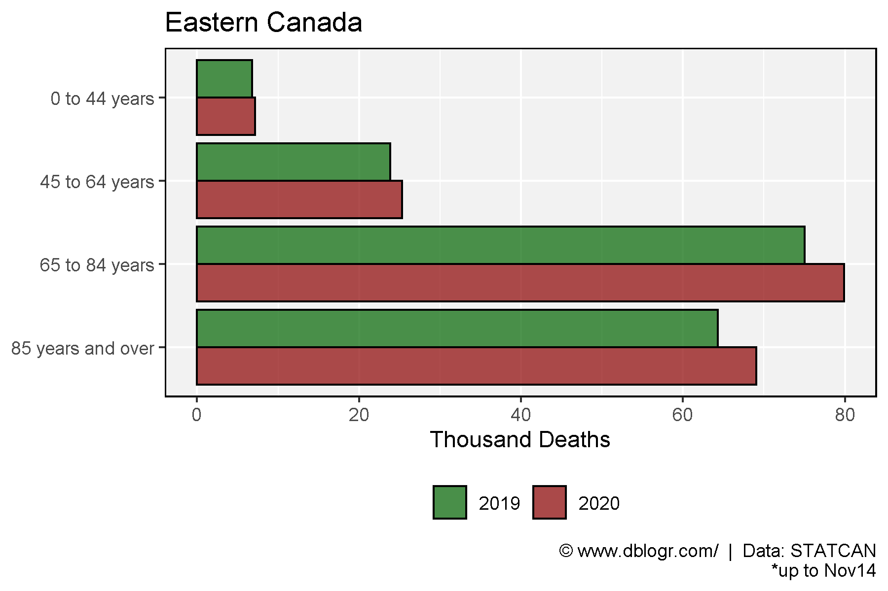
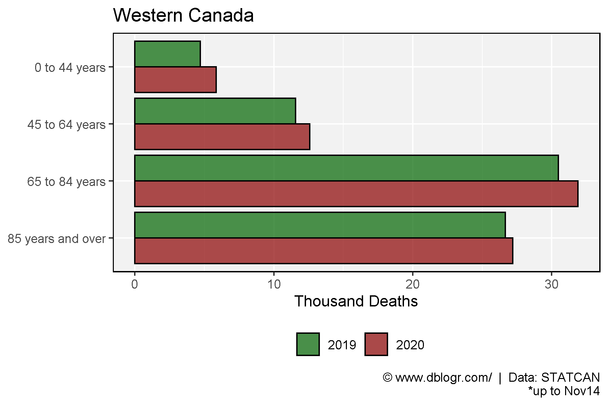
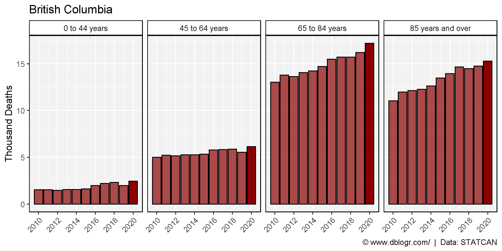
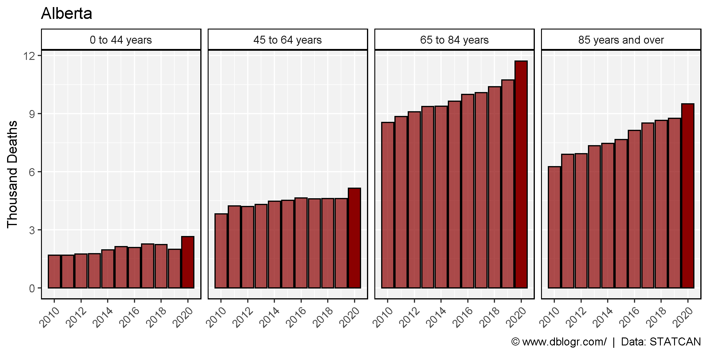
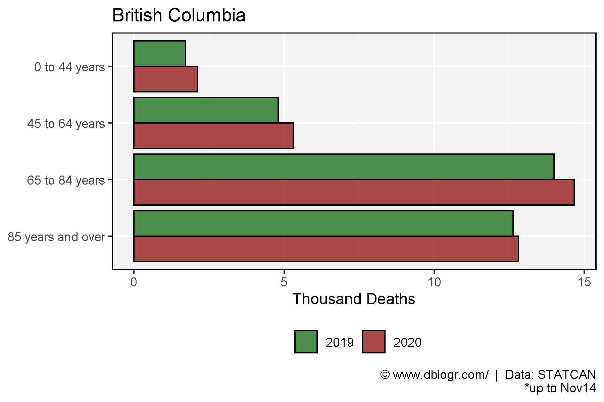
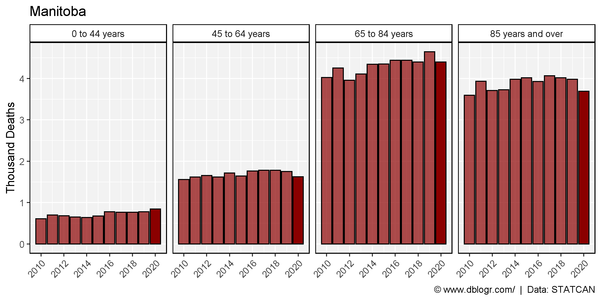

```{r setup, include=FALSE}
knitr::opts_chunk$set(echo = TRUE, message = F, warning = F)
```

---

# Data

## Data Sources

STATCAN data sources: 13-10-0783-01 & 13-10-0768-01

https://www150.statcan.gc.ca/t1/tbl1/en/cv.action?pid=1310078301

https://www150.statcan.gc.ca/t1/tbl1/en/cv.action?pid=1310076801

https://www150.statcan.gc.ca/n1/pub/71-607-x/71-607-x2020017-eng.htm

[**< Download 13-10-0783-01 >**](https://github.com/derekmichaelwright/dblogr/blob/master/content/dblogr/canada_deaths/1310078301_databaseLoadingData.csv)

[**< Download 13-10-0768-01 >**](https://github.com/derekmichaelwright/dblogr/blob/master/content/dblogr/canada_deaths/1310076801_databaseLoadingData.csv)

---

```{r}
# devtools::install_github("derekmichaelwright/agData")
library(agData) # Loads: tidyverse, ggpubr, ggbeeswarm, ggrepel
```

```{r}
# Prep data
cutoffName <- "Nov14"
cutoffDate <- "2020-11-14"
cutoffJD <- lubridate::yday(cutoffDate)
areas <- c("Canada", "Quebec", "Ontario", "British Columbia", 
           "Alberta", "Saskatchewan", "Manitoba", "Nova Scotia",
           "Newfoundland and Labrador", "New Brunswick", "Prince Edward Island", 
           "Northwest Territories", "Yukon", "Nunavut")
#
d1 <- read.csv("1310078301_databaseLoadingData.csv") %>% 
  rename(Date=1, Area=GEO, Value=VALUE) %>%
  mutate(Date = as.Date(Date),
         Year = as.factor(substr(Date, 1, 4)),
         Month = as.factor(substr(Date, 6, 7)),
         Y2020 = ifelse(Year == "2020", "2020", "<2020"),
         JulianDate = lubridate::yday(Date),
         Area = gsub(", place of occurrence", "", Area),
         Area = factor(Area, levels = areas)) %>%
  filter(Date <= cutoffDate)
d2 <- read.csv("1310076801_databaseLoadingData.csv") %>% 
  rename(Date=1, Age=Age.at.time.of.death, Value=VALUE, Area=GEO) %>%
  mutate(Date = as.Date(Date),
         Age = gsub("Age at time of death, ", "", Age),
         Year = as.factor(substr(Date, 1, 4)),
         Month = as.factor(substr(Date, 6, 7)),
         Y2020 = ifelse(Year == "2020", "2020", "<2020"),
         JulianDate = lubridate::yday(Date),
         Area = gsub(", place of occurrence", "", Area),
         Area = factor(Area, levels = areas)) %>%
  filter(Date <= cutoffDate)
```

# Deaths

```{r}
# Create plotting function
deathPlot1 <- function(area = "Canada") {
  # Prep data
  vv <- as.Date(c("2010-01-01","2011-01-01","2012-01-01","2013-01-01",
                  "2014-01-01","2015-01-01","2016-01-01","2017-01-01",
                  "2018-01-01","2019-01-01","2020-01-01"))
  xx <- d1 %>% filter(Area == area)
  # Plot
  ggplot(xx, aes(x = Date, y = Value)) +
    geom_line(color = "darkred", size = 1) +
    geom_vline(xintercept = vv, lty = 2, alpha = 0.5) +
    scale_x_date(date_breaks = "1 year", date_labels = "%Y", minor_breaks = "1 year") +
    theme_agData() +
    labs(title = area, y = "Deaths", x = NULL,
         caption = "\xa9 www.dblogr.com/  |  Data: STATCAN")
}
```

## Canada

```{r}
mp <- deathPlot1("Canada")
ggsave("canada_deaths_1_01.png", mp, width = 8, height = 4)
```


---

## Ontario

```{r}
mp <- deathPlot1("Ontario")
ggsave("canada_deaths_1_02.png", mp, width = 8, height = 4)
```


---

## Quebec

```{r}
mp <- deathPlot1("Quebec")
ggsave("canada_deaths_1_03.png", mp, width = 8, height = 4)
```


---

## British Columbia

```{r}
mp <- deathPlot1("British Columbia")
ggsave("canada_deaths_1_04.png", mp, width = 8, height = 4)
```


---

## Alberta

```{r}
mp <- deathPlot1("Alberta")
ggsave("canada_deaths_1_05.png", mp, width = 8, height = 4)
```


---

## Saskatchewan

```{r}
mp <- deathPlot1("Saskatchewan")
ggsave("canada_deaths_1_06.png", mp, width = 8, height = 4)
```


---

## Saskatchewan

```{r}
mp <- deathPlot1("Manitoba")
ggsave("canada_deaths_1_07.png", mp, width = 8, height = 4)
```


---

# Deaths Vs. Previous Years

```{r}
# Create plotting function
deathPlot2 <- function(areas) {
  # Prep data
  xx <- d1 %>% filter(Area %in% areas)
  # Plot
  ggplot(xx, aes(x = JulianDate, y = Value, group = Year, color = Y2020, alpha = Y2020)) +
    geom_line() +
    facet_wrap(Area ~ ., scales = "free_y", ncol = 5) +
    scale_color_manual(name = NULL, values = c("darkgreen","darkred")) +
    scale_alpha_manual(name = NULL, values = c(0.5,1)) +
    theme_agData(legend.position = "bottom") +
    labs(y = "Deaths Per Week")
}
```

```{r echo = F, eval = F}
# Prep data
  xx <- d1 %>% mutate(Year = as.numeric(as.character(Year))) %>%
    select(Date, Year, JulianDate, Y2020, Area, Value) %>%
    arrange(Area, Date) %>%
    spread(Area, Value)
  for(i in 5:ncol(xx)) {
    for(k in min(xx$Year):max(xx$Year)) {
      xx[xx$Year == k, i] <- cumsum(xx[xx$Year == k,i])
    }
  }
  xx <- xx %>% gather(Area, Value, 5:ncol(.)) %>%
    mutate(Area = factor(Area, levels = areas)) %>%
    filter(Area %in% areas)
  # Plot
  mp2 <- ggplot(xx, aes(x = JulianDate, y = Value / 1000, group = Year, color = Y2020, alpha = Y2020)) +
    geom_line() +
    facet_wrap(Area ~ ., scales = "free_y", ncol = 5) +
    scale_color_manual(name = NULL, values = c("darkgreen","darkred")) +
    scale_alpha_manual(name = NULL, values = c(0.5,1)) +
    theme_agData(legend.position = "bottom") +
    labs(y = "Thousand Deaths",
         caption = "\xa9 www.dblogr.com/  |  Data: STATCAN")
  ggarrange(mp1, mp2, common.legend = T, legend = "bottom", align = "h")
```

## Canada

```{r}
mp <- deathPlot2(areas = areas)
ggsave("canada_deaths_2_01.png", mp, width = 20, height = 8)
```


---

```{r}
mp <- deathPlot2(areas = "Canada")
ggsave("canada_deaths_2_02.png", mp, width = 8, height = 4)
```

```{r echo = F}
ggsave("featured.png", mp, width = 8, height = 4)
```


---

## Ontario

```{r}
mp <- deathPlot2(areas = "Ontario")
ggsave("canada_deaths_2_03.png", mp, width = 8, height = 4)
```


---

## Quebec

```{r}
mp <- deathPlot2(areas = "Quebec")
ggsave("canada_deaths_2_04.png", mp, width = 8, height = 4)
```


---

## British Columbia

```{r}
mp <- deathPlot2(areas = "British Columbia")
ggsave("canada_deaths_2_05.png", mp, width = 8, height = 4)
```


---

## Alberta

```{r}
mp <- deathPlot2(areas = "Alberta")
ggsave("canada_deaths_2_06.png", mp, width = 8, height = 4)
```


---

## Saskatchewan

```{r}
mp <- deathPlot2(areas = "Saskatchewan")
ggsave("canada_deaths_2_07.png", mp, width = 8, height = 4)
```


---

# Deaths by Age Group

```{r}
# Create plotting function
deathPlot3 <- function(areas = "Canada") {
  # Prep data
  xx <- d2 %>% filter(Area %in% areas, Sex == "Both sexes", Age != "all ages")
  # Plot
  ggplot(xx, aes(x = JulianDate, y = Value, group = Year, color = Y2020, alpha = Y2020)) +
    geom_line() +
    facet_grid(Area ~ Age, scales = "free_y") +
    scale_color_manual(name = NULL, values = c("darkgreen","darkred")) +
    scale_alpha_manual(name = NULL, values = c(0.3,1)) +
    theme_agData(legend.position = "bottom") +
    labs(y = "Deaths Per Week",
         caption = "\xa9 www.dblogr.com/  |  Data: STATCAN")
}
```

## Canada

```{r}
mp <- deathPlot3(areas = "Canada")
ggsave("canada_deaths_3_01.png", mp, width = 8, height = 4)
```


---

## Eastern Canada

```{r}
areas <- c("Ontario", "Quebec", "Nova Scotia", 
           "Newfoundland and Labrador", "New Brunswick")
mp <- deathPlot3(areas = areas)
ggsave("canada_deaths_3_02.png", mp, width = 8, height = 8)
```


## Western Canada

```{r}
areas <- c("British Columbia", "Alberta", "Saskatchewan", "Manitoba")
mp <- deathPlot3(areas = areas)
ggsave("canada_deaths_3_03.png", mp, width = 8, height = 8)
```


## Select Provinces

```{r}
areas <- c("Ontario", "Quebec", "Saskatchewan",
           "Alberta", "British Columbia")
mp <- deathPlot3(areas = areas)
ggsave("canada_deaths_3_04.png", mp, width = 8, height = 8)
```


## Saskatchewan vs. Quebec

```{r}
areas <- c("Canada", "Quebec", "Saskatchewan")
mp <- deathPlot3(areas = areas)
ggsave("canada_deaths_3_05.png", mp, width = 8, height = 5)
```


---

## Alberta vs. Ontario

```{r}
areas <- c("Canada", "Ontario", "Alberta")
mp <- deathPlot3(areas = areas)
ggsave("canada_deaths_3_06.png", mp, width = 8, height = 5)
```


---

## Saskatchewan

```{r}
mp <- deathPlot3(areas = "Saskatchewan")
ggsave("canada_deaths_3_07.png", mp, width = 8, height = 4)
```


---

# 2019 vs 2020

```{r}
# Create plotting function
deathPlot4 <- function(areas = "Canada", title = areas) {
  # Prep data
  xx <- d2 %>% 
    filter(Area %in% areas, Year %in% 2019:2020, 
           Sex == "Both sexes", Age != "all ages",
           !is.na(Value), JulianDate < cutoffJD) %>%
    group_by(Age, Year) %>% 
    summarise(Value = sum(Value)) %>%
    ungroup() %>%
    mutate(Year = factor(Year, levels = c("2020","2019")),
           Age = factor(Age, levels = rev(unique(Age))))
  # Plot
  ggplot(xx, aes(x = Age, y = Value / 1000, fill = Year)) +
    geom_bar(stat = "identity", position = "dodge", 
             color = "black", alpha = 0.7) +
    scale_fill_manual(name = NULL, breaks = c("2019","2020"),
                      values = c("darkgreen","darkred")) +
    coord_flip() +
    theme_agData(legend.position = "bottom") +
    labs(title = title, y = "Thousand Deaths", x = NULL,
         caption = paste0("\xa9 www.dblogr.com/  |  Data: STATCAN\n*up to ", cutoffName))
}
```

## Canada

```{r}
mp <- deathPlot4(areas = "Canada")
ggsave("canada_deaths_4_01.png", mp, width = 6, height = 4)
```


---

## Eastern Canada

```{r}
areas <- c("Ontario", "Quebec", "Nova Scotia", "Prince Edward Island",
           "Newfoundland and Labrador", "New Brunswick")
mp <- deathPlot4(areas = areas, title = "Eastern Canada")
ggsave("canada_deaths_4_02.png", mp, width = 6, height = 4)
```



## Western Canada

```{r}
areas <- c("British Columbia", "Alberta", "Saskatchewan", "Manitoba",
           "Northwest Territories", "Nunavut ") #"Yukon"
mp <- deathPlot4(areas = areas, title = "Western Canada")
ggsave("canada_deaths_4_03.png", mp, width = 6, height = 4)
```



---

## Ontario

```{r}
mp <- deathPlot4(areas = "Ontario")
ggsave("canada_deaths_4_04.png", mp, width = 6, height = 4)
```



---

## Quebec

```{r}
mp <- deathPlot4(areas = "Quebec")
ggsave("canada_deaths_4_05.png", mp, width = 6, height = 4)
```



---

## British Columbia

```{r}
mp <- deathPlot4(areas = "British Columbia")
ggsave("canada_deaths_4_06.png", mp, width = 6, height = 4)
```



---

## Alberta

```{r}
mp <- deathPlot4(areas = "Alberta")
ggsave("canada_deaths_4_07.png", mp, width = 6, height = 4)
```



---

## Saskatchewan

```{r}
mp <- deathPlot4(areas = "Saskatchewan")
ggsave("canada_deaths_4_08.png", mp, width = 6, height = 4)
```


---

# Excess Deaths

```{r}
# Create plotting function
deathPlot5 <- function(areas = "Canada", title = areas) {
  # Prep data
  xx <- d2 %>% 
    filter(Area %in% areas, Year %in% 2019:2020, 
           Sex == "Both sexes", Age != "all ages",
           !is.na(Value), JulianDate < cutoffJD) %>%
    group_by(Age, Year) %>% 
    summarise(Value = sum(Value)) %>%
    ungroup() %>%
    mutate(Year = factor(Year, levels = c("2020","2019")),
           Age = factor(Age, levels = rev(unique(Age)))) %>%
    spread(Year, Value) %>%
    mutate(Excess = `2020` - `2019`)
  # Plot
  ggplot(xx, aes(x = Age, y = Excess)) +
    geom_bar(stat = "identity", color = "black", fill = "darkred", alpha = 0.7) +
    geom_label(aes(label = Excess), hjust = 1) +
    coord_flip() +
    theme_agData() +
    labs(title = title, y = "Excess Deaths", x = NULL,
         caption = paste0("\xa9 www.dblogr.com/  |  Data: STATCAN\n*up to ", cutoffName))
}
```

## Canada

```{r}
mp <- deathPlot5(areas = "Canada")
ggsave("canada_deaths_5_01.png", mp, width = 6, height = 4)
```


---

## Ontario

```{r}
mp <- deathPlot5(areas = "Ontario")
ggsave("canada_deaths_5_02.png", mp, width = 6, height = 4)
```


---

## Quebec

```{r}
mp <- deathPlot5(areas = "Quebec")
ggsave("canada_deaths_5_03.png", mp, width = 6, height = 4)
```


---

## British Columbia

```{r}
mp <- deathPlot5(areas = "British Columbia")
ggsave("canada_deaths_5_04.png", mp, width = 6, height = 4)
```


---

## Alberta

```{r}
mp <- deathPlot5(areas = "Alberta")
ggsave("canada_deaths_5_05.png", mp, width = 6, height = 4)
```


---

## Saskatchewan

```{r}
mp <- deathPlot5(areas = "Saskatchewan")
ggsave("canada_deaths_5_06.png", mp, width = 6, height = 4)
```


---

# By Gender

```{r}
# Prep data
xx <- d2 %>% filter(Area %in% "Canada", Sex != "Both sexes", Year == 2020)
# Plot
mp <- ggplot(xx, aes(x = JulianDate, y = Value, group = Sex, color = Sex)) +
  geom_line() +
  facet_grid(Area ~ Age) +
  scale_color_manual(name = NULL, values = c("darkred","darkgreen")) +
  scale_alpha_manual(name = NULL, values = c(0.5,1)) +
  theme_agData(legend.position = "top") +
  labs(y = "Deaths Per Week",
       caption = "\xa9 www.dblogr.com/  |  Data: STATCAN")
ggsave("canada_deaths_6_01.png", mp, width = 8, height = 4)
```


---

```{r echo = F, eval = F}
x1 <- d2 %>% filter(Year == 2020, Sex == "Both sexes") %>%
  group_by(Area, Month, Age) %>% 
  summarise(Value = sum(Value, na.rm = T))
x2 <- d2 %>% filter(Year != 2020, Sex == "Both sexes") %>% 
  group_by(Area, Year, Month, Age) %>% 
  summarise(Value = sum(Value, na.rm = T)) %>%
  ungroup() %>%
  group_by(Area, Month, Age) %>% 
  summarise(Average = max(Value, na.rm = T))
xx <- left_join(x1, x2, by = c("Area","Month","Age")) %>%
  mutate(Excess = Value - Average,
         PosNeg = ifelse(Excess > 0, "Yes", "No")) %>% 
  ungroup() %>%
  filter(Month != "10")
deathPlot4 <- function(areas = "Canada") {
  # Prep data
  xx <- xx %>% filter(Area %in% areas)
  # Plot
  ggplot(xx, aes(x = Month, y = Excess, fill = PosNeg)) +
    geom_bar(stat = "identity", color = "black") +
    facet_grid(Area ~ Age, scales = "free_y") +
    scale_fill_manual(name = NULL, values = c("darkgreen","darkred")) +
    theme_agData(legend.position = "none") +
    labs(y = "Excess Deaths Per Month*", 
    caption =  "*formula = 2020 value - max deaths per month over last 10 years\n\xa9 www.dblogr.com/  |  Data: STATCAN")
}
```

```{r echo = F, eval = F}
mp <- deathPlot4(areas = "Canada")
ggsave("canada_deaths_5_01.png", mp, width = 8, height = 4)
```

```{r echo = F, eval = F}
mp <- deathPlot4(areas = c("Ontario", "Quebec","Saskatchewan","Alberta", "British Columbia"))
ggsave("canada_deaths_5_02.png", mp, width = 8, height = 8)
```

```{r echo = F, eval = F}
mp <- deathPlot4(areas = c("Canada", "Quebec","Saskatchewan"))
ggsave("canada_deaths_5_03.png", mp, width = 8, height = 5)
```

&copy; Derek Michael Wright [www.dblogr.com/](https://dblogr.com/)