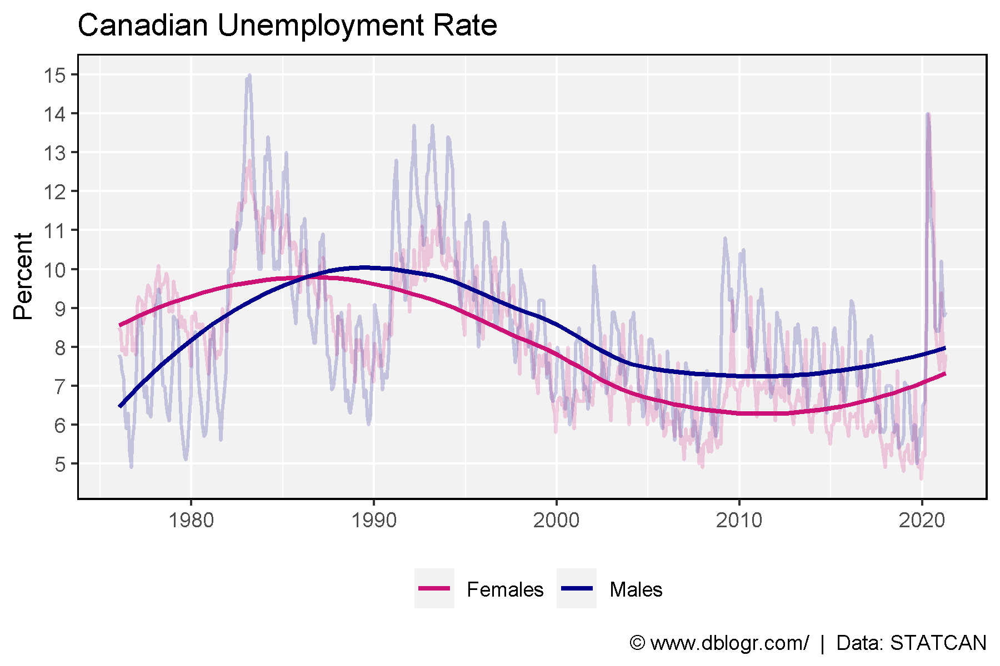
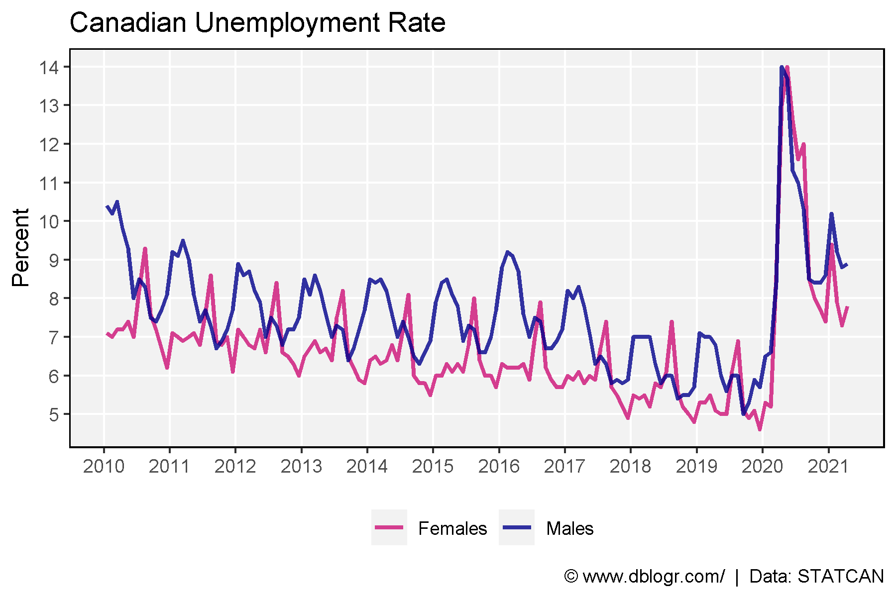
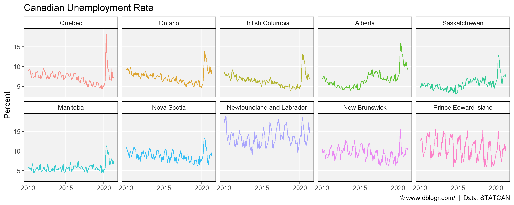
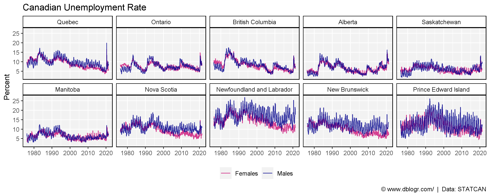
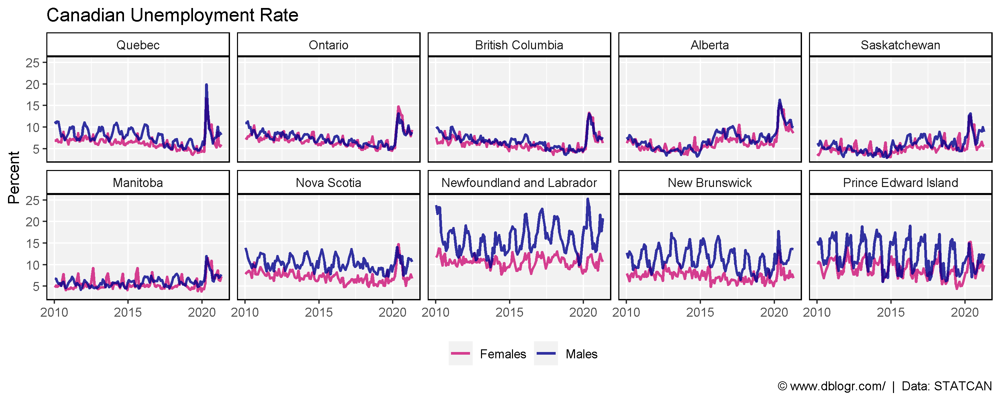
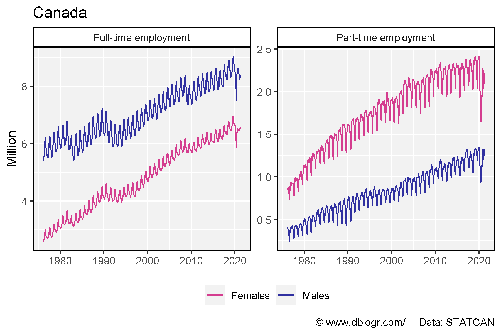
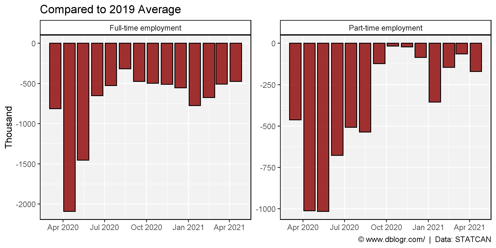
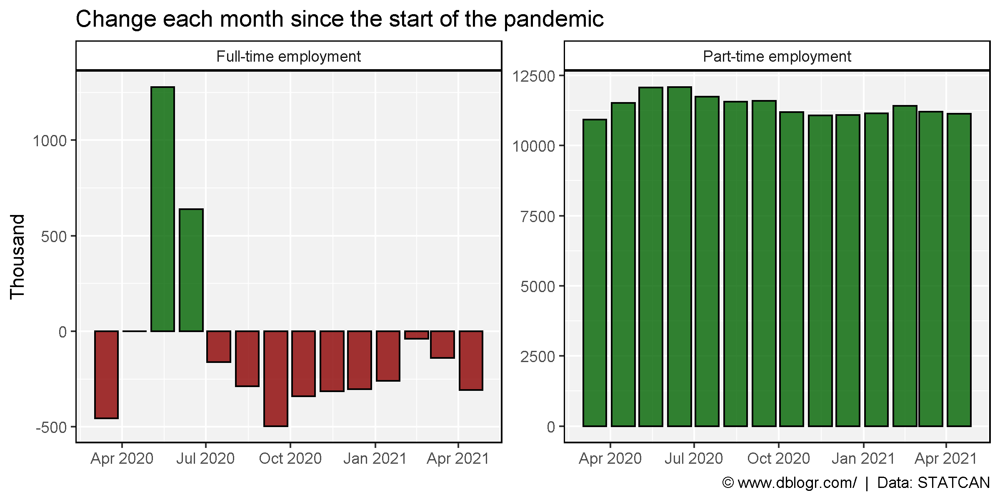

<script src="index_files/font-awesome/js/script.js"></script>

<script src="index_files/htmlwidgets/htmlwidgets.js"></script>

<script src="index_files/jquery/jquery.min.js"></script>

<link href="index_files/datatables-css/datatables-crosstalk.css" rel="stylesheet" />

<script src="index_files/datatables-binding/datatables.js"></script>

<link href="index_files/dt-core/css/jquery.dataTables.min.css" rel="stylesheet" />
<link href="index_files/dt-core/css/jquery.dataTables.extra.css" rel="stylesheet" />

<script src="index_files/dt-core/js/jquery.dataTables.min.js"></script>

<link href="index_files/crosstalk/css/crosstalk.css" rel="stylesheet" />

<script src="index_files/crosstalk/js/crosstalk.min.js"></script>

-----

# Data Source

https://www150.statcan.gc.ca/t1/tbl1/en/cv.action?pid=1410001701

<a href="https://github.com/derekmichaelwright/dblogr/blob/master/content/dblogr/canada_employment/1410001701_databaseLoadingData.csv">
<button class="btn btn-success"><i class="fa fa-save"></i> Download STATCAN Table 14-10-0017-01</button>
</a>

-----

# Prepare Data

``` r
# devtools::install_github("derekmichaelwright/agData")
library(agData) # Loads: tidyverse, ggpubr, ggbeeswarm, ggrepel
# Prep data
areas <- c("Canada", "Quebec", "Ontario", "British Columbia", 
           "Alberta", "Saskatchewan", "Manitoba", "Nova Scotia",
           "Newfoundland and Labrador", "New Brunswick", "Prince Edward Island", 
           "Northwest Territories", "Yukon", "Nunavut") 
a_ord <- c(1,6,7,11, 10,9,8,4, 2,5,3, 13,12,14) # unique(dd$GEO)
dd <- read.csv("1410001701_databaseLoadingData.csv") %>%
  select(Area=GEO, Date=1, Measurement=Labour.force.characteristics, 
         Sex, Unit=SCALAR_FACTOR, Value=VALUE) %>%
  mutate(Area = factor(Area, levels = areas),
         Date = as.Date(paste0(Date, "-15"), format = "%Y-%m-%d"))
```

-----

# Unemployment

## Canada

``` r
# Prep data
xx <- dd %>% 
  filter(Area == "Canada", Sex == "Both sexes",
         Measurement == "Unemployment rate")
# Plot
mp <- ggplot(xx, aes(x = Date, y = Value)) +
  geom_line(size = 0.75, alpha = 0.6, color = "darkgreen") +
  scale_y_continuous(breaks = 5:15, minor_breaks = 5:15) +
  theme_agData(legend.position = "bottom") +
  labs(title = "Canadian Unemployment Rate", y = "Percent", x = NULL,
       caption = "\xa9 www.dblogr.com/  |  Data: STATCAN")
ggsave("canada_employment_1_01.png", mp, width = 6, height = 4)
```


-----

``` r
# Prep data
xx <- dd %>% 
  filter(Area == "Canada", Sex != "Both sexes",
         Measurement == "Unemployment rate")
# Plot
mp <- ggplot(xx, aes(x = Date, y = Value, color = Sex)) +
  geom_line(size = 0.75, alpha = 0.6) +
  scale_color_manual(name = NULL, values = c("deeppink3","darkblue")) +
  scale_y_continuous(breaks = 5:15, minor_breaks = 5:15) +
  theme_agData(legend.position = "bottom") +
  labs(title = "Canadian Unemployment Rate", y = "Percent", x = NULL,
       caption = "\xa9 www.dblogr.com/  |  Data: STATCAN")
ggsave("canada_employment_1_02.png", mp, width = 6, height = 4)
```


-----

``` r
# Prep data
xx <- dd %>% 
  filter(Area == "Canada", Sex != "Both sexes",
         Measurement == "Unemployment rate")
# Plot
mp <- ggplot(xx, aes(x = Date, y = Value, color = Sex)) +
  geom_line(size = 0.75, alpha = 0.2) +
  geom_smooth(method = "loess", se = F, size = 1, alpha = 0.6) +
  scale_color_manual(name = NULL, values = c("deeppink3","darkblue")) +
  scale_y_continuous(breaks = 5:15, minor_breaks = 5:15) +
  theme_agData(legend.position = "bottom") +
  labs(title = "Canadian Unemployment Rate", y = "Percent", x = NULL,
       caption = "\xa9 www.dblogr.com/  |  Data: STATCAN")
ggsave("canada_employment_1_03.png", mp, width = 6, height = 4)
```



-----

``` r
# Prep data
xx <- dd %>% 
  filter(Area == "Canada", Measurement == "Unemployment rate", 
         Sex != "Both sexes", Date > "2010-01-01")
# Plot
mp <- ggplot(xx, aes(x = Date, y = Value, color = Sex)) +
  geom_line(size = 1, alpha = 0.8) +
  scale_color_manual(name = NULL, values = c("deeppink3","darkblue")) +
  scale_y_continuous(breaks = 5:15, minor_breaks = 5:15) +
  scale_x_date(date_breaks = "year", date_minor_breaks = "year", date_labels = "%Y") +
  theme_agData(legend.position = "bottom") +
  labs(title = "Canadian Unemployment Rate", y = "Percent", x = NULL,
       caption = "\xa9 www.dblogr.com/  |  Data: STATCAN")
ggsave("canada_employment_1_04.png", mp, width = 6, height = 4)
```



-----

## Provinces

``` r
# Prep data
xx <- dd %>% 
  filter(Area != "Canada", Sex == "Both sexes",
         Measurement == "Unemployment rate")
# Plot
mp <- ggplot(xx, aes(x = Date, y = Value, color = Area)) +
  geom_line(size = 0.5, alpha = 0.8) +
  facet_wrap(Area ~ ., ncol = 5) +
  scale_y_continuous(breaks = seq(5, 25, 5), minor_breaks = seq(5, 25, 5)) +
  theme_agData(legend.position = "none") +
  labs(title = "Canadian Unemployment Rate", y = "Percent", x = NULL,
       caption = "\xa9 www.dblogr.com/  |  Data: STATCAN")
ggsave("canada_employment_1_05.png", mp, width = 10, height = 4)
```


-----

``` r
# Prep data
xx <- dd %>% 
  filter(Area != "Canada", Measurement == "Unemployment rate",
         Sex == "Both sexes", Date > "2010-01-01")
# Plot
mp <- ggplot(xx, aes(x = Date, y = Value, color = Area)) +
  geom_line(size = 0.5, alpha = 0.8) +
  facet_wrap(Area ~ ., ncol = 5) +
  scale_y_continuous(breaks = seq(5, 25, 5), minor_breaks = seq(5, 25, 5)) +
  theme_agData(legend.position = "none") +
  labs(title = "Canadian Unemployment Rate", y = "Percent", x = NULL,
       caption = "\xa9 www.dblogr.com/  |  Data: STATCAN")
ggsave("canada_employment_1_06.png", mp, width = 10, height = 4)
```



-----

``` r
# Prep data
xx <- dd %>% 
  filter(Area != "Canada", Sex != "Both sexes",
         Measurement == "Unemployment rate")
# Plot
mp <- ggplot(xx, aes(x = Date, y = Value, color = Sex)) +
  geom_line(size = 0.5, alpha = 0.8) +
  facet_wrap(Area ~ ., ncol = 5) +
  scale_color_manual(name = NULL, values = c("deeppink3","darkblue")) +
  scale_y_continuous(breaks = seq(5, 25, 5), minor_breaks = seq(5, 25, 5)) +
  theme_agData(legend.position = "bottom") +
  labs(title = "Canadian Unemployment Rate", y = "Percent", x = NULL,
       caption = "\xa9 www.dblogr.com/  |  Data: STATCAN")
ggsave("canada_employment_1_07.png", mp, width = 10, height = 4)
```



-----

``` r
# Prep data
xx <- dd %>% 
  filter(Area != "Canada", Measurement == "Unemployment rate", 
         Sex != "Both sexes", Date > "2010-01-01")
# Plot
mp <- ggplot(xx, aes(x = Date, y = Value, color = Sex)) +
  geom_line(size = 1, alpha = 0.8) +
  facet_wrap(Area ~ ., ncol = 5) +
  scale_color_manual(name = NULL, values = c("deeppink3","darkblue")) +
  scale_y_continuous(breaks = seq(5, 25, 5), minor_breaks = seq(5, 25, 5)) +
  #scale_x_date(date_breaks = "year", date_minor_breaks = "year", date_labels = "%Y") +
  theme_agData(legend.position = "bottom") +
  labs(title = "Canadian Unemployment Rate", y = "Percent", x = NULL,
       caption = "\xa9 www.dblogr.com/  |  Data: STATCAN")
ggsave("canada_employment_1_08.png", mp, width = 10, height = 4)
```



-----

# Full Time vs. Part Time

``` r
# Prep data
xx <- dd %>% 
  filter(Area == "Canada", Sex != "Both sexes",
         Measurement != "Unemployment rate")
# Plot
mp <- ggplot(xx, aes(x = Date, y = Value / 1000, color = Sex)) +
  geom_line(size = 0.5, alpha = 0.8) +
  facet_wrap(Measurement ~ ., ncol = 2, scales = "free_y") +
  scale_color_manual(name = NULL, values = c("deeppink3","darkblue")) +
  theme_agData(legend.position = "bottom") +
  labs(title = "Canada", y = "Million", x = NULL,
       caption = "\xa9 www.dblogr.com/  |  Data: STATCAN")
ggsave("canada_employment_2_01.png", mp, width = 6, height = 4)
```



-----

``` r
# Prep data
xx <- dd %>% 
  filter(Area == "Canada", Measurement != "Unemployment rate",
         Sex != "Both sexes", Date > "2010-01-01")
# Plot
mp <- ggplot(xx, aes(x = Date, y = Value / 1000, color = Sex)) +
  geom_line(size = 0.75, alpha = 0.8) +
  facet_wrap(Measurement ~ ., ncol = 2, scales = "free_y") +
  scale_color_manual(name = NULL, values = c("deeppink3","darkblue")) +
  theme_agData(legend.position = "bottom") +
  labs(title = "Canada", y = "Million", x = NULL,
       caption = "\xa9 www.dblogr.com/  |  Data: STATCAN")
ggsave("canada_employment_2_02.png", mp, width = 6, height = 4)
```


-----

# Job Losses

``` r
# Prep data
x1 <- dd %>% 
  filter(Area == "Canada", Date > "2019-03-15", Date < "2020-03-15", 
         Sex == "Both sexes", Measurement != "Unemployment rate") %>%
  group_by(Measurement) %>%
  summarise(Value = mean(Value))
xx <- dd %>% 
  filter(Area == "Canada", Date > "2020-02-15", Sex == "Both sexes",
         Measurement != "Unemployment rate") %>%
  mutate(PanDiff = ifelse(Measurement == "Full-time employment", 
                       Value - x1$Value[x1$Measurement == "Full-time employment"],
                       Value - x1$Value[x1$Measurement != "Full-time employment"]))
x1 <- dd %>% 
  filter(Area == "Canada", Date == "2020-02-15", 
         Sex == "Both sexes", Measurement != "Unemployment rate")
for(i in unique(xx$Date)) {
  xx$MonthDiff[xx$Date == i & xx$Measurement == "Full-time employment"] <- xx$Value - x1$Value[x1$Measurement == "Full-time employment"]
  xx$MonthDiff[xx$Date == i & xx$Measurement != "Full-time employment"] <- xx$Value - x1$Value[x1$Measurement != "Full-time employment"]
  x1 <- dd %>% 
  filter(Area == "Canada", Date == i, 
         Measurement != "Unemployment rate", Sex == "Both sexes")
}
DT::datatable(xx %>% 
  filter(Date > "2020-02-15") %>% 
  select(Date, Measurement, PanDiff, MonthDiff) %>%
  mutate(PanDiff = round(PanDiff * 1000),
         MonthDiff = round(MonthDiff * 1000)) %>%
    arrange(desc(Date)))
```

<div id="htmlwidget-1" style="width:100%;height:auto;" class="datatables html-widget"></div>
<script type="application/json" data-for="htmlwidget-1">{"x":{"filter":"none","data":[["1","2","3","4","5","6","7","8","9","10","11","12","13","14","15","16","17","18","19","20","21","22","23","24","25","26","27","28"],["2021-04-15","2021-04-15","2021-03-15","2021-03-15","2021-02-15","2021-02-15","2021-01-15","2021-01-15","2020-12-15","2020-12-15","2020-11-15","2020-11-15","2020-10-15","2020-10-15","2020-09-15","2020-09-15","2020-08-15","2020-08-15","2020-07-15","2020-07-15","2020-06-15","2020-06-15","2020-05-15","2020-05-15","2020-04-15","2020-04-15","2020-03-15","2020-03-15"],["Full-time employment","Part-time employment","Full-time employment","Part-time employment","Full-time employment","Part-time employment","Full-time employment","Part-time employment","Full-time employment","Part-time employment","Full-time employment","Part-time employment","Full-time employment","Part-time employment","Full-time employment","Part-time employment","Full-time employment","Part-time employment","Full-time employment","Part-time employment","Full-time employment","Part-time employment","Full-time employment","Part-time employment","Full-time employment","Part-time employment","Full-time employment","Part-time employment"],[-474818,-170355,-507318,-64155,-674318,-146255,-775018,-354955,-554718,-85155,-509818,-22555,-498918,-17155,-473718,-122855,-317618,-536355,-526318,-507555,-652218,-677855,-1453418,-1015555,-2091218,-1012255,-814118,-462255],[-306800,11127200,-139800,11209300,-39100,11418000,-259400,11148200,-304300,11085600,-315200,11080200,-340400,11185900,-496500,11599400,-287800,11570600,-161900,11740900,639300,12078600,1277100,12075300,0,11525300,-455300,10926600]],"container":"<table class=\"display\">\n  <thead>\n    <tr>\n      <th> <\/th>\n      <th>Date<\/th>\n      <th>Measurement<\/th>\n      <th>PanDiff<\/th>\n      <th>MonthDiff<\/th>\n    <\/tr>\n  <\/thead>\n<\/table>","options":{"columnDefs":[{"className":"dt-right","targets":[3,4]},{"orderable":false,"targets":0}],"order":[],"autoWidth":false,"orderClasses":false}},"evals":[],"jsHooks":[]}</script>

``` r
# Plot
mp <- ggplot(xx, aes(x = Date, y = PanDiff)) + 
  geom_bar(stat = "identity", color = "black", fill = "darkred", alpha = 0.8) +
  facet_wrap(Measurement ~ ., scales = "free_y") +
  theme_agData() +
  labs(title = "Compared to 2019 Average", y = "Thousand", x = NULL,
       caption = "\xa9 www.dblogr.com/  |  Data: STATCAN")
ggsave("canada_employment_2_03.png", mp, width = 8, height = 4)
```



-----

``` r
xx <- xx %>% mutate(PosNeg = ifelse(MonthDiff > 0, "Pos", "Neg"))
# Plot
mp <- ggplot(xx, aes(x = Date, y = MonthDiff, fill = PosNeg)) + 
  geom_bar(stat = "identity", color = "black", alpha = 0.8) +
  facet_wrap(Measurement ~ ., scales = "free_y") +
  scale_fill_manual(values = c("darkred","darkgreen")) +
  theme_agData(legend.position = "none") +
  labs(title = "Change each month since the start of the pandemic", y = "Thousand", x = NULL,
       caption = "\xa9 www.dblogr.com/  |  Data: STATCAN")
ggsave("canada_employment_2_04.png", mp, width = 8, height = 4)
```



-----

© Derek Michael Wright [www.dblogr.com/](https://dblogr.com/)
