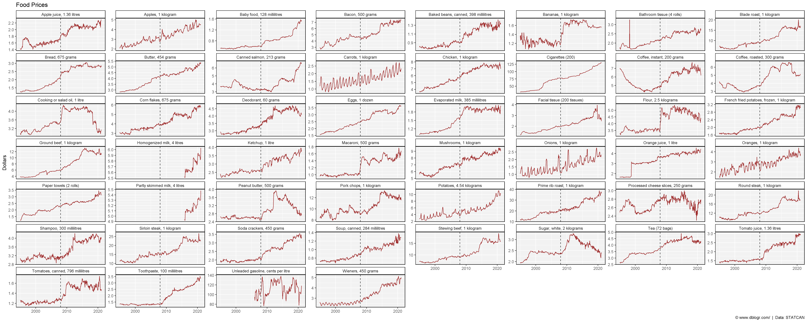
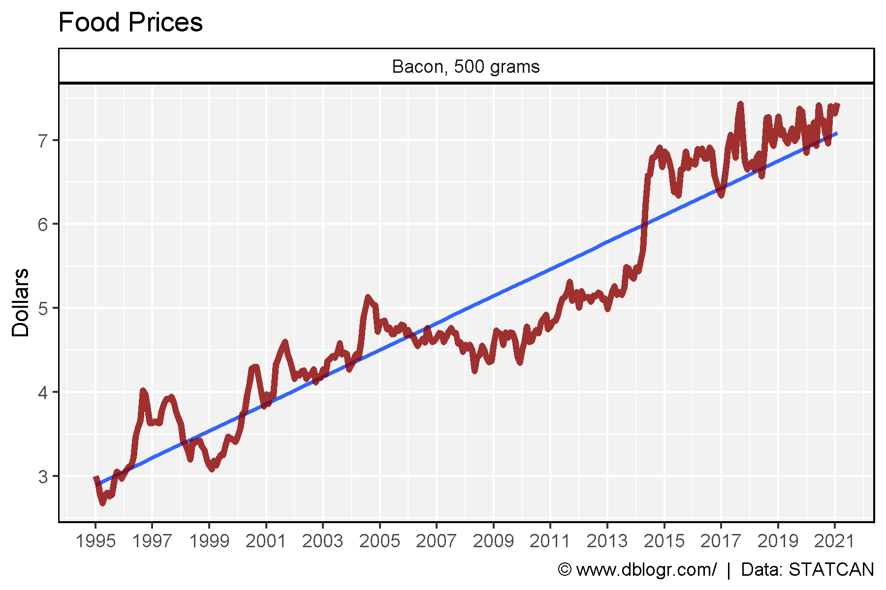
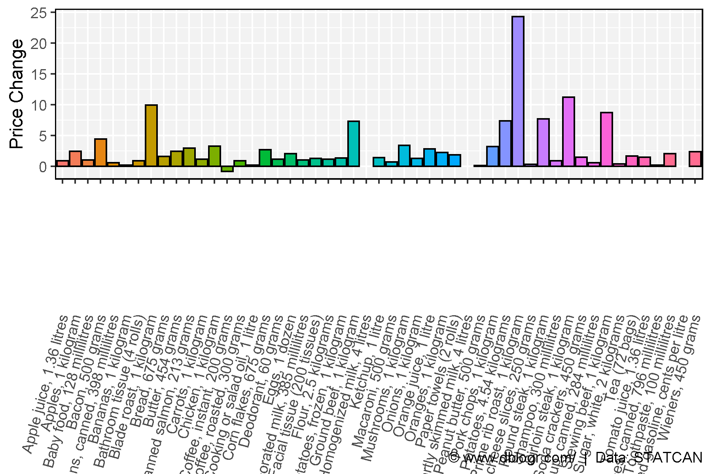

```{r setup, include=FALSE}
knitr::opts_chunk$set(echo = T, message = F, warning = F)
```

---

# Data Source

https://www150.statcan.gc.ca/t1/tbl1/en/tv.action?pid=

```{r echo = F}
downloadthis::download_link(
  link = "https://github.com/derekmichaelwright/dblogr/blob/master/content/dblogr/canada_food_prices/1810000201_databaseLoadingData.csv",
  button_label = "STATCAN Table 18-10-0002-01",
  button_type = "success",
  has_icon = TRUE,
  icon = "fa fa-save",
  self_contained = FALSE
)
```

---

# Prepare data

```{r}
# devtools::install_github("derekmichaelwright/agData")
library(agData) # Loads: tidyverse, ggpubr, ggbeeswarm, ggrepel
# Prep data
dd <- read.csv("1810000201_databaseLoadingData.csv") %>%
  select(Date=1, Area=GEO, Product=Products, Value=VALUE) %>%
  mutate(Date = as.Date(paste0(Date, "-01"), format = "%Y-%m-%d"),
         Product = plyr::mapvalues(Product, 
            "Regular, unleaded gasoline at self-service stations, cents per litre",
            "Unleaded gasoline, cents per litre")) %>%
  arrange(Product)
unique(dd$Product)
```

---

# All Items

```{r eval = F}
pdf("canada_food_prices_products.pdf", width = 6, height = 4)
for(i in unique(dd$Product)) {
  xi <- dd %>% filter(Product == i)
  print(ggplot(xi, aes(x = Date, y = Value)) +
          geom_vline(xintercept = as.Date("2020-01-01"), lty = 2, alpha = 0.8) +
          geom_line(color = "darkred", alpha = 0.8) +
          facet_wrap(Product ~ ., ncol = 8, scales = "free_y") +
          theme_agData() +
          labs(title = "Food Prices", x = NULL, y = "Dollars",
               caption = "\xa9 www.dblogr.com/  |  Data: STATCAN")
  )
}
dev.off()
```

```{r echo = F}
downloadthis::download_link(
  link = "https://github.com/derekmichaelwright/dblogr/blob/master/content/dblogr/canada_food_prices/canada_food_prices_products.pdf",
  button_label = "canada_food_prices_products.pdf",
  button_type = "success",
  has_icon = TRUE,
  icon = "fa fa-file-pdf",
  self_contained = FALSE
)
```

---

```{r}
# Plot
mp <- ggplot(dd, aes(x = Date, y = Value)) +
  geom_vline(xintercept = as.Date("2008-01-01"), lty = 2, alpha = 0.8) +
  geom_line(color = "darkred", alpha = 0.8) +
  facet_wrap(Product ~ ., ncol = 8, scales = "free_y") +
  theme_agData() +
  labs(title = "Food Prices", x = NULL, y = "Dollars",
       caption = "\xa9 www.dblogr.com/  |  Data: STATCAN")
ggsave("canada_food_prices_01.png", width = 25, height = 10, limitsize = F)
```



---

# Bacon

```{r}
# Prep data
xx <- dd %>% filter(Area == "Canada", Product == "Bacon, 500 grams")
# Plot
mp <- ggplot(xx, aes(x = Date, y = Value)) +
  geom_smooth(method = "lm", se = F, alpha = 0.8) +
  geom_line(color = "darkred", alpha = 0.8, size = 1.5) +
  facet_grid(. ~ Product) +
  scale_x_date(date_breaks = "2 year", date_labels = "%Y") +
  theme_agData() +
  labs(title = "Food Prices", x = NULL, y = "Dollars",
       caption = "\xa9 www.dblogr.com/  |  Data: STATCAN")
ggsave("canada_food_prices_02.png", width = 6, height = 4)
```

```{r echo = F}
ggsave("featured.png", mp, width = 6, height = 4)
```



---

# Change

```{r}
# Prep data
xx <- dd %>% 
  filter(Area == "Canada", Product != "Cigarettes (200)",
         Date %in% c(min(Date), max(Date))) %>%
  select(-Area) %>%
  spread(Date, Value)
xx$Change <- xx[,3] - xx[,2]
# Plot
mp <- ggplot(xx, aes(x = Product, y = Change, fill = Product)) +
  geom_bar(stat = "identity", color = "black") +
  theme_agData(legend.position = "none", 
               axis.text.x = element_text(angle = 90, hjust = 1, vjust = 0.4)) +
  labs(y = "Price Change", x = NULL,
       caption = "\xa9 www.dblogr.com/  |  Data: STATCAN")
ggsave("canada_food_prices_03.png", width = 6, height = 4)
```



---

&copy; Derek Michael Wright [www.dblogr.com/](https://dblogr.com/)