<script src="index_files/font-awesome/js/script.js"></script>

<script src="index_files/font-awesome/js/script.js"></script>

<script src="index_files/font-awesome/js/script.js"></script>

-----

# Data Sources

https://www150.statcan.gc.ca/t1/tbl1/en/cv.action?pid=3610040001

https://www150.statcan.gc.ca/t1/tbl1/en/cv.action?pid=3610040201

https://www150.statcan.gc.ca/t1/tbl1/en/cv.action?pid=1710000901

<a href="https://github.com/derekmichaelwright/dblogr/blob/master/content/dblogr/canada_gdp/3610040001_databaseLoadingData.csv">
<button class="btn btn-success"><i class="fa fa-save"></i> STATCAN Table 36-10-0400-01</button>
</a>

<a href="https://github.com/derekmichaelwright/dblogr/blob/master/content/dblogr/canada_gdp/3610040201_databaseLoadingData.csv">
<button class="btn btn-success"><i class="fa fa-save"></i> STATCAN Table 36-10-0402-01</button>
</a>

<a href="https://github.com/derekmichaelwright/dblogr/blob/master/content/dblogr/canada_gdp/1710000901_Data.csv">
<button class="btn btn-success"><i class="fa fa-save"></i> STATCAN Table 17-10-0009-01</button>
</a>

-----

# Prepare Data

``` r
# devtools::install_github("derekmichaelwright/agData")
library(agData) # Loads: tidyverse, ggpubr, ggbeeswarm, ggrepel
# Factor levels
provinces <- c("British Columbia",  "Alberta", "Saskatchewan", "Manitoba", "Ontario", "Quebec", 
               "New Brunswick", "Prince Edward Island", "Nova Scotia", "Newfoundland and Labrador",  
               "Yukon", "Northwest Territories", "Nunavut")
provShort <- c("BC","AB","SK","MB","ON","QC","NB","PE","NS","NL","YT","NT","NU")
# GDP by province
d1 <- read.csv("3610040201_databaseLoadingData.csv") %>%
  select(-Value) %>%
  rename(Area=GEO, Year=ï..REF_DATE, Value=VALUE, 
         Industry=North.American.Industry.Classification.System..NAICS.) %>%
  mutate(Value = Value * 1000000,
         Area = factor(Area, levels = provinces),
         Area_Short = plyr::mapvalues(Area, provinces, provShort)) %>%
  select(Area, Area_Short, Year, Industry, Value)
# GDP percent by industry
d2 <- read.csv("3610040001_databaseLoadingData.csv") %>%
  rename(Area=GEO, Year=ï..REF_DATE, Value=VALUE,
         Industry=North.American.Industry.Classification.System..NAICS.) %>%
  mutate(Area = factor(Area, levels = provinces),
         Area_Short = plyr::mapvalues(Area, provinces, provShort)) %>%
  select(Area, Area_Short, Year, Industry, Value) 
# Population by province
d3 <- read.csv("1710000901_Data.csv") %>% filter(Month == 1) %>%
  rename(Number = Value)
```

-----

# GDP by Province

``` r
# Prep data
xx <- d1 %>% 
  filter(!is.na(Value)) %>%
  filter(Year == max(Year), Industry == "All industries [T001]") %>%
  arrange(desc(Value)) %>% 
  mutate(Area = factor(Area, levels = unique(Area)),
         Value = Value / 1000000000)
# Plot
mp <- ggplot(xx, aes(x = Area, y = Value, fill = Area)) + 
  geom_bar(stat = "identity", color = "black", alpha = 0.7) +
  theme_agData(legend.position = "none",
        axis.text.x = element_text(angle = 90, vjust = 0.4, hjust = 1)) +
  labs(title = paste("GDP by Province", max(xx$Year)), 
       y = "Current Dollars (Billion)", x = NULL,
       caption = "\xa9 www.dblogr.com/  |  Data: STATCAN")
ggsave("canada_gdp_01.png", mp, width = 6, height = 4)
```

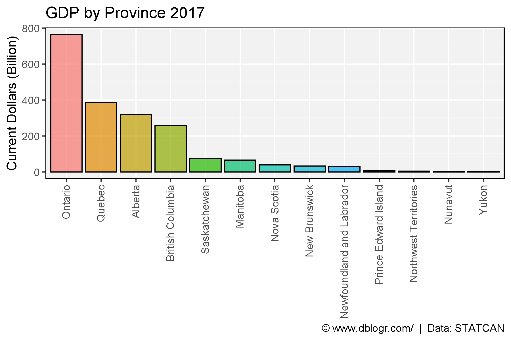

-----

``` r
# Prep data
xx <- d1 %>% 
  filter(!is.na(Value), Industry == "All industries [T001]") %>%
  mutate(Value = Value / 1000000000)
x2 <- xx %>% filter(Year == max(Year), Value > 200)
# Plot
mp <- ggplot(xx, aes(x = Year, y = Value, color = Area)) + 
  geom_line(size = 1) +
  coord_cartesian(xlim = c(min(xx$Year)+1, max(xx$Year)-1)) +
  scale_y_continuous(sec.axis = sec_axis(~ ., breaks = x2$Value, labels = x2$Area)) +
  theme_agData(legend.position = "none") +
  labs(title = "GDP by Province", y = "Current Dollars (Billion)", x = NULL,
       caption = "\xa9 www.dblogr.com/  |  Data: STATCAN")
ggsave("canada_gdp_02.png", mp, width = 6, height = 4)
```

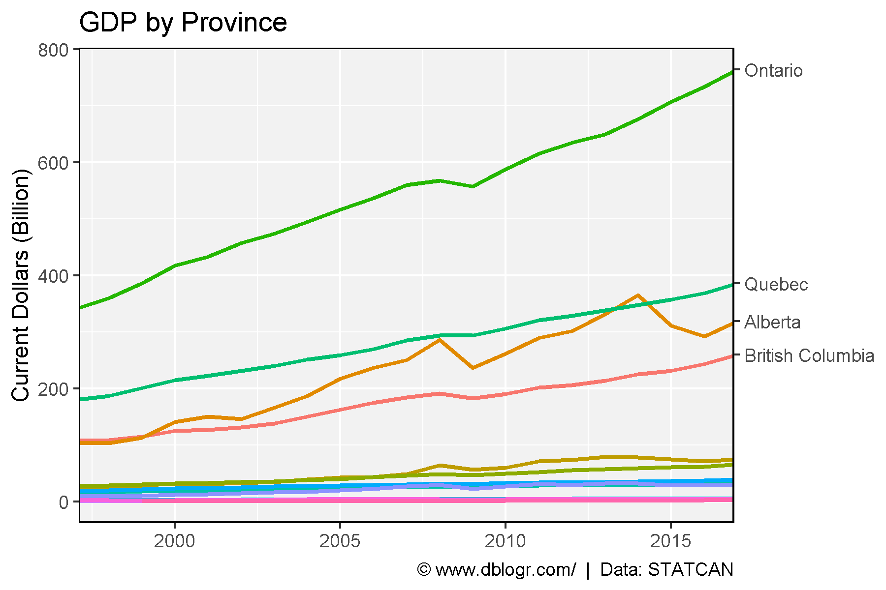

-----

``` r
# Plot
mp <- mp + facet_wrap(Area ~ ., scale = "free_y", ncol = 5) + 
  scale_y_continuous()
ggsave("canada_gdp_03.png", mp, width = 10, height = 6)
```

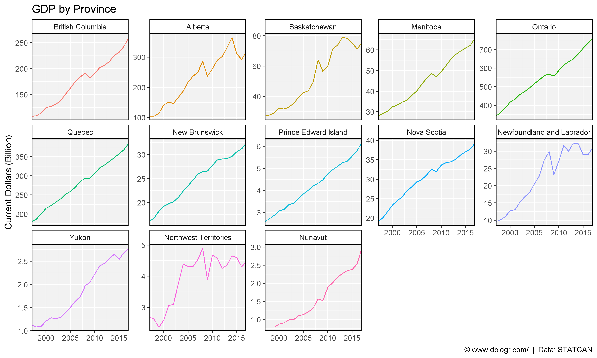

-----

``` r
# Prep data
wc <- c("British Columbia", "Alberta", "Saskatchewan", "Manitoba",
        "Yukon", "Northwest Territories", "Nunavut")
xx <- xx %>% filter(!is.na(Value)) %>%
  mutate(Region = ifelse(Area %in% wc, "Western Canada", "Eastern Canada")) %>%
  group_by(Region, Year) %>% 
  summarise(Value = sum(Value))
# Plot
mp <- ggplot(xx, aes(x = Year, y = Value, color = Region)) + 
  geom_line(size = 1.5, alpha = 0.7) + 
  geom_point(size = 2) +
  coord_cartesian(xlim = c(1997.75, 2015.25)) +
  scale_color_manual(values = c("darkblue", "darkred")) +
  theme_agData(legend.position = "bottom") +
  labs(y = "Current Dollars (Billion)", x = NULL,
       caption = "\xa9 www.dblogr.com/  |  Data: STATCAN")
ggsave("canada_gdp_04.png", mp, width = 6, height = 4)
```

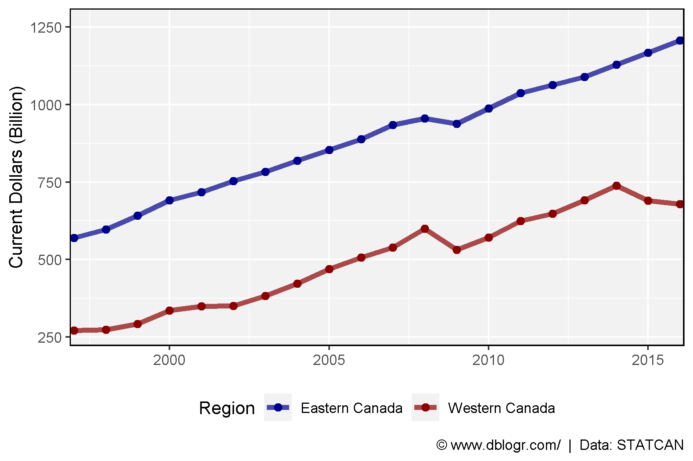

-----

# GDP Per Person

``` r
# Prep data
xx <- d1 %>% left_join(d3, by = c("Area", "Year")) %>%
  mutate(GDP_PP = Value / Number / 1000000) %>%
  filter(!is.na(GDP_PP), Industry == "All industries [T001]")
x2 <- xx %>% filter(Year == max(Year)) %>%
  arrange(desc(GDP_PP)) %>% 
  mutate(Area = factor(Area, levels = unique(Area)))
# Plot
mp <- ggplot(x2, aes(x = Area, y = GDP_PP, fill = Area)) + 
  geom_bar(stat = "identity", color = "black", alpha = 0.7) +
  theme_agData(legend.position = "none",
        axis.text.x = element_text(angle = 90, vjust = 0.4, hjust = 1)) +
  labs(title = paste("GDP Per Person by Province -", max(xx$Year)), 
       y = "Current Dollars (Million)", x = NULL,
       caption = "\xa9 www.dblogr.com/  |  Data: STATCAN")
ggsave("canada_gdp_05.png", mp, width = 6, height = 4)
```

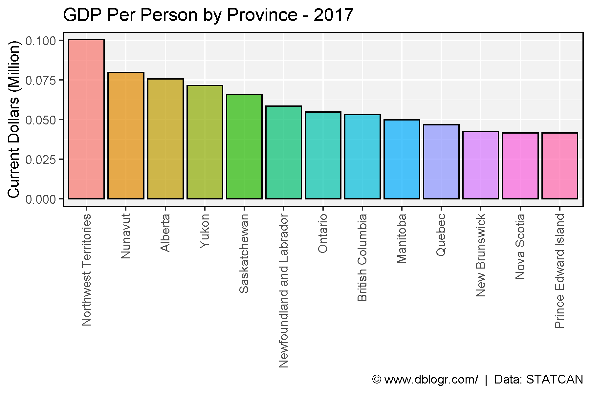

-----

``` r
mp <- ggplot(xx, aes(x = Year, y = GDP_PP, color = Area)) + 
  geom_line(size = 1) +
  coord_cartesian(xlim = c(min(xx$Year)+1, max(xx$Year)-1)) +
  scale_y_continuous(sec.axis = sec_axis(~ ., breaks = x2$GDP_PP, labels = x2$Area)) +
  theme_agData(legend.position = "none") +
  labs(title = "GDP Per Person", y = "Current Dollars (Million)", x = NULL,
       caption = "\xa9 www.dblogr.com/  |  Data: STATCAN")
ggsave("canada_gdp_06.png", mp, width = 6, height = 4)
```

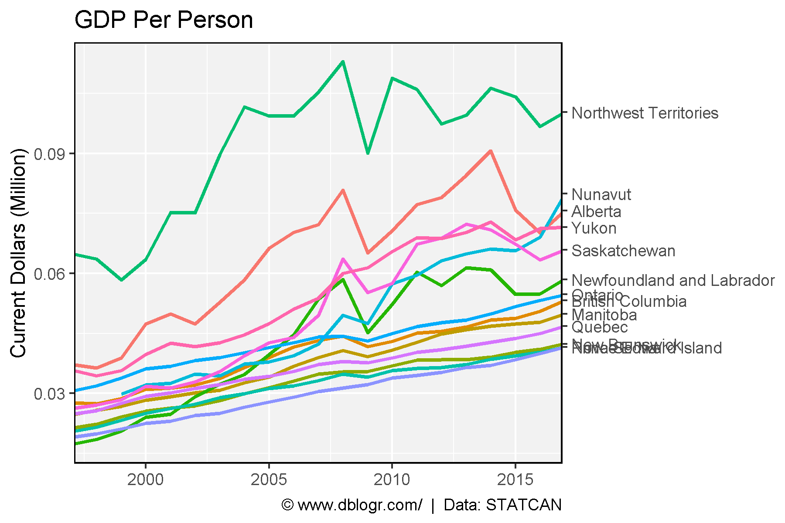

-----

``` r
mp <- mp + facet_wrap(Area ~ ., ncol = 5) + 
  scale_y_continuous()
ggsave("canada_gdp_07.png", mp, width = 10, height = 6)
```

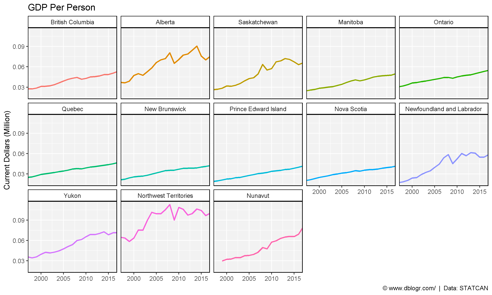

-----

``` r
# Prep data
wc <- c("British Columbia", "Alberta", "Saskatchewan", "Manitoba",
        "Yukon", "Northwest Territories", "Nunavut")
xx <- xx %>% filter(!is.na(Value)) %>%
  mutate(Region = ifelse(Area %in% wc, "Western Canada", "Eastern Canada")) %>%
  group_by(Region, Year) %>% 
  summarise(GDP_PP = mean(GDP_PP))
# Plot
mp <- ggplot(xx, aes(x = Year, y = GDP_PP, color = Region)) + 
  geom_line(size = 1.5, alpha = 0.7) + 
  geom_point(size = 2) +
  scale_color_manual(values = c("darkblue", "darkred")) +
  theme_agData(legend.position = "bottom") +
  labs(title = "GDP Per Person", y = "Current Dollars (Million)", x = NULL,
       caption = "\xa9 www.dblogr.com/  |  Data: STATCAN")
ggsave("canada_gdp_08.png", mp, width = 6, height = 4)
```

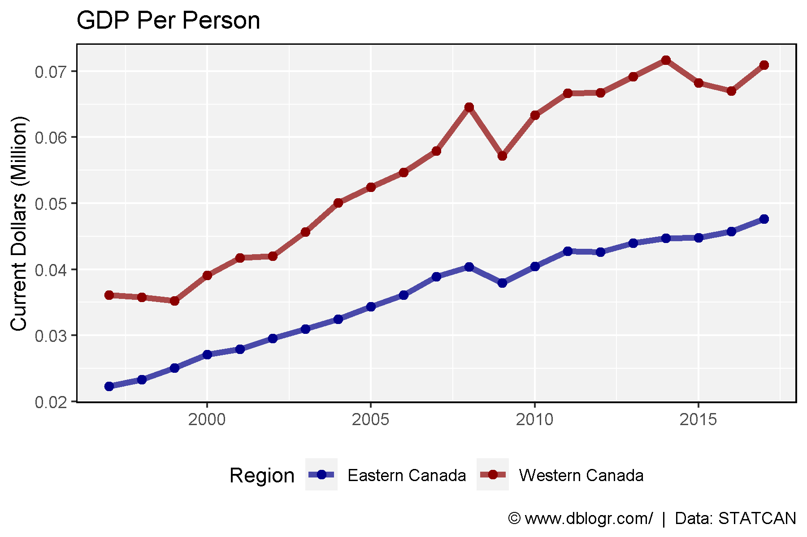

-----

# Compare Privinces

``` r
ggGDP_PP <- function(year, areas, colors) {
  # Prep data
  xx <- d2 %>% #select(1:3, 9:ncol(.)) %>% 
    filter(Year == year, Area %in% areas) %>%
    #gather(Industry, Value, 4:ncol(.)) %>%
    left_join(d3, by = c("Area", "Year")) %>%
    mutate(GDP_PP = 1000000 * Value / Number) %>%
    filter(!is.na(GDP_PP))
  levs <- xx %>% filter(Year == year, Area == areas[1]) %>% 
    arrange(Value) %>% pull(Industry)
  xx <- xx %>% 
    mutate(Industry = factor(Industry, levels = levs),
           Area = factor(Area, levels = areas))
  # Plot
  ggplot(xx, aes(x = Industry, y = GDP_PP, fill = Area)) +
    geom_bar(stat = "identity", position = "dodge", width = 0.75,
             alpha = 0.7, color = "black", lwd = 0.3) +
    scale_fill_manual(values = colors) +
    theme_agData(legend.position = "bottom") +
    coord_flip() +
    labs(title ="GDP Per Person 2016", y = "Million $ / Person", 
         x = NULL, y = NULL,
         caption = "\xa9 www.dblogr.com/  |  Data: STATCAN")
}
```

-----

``` r
mp <- ggGDP_PP(year = 2016, areas = c("Alberta", "Quebec"),
               colors = c("darkblue", "lightblue"))
ggsave("canada_gdp_09.png", mp, width = 8, height = 6)
```

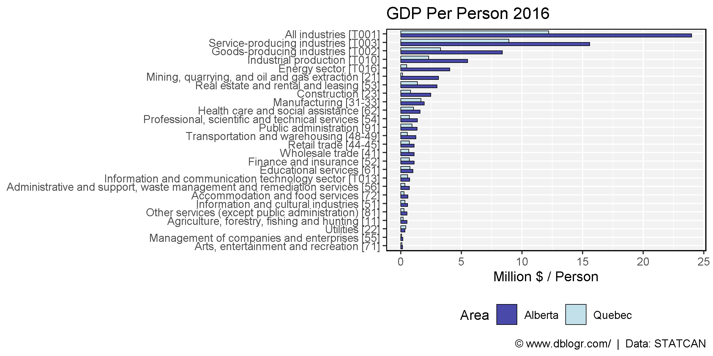

-----

``` r
mp <- ggGDP_PP(2016, c("Alberta", "Ontario"), c("darkblue", "darkred"))
ggsave("canada_gdp_10.png", mp, width = 8, height = 6)
```

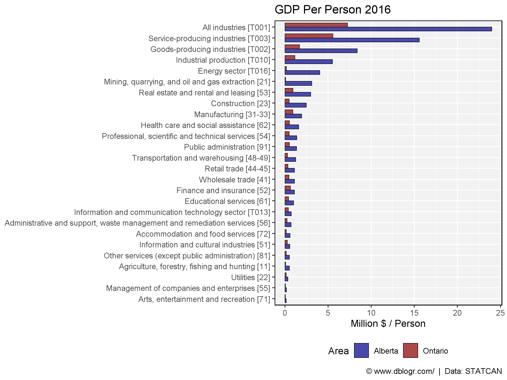

-----

``` r
mp <- ggGDP_PP(2016, c("Alberta", "British Columbia"), c("darkblue", "darkgreen"))
ggsave("canada_gdp_11.png", mp, width = 8, height = 6)
```

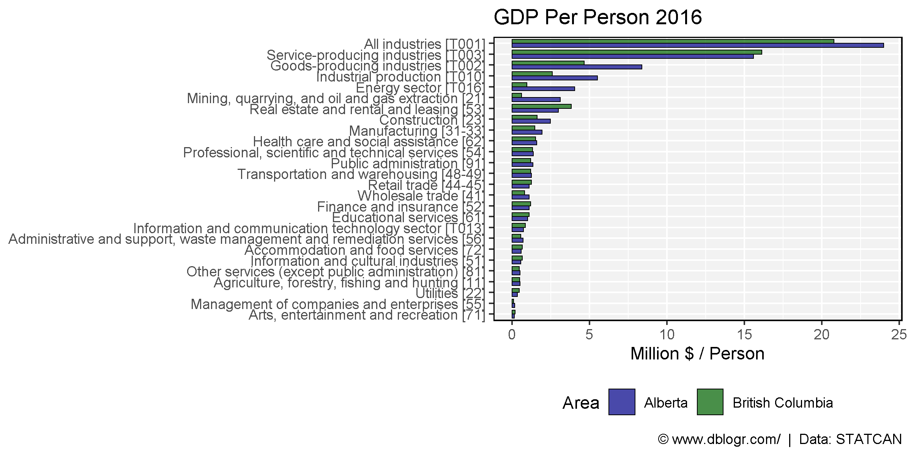

-----

``` r
mp <- ggGDP_PP(2016, c("Saskatchewan", "Manitoba"), c("darkorange3", "darkmagenta"))
ggsave("canada_gdp_12.png", mp, width = 8, height = 6)
```

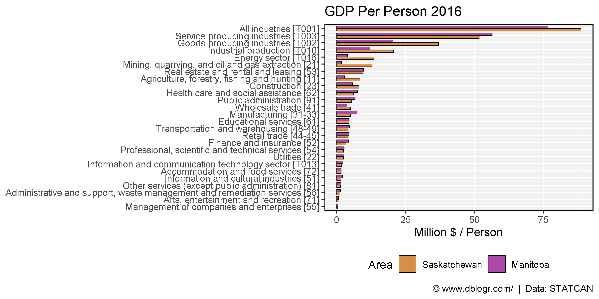

-----

``` r
mp <- ggGDP_PP(2016, c("Alberta", "Saskatchewan"), c("darkblue", "darkorange3"))
ggsave("canada_gdp_13.png", mp, width = 8, height = 6)
```

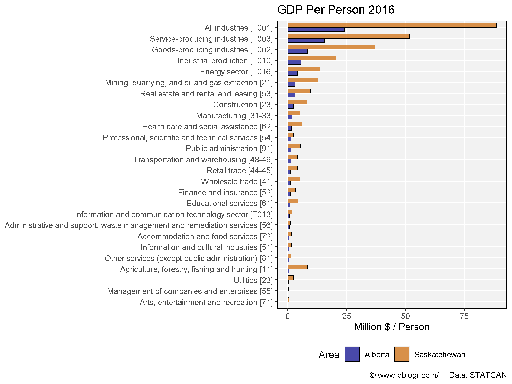

-----

``` r
mp <- ggGDP_PP(2016, c("Ontario", "Saskatchewan"), c("darkred", "darkorange3"))
ggsave("canada_gdp_14.png", mp, width = 8, height = 6)
```

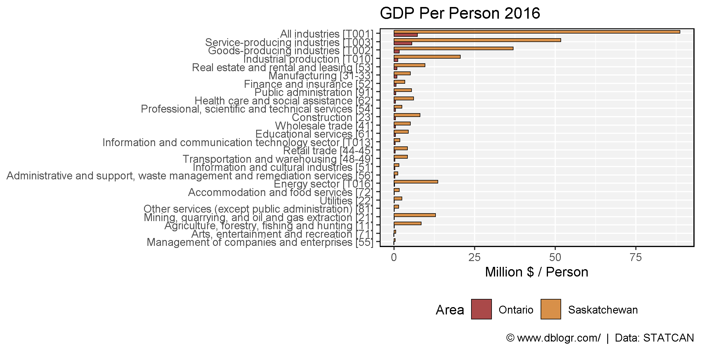

-----

© Derek Michael Wright [www.dblogr.com/](https://dblogr.com/)
