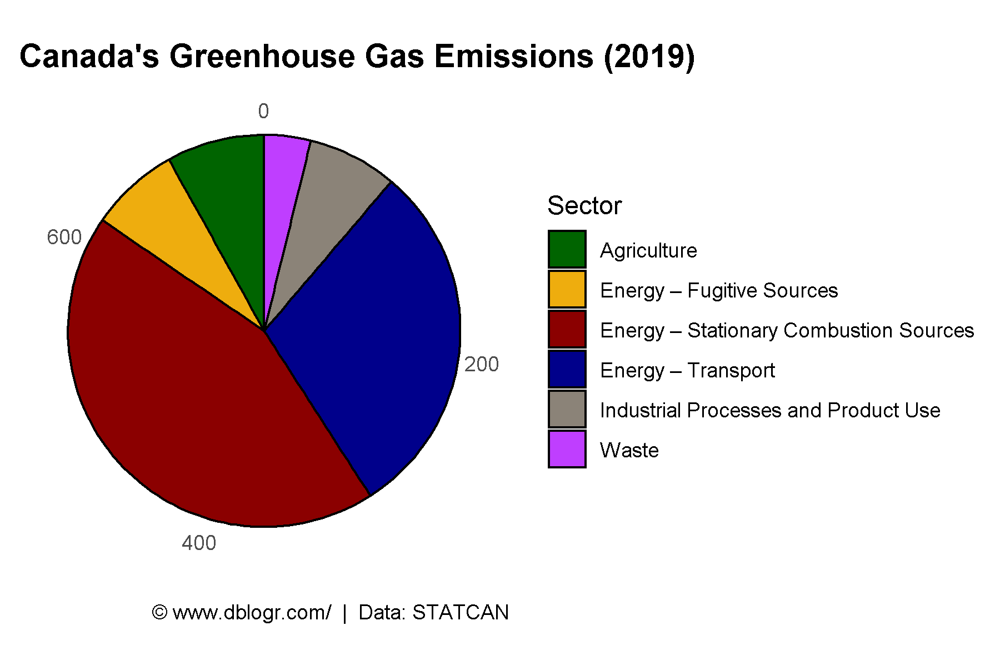
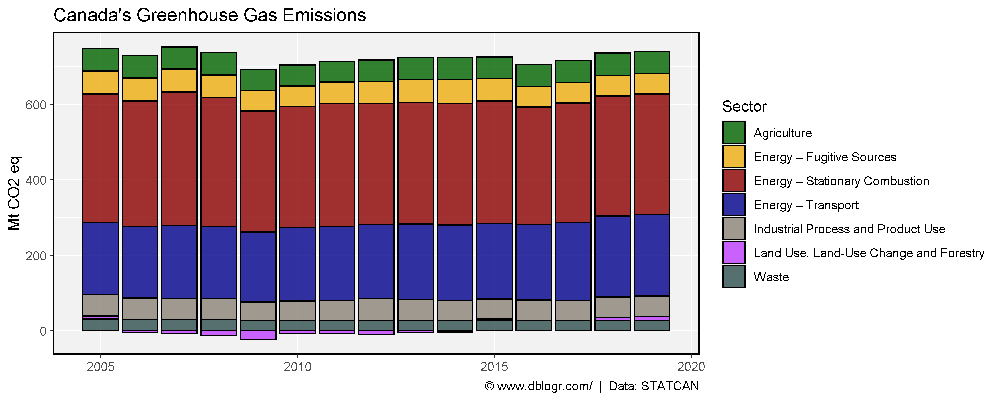
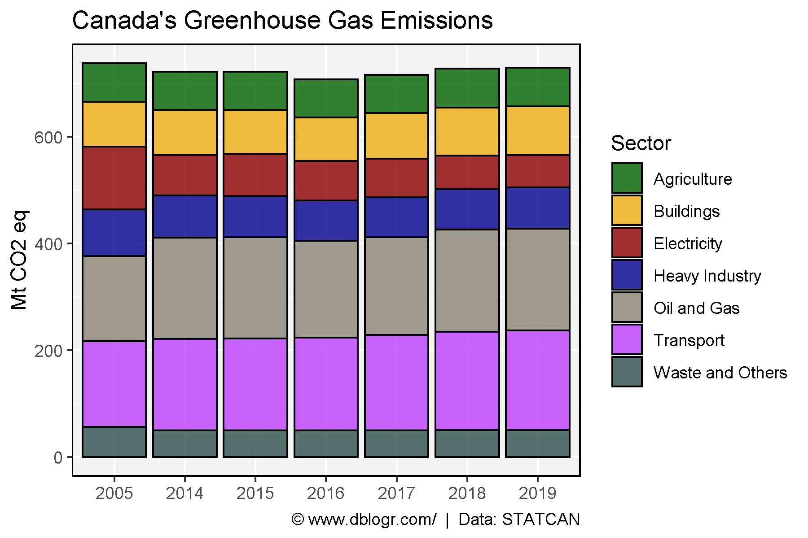
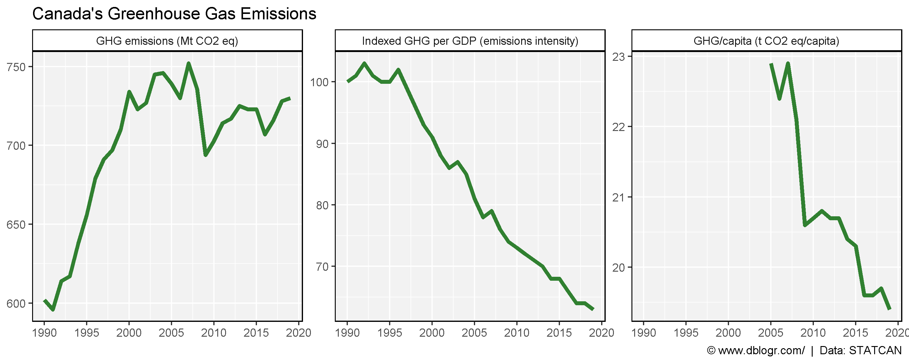

```{r setup, include=FALSE}
knitr::opts_chunk$set(echo = T, message = F, warning = F, out.width = "100%")
```

---

# Data Source

https://www.canada.ca/en/environment-climate-change/services/climate-change/greenhouse-gas-emissions/sources-sinks-executive-summary-2021.html#figure-es-1

```{r echo = F}
downloadthis::download_link(
  link = "https://github.com/derekmichaelwright/dblogr/blob/master/content/dblogr/canada_ghg/canada_ghg_data.xlsx",
  button_label = "canada_ghg_data.xlsx",
  button_type = "success",
  has_icon = TRUE,
  icon = "fa fa-save",
  self_contained = FALSE
)
```

---

```{r}
# devtools::install_github("derekmichaelwright/agData")
library(agData) # Loads: tidyverse, ggpubr, ggbeeswarm, ggrepel
library(readxl) # read_xlsx()
# Prep data
d1 <- read_xlsx("canada_ghg_data.xlsx", "Table1")
d2 <- read_xlsx("canada_ghg_data.xlsx", "Table2") %>%
  gather(Sector, Value, 2:ncol(.))
d3 <- read_xlsx("canada_ghg_data.xlsx", "Table3") %>%
  slice(-1) %>%
  gather(Year, Value, 2:ncol(.))
x1 <- read_xlsx("canada_ghg_data.xlsx", "Table4") %>%
  gather(Trait, Value, 2:3)
x2 <- read_xlsx("canada_ghg_data.xlsx", "Table5") %>% 
  gather(Trait, Value, 2)
d4 <- bind_rows(x1, x2) %>%
  mutate(Trait = factor(Trait, levels = unique(Trait)))
```

---

# 2019 Emissions

```{r}
# Prep data
blank_theme <- theme_minimal() +
    theme(
      axis.title   = element_blank(),
      axis.ticks.y = element_blank(),
      axis.text.y  = element_blank(),
      panel.border = element_blank(),
      panel.grid   = element_blank(),
      plot.title   = element_text(size = 14, face = "bold")
  )
# Plot
mp <- ggplot(d1, aes(x = "", y = `Mt CO2 eq`, fill = Sector)) +
  geom_bar(stat = "identity", color = "black", alpha = 0.8) +
  coord_polar("y", start = 0) +
  scale_fill_manual(values = agData_Colors) +
  blank_theme +
  labs(title = "Canada's Greenhouse Gas Emissions (2019)",
       y = "GHG/capita (t CO2 eq/capita)", x = NULL,
       caption = "\xa9 www.dblogr.com/  |  Data: STATCAN")
ggsave("canada_ghg_01.png", mp, width = 6, height = 4)
```



---

# Emissions by Sector

```{r}
# Plot
mp <- ggplot(d2, aes(x = Year, y = Value, fill = Sector)) +
  geom_bar(stat = "identity", color = "black", alpha = 0.8) +
  scale_fill_manual(values = agData_Colors) +
  theme_agData() +
  labs(title = "Canada's Greenhouse Gas Emissions",
       y = "Mt CO2 eq", x = NULL,
       caption = "\xa9 www.dblogr.com/  |  Data: STATCAN")
ggsave("canada_ghg_02.png", mp, width = 10, height = 4)
```

```{r echo = F}
ggsave("featured.png", mp, bg = "transparent", width = 10, height = 4)
```



---

```{r}
# Plot
mp <- ggplot(d3, aes(x = Year, y = Value, fill = Sector)) +
  geom_bar(stat = "identity", color = "black", alpha = 0.8) +
  scale_fill_manual(values = agData_Colors) +
  theme_agData() +
  labs(title = "Canada's Greenhouse Gas Emissions",
       y = "Mt CO2 eq", x = NULL,
       caption = "\xa9 www.dblogr.com/  |  Data: STATCAN")
ggsave("canada_ghg_03.png", mp, width = 6, height = 4)
```



---

# Total Emissions

```{r}
# Plot
mp <- ggplot(d4, aes(x = Year, y = Value)) +
  geom_line(color = "darkgreen", alpha = 0.8, size = 1.5) +
  facet_wrap(Trait ~ . , scales = "free_y") +
  scale_x_continuous(breaks = seq(1990, 2020, 5)) +
  theme_agData() +
  labs(title = "Canada's Greenhouse Gas Emissions", 
       x = NULL, y = NULL,
       caption = "\xa9 www.dblogr.com/  |  Data: STATCAN")
ggsave("canada_ghg_04.png", mp, width = 10, height = 4)
```



---

&copy; Derek Michael Wright [www.dblogr.com/](https://dblogr.com/)