<script src="index_files/font-awesome/js/script.js"></script>

<script src="index_files/font-awesome/js/script.js"></script>

<script src="index_files/font-awesome/js/script.js"></script>

-----

# Data Sources

https://www150.statcan.gc.ca/t1/tbl1/en/tv.action?pid=1710000901

https://www150.statcan.gc.ca/t1/tbl1/en/tv.action?pid=1710000501

https://www150.statcan.gc.ca/t1/tbl1/en/cv.action?pid=1710000801

<a href="https://github.com/derekmichaelwright/dblogr/blob/master/content/dblogr/canada_population_demographics/1710000901_databaseLoadingData.csv">
<button class="btn btn-success"><i class="fa fa-save"></i> STATCAN Table 17-10-0009-01</button>
</a>

<a href="https://github.com/derekmichaelwright/dblogr/blob/master/content/dblogr/canada_population_demographics/1710000501_databaseLoadingData.csv">
<button class="btn btn-success"><i class="fa fa-save"></i> STATCAN Table 17-10-0005-01</button>
</a>

<a href="https://github.com/derekmichaelwright/dblogr/blob/master/content/dblogr/canada_population_demographics/1710000801_databaseLoadingData.csv">
<button class="btn btn-success"><i class="fa fa-save"></i> STATCAN Table 17-10-0008-01</button>
</a>

-----

# Prep data

``` r
# devtools::install_github("derekmichaelwright/agData")
library(agData) # Loads: tidyverse, ggpubr, ggbeeswarm, ggrepel
library(gganimate)
library(transformr)
# Prep data
d1 <- read.csv("1710000901_databaseLoadingData.csv") %>%
  select(Year=1, Area=GEO, Unit=UOM, Value=VALUE) %>%
  mutate(Month = substr(Year, 6, 8),
         Year = substr(Year, 1,4),
         Year = as.numeric(Year),
         Month = as.numeric(Month))
#
d2 <- read.csv("1710000501_databaseLoadingData.csv")  %>%
  select(Year=1, Area=GEO, Sex, Age=Age.group, Unit=UOM, Value=VALUE) %>%
  mutate(Year = substr(Year, 1,4),
         Year = as.numeric(Year))
# 
d3 <- read.csv("1710000801_databaseLoadingData.csv") %>%
  select(Year=1, Area=GEO, Measurement=Components.of.population.growth, Unit=UOM, Value=VALUE) %>%
  mutate(Year = substr(Year, 1,4),
         Year = as.numeric(Year))
```

# Population

``` r
# Prep data
areas <- c("Canada", "Ontario", "Quebec", "New Brunswick", "Nova Scotia",
           "Prince Edward Island", "Newfoundland and Labrador",
           "British Columbia", "Alberta","Saskatchewan", "Manitoba",
           "Yukon", "Northwest Territories including Nunavut", 
           "Northwest Territories", "Nunavut")
xx <- d1 %>% filter(Area %in% areas) %>%
  mutate(Area = factor(Area, levels = areas))
# Plot
mp <- ggplot(xx, aes(x = Year, y = Value / 1000000, color = Area)) +
  geom_line(size = 1) +
  facet_wrap(Area ~ ., ncol = 4, scales = "free_y") +
  theme_agData(legend.position = "none", 
               axis.text.x = element_text(angle = 45, hjust = 1)) +
  labs(y = "Million People", x = NULL,
       caption = "\xa9 www.dblogr.com/ | Data: STATCAN")
ggsave("canada_population_demographics_1_01.png", mp, width = 10, height = 6)
```

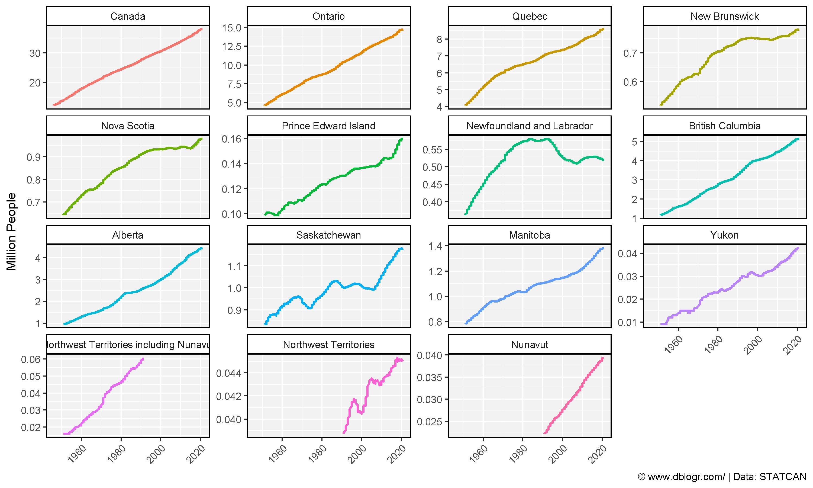

-----

# Population Pyramids

## Create Plotting Functions

``` r
gg_PopDem_plot <- function(areas = "Saskatchewan", title = areas, years = 2019, anim = F) {
  # Prep data
  ages <- c("0 to 4 years", "5 to 9 years", "10 to 14 years", "15 to 19 years",
          "20 to 24 years", "25 to 29 years", "30 to 34 years", "35 to 39 years",
          "40 to 44 years", "45 to 49 years", "50 to 54 years", "55 to 59 years",
          "60 to 64 years", "65 to 69 years", "70 to 74 years", "75 to 79 years",
          "80 to 84 years", "85 to 89 years", "90 to 94 years", "95 to 99 years" ,
          "100 years and over")
  xx <- d2 %>% 
    filter(Area %in% areas, Year %in% years, Age %in% ages) %>%
    mutate(Age = factor(Age, levels = ages),
           Value = Value / 1000)
  # Plot
  mp <- ggplot(xx, aes(y = Value, x = Age, fill = Sex)) + 
    geom_bar(data = xx %>% filter(Sex == "Males"), stat = "identity", alpha = 0.8) +
    geom_bar(data = xx %>% filter(Sex == "Females"), 
             aes(y = -Value), stat = "identity", alpha = 0.8) +
    scale_fill_manual(values = c("deeppink3","darkblue"))
  if(anim == T) { mp <- mp + facet_grid(. ~ Area) }
  if(anim == F) { mp <- mp + facet_grid(. ~ Year) + labs(title = title) }
  mp + 
    theme_agData(legend.position = "bottom", 
                 axis.text.x = element_text(angle = 45, hjust = 1)) +
    labs(x = NULL, y = "Thousand People",
         caption = "\xa9 www.dblogr.com/ | Data: STATCAN") +
    coord_cartesian(ylim = c(-max(xx$Value), max(xx$Value))) +
    coord_flip()
}
gg_PopDem_anim <- function(areas = c("Saskatchewan", "Alberta")) {
  gg_PopDem_plot(areas = areas, years = 1971:2019, anim = T) +
    # Here comes the gganimate specific bits
    labs(title = '{round(frame_time)}') +
    transition_time(Year) +
    ease_aes('linear')
}
```

-----

## Canada

``` r
mp <- gg_PopDem_plot(areas = "Canada", years = c(1971, 1980, 1990, 2000, 2020))
ggsave("canada_population_demographics_2_01.png", mp, width = 10, height = 4)
```

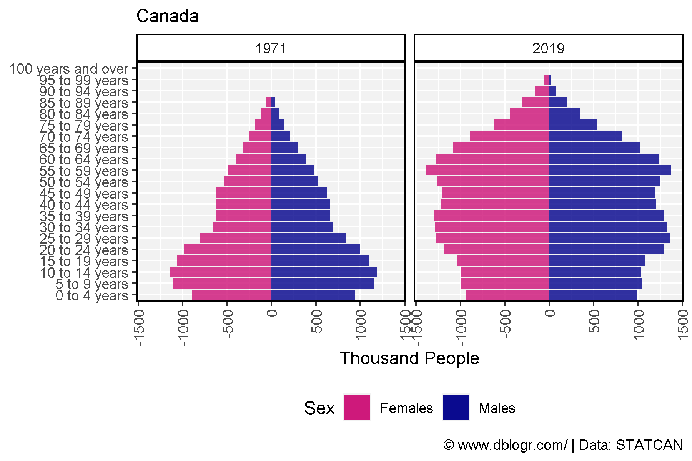

-----

``` r
mp <- gg_PopDem_anim(areas = "Canada")
anim_save("canada_population_demographics_gif_2_01.gif", mp, width = 600, height = 400)
```

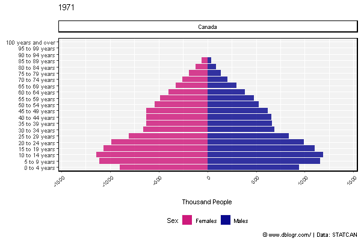

-----

## Eastern Canada

``` r
areas <- c("Ontario", "Quebec","New Brunswick", "Nova Scotia",
           "Prince Edward Island", "Newfoundland and Labrador")
mp <- gg_PopDem_plot(areas = areas, title = "Eastern Canada",
                     years = c(1971, 1980, 1990, 2000, 2020))
ggsave("canada_population_demographics_2_02.png", mp, width = 10, height = 4)
```

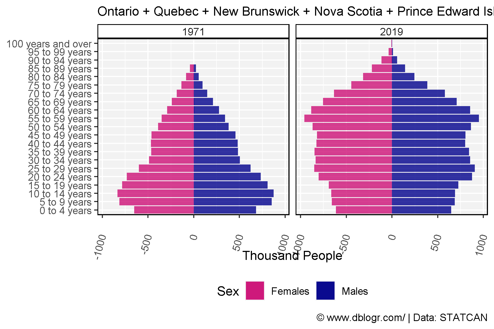

-----

``` r
mp <- gg_PopDem_anim(areas = areas)
anim_save(paste0("canada_population_demographics_gif_2_02.gif"), mp, width = 600, height = 400)
```

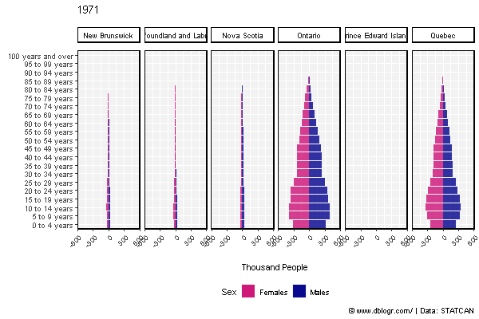

-----

## Western Canada

``` r
areas <- c("British Columbia", "Alberta","Saskatchewan", "Manitoba",
           "Yukon", "Northwest Territories", "Nunavut")
mp <- gg_PopDem_plot(areas = areas, title = "Western Canada",
                     years = c(1971, 1980, 1990, 2000, 2020))
ggsave("canada_population_demographics_2_03.png", mp, width = 10, height = 4)
```

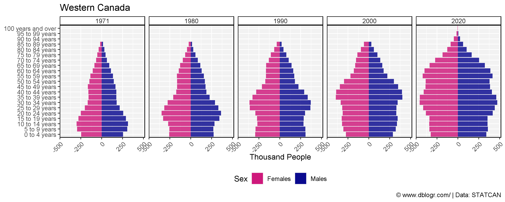

-----

``` r
mp <- gg_PopDem_anim(areas = areas)
anim_save(paste0("canada_population_demographics_gif_2_03.gif"), mp, width = 600, height = 400)
```

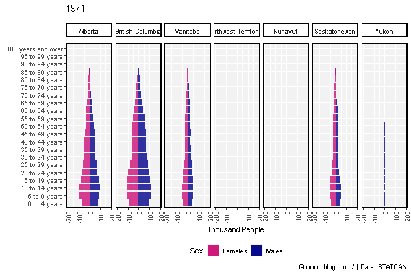

-----

## British Columbia

``` r
mp <- gg_PopDem_plot(areas = "British Columbia", years = c(1971, 1980, 1990, 2000, 2020))
ggsave("canada_population_demographics_2_04.png", mp, width = 10, height = 4)
```

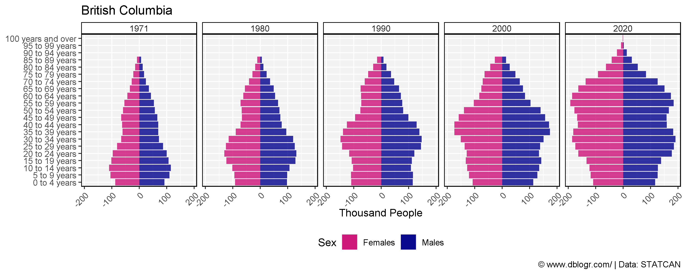

-----

``` r
mp <- gg_PopDem_anim(areas = "British Columbia")
anim_save(paste0("canada_population_demographics_gif_2_04.gif"), mp, width = 600, height = 400)
```

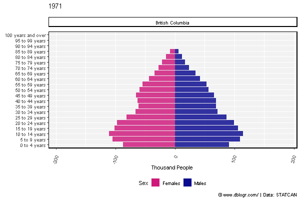

-----

## Alberta

``` r
mp <- gg_PopDem_plot(areas = "Alberta", years = c(1971, 1980, 1990, 2000, 2020))
ggsave("canada_population_demographics_2_05.png", mp, width = 10, height = 4)
```

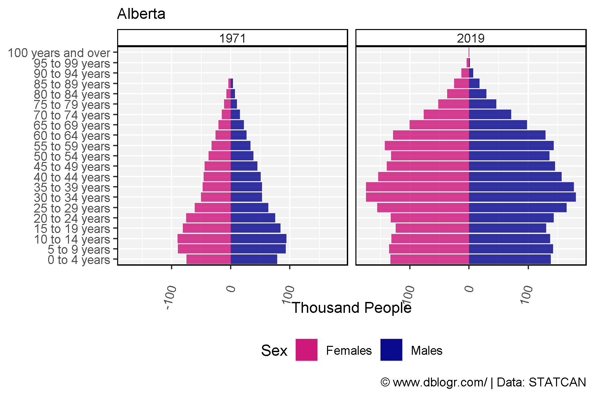

-----

``` r
mp <- gg_PopDem_anim(areas = "Alberta")
anim_save(paste0("canada_population_demographics_gif_2_05.gif"), mp, width = 600, height = 400)
```

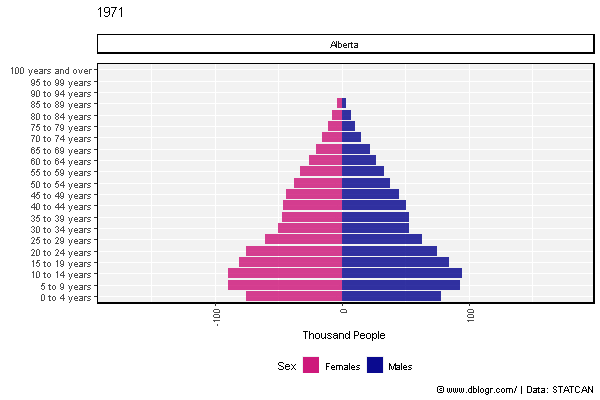

-----

## Saskatchewan

``` r
mp <- gg_PopDem_plot(areas = "Saskatchewan", years = c(1971, 1980, 1990, 2000, 2020))
ggsave("canada_population_demographics_2_06.png", mp, width = 10, height = 4)
```

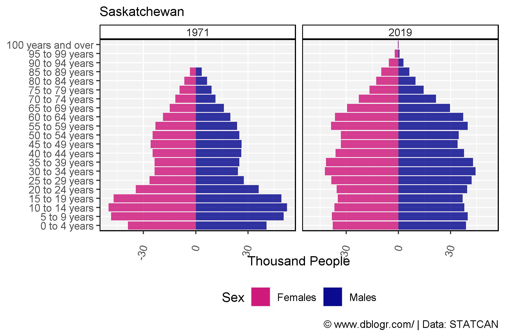

-----

``` r
mp <- gg_PopDem_anim(areas = "Saskatchewan")
anim_save(paste0("canada_population_demographics_gif_2_06.gif"), mp, width = 600, height = 400)
```


-----

## Ontario

``` r
mp <- gg_PopDem_plot(areas = "Ontario", years = c(1971, 1980, 1990, 2000, 2020))
ggsave("canada_population_demographics_2_07.png", mp, width = 10, height = 4)
```

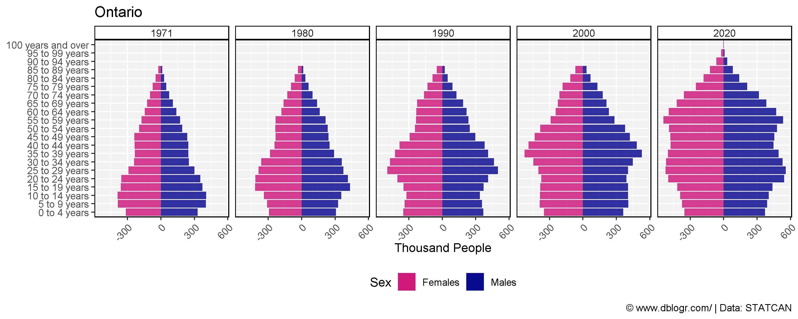

-----

``` r
mp <- gg_PopDem_anim(areas = "Saskatchewan")
anim_save(paste0("canada_population_demographics_gif_2_07.gif"), mp, width = 600, height = 400)
```

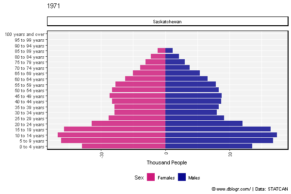

-----

# Line Graphs

``` r
# Prep data
ages <- c("0 to 4 years", "5 to 9 years", "10 to 14 years", "15 to 19 years",
            "20 to 24 years", "25 to 29 years", "30 to 34 years", "35 to 39 years",
            "40 to 44 years", "45 to 49 years", "50 to 54 years", "55 to 59 years",
            "60 to 64 years", "65 to 69 years", "70 to 74 years", "75 to 79 years",
            "80 to 84 years", "85 to 89 years", "90 to 94 years", "95 to 99 years" ,
            "100 years and over")
xx <- d2 %>%
  filter(Area == "Canada", Sex %in% c("Males","Females"), Age %in% ages) %>%
  mutate(Age = factor(Age, levels = ages))
# Plot
mp <- ggplot(xx, aes(x = Year, y = Value / 1000000, color = Sex)) +
  geom_line(size = 1, alpha = 0.8) +
  facet_wrap(Age ~ ., scales = "free_y", ncol = 6) +
  scale_color_manual(values = c("deeppink3","darkblue")) +
  theme_agData(legend.position = "bottom",
               axis.text.x = element_text(angle = 45, hjust = 1)) +
  labs(y = "Million", x = NULL,
       caption = "\xa9 www.dblogr.com/ | Data: STATCAN")
ggsave("canada_population_demographics_3_01.png", mp, width = 12, height = 6)
```

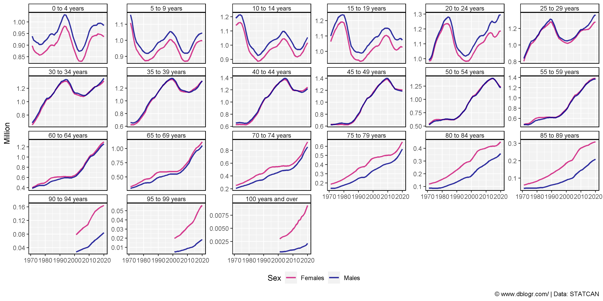

-----

``` r
xx <- d2 %>%
  filter(Area == "Canada", Sex %in% c("Males","Females"), Age %in% ages) %>%
  mutate(Age = factor(Age, levels = ages))
# Plot
mp <- ggplot(xx, aes(x = Year, y = Value, color = Sex, group = Sex)) +
  geom_line(size = 1, alpha = 0.8) +
  scale_color_manual(values = c("deeppink3","darkblue")) +
  theme_agData(legend.position = "bottom") +
  labs(y = "Million", x = NULL,
       caption = "\xa9 www.dblogr.com/ | Data: STATCAN") +
  # Here comes the gganimate specific bits
  labs(title = '{closest_state}') +
  transition_states(Age, transition_length = 1, state_length = 1) +
  ease_aes('linear')
anim_save("canada_population_demographics_gif_3_01.gif", mp, width = 600, height = 400)
```

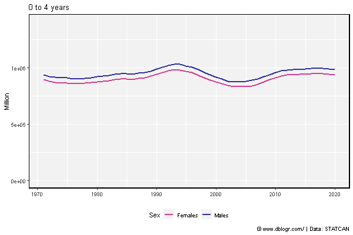

-----

# Immigration

``` r
# Prep data
areas <- c("Canada", "Ontario", "Quebec", "New Brunswick", "Nova Scotia",
           "Prince Edward Island", "Newfoundland and Labrador",
           "British Columbia", "Alberta","Saskatchewan", "Manitoba",
           "Yukon", "Northwest Territories including Nunavut", 
           "Northwest Territories", "Nunavut")
colors <- c("darkgreen","black","darkred","darkblue")
measures <- c("Births", "Deaths", "Immigrants", "Emigrants")
xx <- d3 %>% filter(Measurement %in% measures) %>%
  mutate(Area = factor(Area, levels = areas))
# Plot
mp <- ggplot(xx, aes(x = Year, y = Value / 1000, color = Measurement)) +
  geom_line(size = 1, alpha = 0.8) +
  facet_wrap(Area ~ ., ncol = 5, scales = "free_y") +
  scale_color_manual(values = colors) +
  theme_agData(legend.position = "bottom", 
               axis.text.x = element_text(angle = 45, hjust = 1)) +
  labs(y = "Thousand People", x = NULL,
       caption = "\xa9 www.dblogr.com/ | Data: STATCAN")
ggsave("canada_population_demographics_4_01.png", mp, width = 12, height = 6)
```

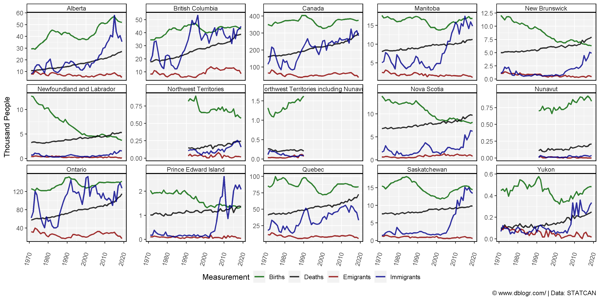

-----

``` r
# Prep data
colors <- c("steelblue", "red", "darkorange", "darkblue", "darkgreen", "darkred")
areas <- c("Quebec", "Ontario", "British Columbia", "Alberta", "Saskatchewan", "Manitoba")
wings <- c("Left", "Left", "Left", "Right", "Right", "Right")
x1 <- d1 %>% 
  filter(Month == 1) %>%
  select(Area, Year, Population=Value)
x2 <- d3 %>% 
  filter(Measurement == "Immigrants") %>%
  select(Area, Year, Immigrants=Value)
xx <- left_join(x1, x2, by = c("Area", "Year")) %>%
  filter(Area %in% areas, !is.na(Immigrants)) %>%
  mutate(Value = 1000000 * Immigrants / Population,
         Area = factor(Area, levels = areas),
         Wing = plyr::mapvalues(Area, areas, wings))
# Plot
mp <- ggplot(xx, aes(x = Year, y = Value, color = Area)) +
  geom_line(alpha = 0.2) + 
  geom_smooth(se = F) +
  facet_grid(. ~ Wing) +
  scale_x_continuous(breaks = seq(1975, 2015, 10)) +
  scale_color_manual(values = colors) +
  theme_agData() +
  labs(title = "Immigration Rates", x = NULL,
       y = "Immigrants per Million People",
       caption = "\xa9 www.dblogr.com/ | Data: STATCAN")
ggsave("canada_population_demographics_4_02.png", mp, width = 8, height = 4)
```

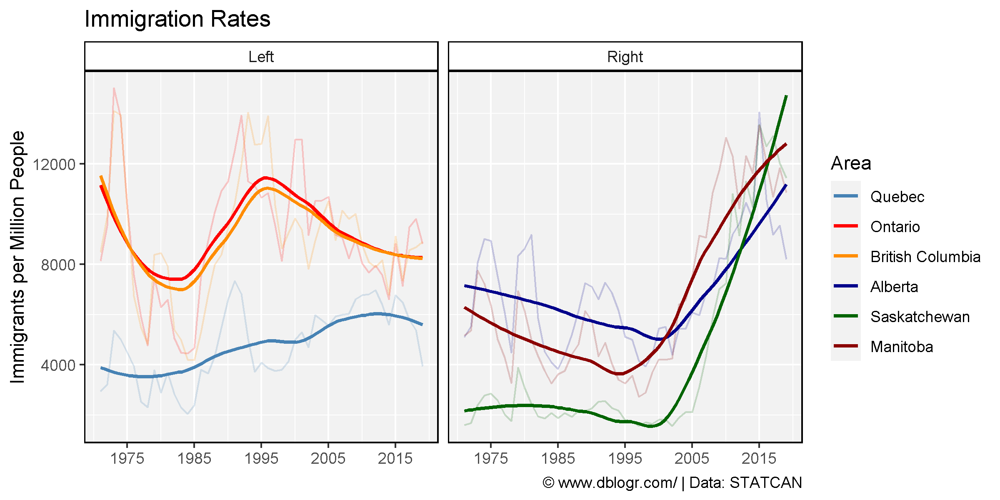

-----

# Births vs Deaths

``` r
# Prep data
xx <- d3 %>% filter(Area == "Saskatchewan", Measurement %in% c("Births","Deaths"))
# Plot
mp <- ggplot(xx, aes(x = Year, y = Value / 1000000, color = Measurement)) + 
  geom_line(size = 1.5, alpha = 0.8) + 
  scale_color_manual(values = c("darkblue", "darkred")) +
  theme_agData() +
  labs(title = "Population Dynamics in Saskatchewan, Canada", 
       y = "Million People", x = NULL,
       caption = "\xa9 www.dblogr.com/ | Data: STATCAN")
ggsave("canada_population_demographics_5_01.png", mp, width = 6, height = 4)
```

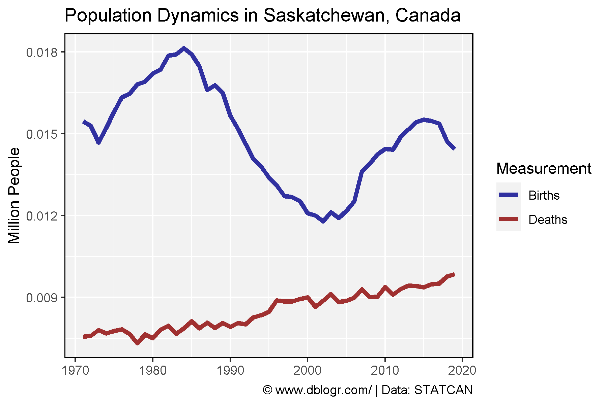

-----

© Derek Michael Wright [www.dblogr.com/](https://dblogr.com/)
