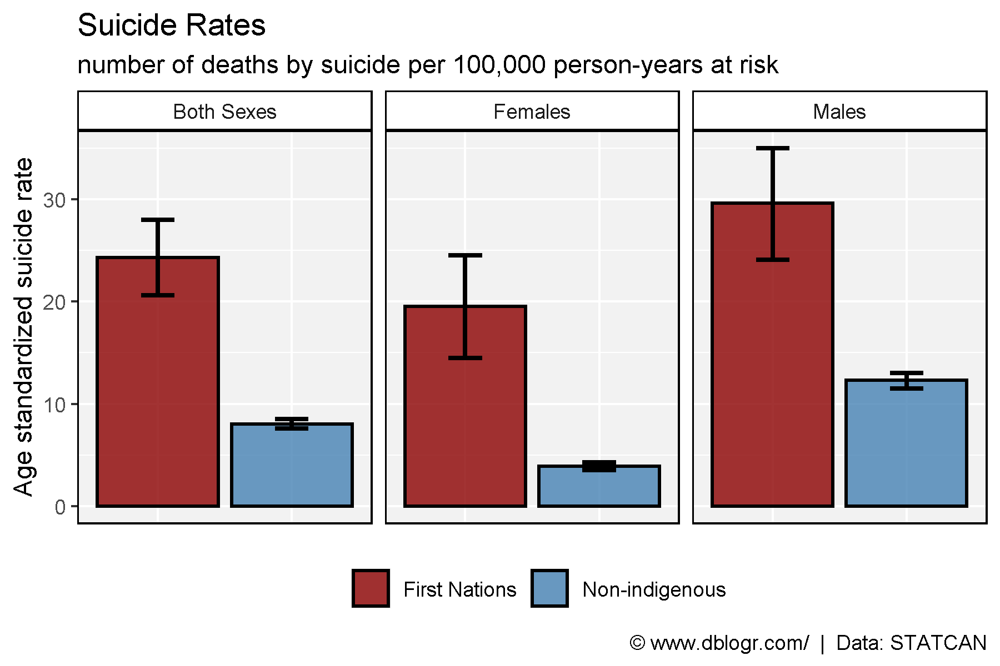
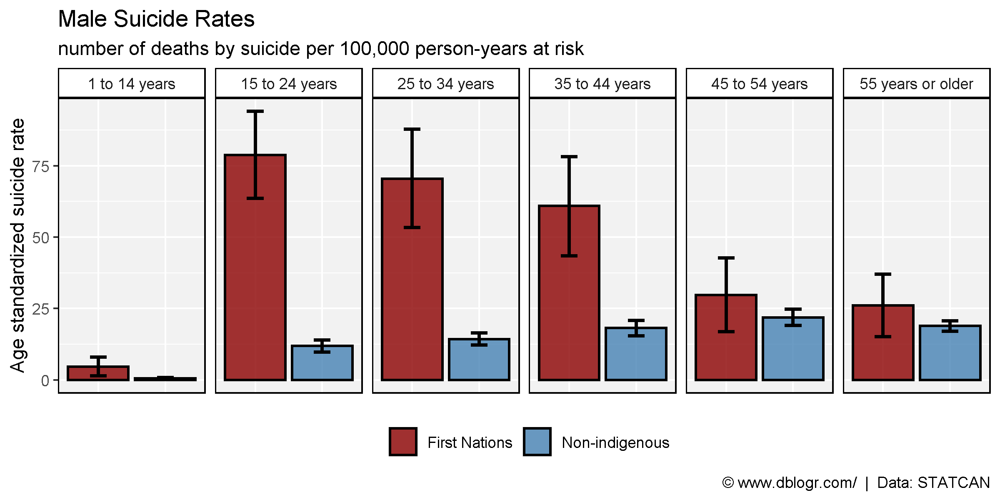
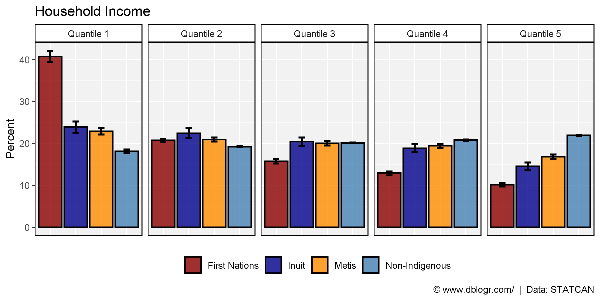
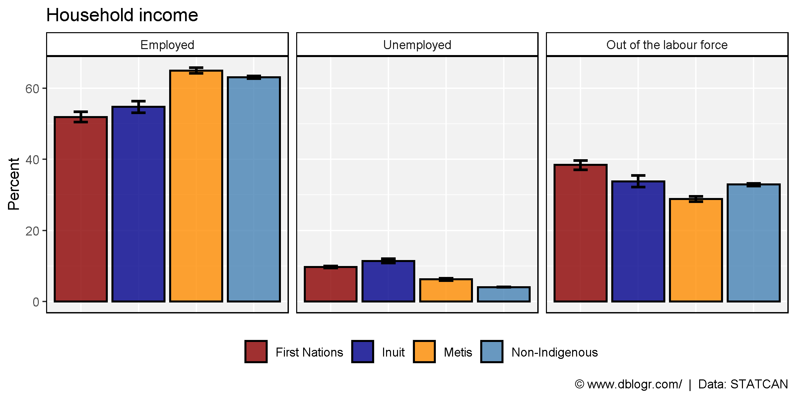
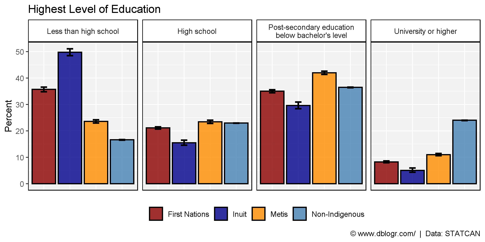
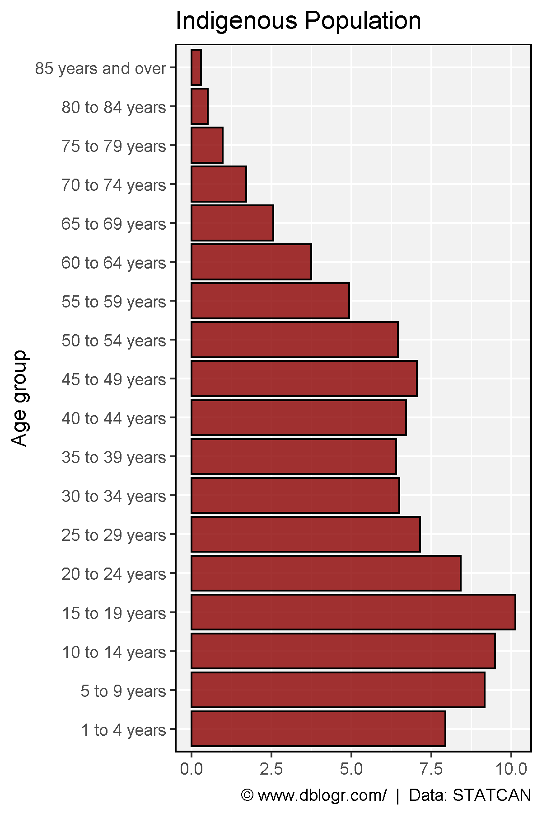

```{r setup, include=FALSE}
knitr::opts_chunk$set(echo = T, message = F, warning = F)
```

---

# Data Source

https://www150.statcan.gc.ca/n1/pub/99-011-x/99-011-x2019001-eng.htm

```{r echo = F}
downloadthis::download_link(
  link = "https://github.com/derekmichaelwright/dblogr/blob/master/content/dblogr/canada_suicide/canada_suicide_data.xlsx",
  button_label = "canada_suicide_data.xlsx",
  button_type = "success",
  has_icon = TRUE,
  icon = "fa fa-save",
  self_contained = FALSE
)
```

---

# Prepare data

```{r}
# devtools::install_github("derekmichaelwright/agData")
library(agData) # Loads: tidyverse, ggpubr, ggbeeswarm, ggrepel
library(readxl)
# Prep data
d1 <- read_xlsx("canada_suicide_data.xlsx", "Table 1") %>% spread(Unit, Value)
d2 <- read_xlsx("canada_suicide_data.xlsx", "Table 2") %>% spread(Unit, Value)
d3 <- read_xlsx("canada_suicide_data.xlsx", "Table A5") %>% spread(Unit, Value)
d4 <- read_xlsx("canada_suicide_data.xlsx", "Table A6") %>%
  mutate(`Age group` = factor(`Age group`, levels = unique(`Age group`)))
```

---

# Suicides

```{r}
# Plot
mp <- ggplot(d1, aes(x = Race, y = ASMR, fill = Race)) +
  geom_bar(stat = "identity", color = "black", alpha = 0.8, size = 0.75) +
  geom_errorbar(width = 0.25, size = 1,
                aes(ymin = `Lower 95% confidence interval`, 
                    ymax = `Upper 95% confidence interval`)) +
  facet_grid(. ~ Sex) +
  scale_fill_manual(name = NULL, values = c("darkred", "steelblue")) +
  theme_agData(legend.position = "bottom",
               axis.text.x = element_blank(),
               axis.ticks.x = element_blank()) +
  labs(title = "Suicide Rates", y = "Age standardized suicide rate", x = NULL,
       subtitle = "number of deaths by suicide per 100,000 person-years at risk",
       caption = "\xa9 www.dblogr.com/  |  Data: STATCAN")
ggsave("canada_suicide_01.png", mp, width = 6, height = 4)
```



---

# Males by Age

```{r}
# Plot
mp <- ggplot(d2, aes(x = Race, y = ASMR, fill = Race)) +
  geom_bar(stat = "identity", color = "black", alpha = 0.8, size = 0.75) +
  geom_errorbar(width = 0.25, size = 1,
                aes(ymin = `Lower 95% confidence interval`, 
                    ymax = `Upper 95% confidence interval`)) +
  facet_grid(. ~ `Age group`) +
  scale_fill_manual(name = NULL, values = c("darkred", "steelblue")) +
  theme_agData(legend.position = "bottom",
               axis.text.x = element_blank(),
               axis.ticks.x = element_blank()) +
  labs(title = "Male Suicide Rates", y = "Age standardized suicide rate", x = NULL,
       subtitle = "number of deaths by suicide per 100,000 person-years at risk",
       caption = "\xa9 www.dblogr.com/  |  Data: STATCAN")
ggsave("canada_suicide_02.png", mp, width = 8, height = 4)
```



---

# Household Income

```{r}
# Prep data
colors <- c("darkred", "darkblue", "darkorange", "steelblue" )
xx <- d3 %>% filter(Trait == "Household income")
# Plot
mp <- ggplot(xx, aes(x = Race, y = Percent, fill = Race)) +
  geom_bar(stat = "identity", color = "black", alpha = 0.8, size = 0.75) +
  geom_errorbar(width = 0.25, size = 1,
                aes(ymin = `Lower 95% confidence interval`, 
                    ymax = `Upper 95% confidence interval`)) +
  facet_grid(. ~ Measurement) +
  scale_fill_manual(name = NULL, values = colors) +
  theme_agData(legend.position = "bottom",
               axis.text.x = element_blank(),
               axis.ticks.x = element_blank()) +
  labs(title = "Household Income", x = NULL,
       caption = "\xa9 www.dblogr.com/  |  Data: STATCAN")
ggsave("canada_suicide_03.png", mp, width = 8, height = 4)
```



---

# Labour Force Status

```{r}
# Prep data
measures <- c("Employed", "Unemployed", "Out of the labour force")
xx <- d3 %>% filter(Trait == "Labour force status") %>%
  mutate(Measurement = factor(Measurement, levels = measures))
# Plot
mp <- ggplot(xx, aes(x = Race, y = Percent, fill = Race)) +
  geom_bar(stat = "identity", color = "black", alpha = 0.8, size = 0.75) +
  geom_errorbar(width = 0.25, size = 1,
                aes(ymin = `Lower 95% confidence interval`, 
                    ymax = `Upper 95% confidence interval`)) +
  facet_grid(. ~ Measurement) +
  scale_fill_manual(name = NULL, values = colors) +
  theme_agData(legend.position = "bottom",
               axis.text.x = element_blank(),
               axis.ticks.x = element_blank()) +
  labs(title = "Household income", x = NULL,
       caption = "\xa9 www.dblogr.com/  |  Data: STATCAN")
ggsave("canada_suicide_04.png", mp, width = 8, height = 4)
```



---

# Highest Level of Education

```{r}
# Prep data
measures <- c("Less than high school", "High school",
              "Post-secondary education below bachelor's level", 
              "University or higher")
xx <- d3 %>% filter(Trait == "Highest level of education") %>%
  mutate(Measurement = factor(Measurement, levels = measures))
# Plot
mp <- ggplot(xx, aes(x = Race, y = Percent, fill = Race)) +
  geom_bar(stat = "identity", color = "black", alpha = 0.8, size = 0.75) +
  geom_errorbar(width = 0.25, size = 1,
                aes(ymin = `Lower 95% confidence interval`, 
                    ymax = `Upper 95% confidence interval`)) +
  facet_grid(. ~ Measurement, labeller = label_wrap_gen(width = 30)) +
  scale_fill_manual(name = NULL, values = colors) +
  theme_agData(legend.position = "bottom",
               axis.text.x = element_blank(),
               axis.ticks.x = element_blank()) +
  labs(title = "Highest Level of Education", x = NULL,
       caption = "\xa9 www.dblogr.com/  |  Data: STATCAN")
ggsave("canada_suicide_05.png", mp, width = 8, height = 4)
```



---

# Population Pyramid

```{r}
# Plot
mp <- ggplot(d4, aes(x = `Age group`, y = Percent)) +
  geom_bar(stat = "identity", fill = "darkred", color = "black", alpha = 0.8) +
  coord_flip() +
  theme_agData() +
  labs(title = "Indigenous Population", y = NULL,
       caption = "\xa9 www.dblogr.com/  |  Data: STATCAN")
ggsave("canada_suicide_06.png", mp, width = 4, height = 6)
```



---

&copy; Derek Michael Wright [www.dblogr.com/](https://dblogr.com/)