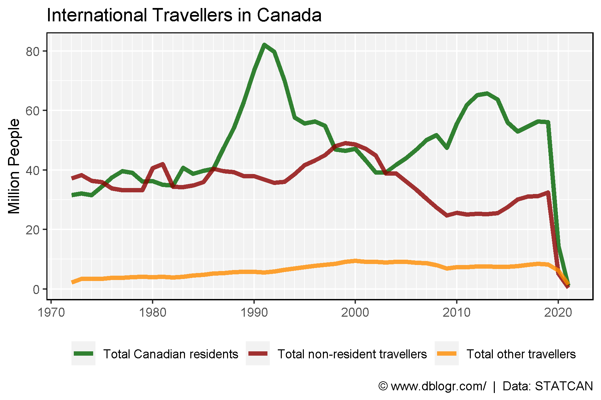
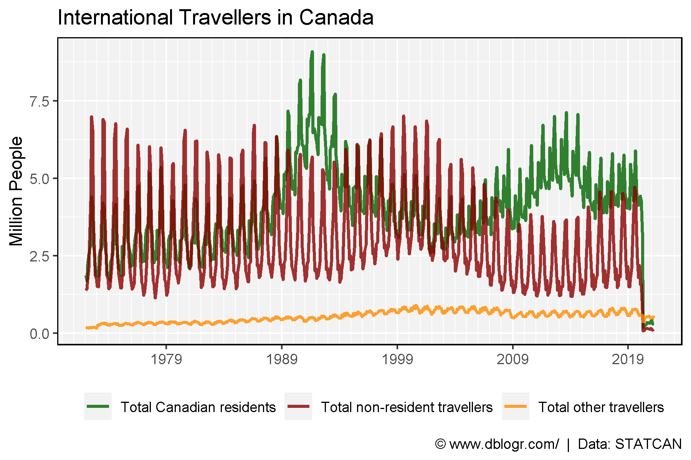
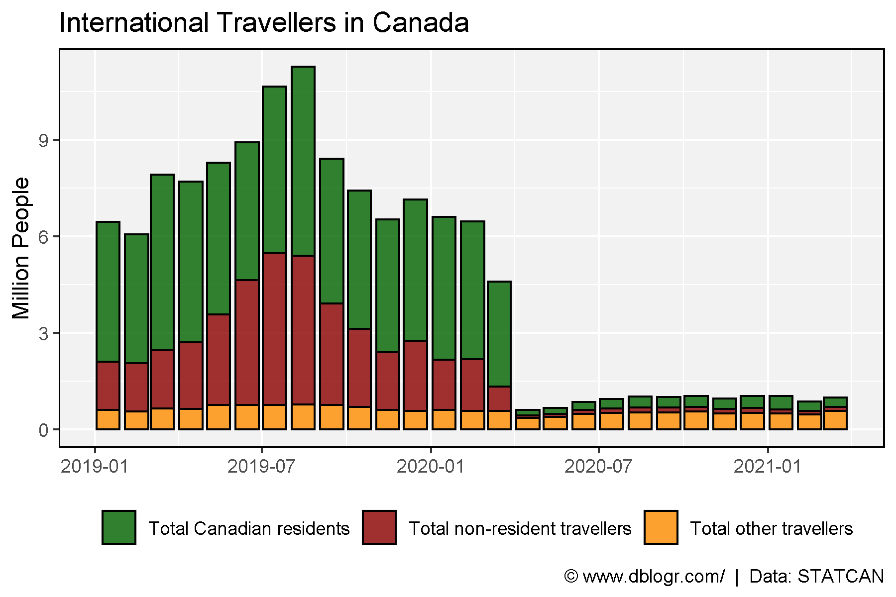

```{r setup, include=FALSE}
knitr::opts_chunk$set(echo = T, message = F, warning = F, out.width = "100%")
```

---

# Data Source

https://www150.statcan.gc.ca/t1/tbl1/en/cv.action?pid=2410004101

```{r echo = F}
downloadthis::download_link(
  link = "https://github.com/derekmichaelwright/dblogr/blob/master/content/dblogr/canada_travel/2410004101_databaseLoadingData.csv",
  button_label = "2410004101_databaseLoadingData.csv",
  button_type = "success",
  has_icon = TRUE,
  icon = "fa fa-save",
  self_contained = FALSE
)
```

---

# Prepare Data

```{r}
# devtools::install_github("derekmichaelwright/agData")
library(agData) # Loads: tidyverse, ggpubr, ggbeeswarm, ggrepel
# Prep data
d1 <- read.csv("2410004101_databaseLoadingData.csv") %>%
  select(Date=1, Area=GEO, Unit=UOM, Value=VALUE,
         Measurement=Traveller.characteristics) %>%
  mutate(Year = as.numeric(substr(Date, 1, 4)),
         Month = as.numeric(substr(Date, 6, 8)),
         Date = as.Date(paste0(Date,"-15"), format = "%Y-%m-%d"))
```

---

# Yearly

```{r}
# Prep data
colors <- c("darkgreen", "darkred", "darkorange")
xx <- d1 %>% 
  filter(Measurement != "Total international travellers") %>%
  group_by(Year, Measurement) %>%
  summarise(Value = sum(Value))
# Plot
mp <- ggplot(xx, aes(x = Year, y = Value / 1000000, color = Measurement)) +
  geom_line(size = 1.5, alpha = 0.8) +
  scale_color_manual(name = NULL, values = colors) +
  scale_x_continuous(minor_breaks = 1970:2021) +
  theme_agData(legend.position = "bottom") +
  labs(title = "International Travellers in Canada",
       y = "Million People", x = NULL,
       caption = "\xa9 www.dblogr.com/  |  Data: STATCAN")
ggsave("canada_travel_01.png", mp, width = 6, height = 4)
```



---

# Monthly

```{r}
# Prep data
xx <- d1 %>% filter(Measurement != "Total international travellers")
# Plot
mp <- ggplot(xx, aes(x = Date, y = Value / 1000000, color = Measurement)) +
  geom_line(size = 1, alpha = 0.8) +
  scale_color_manual(name = NULL, values = colors) +
  scale_x_date(date_breaks = "10 years", date_labels = "%Y", date_minor_breaks = "1 year") +
  theme_agData(legend.position = "bottom") +
  labs(title = "International Travellers in Canada",
       y = "Million People", x = NULL,
         caption = "\xa9 www.dblogr.com/  |  Data: STATCAN")
ggsave("canada_travel_02.png", mp, width = 6, height = 4)
```



---

2019 vs 2020

```{r}
# Prep data
xx <- d1 %>% 
  filter(Year > 2018, Measurement != "Total international travellers")
# Plot
mp <- ggplot(xx, aes(x = Date, y = Value / 1000000, fill = Measurement)) +
  geom_bar(stat = "identity", color = "black", alpha = 0.8) + 
  scale_fill_manual(name = NULL, values = colors) +
  #scale_x_date(date_breaks = "1 Month", date_labels = "%Y-%m") +
  theme_agData(legend.position = "bottom") +
  labs(title = "International Travellers in Canada",
       y = "Million People", x = NULL,
         caption = "\xa9 www.dblogr.com/  |  Data: STATCAN")
ggsave("canada_travel_03.png", mp, width = 6, height = 4)
```

```{r echo = F}
ggsave("featured.png", mp, width = 6, height = 4)
```



---

&copy; Derek Michael Wright [www.dblogr.com/](https://dblogr.com/)