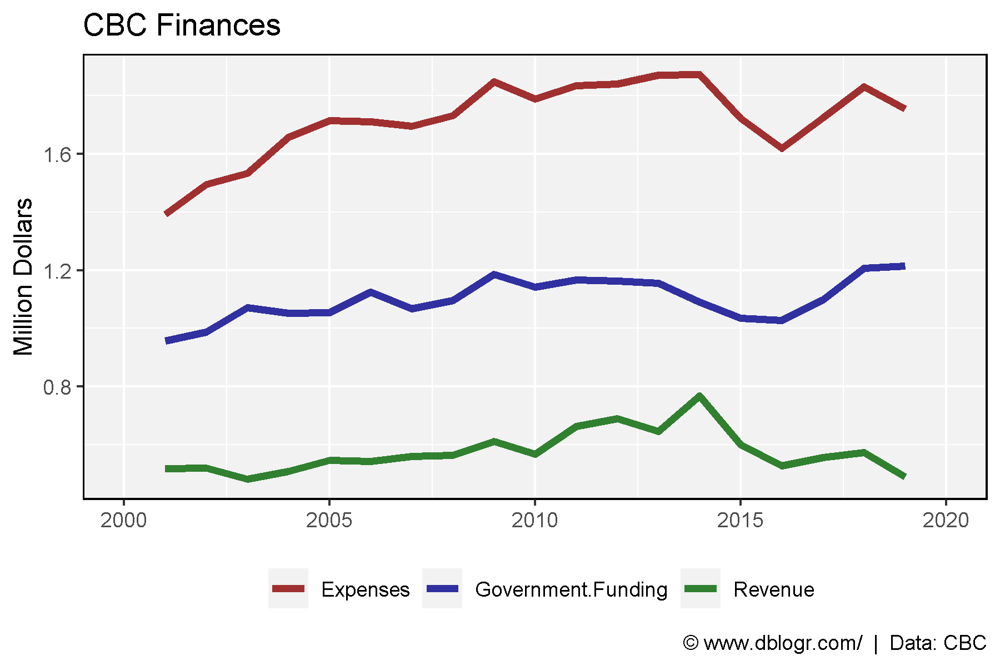
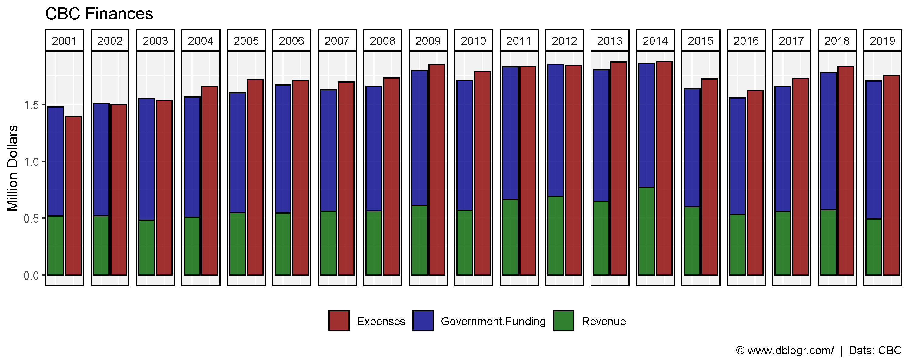
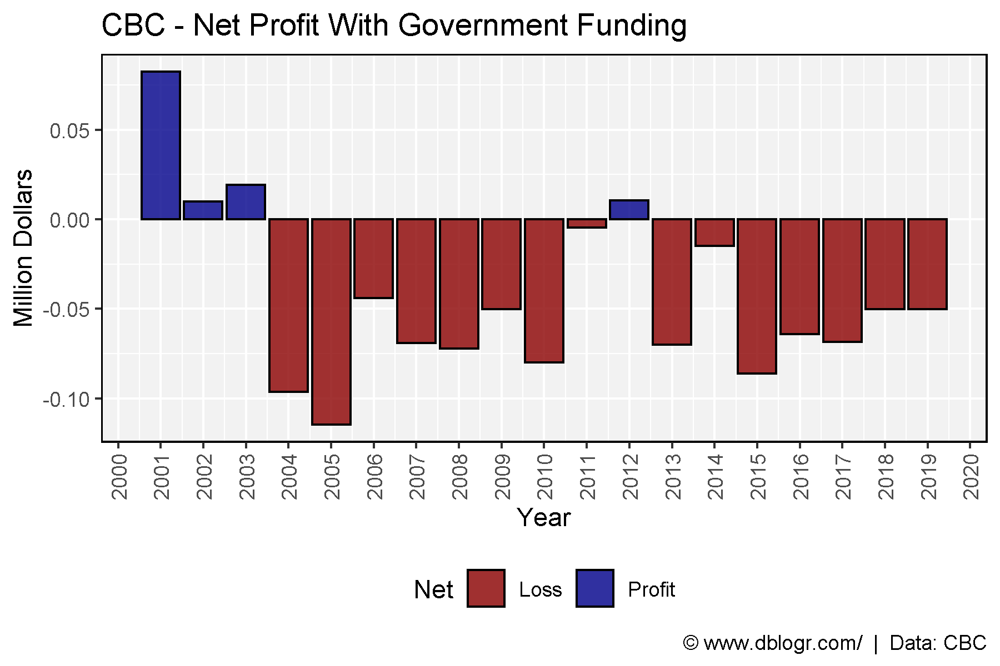
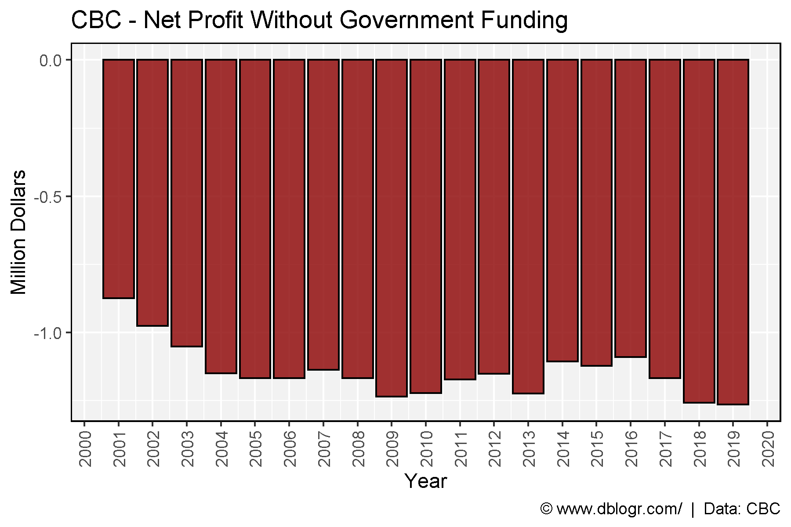

<script src="index_files/font-awesome/js/script.js"></script>

-----

# Data Source

https://cbc.radio-canada.ca/en/impact-and-accountability/finances/annual-reports

<a href="https://github.com/derekmichaelwright/dblogr/blob/master/content/dblogr/cbc_finances/cbc_finances_data.csv">
<button class="btn btn-success"><i class="fa fa-save"></i> cbc_finances_data.csv</button>
</a>

-----

# Prepare data

``` r
# devtools::install_github("derekmichaelwright/agData")
library(agData) # Loads: tidyverse, ggpubr, ggbeeswarm, ggrepel
# Prep data
xx <- read.csv("cbc_finances_data.csv") %>% 
  gather(Source, Value, Revenue, Government.Funding, Expenses) %>%
  mutate(PlusMinus = ifelse(Source == "Expenses", "Plus", "Minus"),
         Value = Value / 1000000)
```

calculate the cost per person per year

``` r
# Prep data
cost <- read.csv("cbc_finances_data.csv") %>% 
  filter(Year == 2019) %>% 
  pull(Government.Funding) 
pop <- agData_STATCAN_Population %>% 
  filter(Year == 2019, Area == "Canada") %>% 
  pull(Value) %>% mean()
cost / pop
```

    ## [1] 0.03233661

-----

# Expenses vs Revenue (Line)

``` r
mp <- ggplot(xx, aes(x = Year, y = Value, color = Source)) + 
  geom_line(size = 1.5, alpha = 0.8) + 
  scale_x_continuous(breaks = seq(2000, 2020, 5), limits = c(2000, 2020)) +
  scale_color_manual(name = NULL, values = c("darkred" , "darkblue", "darkgreen")) +
  theme_agData(legend.position = "bottom") +
  labs(title = "CBC Finances", x = NULL, y = "Million Dollars",
       caption = "\xa9 www.dblogr.com/  |  Data: CBC")
ggsave("canada_population_demographics1.png", width = 6, height = 4)
```



-----

# Expenses vs Revenue (Bar)

``` r
mp <- ggplot(xx, aes(x = PlusMinus, y = Value, fill = Source)) + 
  geom_bar(stat = "identity", position = "stack", color = "black", alpha = 0.8) +
  facet_grid(. ~ Year) +
  scale_fill_manual(name = NULL, values = c("darkred" , "darkblue", "darkgreen")) +
  theme_agData(legend.position = "bottom",
               axis.text.x = element_blank(), 
               axis.ticks.x = element_blank()) +
  labs(title = "CBC Finances", x = NULL, y = "Million Dollars",
       caption = "\xa9 www.dblogr.com/  |  Data: CBC")
ggsave("canada_population_demographics2.png", width = 10, height = 4)
```



-----

# Net Profit With Government Funding

``` r
# Prep data
xx <- read.csv("cbc_finances_data.csv") %>% 
  mutate(Profit = Revenue + Government.Funding - Expenses,
         Net = ifelse(Profit > 0, "Profit", "Loss") )
# Plot
mp <- ggplot(xx, aes(x = Year, y = Profit / 1000000, fill = Net)) + 
  geom_bar(stat = "identity", color = "black", alpha = 0.8) +
  scale_fill_manual(values = c("darkred","darkblue")) +
  scale_x_continuous(breaks = 2000:2020) +
  theme_agData(legend.position = "bottom", 
               axis.text.x = element_text(angle = 90, hjust = 1, vjust = 0.5)) +
  labs(title = "CBC - Net Profit With Government Funding", y = "Million Dollars",
       caption = "\xa9 www.dblogr.com/  |  Data: CBC")
ggsave("canada_population_demographics3.png", width = 6, height = 4)
```



-----

# Net Profit Without Government Funding

``` r
# Prep data
xx <- read.csv("cbc_finances_data.csv") %>% 
  mutate(Profit = Revenue - Expenses,
         Net = ifelse(Profit > 0, "Profit", "Loss"))
# Plot
mp <- ggplot(xx, aes(x = Year, y = Profit / 1000000, fill = Net)) + 
  geom_bar(stat = "identity", color = "black", alpha = 0.8) +
  scale_fill_manual(values = c("darkred","darkblue")) +
  scale_x_continuous(breaks = 2000:2020) +
  theme_agData(legend.position = "none", 
               axis.text.x = element_text(angle = 90, hjust = 1, vjust = 0.5)) +
  labs(title = "CBC - Net Profit Without Government Funding", y = "Million Dollars",
       caption = "\xa9 www.dblogr.com/  |  Data: CBC")
ggsave("canada_population_demographics4.png", width = 6, height = 4)
```



-----

© Derek Michael Wright [www.dblogr.com/](https://dblogr.com/)
