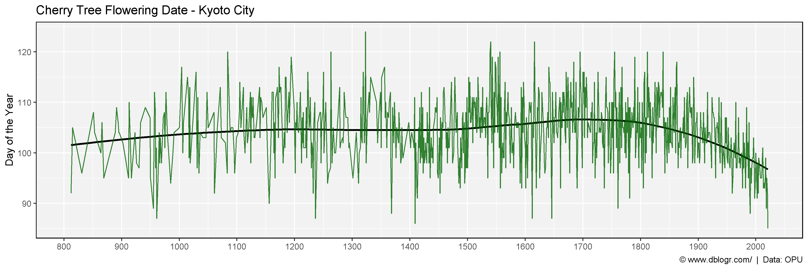
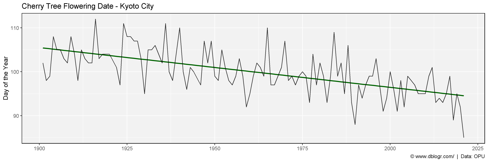

```{r setup, include=FALSE}
knitr::opts_chunk$set(echo = T, message = F, warning = F)
```

---

# Data

http://atmenv.envi.osakafu-u.ac.jp/aono/kyophenotemp4/

[**< Download Data >**](https://github.com/derekmichaelwright/dblogr/blob/master/content/dblogr/ccherry_trees/1810000201_databaseLoadingData.csv)

---

# Prepare data

```{r}
# devtools::install_github("derekmichaelwright/agData")
library(agData) # Loads: tidyverse, ggpubr, ggbeeswarm, ggrepel
```

```{r}
# Prep data
dd <- read.csv("KyotoFullFlower7.csv") %>%
  filter(!is.na(Full.flowering.date..DOY.))
# Plot
mp <- ggplot(dd, aes(x = AD, y = Full.flowering.date..DOY.)) +
  geom_smooth(method = "loess", se = F, color = "black") +
  geom_line(alpha = 0.8, color = "darkgreen") +
  scale_x_continuous(breaks = seq(800, 2000, 100)) +
  theme_agData() +
  labs(title = "Cherry Tree Flowering Date - Kyoto City", y = "Day of the Year", x = NULL,
       caption = "\xa9 www.dblogr.com/  |  Data: OPU")
ggsave("cherry_trees_01.png", mp, width = 12, height = 4)
```



---

```{r}
# Prep data
xx <- dd %>% filter(AD > 1900)
# Plot
mp <- ggplot(xx, aes(x = AD, y = Full.flowering.date..DOY.)) +
  geom_smooth(method = "lm", se = F, color = "darkgreen") +
  geom_line(alpha = 0.8) +
  theme_agData() +
  labs(title = "Cherry Tree Flowering Date - Kyoto City", y = "Day of the Year", x = NULL,
       caption = "\xa9 www.dblogr.com/  |  Data: OPU")
ggsave("cherry_trees_02.png", mp, width = 12, height = 4)
```



---

```{r eval = F, echo = F}
xx <- dd %>% arrange(Full.flowering.date..DOY.) 
grep("2020", as.character(dd$AD) )
#
lubridate::yday("2016-04-04")
lubridate::yday("2017-04-09")
lubridate::yday("2018-03-30")
lubridate::yday("2019-04-05")
lubridate::yday("2020-04-01")
lubridate::yday("2021-03-26")
```

&copy; Derek Michael Wright [www.dblogr.com/](https://dblogr.com/)